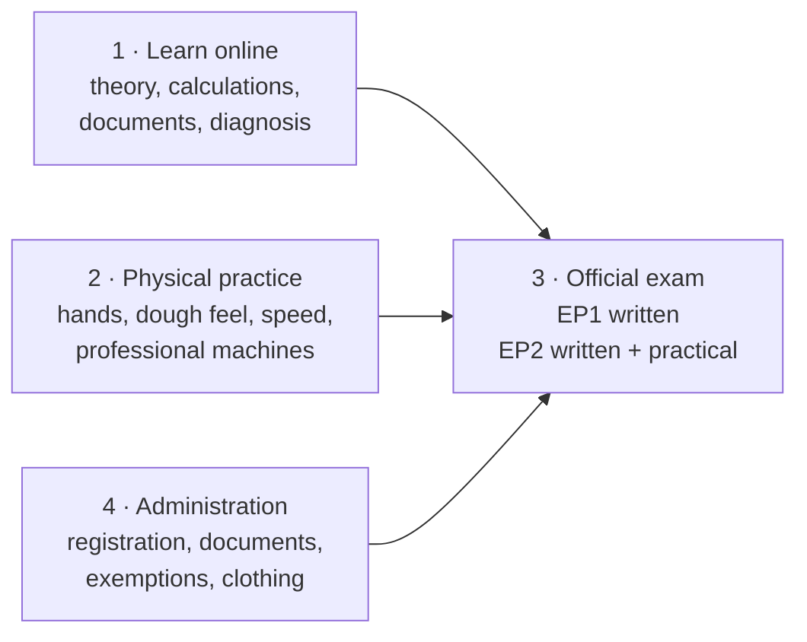

# 01.1 · The Boulanger's Job and the CAP

This lesson explains what a boulanger actually does, what the CAP Boulanger is, and what this course can and cannot do for you. You finish by writing your own preparation plan, split into what you learn online, what you must practise physically, what the exam assesses and what you must arrange administratively.

## Why it matters

This free course prepares you for the CAP Boulanger. It is not the CAP itself and does not award the French national diploma. The CAP is awarded by the French Ministry of Education (Ministère de l'Éducation nationale) after the official examination.

People who prepare alone often fail for reasons that have nothing to do with baking: they register too late, they arrive at the practical test without the required clothing, or they have read a great deal but never made 5 kg of dough against the clock. Knowing from day one which parts of the job you can learn from a screen and which you cannot lets you plan the hours of real practice you will need.

## Key terms

| French | Say it | English meaning |
|---|---|---|
| Boulanger / boulangère | *boo-lahn-ZHAY / boo-lahn-ZHAIR* | Baker who makes bread (and usually viennoiserie) |
| Ouvrier boulanger | *oo-vree-AY boo-lahn-ZHAY* | Bakery worker: the job the CAP prepares for, working under a supervisor |
| Fournil | *foor-NEEL* | The bakehouse: the production room |
| CAP (Certificat d'aptitude professionnelle) | *say-ah-PAY* | French national vocational diploma, level 3 |
| Référentiel | *ray-fay-rahn-SYEL* | The official framework listing the competencies and knowledge the CAP assesses |
| Épreuve (EP1, EP2) | *ay-PRUHV* | A test of the exam; EP1 and EP2 are the two professional tests |
| Candidat individuel (candidat libre) | *kahn-dee-DAH an-dee-vee-dü-EL* | Someone who registers for the exam alone, without a school or training centre |
| PFMP (période de formation en milieu professionnel) | *pay-eff-em-pay* | Workplace training period in a real bakery, part of the school route |
| Apprentissage / CFA | *ah-prahn-tee-SAHZH / say-eff-AH* | Apprenticeship: paid work in a bakery plus classes in a training centre (CFA) |

## How it works

### The job

France Compétences describes the holder of the CAP as an ouvrier boulanger working under the authority of a manager, in craft bakeries, supermarket bakeries and the food industry. The official list of activities has four parts:

1. **Supply (approvisionnement):** receive deliveries, check them, store them and report anything that is wrong.
2. **Production:** set up the workstation, prepare the ingredients, make the products (bread and viennoiserie), store them and check the finished goods.
3. **Quality, hygiene and safety:** follow the company's hygiene plan, safety rules and environmental practices.
4. **Sales and communication:** explain the products to the sales staff and report to the team and the manager.

Notice that only part 2 is "baking". Parts 1, 3 and 4 are also assessed, mostly in the written test, and a good baker who cannot read a delivery note or explain a product to the shop loses marks.

The working day is shaped by one fact: bread must be fresh when the shop opens, and again later in the day. Production therefore starts in the early morning, and the baker plans backwards from opening time. Lesson 01.2 shows how a bakery is organised around that flow.

### Bread, the trade and the law

Bread-making in France is protected in a way most countries do not know:

- Since a 1998 law, now article L122-17 of the Code de la consommation, a business may call itself a **boulangerie** and its staff **boulangers** only if they themselves knead, ferment, shape and bake the bread on the premises where it is sold to the customer, from raw materials they choose. The dough and the bread may never be frozen at any stage. A shop that bakes off frozen dough is a "terminal de cuisson" or "dépôt de pain", not a boulangerie.
- The **pain de tradition française** has a legal definition that limits its ingredients ([module 9](../module-09/lesson-01.md)).
- In 2022 UNESCO inscribed the "artisanal know-how and culture of baguette bread" on its list of intangible cultural heritage. Its description of the craft is the sequence you will learn in this course: weighing, mixing, kneading, fermentation, dividing, resting, hand shaping, a second fermentation, scoring and baking.

These rules matter to you as a worker: they decide what you may do in the fournil (no freezing in a boulangerie), what the shop may write on its sign and on its labels, and why the written test asks you about legal names.

### Four different things: online, physical, exam, admin

| Area | What it contains | Where you get it |
|---|---|---|
| 1. What you can learn online | Ingredients and their functions, dough science, fermentation, temperatures, baker's maths, technical sheets and organigrammes, hygiene rules, legal names, product diagnosis, communication | This course, with its quizzes |
| 2. What needs physical practice | Feeling dough, shaping speed and regularity, scoring, laminating butter, loading a deck oven, working 4-6 kg batches on a spiral mixer and a sheeter, working safely at speed | Your home kitchen first (this course gives you a practice for each skill), then a real fournil: a job, an apprenticeship, a placement or a training centre |
| 3. What the official exam assesses | Two professional tests (a written test and a production test) plus general subjects, unless you are exempt | The exam centre. The rules are on one page: [The CAP Boulanger Exam](../../references/cap-exam.md) |
| 4. Administrative requirements | Registering with your académie on time, the documents it asks for, exemptions from general subjects, the protective clothing named on your convocation | Your académie's exam office; [The CAP Boulanger Exam](../../references/cap-exam.md) lists what to check |

Read that table twice. A course can make you understand why a baguette spreads flat; it cannot put the feel of a well-proofed pâton into your fingers. Only repetition does that. Every practical lesson here gives you a home version of the skill and tells you what still needs a professional fournil.

> [!IMPORTANT]
> Exam rules (tests, durations, coefficients, product lists, registration dates) are kept on one page only, [The CAP Boulanger Exam](../../references/cap-exam.md), because they change. Lessons link to it rather than repeat it. Always confirm with your académie and your convocation.

### Ways to the CAP

There are several routes: school, apprenticeship, adult training, individual registration, and validation of experience (VAE). They differ in how you are assessed and in whether workplace training is built in. The table is on the [exam page](../../references/cap-exam.md#ways-to-get-the-cap). If you register as an individual candidate, nobody organises your practice for you: plan it from the start.

## Worked example

Karim, 31, works in logistics in Lyon and bakes at home at weekends. He wants to sit the CAP as an individual candidate next June. He sorts what he needs into the four areas.

| Area | Karim's situation | His action |
|---|---|---|
| 1. Online | No baking theory; good with numbers | Work through this course module by module, 5 hours a week; take every quiz until he scores at least 70% |
| 2. Physical | Bakes one loaf a week by hand; has never used a spiral mixer, a deck oven or a sheeter | Do every home practice. Ask two local bakeries for Saturday work or an unpaid observation placement (stage) from February, so he works professional batches before the exam |
| 3. Exam | Does not know what the tests contain | Read [The CAP Boulanger Exam](../../references/cap-exam.md) once now and again before modules 21-22; mark the product list and the marking grid |
| 4. Admin | Has a French baccalauréat from 2013 | Check the registration window on the Lyon académie's site this week; ask the exam office which general subjects his baccalauréat exempts him from and whether workplace training certificates are required for this specialty; note the clothing on the convocation when it arrives |

His key insight: area 2 is the bottleneck. He can finish the theory in about six months at 5 hours a week, but he needs months of real batches to work at exam speed, so the bakery placement goes in his calendar now, not after the theory.

## Practice

You write your own preparation plan. It is a document you will update at the end of every module and check again with the [readiness checklist](../../templates/readiness-checklist.md) before the exam.

### You need

- A notebook or a file. That is all.
- Professional equivalent: the training plan a CFA or employer writes with an apprentice.

### Steps

1. Read [The CAP Boulanger Exam](../../references/cap-exam.md) from top to bottom (10 minutes).
2. Copy the four-area table from this lesson and fill in each row with your own situation, as Karim did.
3. In area 4, write the name of your académie and find its exam office page (search "candidats individuels CAP" with the académie's name). Write down the registration window and any documents it asks for. If you live outside France, write down which académie you would register with and how you would get to the exam centre.
4. In area 2, write the names of two real places where you could get professional practice (a bakery, a CFA open day, a training centre).
5. Estimate your weekly hours: online study and home baking. Divide the remaining weeks before the exam by those hours and see if it is realistic.
6. Put the date of your next review of this plan in your calendar (the end of module 1).

### Targets

- All four areas filled with at least two concrete actions each.
- At least one date (registration window or exam session) written down from an official académie source, not from a forum.
- At least one named place for physical practice.

### How you know it worked

Someone reading your plan could tell you, without asking questions, what you are doing this week, where you will practise on professional machines, and when you must register.

### Self-check

- [ ] I can say in one sentence what this course does and does not give me.
- [ ] My plan separates online, physical, exam and admin.
- [ ] I found my académie's exam office page and wrote down where its registration dates are published.
- [ ] I have named at least one place for professional practice.
- [ ] I have a calendar reminder to review the plan.

## What goes wrong

| Symptom | Likely cause | Fix now | Prevent next time |
|---|---|---|---|
| You plan only study hours, no practice | Treating the CAP as a knowledge test | Add weekly home bakes and a date to start professional practice | Review the "physical" row every module |
| You find out the registration window has closed | Assumed registration happens in spring | Note the next session's window and use the year to build practice | Check the académie's dates as soon as you decide to sit the exam |
| You quote exam rules from a forum or a private school site | Unofficial sources go out of date | Check against [The CAP Boulanger Exam](../../references/cap-exam.md) and its official links | Use official sources only for exam rules |
| You believe the course certificate is the diploma | Confusing course completion with the national diploma | Re-read the first paragraph of "Why it matters" | Keep the distinction clear when you talk to employers |

## Review

- The CAP Boulanger prepares an ouvrier boulanger: supply, production, hygiene and safety, and communication, not only baking.
- The names boulanger and boulangerie are protected: the bread must be kneaded, fermented, shaped and baked on the premises and never frozen.
- Keep four things apart: online learning, physical practice, the official exam and administration. Physical practice is usually the bottleneck.
- Exam facts live on one page: [The CAP Boulanger Exam](../../references/cap-exam.md). Confirm everything with your académie and your convocation.
- This course prepares you for the CAP; it does not award it.
