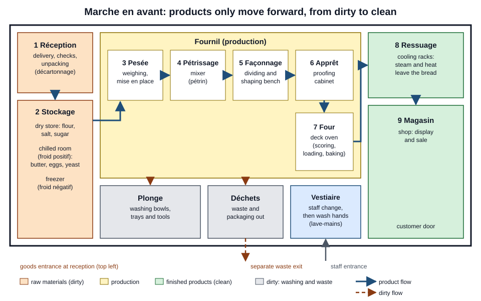
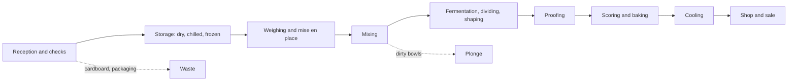

# 01.2 · Inside a Bakery: Workflow, Zones and Roles

A bakery is laid out so that flour comes in at one end and bread goes out at the other without ever meeting the bin, the dirty bowls or a muddy delivery box. This lesson walks you through the wheat-flour-bread chain, the types of bakery business, the people in a fournil and the zones of the building, then you map your own kitchen the same way.

## Why it matters

The written test asks you to name the zones of a bakery and explain the marche en avant, and in the production test you are watched for how you organise your bench. In real work, the layout decides how fast you can move and how easily you contaminate food: a delivery box put down on the shaping bench is a hygiene fault, not just untidiness.

## Key terms

| French | Say it | English meaning |
|---|---|---|
| Filière blé-farine-pain | *fee-LYAIR blay far-EEN pan* | The wheat-flour-bread chain: farmer, storer, miller, baker |
| Meunier / minoterie | *muh-NYAY / mee-noh-TREE* | Miller / flour mill |
| Laboratoire (labo) | *lah-boh-rah-TWAHR* | The production rooms of a food business (fournil for bread, labo for pastry) |
| Marche en avant | *marsh ahn ah-VAHN* | "Forward flow": dirty and clean products and operations never cross |
| Ressuage | *ruh-sü-AHZH* | Cooling of bread after baking, when steam and heat leave the loaf |
| Chambre de pousse | *shahm-bruh duh POOSS* | Proofing cabinet: warm, humid cabinet for the apprêt |
| Plonge | *plonzh* | Washing-up area for bowls, trays and tools |
| Tourier | *too-RYAY* | Baker who specialises in laminated dough (croissants) |
| Terminal de cuisson | *tair-mee-NAL duh kwee-SOHN* | Bake-off point: bakes dough made elsewhere; not a boulangerie |
| GMS (grande et moyenne surface) | *zhay-em-ESS* | Supermarkets and hypermarkets, many with an in-store bakery |

## How it works

### The wheat-flour-bread chain

Bread starts in a field. The **farmer** (céréalier) grows wheat; a **cooperative or grain merchant** stores and grades it; the **miller** (meunier) cleans, conditions and grinds it into flours of different types; the **baker** turns flour into bread; the **customer** buys it. Each link affects your work. A wet harvest can give flour with more enzyme activity and stickier dough; a mill blends wheats to keep its flour steady from year to year; the baker adjusts water and fermentation to the flour of the day. [Module 2](../module-02/lesson-01.md) follows the grain in detail.

### Types of bakery business

| Type | What it does | Typical staff | What it means for you |
|---|---|---|---|
| Boulangerie artisanale | Makes its own bread on site from raw materials, sells in its shop | Owner-baker, 1-5 bakers, apprentice, sales staff | All stages by hand; legal name protected (lesson [01.1](lesson-01.md)) |
| Chain or franchise (enseigne) | Several shops under one brand, shared formulas and suppliers | Production manager, bakers, sales staff | Standard technical sheets you must follow exactly |
| Terminal de cuisson | Bakes frozen or chilled dough delivered from a factory | Sales staff who bake off | Little craft skill needed; may not call itself boulangerie |
| GMS in-store bakery | Bakery department in a supermarket, sometimes making dough on site | Department manager, bakers | Large volumes, long opening hours, shift work |
| Industrial bakery (industrie de panification) | Factory production for supermarkets and catering | Line operators, technicians | Machines, process control, cold chain |

The CAP prepares you to work in any of these, under a supervisor. Lesson [20.1](../module-20/lesson-01.md) looks at the sector and these businesses in more detail.

### People in a craft bakery

- **Chef d'entreprise / patron boulanger:** owns or runs the business, sets the range and prices, orders goods.
- **Chef boulanger / responsable de production:** plans the day's production, gives the orders, checks quality.
- **Ouvrier boulanger:** makes the products from the orders and technical sheets; the CAP job.
- **Tourier:** specialises in laminated doughs (croissant, pain au chocolat); in a small bakery, the baker does this too.
- **Apprenti:** trains in the bakery and at a CFA.
- **Vendeur / vendeuse:** sells and advises customers; needs your information on products and allergens.

### Zones and the marche en avant

The principle, as the bakery profession's hygiene guide (CNBPF) puts it: "dirty" areas and products (unpacking, washing up, raw materials, dirty equipment, waste) must never cross "clean" ones (finished and baked products). Microbes, dust, cardboard fibres and allergens travel on hands, tools and packaging; if paths cross, they reach the bread. That transfer is called **cross-contamination** (contamination croisée).

There are two ways to achieve it:

- **In space:** the rooms are arranged so products move forward only, as in the plan above. Deliveries enter on one side, are unpacked at reception (cardboard never goes into the fournil), stored, weighed, mixed, shaped, proofed, baked, cooled and sold. Waste and dirty equipment leave by their own route.
- **In time:** in a small bakery with one room, dirty and clean operations happen in the same place one after the other, with cleaning and, where needed, disinfection between them. Example: unpack the delivery at 9:00, clean the table, then start shaping at 9:20.

Bread has one advantage: baking kills most microorganisms in the crumb. That is why the most sensitive zone is **after** the oven: cooled bread, sandwiches, crème pâtissière once cooked. A loaf touched by a dirty hand on the cooling rack will not be baked again.

### The bakery's day as a flow

Every product you make follows this order. [Module 7](../module-07/lesson-01.md) breaks it into the full set of production stages.

## Worked example

A small bakery has one production room. At 9:30 Léa is shaping croissants on the marble table. The flour and egg delivery arrives: four 25 kg flour sacks on a pallet and two cartons of 180 eggs. The table next to her is free. The baker on the oven is unloading baguettes onto a rack beside the door.

What should happen, in order?

1. The delivery stays at the door or in the reception area. Nobody puts the cartons on any work table: the outside of a carton has travelled in a lorry and on the ground.
2. The receiving person checks the delivery note against the order (quantity, product, use-by dates, temperature of the eggs) before signing.
3. The eggs are taken out of the outer carton at reception and go to the cold room in their trays; the outer carton goes straight to the waste and packaging area. The flour sacks go to the dry store on a pallet, off the floor.
4. The person who handled the delivery washes their hands before touching any dough.
5. The baguette rack is moved away from the doorway path before the next delivery or waste trip, because baked bread is in the most sensitive state.

Time cost: about 10 minutes. The alternative, unpacking on the free table next to the croissants, saves two minutes and puts cardboard dust and egg-shell contamination beside raw dough.

## Practice

You map your own kitchen as a bakery and design the marche en avant you will use for every bake in this course.

### You need

- Paper and a pencil, or a drawing app.
- A tape measure (optional).
- Professional equivalent: the layout plan of a fournil, as drawn in a hygiene plan (plan de maîtrise sanitaire).

### Steps

1. Draw a plan of your kitchen from above: worktops, sink, oven, fridge, bin, cupboards, door.
2. Mark where each function will happen when you bake: reception (where shopping bags arrive), dry storage, chilled storage, weighing, mixing, shaping, proofing, oven, cooling, "shop" (where bread is stored or served), washing up, waste.
3. Draw the product flow with arrows in one colour, from shopping bag to cooled bread.
4. Draw the dirty flows in another colour: shopping bags and packaging, dirty bowls, peelings and waste.
5. Circle every place where the two colours cross.
6. For each crossing, write a fix in space (move the cooling rack away from the bin) or in time (unpack shopping, clean the worktop, then weigh).
7. Write your three house rules on one line each, for example "Shopping bags never go on the worktop".

### Targets

- All 12 functions placed on the plan.
- Every crossing has a written fix.
- The cooling area is not next to the bin or the sink.

### How you know it worked

You can trace one loaf from flour bag to cooled bread with your finger without passing over the bin, the sink or the shopping-bag area, or every place where it does has a cleaning step written beside it.

### Self-check

- [ ] My plan shows reception, storage, production, oven, cooling and the dirty areas.
- [ ] Product flow and dirty flow are drawn in different colours.
- [ ] I have a fix (space or time) for every crossing.
- [ ] I can explain the difference between marche en avant in space and in time.
- [ ] I can name five types of bakery business and say which may use the name boulangerie.

## What goes wrong

| Symptom | Likely cause | Fix now | Prevent next time |
|---|---|---|---|
| Cartons or shopping bags on the work table | No reception zone defined | Remove them, clean and dry the surface before using it | Mark a floor or shelf spot as "reception" |
| Bread cooling next to the bin or sink | Cooling area chosen for convenience | Move the rack; check that nothing splashed on the bread | Fix the cooling place on your plan |
| Dirty bowls piled on the shaping bench | Washing up not planned in the sequence | Move them to the plonge before shaping | Plan "clean as you go" moments between stages |
| Raw eggs or their shells near cooked products | Eggs cracked in the finishing area | Clean and disinfect the area; discard exposed cooked products | Crack eggs in the production zone, then wash hands |

## Review

- Bread comes from a chain: farmer, storer, miller, baker, customer; each link affects your dough.
- Only a business that makes its bread from scratch on site may call itself a boulangerie; terminals de cuisson and many supermarket departments bake dough made elsewhere.
- The marche en avant keeps dirty and clean flows apart, either in space (separate zones) or in time (one after the other with cleaning in between).
- The most sensitive zone is after the oven: cooled bread is not baked again.
- Zones and the marche en avant are part of the written test's professional knowledge; see [The CAP Boulanger Exam](../../references/cap-exam.md).
