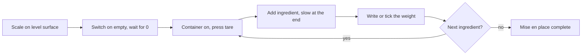

# 01.4 · Weighing and Measuring Like a Professional

Bakers weigh everything, including water, because the same recipe must give the same bread every day. This lesson explains how a scale and a thermometer can be wrong, how much error each ingredient can tolerate, and how to check your own instruments, then you test your scale, your thermometer and your weighing.

## Why it matters

Bread has very few ingredients, so each one has a large effect. Salt at 1.8% of the flour tastes right; at 2.5% the bread is salty and ferments slowly. Yeast is used in such small amounts that a 1 g mistake in a home batch is more than a tenth of the yeast and visibly changes the fermentation time. The référentiel judges weighing on two criteria: correct use of the equipment (setting, tare) and the accuracy of weighings and measurements. In the production test, wrong weighing shows up later as wrong dough, wrong fermentation and wrong piece weights.

## Key terms

| French | Say it | English meaning |
|---|---|---|
| Peser | *puh-ZAY* | To weigh |
| Pesée | *puh-ZAY* | A weighing; also the weighing stage of production |
| Balance / bascule | *bah-LAHNSS / bahs-KÜL* | Scale / platform scale for heavy loads (sacks, bowls) |
| Tare / tarer | *tar / tah-RAY* | The weight of the container / to set the scale to zero with the container on it |
| Portée | *por-TAY* | Capacity: the maximum load of a scale |
| Précision | *pray-see-ZYOHN* | Accuracy, often used loosely for the smallest step the scale shows |
| Thermomètre à sonde | *tair-moh-METR ah SOHND* | Probe thermometer, used for dough, water and bread core |
| Mise en place | *meez ahn PLASS* | Setting out everything weighed and ready before you start |

## How it works

### Weight, not volume

A cup or a spoon measures volume, and flour is compressible: scooped, it packs down; spooned in, it stays airy. The same cup can hold quite different weights of flour (you will measure this yourself in the practice). Weight does not change with how you fill the container, which is why every bakery formula is written in grams and why baker's percentages (lesson [01.5](lesson-05.md)) only work with weights.

Water is the one ingredient where volume and weight are nearly the same: 1 mL of water weighs about 1 g at kitchen temperature. Bakers still weigh it, directly into the bowl, because a jug is read to 10-25 mL at best and a scale to 1 g. Do not assume 1 mL = 1 g for other liquids: milk is slightly heavier (about 1.03 g per mL) and oil lighter (about 0.92 g per mL).

### Three numbers on every scale

- **Capacity (portée):** the maximum load, for example 5 kg for a kitchen scale, 30 or 60 kg for a bakery platform scale. Never put the bowl plus a full batch on a scale with too small a capacity.
- **Resolution (division):** the smallest step on the display, for example 1 g. A display of 7 g means the true weight is somewhere between 6.5 and 7.5 g, before any other error.
- **Accuracy:** how close the reading is to the true weight. A scale can show 0.1 g steps and still be 2 g wrong if it is badly made, on a slope or has weak batteries. You only know accuracy by checking against known weights.

### How much error can an ingredient tolerate?

The error that matters is the **relative error**: the error divided by the amount you want.

$$\text{relative error (\%)} = \frac{\text{possible error (g)}}{\text{target weight (g)}} \times 100$$

| Ingredient (home batch, 500 g flour) | Target | Error on a 1 g scale | Relative error |
|---|---|---|---|
| Flour | 500 g | ±0.5 g | ±0.1% |
| Water | 325 g | ±0.5 g | ±0.15% |
| Salt (1.8%) | 9 g | ±0.5 g | ±5.6% |
| Fresh yeast (1.5%) | 7.5 g | the scale shows 7 or 8 | about ±13% |

The same 1 g scale that is excellent for flour is poor for yeast. Two fixes: use a **pocket scale with 0.1 g resolution** for salt and yeast, or make bigger batches. In a professional 5 kg batch the yeast is 75 g, and ±0.5 g is under 1%: bakery scales can work in 1 g or even 5 g steps because the quantities are large.

### Tare and good weighing practice

1. Put the scale on a firm, level surface, away from draughts and vibrations (not next to the running mixer).
2. Switch on with nothing on the platform; wait for 0.
3. Put the empty container on, press **tare**: the display returns to 0. You now read only what you add.
4. Add the ingredient slowly at the end; stop just before the target and finish with small amounts.
5. Weigh each ingredient in its own container (salt and yeast separately: salt in direct contact damages yeast if left for long).
6. Write each weight down or tick it on the technical sheet as you go, so you never wonder "did I add the salt?".

### Checking the scale

You do not need laboratory weights. The European Central Bank publishes the mass of each euro coin: a 2-euro coin is 8.50 g, a 1-euro coin 7.50 g, a 50-cent coin 7.80 g. Ten 2-euro coins should read about 85 g. Worn coins can be a little lighter, so use reasonably clean coins and look for a reading that is plainly wrong, not for a 0.1 g difference. Outside the euro area, use your own national mint's published coin weights the same way. Check also that the scale reads the same when the load is in the centre and in each corner (the corner test).

### Checking the thermometer

Dough temperature is one of the most important numbers in this course ([module 5](../module-05/lesson-02.md)). A probe thermometer is checked in **iced water**: a glass packed with ice, topped with cold water, stirred. Push the probe at least 5 cm into the slush without touching the glass, wait until the reading is steady: it should read 0 °C. Texas A&M AgriLife Extension accepts ±2 °F, about ±1 °C. Some thermometers can be reset; if yours cannot, write its offset on it (for example "+1 °C") and subtract it from every reading. The boiling-water check (100 °C) only works at sea level: water boils at a lower temperature at altitude.

## Worked example

A home baker makes 500 g of flour into rolls with 1.5% fresh yeast. 1.5% of 500 g is 7.5 g. On a 1 g kitchen scale she adds yeast until the display shows 8 g. The true weight is between 7.5 and 8.5 g, so she may have up to 8.5 g: 13% more yeast than planned. Next time she adds yeast until it shows 7 g, and the true weight could be as low as 6.5 g: 13% less. Fermentation speed follows the yeast amount, so the timing changes from one bake to the next and she cannot tell whether it was her technique or her scale.

With a 0.1 g pocket scale, she weighs 7.5 g ±0.05 g, a relative error of under 1%. The pocket scale costs about the same as a bag of good flour and is the most useful upgrade for home practice.

In the bakery the same formula on 5 kg of flour needs 75 g of yeast. A 1 g bakery scale gives ±0.5 g, or ±0.7%: no pocket scale needed.

## Practice

You check your instruments and prove to yourself why bakers weigh.

### You need

- Digital kitchen scale (1 g), and a 0.1 g pocket scale if you have one.
- Probe thermometer.
- Ten 2-euro coins (or ten coins of a known published weight).
- A measuring cup (any size), a tablespoon, flour, salt, a glass, ice, a bowl.
- Professional equivalent: bench scale (1 g), platform scale for sacks, probe thermometer checked against a reference.

### In Israel

- **Coins:** use ten ₪10 coins instead of 2-euro coins. A ₪10 coin weighs 7 g, so ten should read about **70 g** (checked 2026-10-09). Do not use ₪1 coins: older and newer series weigh differently.
- **Thermometer check in a hot kitchen:** the ice melts faster, so fill the glass well with ice and read within a few minutes.
- **Cup test:** use the white flour (קמח לבן, *kemakh lavan*) you will bake with ([Flour in Israel](../../references/flour-in-israel.md)) and fine salt (מלח דק, *melakh dak*); the spread between cups is what matters, not the brand.
- **Yeast drill:** if you only have instant dry yeast (שמרים יבשים, *shmarim yeveshim*), weigh 2.5 g: on a 1 g scale this is where resolution hurts most.

### Steps

1. **Scale check.** Tare the empty scale. Put the ten coins in a small bowl in the centre and read the weight. Then place the bowl at each corner. Write down all five readings.
2. **Thermometer check.** Fill a glass with ice, top up with cold water, stir and wait 2 minutes. Insert the probe 5 cm, wait until it is steady, read. Write down the offset.
3. **Cup test.** Fill the cup with flour five times by scooping it from the bag and levelling, and five times by spooning flour into the cup and levelling. Weigh each cup (tare the cup first). Write down the 10 weights and the difference between the lightest and heaviest.
4. **Weighing drill.** Using tare and one container per item, weigh 500 g flour, 325 g water, 9 g salt and 7.5 g of yeast (or 2.5 g instant yeast). If you only have a 1 g scale, note what the display shows for the yeast. Time yourself.
5. **Calculations.** Answer the exercises below, then open the answers.

### Exercises

1. Your scale shows 1 g steps. You need 12 g of salt. What is the worst-case relative error from resolution alone?
2. A recipe for 1 kg flour needs 1.2% instant yeast. What weight is that, and which scale should you use?
3. Your thermometer reads +1.5 °C in iced water. Your dough reads 26.0 °C. What is its real temperature?
4. A bakery weighs 5 kg of flour on a platform scale with 5 g steps. What is the worst-case relative error?

Answers

1. ±0.5 g ÷ 12 g × 100 = about ±4.2%.
2. 1.2% × 1000 g = 12 g. A 0.1 g pocket scale gives ±0.4%; a 1 g scale gives ±4.2%. Use the pocket scale if you have one.
3. 26.0 − 1.5 = 24.5 °C.
4. ±2.5 g ÷ 5000 g × 100 = ±0.05%. Large quantities tolerate coarse steps.

### Targets

- Coin readings: about 85 g in the centre (ten ₪10 coins: about 70 g), and the corner readings within 1 g of the centre reading.
- Thermometer: 0 °C ±1 °C, or a known offset written down.
- Weighing drill: all four items within ±1 g (yeast within ±0.1 g on a pocket scale) in under 5 minutes.

### How you know it worked

You know the offset of your thermometer, you trust your scale (or know it needs replacing), and your cup test showed you, with your own numbers, why volume measures are not used in a bakery.

### Self-check

- [ ] I can explain the difference between resolution and accuracy.
- [ ] My scale passed the coin test and the corner test.
- [ ] My thermometer reads 0 °C in iced water, or I wrote its offset on it.
- [ ] I tare between ingredients and weigh salt and yeast separately.
- [ ] I can calculate the relative error of a weighing.

## What goes wrong

| Symptom | Likely cause | Fix now | Prevent next time |
|---|---|---|---|
| The reading drifts while you weigh | Draught, vibration, scale on a cloth, weak batteries | Move the scale to a firm, still surface; change batteries | Keep the scale in a fixed weighing place |
| Coins read several grams off | Scale faulty or not level | Level it and repeat; if still wrong, replace it | Check the scale every month and after any fall |
| Display shows "0" but a container is on it, and you forgot | Tared twice without noting | Empty, re-weigh from zero | One container per ingredient; tick each weight |
| Thermometer reads 3 °C in iced water | Offset or failing probe | Reset if possible, or note "+3 °C" and correct every reading | Check it every month |
| Bread suddenly faster or slower to rise with the same recipe | Yeast weighed on a 1 g scale in a small batch | Note the actual display value in your bake log | Use a 0.1 g scale for yeast and salt |

## Review

- Bakers weigh every ingredient, water included, because weight does not depend on how a container is filled.
- Resolution is not accuracy: check your scale with known weights and your thermometer in iced water.
- What matters is the relative error: a 1 g step is fine for flour and poor for 7.5 g of yeast.
- Tare between ingredients, one container per ingredient, and record each weight as you go.
- Weighing accuracy is part of the production test; see [The CAP Boulanger Exam](../../references/cap-exam.md).
