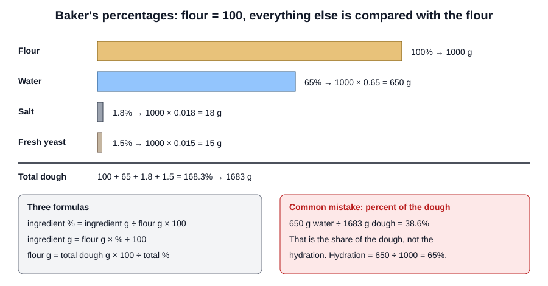

# 01.5 · Baker's Percentages

Bakers do not write recipes as "500 g flour, 325 g water"; they write "water 65%", meaning 65% of the flour weight. This lesson teaches that language, which every technical sheet in France and in this course uses, and the three formulas you need to go from a percentage to grams for any batch.

## Why it matters

In the written part of the production test you complete a technical sheet from an order: that means turning a formula in percentages into weights for the quantity ordered (see [The CAP Boulanger Exam](../../references/cap-exam.md)). Calculation accuracy is one of the référentiel's criteria for C1.3. Beyond the exam, percentages let you scale a recipe from 500 g to 25 kg of flour in one line, compare two formulas at a glance (65% water is a firmer dough than 72%), and spot a typing error before it ruins a batch (salt at 18% instead of 1.8% is obvious in percentages and easy to miss in grams).

## Key terms

| French | Say it | English meaning |
|---|---|---|
| Pourcentage du boulanger | *poor-sahn-TAHZH dü boo-lahn-ZHAY* | Baker's percentage: each ingredient as a percentage of the total flour weight |
| Taux d'hydratation | *toh dee-drah-tah-SYOHN* | Hydration rate: water ÷ flour × 100 |
| Formule / recette | *for-MÜL / ruh-SET* | Formula (in %) / recipe (in grams, for one batch) |
| Pâton | *pah-TOHN* | A divided piece of dough before shaping |
| Pertes | *pairt* | Losses: dough left in the bowl, on the scraper, scaling trimmings |
| Pâte fermentée | *paht fair-mahn-TAY* | Fermented dough kept from an earlier batch and added to a new one |

## How it works

### Flour is always 100

In baker's percentages, the total weight of flour in the formula is 100%. Every other ingredient is its weight divided by the flour weight. The total is therefore always more than 100%.

Why the flour? Because flour is the ingredient that defines how much bread you make and how much water the dough can hold. When everything is tied to the flour, the ratios stay the same at any batch size.

### The three formulas

$$\text{ingredient \%} = \frac{\text{ingredient (g)}}{\text{flour (g)}} \times 100$$

$$\text{ingredient (g)} = \text{flour (g)} \times \frac{\text{ingredient \%}}{100}$$

$$\text{flour (g)} = \frac{\text{total dough (g)} \times 100}{\text{total \%}}$$

The third one is the one you use most in production: you know how much dough you need (pieces × weight), so you work back to the flour, then forward to every other ingredient.

### When there are several flours

All the flours together make 100%. A pain de campagne with 850 g of T65 wheat flour and 150 g of rye flour is written T65 85%, rye 15%. The water, salt and yeast are still percentages of the 1000 g total.

### Hydration

The water percentage is the **hydration**. 62-65% gives a firm, easy dough (pain courant); 68-72% a softer, more extensible one (pain de tradition, see the [base formulas](../../references/formulas.md)). Hydration is always water ÷ flour. Water ÷ total dough is a different number and means nothing to a baker.

### Pre-ferments

French technical sheets often list a pâte fermentée as an extra ingredient with its own percentage (for example 15% of the flour). That piece of old dough also contains flour and water, so the "true" overall hydration is a little different from the figure on the sheet. For now, treat it as one more ingredient in the list; module 6 shows how to count the flour and water inside a pre-ferment.

### Rounding

Round flour up to a practical figure (often the nearest 50 or 100 g in a bakery), then calculate the other ingredients from the rounded flour. Weigh flour and water to the gram; salt and yeast to 0.1 g in small batches (lesson 01.4). Never round each ingredient separately before you have fixed the flour: the ratios drift.

## Worked example

A bakery receives an order for **40 baguettes**, each divided at **350 g** of dough. The formula is:

| Ingredient | Baker's % |
|---|---|
| Flour T65 | 100 |
| Water | 65 |
| Salt | 1.8 |
| Fresh yeast | 1.5 |
| **Total** | **168.3** |

**Step 1 — dough needed.** 40 × 350 g = 14,000 g. Some dough always stays in the mixer bowl and on the scraper, and dividing leaves trimmings, so add an allowance for losses: here 2%. 14,000 × 1.02 = 14,280 g.

**Step 2 — flour.** 14,280 × 100 ÷ 168.3 = 8,485 g. Round up to **8,500 g** (8.5 kg).

**Step 3 — every ingredient from the rounded flour.**

| Ingredient | % | Calculation | Weight |
|---|---|---|---|
| Flour T65 | 100 | 8,500 × 1.00 | 8,500 g |
| Water | 65 | 8,500 × 0.65 | 5,525 g |
| Salt | 1.8 | 8,500 × 0.018 | 153 g |
| Fresh yeast | 1.5 | 8,500 × 0.015 | 127.5 g, weigh 128 g |
| **Total** | 168.3 | | **14,306 g** |

**Step 4 — check.** 14,306 g ≥ 14,280 g needed: enough. 14,306 ÷ 350 = 40.9, so 40 pieces with a little dough to spare.

**The typical slip.** A trainee reads "water 65%" as 65% of the total dough and calculates 14,280 × 0.65 = 9,282 g of water. That is 3.8 kg too much water: the dough becomes soup. Always multiply percentages by the **flour**, never by the dough.

## Practice

You convert three recipes into baker's percentages and back into new batch sizes. Use a calculator and the [production sheet template](../../templates/production-sheet.md) if you like.

### You need

- A calculator, paper, the three recipes below.
- Professional equivalent: the bakery's technical sheets (fiches techniques), always written in percentages.

### Steps

1. Convert each recipe into baker's percentages (one decimal place).
2. Find the hydration of each.
3. Scale each one as asked.
4. Check each scaled recipe: the total weight should match the target, and the percentages should not have changed.
5. Open the answers and correct your work. For every mistake, write which slip it was (percent of dough, forgotten flour in a multi-flour recipe, rounding too early).

### Exercises

**Recipe A — home rolls:** flour 500 g, water 325 g, salt 9 g, fresh yeast 7.5 g.
Scale it to 2 kg of flour.

**Recipe B — a cookbook loaf:** flour 750 g, water 510 g, salt 15 g, instant yeast 6 g.
Scale it to make 12 loaves of 300 g dough each, with 2% for losses. Round the flour up to the nearest 50 g.

**Recipe C — a country loaf:** T65 flour 425 g, rye flour 75 g, water 350 g, salt 9 g, levain 125 g.
Scale it to 1.5 kg of total flour.

Answers

**A.** Flour 100, water 65.0, salt 1.8, yeast 1.5 (total 168.3). Hydration 65%. For 2,000 g flour: water 1,300 g, salt 36 g, yeast 30 g. Total 3,366 g.

**B.** Flour 100, water 68.0, salt 2.0, instant yeast 0.8 (total 170.8). Hydration 68%. Dough needed: 12 × 300 = 3,600 g; with losses 3,600 × 1.02 = 3,672 g. Flour: 3,672 × 100 ÷ 170.8 = 2,149.9 g, round up to 2,150 g. Water 1,462 g, salt 43 g, instant yeast 17.2 g. Total 3,672.2 g, enough for 12 loaves with 2% to lose.

**C.** Total flour is 425 + 75 = 500 g. T65 85.0, rye 15.0, water 70.0, salt 1.8, levain 25.0 (total 196.8). Hydration on the sheet 70% (the levain adds a little more water; [module 6](../module-06/lesson-04.md)). For 1,500 g flour: T65 1,275 g, rye 225 g, water 1,050 g, salt 27 g, levain 375 g. Total 2,952 g.

If you got water 38.6% for recipe A, you divided by the total dough (325 ÷ 841.5) instead of by the flour.

### Targets

- All three recipes converted with no percent-of-dough errors.
- Scaled totals within 1 g of the answers (except where rounding the flour was asked).
- Each exercise done in under 5 minutes by the end of the session.

### How you know it worked

You can take any recipe in grams, say its hydration and salt percentage in a few seconds, and produce a new batch for any flour weight without looking at this lesson.

### Self-check

- [ ] I always divide by the flour, never by the total dough.
- [ ] In a multi-flour recipe, all flours together make 100%.
- [ ] I can find the flour from a number of pieces, a piece weight and a loss allowance.
- [ ] I round the flour first, then calculate the rest from it.
- [ ] I check my result against the dough needed.

## What goes wrong

| Symptom | Likely cause | Fix now | Prevent next time |
|---|---|---|---|
| Dough far too wet or too dry after scaling | Percentages applied to total dough instead of flour | Stop before adding all the water; recalculate from the flour | Write "× flour" at the top of every sheet |
| Two or three pieces short at dividing | No loss allowance, or flour rounded down | Make the short pieces from a small extra batch, or adjust the order with the manager | Add 2-3% for losses; round the flour up |
| Salt or yeast clearly wrong (bread salty, or fermentation racing) | Decimal slip: 18% instead of 1.8%, or 15 g for 1.5% of 500 g | Note the batch as non-conforming and tell the manager | Check that salt is near 2% and yeast in its usual range before weighing |
| Percentages of a multi-flour recipe add up to more than 100 for the flours | Only one flour taken as 100 | Recalculate with total flour = 100 | Add all flours first |

## Review

- Flour is 100%; every other ingredient is its weight divided by the flour weight. The total is more than 100%.
- Ingredient (g) = flour (g) × % ÷ 100; flour (g) = total dough (g) × 100 ÷ total %.
- Hydration is water ÷ flour, never water ÷ dough.
- For an order: pieces × weight, plus 2-3% losses, back to flour, round the flour up, then every ingredient from the rounded flour.
- Technical-sheet calculations are marked in the production test; see [The CAP Boulanger Exam](../../references/cap-exam.md).
