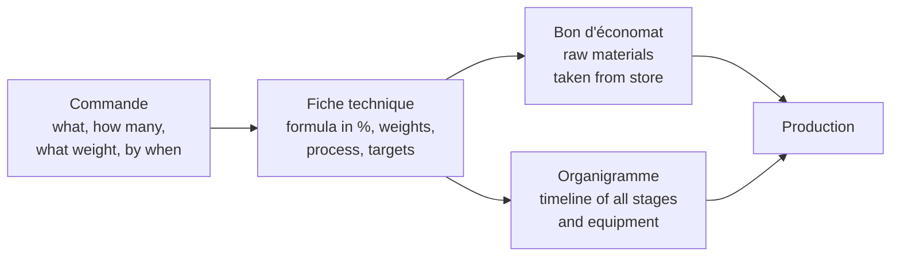

# 01.6 · Reading a Production Order and a Technical Sheet

Every production day starts with paper: an order says what must be ready and when, and a technical sheet says how to make it. This lesson takes you through a realistic order and a pain courant technical sheet from a craft bakery, and shows how to pull out everything you need before you touch the flour.

## Why it matters

The production test starts with a written phase: from an order, you complete the technical sheet and the organigramme for the whole order (see [The CAP Boulanger Exam](../../references/cap-exam.md)). The référentiel describes the expected result of C1.3 as technical sheets that match the order, a coherent sequence of tasks and exact calculations. In a real bakery, the person who misreads "60 g" as "80 g" on the roll order runs out of dough at 6:30 with the restaurant's delivery due at 7:30.

## Key terms

| French | Say it | English meaning |
|---|---|---|
| Commande (journalière) | *koh-MAHND* | The (daily) order: products, quantities, weights, deadline |
| Fiche technique | *feesh tek-NEEK* | Technical sheet: formula, process and targets for one product |
| Bon d'économat | *bohn day-koh-noh-MAH* | Requisition: the list of raw materials taken from the store for the day |
| Organigramme (de travail) | *or-gah-nee-GRAHM* | Work schedule: every stage of every product on one timeline |
| Frasage | *frah-ZAHZH* | First mixing phase at slow speed: ingredients come together |
| Pétrissage | *pay-tree-SAHZH* | Kneading: develops the gluten (mixing method and times on the sheet) |
| Pointage | *pwan-TAHZH* | Bulk fermentation, before dividing |
| Détente | *day-TAHNT* | Bench rest after dividing and pre-shaping |
| Apprêt | *ah-PRAY* | Final proof after shaping |
| Buée | *bü-AY* | Steam injected into the oven at loading |

## How it works

### Four documents, one chain

- The **order** comes from the manager, a customer or the shop. It fixes what and when, never how.
- The **technical sheet** fixes how: the bakery's formula in baker's percentages, the weights for this batch, the temperatures and every stage with its time and target. It is the bakery's standard, so the bread is the same whoever makes it.
- The **requisition** (bon d'économat) lists what you take from the store, so stock is known and the right batch numbers are used.
- The **organigramme** places every stage on a timeline so the mixer, the bench and the oven are never needed twice at the same time. Module 14 teaches it in full; here you only read one.

### The order

> **Boulangerie Au Pain de la Halle — Commande de production**
> Date: samedi 14 novembre 2026 · Ouvrier: you · Responsable: M. Ferrand
>
> | Produit | Quantité | Poids pâton | Forme | Pour |
> |---|---|---|---|---|
> | Baguette (pain courant) | 24 | 350 g | baguette, 5 coups de lame | magasin 7:00 |
> | Petit pain rond (pain courant) | 20 | 60 g | boule, 1 coup de lame | restaurant Le Zinc, livraison 7:30 |
>
> Même pâte pour les deux produits. Pâte fermentée: prendre au froid (+4 °C) le bac du vendredi. Fiche technique PC-02.

In English: 24 baguettes divided at 350 g and 20 round rolls at 60 g, both from the same pain courant dough, using the pâte fermentée kept in the fridge from Friday. Baguettes must be in the shop at 7:00, rolls ready for a restaurant delivery at 7:30. The process is on sheet PC-02.

### The technical sheet

> **Fiche technique PC-02 — Pain courant sur pâte fermentée**
>
> | Ingrédient | % | Base 1 kg farine | Lot du 14/11 |
> |---|---|---|---|
> | Farine T55 | 100 | 1,000 g | 5,400 g |
> | Eau | 64 | 640 g | 3,456 g |
> | Sel | 1.8 | 18 g | 97 g |
> | Levure fraîche | 1.5 | 15 g | 81 g |
> | Pâte fermentée | 15 | 150 g | 810 g |
> | **Total** | **182.3** | **1,823 g** | **9,844 g** |
>
> Température de pâte visée (TPV): 24 °C (23-25 °C). Eau: calculée le jour même (température de base).
>
> | Étape | Temps / réglage | Contrôle |
> |---|---|---|
> | Frasage | 4 min, 1re vitesse (pétrin à spirale); pâte fermentée en fin de frasage | plus de farine sèche |
> | Pétrissage | 6 min, 2e vitesse (pétrissage amélioré) | pâte lisse, se décolle de la cuve; T° 23-25 °C |
> | Pointage | 45 min, bac couvert, 24 °C | pâte gonflée, souple |
> | Division / boulage | 24 × 350 g, 20 × 60 g; boulage léger | ±5 g baguettes, ±2 g petits pains |
> | Détente | 20 min, couvert | pâte détendue |
> | Façonnage | baguettes 55 cm; petits pains en boule | régularité |
> | Apprêt | 1 h 15, chambre de pousse 25 °C, 75-80 % HR | test du doigt: l'empreinte revient lentement |
> | Grignage | baguettes 5 coups; petits pains 1 coup | lame à 30-45° |
> | Cuisson | four à sole 250 °C, buée à l'enfournement; baguettes 22 min, petits pains 15 min | croûte dorée, son creux |
> | Ressuage | sur grilles, 30 min minimum | — |

The batch weights were calculated exactly as in lesson 01.5: dough needed (24 × 350) + (20 × 60) = 9,600 g; plus 2% for losses = 9,792 g; flour = 9,792 × 100 ÷ 182.3 = 5,371 g, rounded up to 5,400 g; every other ingredient from 5,400 g.

### What to pull out before you start

From these two documents a professional extracts six lists, in this order:

1. **Products and deadlines:** what, how many, what weight, when, for whom.
2. **Ingredients and quantities:** the batch column, checked against the order.
3. **Requisition:** what to take from the store, including the pâte fermentée from the fridge.
4. **Equipment:** everything each stage needs.
5. **Sequence and times:** stages in order, with fermentation and rest times.
6. **Baking requirements:** oven temperature, steam, times, loads, cooling.

Then you work backwards from the earliest deadline to find your start time.

```mermaid
gantt
  title Order of 14/11, backwards from 7:00 (one 2-deck oven)
  dateFormat HH:mm
  axisFormat %H:%M
  section Dough
  Weighing (pesée)          :w, 02:30, 15m
  Mixing (frasage + pétrissage) :m, after w, 10m
  Pointage                  :p, after m, 45m
  Dividing and pre-shaping  :d, after p, 20m
  Détente                   :r, after d, 20m
  Shaping                   :s, after r, 25m
  Apprêt                    :a, after s, 75m
  section Oven
  Preheat 250 °C            :o, 05:00, 60m
  Bake 24 baguettes (2 decks) :b1, 06:00, 25m
  Bake 20 rolls             :b2, after b1, 18m
  section Finish
  Cooling baguettes         :c1, after b1, 30m
  Cooling rolls             :c2, after b2, 30m
```

The baguettes leave the oven at about 6:25 and are cool enough for the shop at 7:00; the rolls are out at 6:43 and cooled by about 7:15, in time for the 7:30 delivery. Weighing must start at 2:30. The rolls are shaped last and proofed slightly cooler so they are ready when the first load comes out. Cleaning happens in the gaps (during pointage and apprêt).

## Worked example

You are the ouvrier on 14 November. Here are your six lists for this order.

**1. Products and deadlines.** 24 baguettes, 350 g pâton, shop 7:00. 20 round rolls, 60 g pâton, delivery 7:30. Earliest deadline: 7:00.

**2. Ingredients.** Check the sheet against the order first: (24 × 350) + (20 × 60) = 9,600 g needed; the batch makes 9,844 g, which covers the 2% allowance. Weights: T55 flour 5,400 g; water 3,456 g; salt 97 g; fresh yeast 81 g; pâte fermentée 810 g.

**3. Requisition (bon d'économat).** Flour T55 5.4 kg (from the open sack first, then a new one: note the lot number); fresh yeast 81 g (check the use-by date on the block); salt 97 g; pâte fermentée 810 g from the fridge tub dated Friday. Water from the tap at the calculated temperature.

**4. Equipment.**

| Stage | Equipment |
|---|---|
| Weighing | Bench scale, bowls, thermometer |
| Mixing | Spiral mixer, scraper, probe thermometer |
| Pointage | Covered dough tub |
| Dividing | Scale, dough cutter (coupe-pâte), flour duster |
| Détente and shaping | Bench, cloths or plastic cover |
| Apprêt | Floured couche (baker's linen) on boards for baguettes, trays for rolls, proofing cabinet at 25 °C, 75-80% RH |
| Scoring and loading | Lame, transfer board (planchette), oven loader or peel |
| Baking | Deck oven at 250 °C with steam |
| Cooling | Racks (grilles) on a trolley (échelle) |

**5. Sequence and fermentation times.** Weigh → frasage 4 min speed 1, pâte fermentée added at the end of frasage → kneading 6 min speed 2 → check dough temperature (target 24 °C) → pointage 45 min → divide 24 × 350 g and 20 × 60 g, loose pre-shape → détente 20 min → shape → apprêt 1 h 15 at 25 °C → score → bake → cool 30 min minimum. Total fermentation from end of mixing to oven: 45 + 20 + 20 (dividing) + 25 (shaping) + 75 = about 3 h 05.

**6. Baking requirements.** Deck oven at 250 °C, preheated; steam at loading. Baguettes 22 min (one load across two decks); rolls 15 min (second load). Oven must be ready by 6:00. Cool on racks, never stacked or bagged warm.

The timing check is the one most beginners skip: start weighing at 2:30, or the baguettes will not be cool for 7:00.

## Practice

You read a second order and its technical sheet and produce the six lists yourself. It is a home-sized order, the same kind you will bake in lesson 01.7 and in the module project.

### You need

- Paper or a file, a calculator.
- The [production sheet template](../../templates/production-sheet.md) (optional, for the ingredient list).
- Professional equivalent: the day's orders and the bakery's binder of technical sheets.

### The documents

> **Commande — dimanche, maison**
> 8 petits pains plats (pain courant direct), pâton 105 g, prêts pour le déjeuner à 12:30.
>
> **Fiche technique PD-01 — Pain courant direct, pétrissage à la main**
>
> | Ingrédient | % |
> |---|---|
> | Farine T55 | 100 |
> | Eau | 65 |
> | Sel | 1.8 |
> | Levure fraîche | 1.5 |
>
> TPV 24 °C. Frasage 4 min à la main; pétrissage 10 min à la main. Pointage 1 h 15 à 24 °C, un rabat à 40 min. Division, boulage. Détente 15 min. Façonnage: aplatir à 1.5 cm. Apprêt 40 min à 24-26 °C. Cuisson four ménager 230 °C, plaque préchauffée, buée, 15-18 min. Ressuage sur grille 30 min.

### Steps

1. Write the products and deadline (list 1).
2. Calculate the dough needed. Use no loss allowance, then check whether 500 g of flour is enough. Write every ingredient weight for 500 g of flour (list 2).
3. Write the requisition from your own cupboard (list 3).
4. Write the equipment for each stage, home version (list 4).
5. Write the sequence with times and the total time from end of mixing to oven (list 5).
6. Write the baking requirements (list 6).
7. Work backwards from 12:30 to find the latest time you can start weighing. Allow 10 minutes for weighing, 10 minutes for dividing and pre-shaping, and 5 minutes for shaping.

Answers

1. 8 flat rolls of 105 g dough, ready at 12:30.
2. 8 × 105 = 840 g of dough. Total % = 168.3. With 500 g flour: water 325 g, salt 9 g, fresh yeast 7.5 g; total 841.5 g, which covers 840 g (only 1.5 g spare, so divide carefully).
3. Flour T55 500 g; salt 9 g; fresh yeast 7.5 g (check the date) or 2.5 g instant yeast; water 325 g.
4. Weighing: kitchen scale, 0.1 g scale, bowls, thermometer. Mixing: large bowl, scraper. Pointage: lidded container. Dividing: scale, scraper or knife. Détente and shaping: clean worktop, cloth. Apprêt: tray lined with baking paper, cover. Baking: oven at 230 °C, a baking tray preheated on the middle shelf, a metal tray on the bottom shelf for steam, oven gloves. Cooling: wire rack.
5. Weigh → frasage 4 min → knead 10 min → check 24 °C → pointage 1 h 15 with a fold at 40 min → divide 8 × 105 g, pre-shape → détente 15 min → flatten to 1.5 cm → apprêt 40 min → bake. From end of mixing to oven: 75 + 10 + 15 + 5 (shaping) + 40 = about 2 h 25.
6. Home oven 230 °C, preheated with the baking tray inside (allow 30-45 min), steam at loading, 15-18 min, cool 30 min on a rack.
7. Backwards from 12:30: cooling 30 min → out of the oven by 12:00 → bake 18 min → in the oven by 11:42 → apprêt 40 → shaping done by 11:02 → shaping 5 → détente 15 → dividing 10 → pointage 75 → mixing done by 9:17 → mixing 14 → weighing 10. Latest start for weighing: 8:53, so about 8:50. Switch the oven on around 11:00.

### Targets

- All six lists complete; ingredient weights exact.
- Your latest start time within 10 minutes of the answer.

### How you know it worked

You could hand your six lists to someone else and they could make the rolls without seeing the order or the sheet.

### Self-check

- [ ] I checked that the batch makes enough dough for the order.
- [ ] My equipment list covers every stage, including cooling.
- [ ] I added up the fermentation and rest times.
- [ ] I worked backwards from the deadline to a start time.
- [ ] I can say what each of the four documents is for.

## What goes wrong

| Symptom | Likely cause | Fix now | Prevent next time |
|---|---|---|---|
| Not enough dough for the last pieces | Batch not checked against the order; no loss allowance | Tell the manager at once; make the missing pieces from the next batch | Always check batch total ≥ pieces × weight + losses |
| Bread out of the oven late | Start time not worked backwards; oven not preheated | Warn the shop; prioritise the order with the earliest deadline | Plan backwards from the deadline including preheating and cooling |
| Wrong flour used | Requisition not checked against the sheet | Report it; do not sell the bread under the wrong name | Read the flour type on the sheet and the sack |
| Bread bagged warm and soft | Cooling time missing from the plan | Unbag and cool on racks | Cooling is a stage on every plan |
| Rolls made at 80 g instead of 60 g | Order misread | Re-divide if still possible; report | Read weights aloud and tick each line of the order |

## Review

- The order says what and when; the technical sheet says how; the requisition says what leaves the store; the organigramme says when each stage happens.
- From an order and a sheet, extract six lists: products and deadlines, ingredients, requisition, equipment, sequence and times, baking requirements.
- Always check that the batch covers the order plus losses.
- Work backwards from the earliest deadline, counting preheating and cooling.
- Completing a technical sheet and an organigramme from an order is part of the production test; see [The CAP Boulanger Exam](../../references/cap-exam.md).
