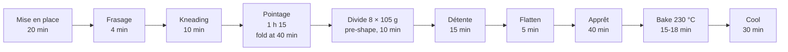

# 01.7 · Mise en Place: Your First Simple Dough

This is your first bake: a lean dough of flour, water, salt and yeast, mixed and kneaded by hand, fermented, divided into eight pieces and baked as flat rolls. The aim is not a perfect roll but a complete, controlled process: everything weighed before you start, every temperature and time measured, and a written record you can learn from.

## Why it matters

Watching someone make bread does not make you able to make bread: your hands learn only by doing, and this is the first of many bakes. Mise en place is assessed in the production test through your organisation and your hygiene (see [The CAP Boulanger Exam](../../references/cap-exam.md)), and a bench that is set up properly saves minutes at every stage. The Academy cannot grade photos of your bread: you compare your result honestly with the [quality rubric](../../templates/quality-rubric.md). That self-assessment helps you improve; it does not replace the official practical exam.

## Key terms

| French | Say it | English meaning |
|---|---|---|
| Mise en place | *meez ahn PLASS* | Everything weighed, cleaned and set out before you start |
| Pâte | *paht* | Dough |
| Frasage | *frah-ZAHZH* | First phase of mixing: flour and water come together into a rough dough |
| Étirage / soufflage | *ay-tee-RAHZH / soo-FLAHZH* | Stretching / the phase where the dough traps air and becomes smooth and elastic |
| Rabat | *rah-BAH* | Fold during pointage: stretching the dough and folding it over itself to give strength |
| Boulage | *boo-LAHZH* | Rounding a piece of dough into a ball (pre-shaping) |
| Coupe-pâte (corne) | *koop-PAHT (korn)* | Dough scraper / plastic bowl scraper |
| Test du doigt | *test dü DWAH* | Poke test: a floured finger pressed into the dough shows whether it is ready to bake |
| Plaque / grille | *plak / greey* | Baking tray / cooling rack |

## How it works

### What happens in a lean dough

1. **Frasage.** Water wets the flour. Two proteins in the flour, glutenin and gliadin, absorb water and start to link into **gluten**: a stretchy network. Starch absorbs water too. At the end of frasage the dough is rough and sticky.
2. **Kneading (étirage and soufflage).** Stretching and folding lines up and strengthens the gluten network, and folds in air. The dough becomes smooth, less sticky and springs back when pressed. By hand, this takes about 10 minutes for a 65% hydration dough.
3. **Fermentation.** Yeast feeds on sugars released from the flour's starch and produces carbon dioxide (CO2) and alcohol. The gluten network traps the gas, so the dough rises. Flavour develops at the same time. Temperature controls the speed: the same dough rises much faster at 27 °C than at 20 °C. That is why you aim for a **dough temperature** of 23-25 °C and measure it.
4. **Dividing, rest and shaping.** Dividing degasses the dough and tightens the gluten; the rest (détente) lets it relax so it can be shaped without tearing.
5. **Apprêt.** The shaped pieces fill with gas again.
6. **Baking.** In the hot oven the gas expands and the water turns to steam (oven spring); yeast dies at around 50-60 °C; starch sets into crumb; the surface browns. Steam at loading keeps the surface soft for the first minutes so the bread can expand, then gives a thin, shiny crust.

[Modules 3](../module-03/lesson-01.md), [4](../module-04/lesson-01.md) and [7](../module-07/lesson-01.md) explain each step in depth. Today you observe them.

### Getting the dough temperature right

The dough temperature after mixing depends on the flour, the room, the water and the heat from kneading. Water is the one you control. As a first estimate for hand mixing:

$$\text{water temperature} \approx 3 \times 24 - \text{flour temp} - \text{room temp} - 2$$

The 3 × 24 is the target dough temperature (24 °C) times the three temperatures you add up (flour, room, water). The 2 °C is a small allowance for the warmth of your hands and of kneading. Lesson [05.3](../module-05/lesson-03.md) shows how to measure it as a friction factor. Example: flour 20 °C, room 21 °C → water ≈ 72 − 20 − 21 − 2 = 29 °C. [Module 5](../module-05/lesson-02.md) makes this method precise; today, use the estimate, measure the result and write both in your log.

### Your timeline

About 3 h 30 from the first weighing to cooled rolls, of which about 1 hour is hands-on. Switch the oven on with its trays inside about 45 minutes before baking, during the détente.

## Worked example

Sam bakes at home on a Sunday. Kitchen 21 °C, flour 20 °C. Her mise en place sheet:

| Item | Plan | Actual |
|---|---|---|
| Flour T55 | 500 g | 500 g |
| Water | 325 g at 29 °C | 325 g at 29 °C |
| Salt | 9.0 g | 9.0 g |
| Fresh yeast | 7.5 g | 7.5 g |
| Dough temperature after kneading | 24 °C | 25.5 °C |
| Pointage | 1 h 15 | stopped at 1 h 00: dough already about twice its volume |
| Pieces | 8 × 105 g | 104-107 g |
| Bake | 230 °C, 16 min | 17 min |

Her dough came out 1.5 °C too warm. Warmer dough ferments faster, so she judged the dough rather than the clock and divided after 1 hour. Her correction for next time: water 1.5 °C cooler, at 27.5 °C. That is exactly how professionals use a technical sheet: plan, measure, compare, correct.

## Practice

> [!WARNING]
> The oven, the trays and the steam can burn you. Use dry oven gloves (wet ones conduct heat), long sleeves, and keep children and pets away. Never pour water into a hot glass or ceramic dish: it can shatter. Use a metal tray only, pour quickly, close the door and step back from the first burst of steam.

### You need

- Digital scale (1 g) and, ideally, a 0.1 g pocket scale; probe thermometer.
- Large bowl, dough scraper, a lidded container of about 2 L for pointage (with a line marked at the starting level), clean worktop.
- Tea towel or plastic sheet to cover the dough; baking paper.
- Two metal baking trays (one for the rolls, one empty roasting tin for steam), oven gloves, wire rack, timer.
- Professional equivalent: spiral mixer, dough tub, bench, proofing cabinet, deck oven with steam injection, racks.

### Ingredients

| Ingredient | Baker's % | Weight |
|---|---|---|
| Flour T55 (outside France: plain or all-purpose flour, about 10-12% protein) | 100 | 500 g |
| Water | 65 | 325 g |
| Fine salt | 1.8 | 9 g |
| Fresh yeast (or instant dry yeast at one third of the weight) | 1.5 | 7.5 g (or 2.5 g instant) |
| **Total** | **168.3** | **841.5 g** |

Professional batch for comparison: the same formula on 5 kg of flour is 3,250 g water, 90 g salt and 75 g fresh yeast, mixed on a spiral mixer.

### In Israel

- **Flour:** white flour (קמח לבן, *kemakh lavan*) stands in for T55; read the protein and ingredients as shown in [Flour in Israel](../../references/flour-in-israel.md). If the dough feels firm and tears after frasage, which is common with stronger Israeli white flour, work in 10-15 g more water and write it down.
- **Yeast:** fresh yeast (שמרים טריים, *shmarim triyim*) is in the chilled section of some supermarkets and bakery-supply shops; instant dry yeast (שמרים יבשים, *shmarim yeveshim*) is everywhere: use 2.5 g instant instead of 7.5 g fresh (checked 2026-10-09).
- **Salt:** fine salt (מלח דק, *melakh dak*), not coarse salt (מלח גס, *melakh gas*), which dissolves slowly in a hand-mixed dough.
- **Summer water:** with flour at 29 °C and a 30 °C kitchen, the lesson [01.7](../module-01/lesson-07.md) estimate gives 72 − 29 − 30 − 2 = **11 °C**: tap water at 26-30 °C is far too warm. Blend fridge water with tap water (lesson [05.2](../module-05/lesson-02.md)).
- **Shorter times:** fermentation runs about 7 % faster per °C of dough (lesson [05.4](../module-05/lesson-04.md)): a 26 °C dough is ready about 15 % sooner, so check pointage from 1 h and the poke test from 30 minutes. Proof in the coolest room, not beside the oven.

### Steps

**Mise en place (20 min)**

1. Clear and clean the worktop; dress (apron, hair covered, no rings or watch); wash your hands (lesson [01.3](lesson-03.md)).
2. Check the scale is at zero. Measure the flour and room temperatures. Calculate the water temperature with the estimate above and write it down.
3. Weigh each ingredient in its own container: flour, water (at the calculated temperature), salt, yeast. Tick each one on your sheet.
4. Set out the scraper, the container, the cover, the timer, the bake log. Copy the timeline onto paper.

**Mixing (15 min)**

5. Pour the water into the bowl. Crumble the fresh yeast into it and stir until dissolved (instant yeast can go straight in with the flour).
6. Add the flour, then the salt on top. **Frasage:** mix with the scraper and one hand for about 4 minutes until there is no dry flour left. The dough is rough and sticky.
7. Turn the dough onto the clean, unfloured worktop. **Knead for 10 minutes:** lift the dough, slap the bottom on the worktop, stretch the top towards you and fold it back over itself; turn it a quarter and repeat. Use the scraper to gather it. Do not add flour: the stickiness decreases as the gluten develops.
8. Stop when the dough is smooth, does not stick to a clean hand and springs back slowly when pressed. Stretch a small piece between your fingers: it should stretch into a thin sheet before tearing.
9. Measure the dough temperature in the centre. Write it down. Target: 23-25 °C.

**Pointage (1 h 15)**

10. Put the dough in the lightly oiled container, mark the level, cover it and leave it at about 24 °C (in winter, inside the switched-off oven with only the light on, checked with your thermometer).
11. At 40 minutes, do one **fold (rabat):** with a wet hand, lift each side of the dough, stretch it up and fold it over the middle; four sides. Cover again.
12. At 1 h 15, the dough should have risen to roughly one and a half to two times its volume, be domed and show a few bubbles. If it got there earlier (warm dough), move on earlier.

**Dividing and shaping (30 min)**

13. Turn the dough onto a very lightly floured worktop. Cut 8 pieces with the scraper and weigh each one to **105 g ±2 g**, adding or removing small pieces. Write down each weight.
14. Round each piece gently into a ball (boulage), seam underneath. Cover. **Détente 15 minutes.** Switch the oven on now: 230 °C, one tray on the middle shelf, the empty roasting tin on the lowest shelf.
15. Flatten each ball with your fingertips into a disc about 1.5 cm thick and 10-11 cm across. Place them on baking paper on the back of a tray or a board, 3 cm apart.

**Apprêt and baking (60 min)**

16. Cover and leave to proof about 40 minutes at 24-26 °C.
17. **Poke test:** press a floured finger 1 cm into one roll. If the dent springs back slowly and leaves a slight mark, bake. If it springs back at once, wait 10 more minutes. If it does not spring back at all, bake immediately.
18. Slide the paper with the rolls onto the hot tray. Pour about 100 mL of hot water into the roasting tin, close the door at once and step back.
19. Bake 15-18 minutes until golden on top and underneath. A roll tapped underneath sounds hollow; the centre of a roll reads above about 95 °C with the probe.
20. Cool on the rack for 30 minutes. Weigh one cooled roll and calculate the baking loss: (105 − baked weight) ÷ 105 × 100.
21. Clean the station: scrape the worktop dry first (dough and water make paste), then wash; wash and dry the tools.
22. Cut one roll and score it with the [quality rubric](../../templates/quality-rubric.md). Fill in the [bake log](../../templates/bake-log.md).

### Targets

- All ingredients weighed before mixing; salt and yeast within ±0.1 g on a pocket scale (±0.5 g on a 1 g scale).
- Dough temperature after kneading 23-25 °C.
- 8 pieces of 105 g ±2 g.
- Rolls evenly golden, top and bottom; crumb baked through, not sticky.
- Station clean within 15 minutes of the last tray coming out.

### How you know it worked

The rolls have risen in the oven and have a soft, even crumb with small holes, a thin golden crust and a clean bread smell. Your log shows every planned and actual number, and you can say what you will change next time and why.

### Self-check

- [ ] Every ingredient was weighed and ticked before I started mixing.
- [ ] I measured and wrote down flour, room, water and dough temperatures.
- [ ] My dough was smooth and stretched into a thin sheet after kneading.
- [ ] I judged the end of pointage and apprêt by the dough, not only the clock.
- [ ] All 8 pieces were within ±2 g.
- [ ] I loaded the oven and made steam without burning myself.
- [ ] I filled in the bake log and scored one roll with the rubric.

## What goes wrong

| Symptom | Likely cause | Fix now | Prevent next time |
|---|---|---|---|
| Dough very sticky after 10 minutes of kneading | Not yet developed; or extra water | Keep kneading 3-5 more minutes with the scraper; resist adding flour | Weigh water exactly; knead the full time |
| Dough below 22 °C after kneading | Water too cold, cold room | Ferment somewhere warmer and let it take longer | Raise the water temperature by the difference |
| Dough above 26 °C | Water too warm | Ferment somewhere cooler; shorten pointage by the dough's look | Lower the water temperature by the difference |
| Hardly risen after 1 h 15 | Cold dough or room; yeast old or weighed short | Give it more time somewhere warm | Check yeast date; use the 0.1 g scale |
| Rolls spread flat and pale | Over-proofed: apprêt too long or too warm | Bake at once | Use the poke test; check the dough earlier |
| Rolls dense with tight crumb | Under-proofed or under-kneaded | — | Knead to the stretch test; wait for a slow spring-back |
| Pieces from 98 to 112 g | Divided by eye | Re-weigh and adjust before rounding | Weigh every piece, every time |
| Burnt bottoms, pale tops | Tray too low or oven hotter at the bottom | Move to a higher shelf for the last minutes | Bake on the middle shelf; check your oven with a thermometer |

## Review

- Mise en place first: clean station, everything weighed and ticked, timeline written, before the first mix.
- Dough temperature controls fermentation speed; estimate the water temperature, measure the dough, correct next time.
- Judge pointage and apprêt by the dough (volume, poke test), not only by the clock.
- Weigh every piece; record planned and actual numbers in the bake log.
- This home bake is practice, not the exam: compare honestly with the rubric, and see [The CAP Boulanger Exam](../../references/cap-exam.md) for what the production test requires.
