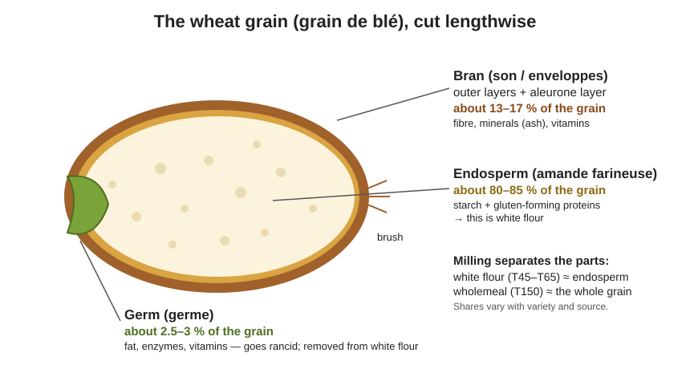
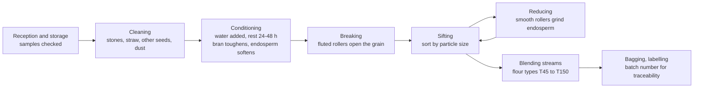

# 02.1 · The Wheat Grain and Milling

Every loaf you will make starts as a grain of wheat, and most of what flour does in a dough is decided by which parts of that grain the mill kept. This lesson takes the grain apart, follows it through the mill, and ends with you sieving and comparing a wholemeal and a white flour at home.

## Why it matters

A baker who knows the grain can predict a flour. Bran (the outer layers) brings colour, fibre, minerals and flavour, but it also absorbs water and cuts the gluten network. The germ brings fat and enzymes, which add taste but make flour go rancid. The endosperm (the white heart) brings the starch and the gluten-forming proteins that make bread possible. When a dough behaves differently from yesterday's, "the flour changed" is often the honest first answer, and this lesson gives you the words to describe how.

The CAP référentiel expects you to cite the parts of the grain with their percentages, the steps of milling and the difference between soft wheat and durum wheat (savoir S2.1). These are classic EP1 questions; see the [exam reference](../../references/cap-exam.md) for how EP1 is organised.

> [!NOTE]
> This is the first lesson of a practical module, so a reminder that applies to all of them: watching someone bake does not make you able to bake. Do the practice at home. The Academy cannot grade photos, so you compare your result with the targets and the rubric yourself, and that self-assessment does not replace the official practical exam.

## Key terms

| French | Say it | English meaning |
|---|---|---|
| grain de blé | *gran duh BLAY* | wheat grain (kernel) |
| blé tendre | *blay TAHN-druh* | soft (common) wheat, *Triticum aestivum*: the wheat for bread flour |
| blé dur | *blay DOOR* | durum wheat, *Triticum durum*: for semolina and pasta, not French bread |
| enveloppes / son | *ahn-VLOP / SOHN* | bran: the protective outer layers of the grain |
| amande farineuse | *ah-MAHND fah-ree-NUHZ* | starchy endosperm: the white heart that becomes white flour |
| germe | *ZHAIRM* | germ (embryo) of the grain |
| mouture | *moo-TOOR* | milling: turning grain into flour |
| taux d'extraction | *toh dex-trak-SYOHN* | extraction rate: kg of flour obtained from 100 kg of clean grain |
| meunier / minoterie | *muh-NYAY / mee-no-TREE* | miller / flour mill |

## How it works

### The three parts of the grain

| Part | Share of grain weight (approx.) | What it contains | What it does in bread |
|---|---|---|---|
| Bran (enveloppes + aleurone layer) | 13–17 % | fibre, most of the minerals, B vitamins, some protein | darker colour, more flavour, more water absorption; sharp particles cut the gluten film so volume falls |
| Endosperm (amande) | 80–85 % | starch (about 70 % of flour), gluten-forming proteins | the structure of the dough and the bulk of the crumb |
| Germ (germe) | 2.5–3 % | fat, enzymes, vitamin E | flavour, but fat oxidises: flour with germ keeps for less time |

Authors give slightly different numbers (they cut the layers differently), so learn ranges, not a single figure. The référentiel only asks for the order of magnitude: the endosperm is by far the biggest part.

### Soft wheat and durum wheat

- **Blé tendre** (soft or common wheat) breaks into a fine, soft flour whose proteins form an elastic, extensible gluten. All French bread and viennoiserie flours are soft wheat.
- **Blé dur** (durum) is very hard and glassy. It breaks into semolina (coarse particles) and its gluten is tough and not very extensible. It is used for pasta and couscous, not for French bread.

### What the mill does

Modern flour mills (*minoteries*) use roller mills: pairs of steel cylinders that open the grain gradually, followed by sifters that sort the particles by size. Each pass is called a stream; the miller blends streams to make each flour type.

- **Cleaning** removes stones, metal, other seeds and dust.
- **Conditioning** (*mouillage*, then rest): water toughens the bran so it comes off in big flakes and softens the endosperm so it grinds easily.
- **Breaking** (*broyage*): grooved rollers open the grain and scrape the endosperm off the bran.
- **Sifting** (*blutage*): sieves separate flour, semolina-sized particles and bran.
- **Reducing** (*convertissage*): smooth rollers grind the semolina-sized endosperm into flour. Some starch granules are damaged on purpose; a little damaged starch (around 6 % of the starch) helps the dough absorb water and feeds the yeast.

Stone mills (*meules*) crush the whole grain in one pass. The flour keeps more germ and fine bran, so it is darker and tastier but keeps less long; it is usually sold as T80 to T110.

### Extraction and the flour type

From 100 kg of clean grain, a mill making white flour gets roughly 70–78 kg of flour; the rest is bran and germ (sold mostly for animal feed). The more of the grain is kept, the higher the extraction rate, the more minerals (ash) end up in the flour and the higher its type number. Wholemeal flour keeps almost all of the grain. Lesson [02.2](lesson-02.md) turns this into the legal French flour types.

### From the field to the bakery: traceability

The chain runs farmer → collecting cooperative (*organisme stockeur*) → mill → baker → customer. Each step keeps documents (delivery note, batch number, analysis certificate) so that a problem found in bread can be traced back to a batch of flour and a batch of wheat. As a baker you keep the flour bag label or the delivery note until the batch is used up.

## Worked example

A mill receives 30 t (30,000 kg) of clean, conditioned wheat. It runs at a 75 % extraction rate for white flour. How much flour and how many 25 kg bags?

1. Flour = 30,000 × 75 / 100 = 22,500 kg.
2. Bags = 22,500 ÷ 25 = 900 bags.
3. By-products (bran, germ, small losses) = 30,000 − 22,500 = 7,500 kg.

A baker using 50 kg of flour per day uses 900 bags in 900 × 25 ÷ 50 = 450 working days: one truckload of wheat is more than a year of bread for one bakery. That is why the batch number on the bag matters: one batch of flour ends up in thousands of loaves.

## Practice

### You need

- Minimum: a digital scale (1 g), a fine sieve (tea strainer or flour sieve), two white plates or sheets of white paper, a spoon, good light, a notebook or the [bake log](../../templates/bake-log.md).
- Professional equivalent: a laboratory sieve set and a miller's analysis certificate.

### Ingredients

| Ingredient | Weight | Note |
|---|---|---|
| Wholemeal flour (T150, "farine complète", or "wholemeal" outside France) | 100 g | weigh exactly |
| White flour (T55 or T45, or plain/all-purpose) | 100 g | weigh exactly |

### Steps

1. Weigh 100 g of wholemeal flour into a bowl. Write down the bag's name, type and batch number.
2. Sieve it onto a plate, tapping gently for 2 minutes. Do not push it through with your fingers.
3. Weigh what stayed in the sieve (the coarse bran) and what passed through.
4. Repeat with 100 g of white flour.
5. Put a spoonful of each sieved fraction side by side on white paper. Compare colour, particle size and smell (rub a pinch between your fingers and smell).
6. Rub a pinch of each between two fingers: note whether it feels soft or gritty.
7. Write one sentence per flour: what part of the grain do you think it contains?

### Targets

- Weighing error under 1 g on 100 g.
- Wholemeal: typically 5–20 g stays in a tea strainer (depends on how finely it was milled). White flour: close to 0 g.

### How you know it worked

You can show someone a pile of bran from the wholemeal flour and explain that it came from the 13–17 % outer layers of the grain, and that the white flour has almost none of it.

### Self-check

- [ ] I weighed both flours to the gram and recorded the batch numbers.
- [ ] I can name the three parts of the grain with their approximate shares.
- [ ] I can say which part gives starch, which gives fat, which gives fibre and minerals.
- [ ] I can list the five main milling steps in order.

## What goes wrong

| Symptom | Likely cause | Fix now | Prevent next time |
|---|---|---|---|
| Wholemeal flour smells bitter or "paint-like" | Germ fat has oxidised (rancid flour) | Do not use it for bread; it will taste bitter | Buy small amounts, check the date, store cool and dark, use within weeks |
| Nothing stays in the sieve for a wholemeal flour | Very finely milled, or it is not truly wholemeal | Check the type on the bag | Read the label: "complète" or T150 |
| Bran pushed through the sieve | Pressing with fingers instead of tapping | Restart with a new 100 g | Tap only; same time for both flours |
| Different results from the same flour | Inconsistent weighing or sieving time | Repeat both | Same method, same time, same scale |

## Review

- The wheat grain is about 80–85 % endosperm (starch and gluten proteins), 13–17 % bran and 2.5–3 % germ.
- White flour comes from the endosperm; wholemeal keeps bran and germ, so it is darker, tastier, absorbs more water and gives less volume.
- Milling: clean, condition, break, sift, reduce, blend. Soft wheat makes bread flour; durum makes semolina and pasta.
- Batch numbers and delivery notes let a problem be traced from bread back to wheat; keep them until the flour is used.
- Exam-relevant (EP1, savoir S2.1): see [the CAP exam reference](../../references/cap-exam.md).
