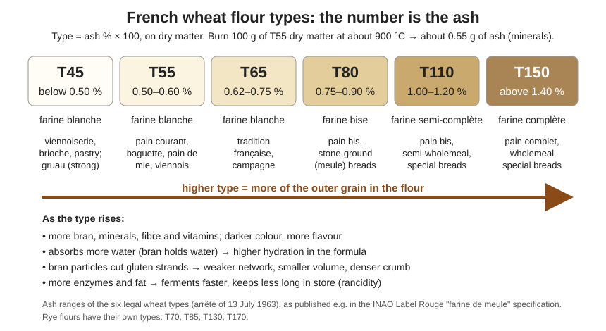

# 02.2 · French Flour Types and Legal Names

In France a flour bag tells you a lot in very few characters: "T65", "farine de tradition française", "gruau". This lesson decodes those labels, shows how millers and bakers test a flour, compares rye with wheat, and ends with you reading real flour bags and doing a Pekar test at home.

## Why it matters

The flour type tells you, before you open the bag, roughly how dark the flour is, how much water it will take, how much volume to expect and how fast it will ferment. The legal names tell you what you are allowed to make with it: you cannot sell a "pain de tradition française" made with a flour that contains additives. Choosing the wrong flour is one of the first non-conformities a CAP candidate can make on a production order, and "associate each flour with its product" is a typical EP1 question (see the [exam reference](../../references/cap-exam.md)).

## Key terms

| French | Say it | English meaning |
|---|---|---|
| type (T55, T65…) | *teep* | flour type: ash content × 100, on dry matter |
| taux de cendres | *toh duh SAHNDR* | ash content: the minerals left after burning the flour |
| farine blanche / bise / complète | *fah-REEN blahnsh / beez / kohm-PLET* | white / light brown / wholemeal flour |
| farine de tradition française | *fah-REEN duh trah-dee-SYOHN frahn-SEZ* | wheat flour with no additives, made for pain de tradition française |
| farine de gruau | *fah-REEN duh grew-OH* | high-protein, strong white flour for viennoiserie and pâtes levées |
| farine de seigle | *fah-REEN duh SEG-luh* | rye flour |
| test de Pekar | *test duh peh-KAR* | Pekar (slick) test: comparing flour colour and specks wet on a board |
| teneur en eau | *tuh-NUHR ahn OH* | moisture content of the flour |
| piqûres | *pee-KOOR* | specks: tiny bran particles visible in the flour |

## How it works

### The type is the ash

To find the ash content, a laboratory burns a weighed sample of flour at about 900 °C. Starch, proteins and fat burn away; the minerals remain as ash. Because minerals sit mostly in the bran, more ash means more bran in the flour. The French type number is the ash percentage (on dry matter) × 100: T55 leaves about 0.55 g of ash per 100 g of dry flour.

| Type | Ash on dry matter | Usual name | Typical uses |
|---|---|---|---|
| T45 | below 0.50 % | farine blanche | viennoiserie, brioche, pastry; gruau is usually T45 |
| T55 | 0.50–0.60 % | farine blanche | pain courant, baguette, pain de mie, viennois |
| T65 | 0.62–0.75 % | farine blanche | pain de tradition française, campagne |
| T80 | 0.75–0.90 % | farine bise | pain bis, stone-ground breads |
| T110 | 1.00–1.20 % | farine semi-complète | semi-wholemeal and special breads |
| T150 | above 1.40 % | farine complète | pain complet |

These six types were fixed for wheat flour by an arrêté of 13 July 1963 and are still the reference used by mills and in official specifications. The numbers are ranges, not exact values, and the gaps between them are real: there is no legal type for a flour at 0.61 % ash.

### What the type changes in the dough

| Property | Low type (T45–T55) | High type (T110–T150) | Why |
|---|---|---|---|
| Colour of crumb | white, creamy | grey-brown | bran pigments and particles |
| Water absorption | lower | higher (several % more) | bran fibre holds water |
| Elasticity / extensibility | strong, extensible network | shorter, weaker network | bran particles cut gluten films |
| Fermentation | normal | faster | more enzymes, minerals and sugars near the bran |
| Volume and crumb | high volume, open crumb | lower volume, denser crumb | weaker gas retention |
| Crust | golden, crisp | darker, thicker | more sugars and proteins for colour |
| Storage | months | weeks (germ fat oxidises) | more fat in higher types |

### Composition of a bread flour

For a white bread flour such as T55, as an order of magnitude: moisture up to about 15–16 % (mills usually aim for 14–15 %), starch about 70 %, proteins about 9–12 %, fat 1–2 %, simple sugars 1–2 % and ash 0.50–0.60 %. Moisture matters: flour above 16 % water keeps badly and you pay for water instead of flour.

### The legal names

- **Farine ordinaire** (or simply "farine de blé"): a wheat flour that may contain the improvers and additives allowed for bread flour (for example ascorbic acid, malt flour, bean flour, gluten, fungal enzymes; see lesson [02.9](lesson-09.md)).
- **Farine de tradition française**: a wheat flour sold for making pain de tradition française. The law on bread (décret n°93-1074, article 2) allows that bread no additives at all; the only extras permitted are up to 2 % bean flour (*farine de fèves*), 0.5 % soy flour and 0.3 % wheat malt flour, as a share of the flour. So a "tradition" flour is a flour without additives, usually T65, often with a little malt or bean flour already blended in. The full legal definition of the bread is taught in [lesson 09.1](../module-09/lesson-01.md) ([Module 9](../module-09/lesson-01.md)).
- **Farine de gruau**: a strong, high-protein white flour (traditionally the finest streams of the mill). The millers' code of practice quoted by INAO sets at least 12 % protein on dry matter and at most type 65; in practice it is sold as T45 (sometimes T55) for croissants, brioche and pain de mie, where it gives volume and holds butter-rich doughs.

### How flour is tested

| Test | What it measures | What the baker learns |
|---|---|---|
| Ash content (taux de cendres) | minerals left after burning | the type: how much bran and how pure the flour is |
| Moisture (teneur en eau) | water lost on drying at about 130 °C | keeping quality; true amount of dry flour bought |
| Pekar test | colour and specks of wet flour compared side by side | quick comparison of purity between two flours, no numbers |
| Alveograph (W, P/L) | dough bubble blown until it bursts | strength and balance of the gluten (lesson [02.3](lesson-03.md)) |
| Hagberg falling number | enzyme (amylase) activity | too low = sticky dough and gummy crumb; too high = pale crust, slow fermentation |
| Baking test (test de panification) | a standard bread is made and scored | the only test that says how the flour really bakes |

The Pekar test is the one you can do in a bakery with no laboratory. Flour is pressed flat on a small board with a spatula so the surface is smooth, dipped in water for about 20 seconds, then left to dry slightly. Wetting makes colour differences and bran specks (*piqûres*) much easier to see. It compares flours with each other; it does not give a number. Two flours with the same ash can show different specks, which tells you about milling quality.

### Rye flour (farine de seigle)

Rye has its own French types: T70 and T85 (light), T130 (semi-wholemeal) and T170 (wholemeal). Its behaviour is very different from wheat:

| | Wheat flour | Rye flour |
|---|---|---|
| Gluten | proteins form an elastic gluten network | proteins do not form a gluten network |
| What holds the gas | gluten films | sticky gums (pentosans) that hold a lot of water |
| Water absorption | normal | high; the dough is sticky and paste-like |
| Enzymes | moderate | strong amylase activity: risk of gummy crumb |
| Fermentation | yeast or levain | acidification (levain) is needed to control enzymes and set the crumb |
| Typical use | all breads | pain de seigle, pain de campagne (part rye), tourte de seigle |

A rye T170 sheet from a French mill gives, per 100 g: about 8 g protein and 21 g fibre, against roughly 10–12 g protein and about 3 g fibre for a white wheat flour. The high fibre explains the water absorption and the dense crumb.

## Worked example

A production order for tomorrow asks for: 60 baguettes de tradition française, 20 pains complets, 1 batch of croissants and 10 pains de seigle. In the store you find four bags: "Farine de blé T55 (contient : acide ascorbique, farine de fève)", "Farine de tradition française T65", "Farine de gruau T45", "Farine de blé complète T150", "Farine de seigle T130".

1. **Tradition baguettes** → farine de tradition française T65. The T55 contains ascorbic acid, an additive: forbidden for tradition.
2. **Pain complet** → T150 wholemeal. Plan more water (higher absorption).
3. **Croissants** → farine de gruau T45 (or T45 with part gruau): strong enough to hold the layers and the butter.
4. **Pain de seigle** → the T130 rye with some wheat flour as the formula says; plan a levain to acidify.
5. **The T55 with additives** goes to pain courant, not to tradition.

Write the batch numbers of the bags you open on the production sheet: if the bread fails, you can check whether the flour batch was the cause.

## Practice

### You need

- Minimum: 2 or 3 different flour bags (supermarket is fine), a small smooth wooden or plastic board (or a ruler, a spatula), a bowl of cold water, good daylight, your phone camera, the [bake log](../../templates/bake-log.md).
- Professional equivalent: Pekar boards and the miller's analysis certificate for each batch.

### Ingredients

| Ingredient | Weight |
|---|---|
| Flour A (e.g. T45 or plain white) | about 10 g |
| Flour B (e.g. T65 or T80, or "bread flour") | about 10 g |
| Flour C (optional, T110 or T150 / wholemeal) | about 10 g |

### Steps

1. **Read the bags.** For each flour, copy: name (dénomination), type, ingredients list, protein per 100 g from the nutrition table, best-before date (DDM), batch number, storage advice. Outside France, write the protein and "wholemeal/white" instead of the type.
2. Decide for each flour which product of the worked example it would suit, and why.
3. **Pekar test.** Put a heaped teaspoon of each flour side by side on the board, touching each other.
4. Press them flat and smooth with the spatula in one stroke so the edges touch and the surfaces are level.
5. Hold the board at an angle and dip it slowly into the water for about 20 seconds without shaking.
6. Lift it out and let it drain for 5–10 minutes. Photograph it in daylight before and after wetting.
7. Compare: whiteness, grey or yellow tones, number and size of specks.

### Targets

- All label data copied for each flour with no gaps.
- Pekar strips touching, smooth, equally wet.

### How you know it worked

The flour with the higher type (or "wholemeal") is visibly darker after wetting and shows more and larger specks; the strongest white flour is the creamiest. Your ranking matches the types on the bags. If it does not, check whether one flour is labelled "bise" or stone-ground, which carries more fine bran.

### Self-check

- [ ] I can convert a type to an ash percentage and back.
- [ ] I can explain why a T150 needs more water and gives less volume than a T55.
- [ ] I know which flour is forbidden for tradition and why.
- [ ] I did a Pekar test and can describe what it shows and what it cannot show.
- [ ] I can give three differences between rye and wheat flour.

## What goes wrong

| Symptom | Likely cause | Fix now | Prevent next time |
|---|---|---|---|
| Tradition loaf refused at a check: the flour list shows E300 | Ordinary flour with ascorbic acid used | Sell it as pain courant, not tradition | Separate and label tradition flour in the store; check the bag before weighing |
| Dough far too stiff after switching to a higher type | Same water as the white-flour formula | Add water gradually during mixing (bassinage, [lesson 03.5](../module-03/lesson-05.md)) | Adjust hydration when the flour type changes |
| Croissant dough tears and lacks volume | Weak T55 used instead of gruau | Give longer rests between turns | Use the flour the formula asks for |
| Rye dough sticky and gummy crumb | No acidification, too much enzyme activity | Bake longer at slightly lower temperature | Use levain; follow the rye formula's water |
| Pekar strips run into each other | Surface not smooth, board shaken | Repeat with fresh flour | Press flat in one stroke; dip slowly |

## Review

- The type is ash × 100: T45 (white, viennoiserie) to T150 (wholemeal). Higher type = more bran, darker, more water, less volume, faster fermentation, shorter storage.
- Farine de tradition française has no additives (only up to 2 % bean, 0.5 % soy, 0.3 % malt flour); gruau is a strong flour for viennoiserie.
- Baking in Israel? [Flour in Israel](../../references/flour-in-israel.md) matches white, 80 % and 100 % whole wheat flour to the French types.
- Ash, moisture, Pekar, alveograph, falling number and the baking test each answer a different question; only the baking test shows real behaviour.
- Rye has no gluten network: its gums hold water and gas, and it needs acidification (levain).
- Exam-relevant (EP1, S2.1): see [the CAP exam reference](../../references/cap-exam.md).
