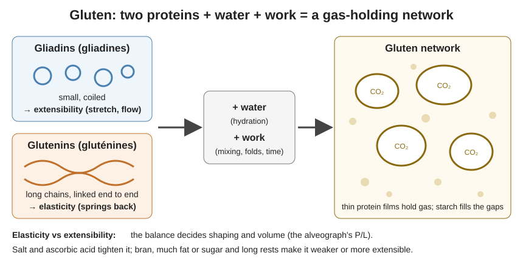

# 02.3 · Proteins, Gluten, Starch and Flour Strength

Bread exists because two wheat proteins, given water and work, link into gluten: a stretchy film that traps the gas made by yeast. This lesson explains gluten, starch and enzymes, what "flour strength" means on a miller's sheet, and ends with you washing the gluten out of two flours and baking it.

## Why it matters

Every dough decision later in the course (how much water, how long to mix, how long to ferment, how tightly to shape) is a decision about gluten and starch. A baker talks about a dough's *force* (strength), its *élasticité* (it springs back) and its *extensibilité* (it stretches without tearing). Those three words come straight from the flour's proteins. When you know where they come from, you can read a flour specification, choose the right flour and correct a dough that is too tight or too slack.

## Key terms

| French | Say it | English meaning |
|---|---|---|
| protéines du blé | *pro-tay-EEN dew BLAY* | wheat proteins; in flour, about 9–12 % of the weight |
| gliadines / gluténines | *glee-ah-DEEN / gloo-tay-NEEN* | the two gluten-forming protein families |
| gluten | *gloo-TEN* | the network formed by gliadins and glutenins with water and work |
| élasticité | *ay-las-tee-see-TAY* | elasticity: the dough springs back after stretching |
| extensibilité | *ex-tahn-see-bee-lee-TAY* | extensibility: the dough stretches without tearing |
| force (boulangère) | *FORSS* | flour or dough strength; on a lab sheet, the alveograph value W |
| amidon | *ah-mee-DOHN* | starch: about 70 % of flour |
| empois d'amidon | *ahm-PWAH dah-mee-DOHN* | starch gel formed when starch is heated in water (gelatinisation) |
| amylases | *ah-mee-LAHZ* | enzymes that cut starch into sugars the yeast can eat |
| indice de chute (Hagberg) | *an-DEESS duh SHOOT* | falling number: a measure of amylase activity |

## How it works

### Flour proteins: two families that make gluten

About 80–85 % of the proteins in wheat flour are the gluten-forming ones; the rest (albumins, globulins, enzymes) dissolve in water and do not build structure.

- **Gliadins** are small, coiled proteins. Hydrated, they behave like a sticky, flowing glue: they give **extensibility**.
- **Glutenins** are very long chains linked end to end. Hydrated, they behave like rubber: they give **elasticity** and strength.
- Neither forms gluten in dry flour. **Water** lets them unfold; **mechanical work** (mixing, folding) and **time** let them line up and bond (including disulphide bridges between sulphur atoms). The result is a continuous network of thin films.
- Yeast makes carbon dioxide; gas dissolves in the dough water and diffuses into tiny air bubbles trapped during mixing. The gluten films stretch around those bubbles and hold them. That is **gas retention**, and it decides the volume.

A dough with lots of glutenin relative to gliadin is strong and elastic: it resists, springs back and holds its shape, but can be hard to shape and can tear. A dough with relatively more gliadin, or a weak flour, is extensible: easy to stretch, but it spreads. The baker wants a **balance** for each product.

### Starch: the filling that becomes the crumb

Starch is about 70 % of flour, stored as tiny granules (2–40 µm). In the cold dough most granules sit intact between the gluten films and absorb a little water. A few percent are **damaged** by the mill (about 6 % of the starch is a usual target): damaged granules absorb much more water and are attacked by enzymes, which feeds the yeast.

In the oven, from about 55–60 °C upward, starch granules swell with water and burst into a gel: **gelatinisation** (*formation d'empois*). Around 70–80 °C the gluten proteins **coagulate** (set). Together they turn the soft foam into a firm crumb. During cooling and storage the starch slowly recrystallises and pushes water out: that is **staling** (rassissement), lesson 07.5.

### Enzymes: amylases and the falling number

Flour contains **beta-amylase** (always enough) and a variable amount of **alpha-amylase**. Together they cut damaged starch into maltose, the sugar yeast uses through the whole fermentation, and the sugar left over colours the crust.

- **Too little alpha-amylase** (high falling number, well above 300 s): slow fermentation, pale crust, small volume. Millers correct with malt flour or fungal amylase (lesson [02.9](lesson-09.md)).
- **Too much alpha-amylase** (low falling number, below about 220 s; typical of wheat that started to sprout in a wet harvest): sticky dough, red-brown crust, gummy crumb. French bread-flour specifications ask for a Hagberg falling number above 220 seconds.

### Flour strength on paper: the alveograph

Millers measure strength with the **Chopin alveograph**: a disc of flour-salt-water dough is blown into a bubble until it bursts, and the pressure curve is recorded.

| Value | What it measures | Reading |
|---|---|---|
| **P** (mm) | height of the curve: resistance (tenacity) | high P = tight, elastic dough |
| **L** (mm) | length of the curve: how far it stretches before bursting | high L = extensible dough |
| **P/L** | balance between tenacity and extensibility | about 0.5–0.8 is common for French bread flours; high = tight, low = slack |
| **W** (10⁻⁴ J) | energy needed to burst the bubble: the *force boulangère* | the single "strength" number |
| **G** | swelling index, linked to L | used in specifications |

As orders of magnitude (each mill and harvest differs, so read your miller's sheet):

| Flour use | Typical W | Why |
|---|---|---|
| Biscuits, short pastry | under about 150 | weak, extensible, does not shrink |
| Pain courant, tradition (T55/T65) | about 150–250 | enough strength for long fermentation without being tight |
| Gruau for viennoiserie, pain de mie | 250 and above (INAO gruau Label Rouge: W ≥ 250, protein ≥ 12.5 % dry matter) | holds butter-rich, sugar-rich doughs and long proofs |

A "strong" flour is not always better. Very strong flour in a baguette gives a tight dough that resists shaping and tears at scoring; a weak flour in a croissant cannot hold the layers.

### How to see strength without a laboratory: gluten washing

If you knead a ball of dough under running water, the starch and soluble proteins wash away and you are left with **wet gluten**: an elastic, grey, rubbery mass. Wet gluten is about two-thirds water, so dry gluten is roughly one-third of the wet weight. White bread flours typically give about 25–35 g of wet gluten per 100 g of flour; strong gruau gives more, weak pastry flour less. Stretching the gluten shows its quality: does it stretch a long way (extensible), snap back (elastic), or tear early (weak)? Baked, a ball of gluten puffs up like a hollow balloon: proof that gluten alone holds gas.

## Worked example

A bakery receives two flour delivery certificates for tomorrow's production:

| | Flour A (T55) | Flour B (T45 gruau) |
|---|---|---|
| Protein (dry matter) | 11.0 % | 13.0 % |
| W | 190 | 290 |
| P/L | 0.6 | 0.9 |
| Hagberg falling number | 280 s | 310 s |

Which flour for the baguettes, which for the brioche?

1. **Baguettes** need extensibility for shaping long pieces and a long fermentation without the dough becoming tight. Flour A: W 190 (medium), P/L 0.6 (balanced, extensible). Falling number 280 s is normal. → Flour A.
2. **Brioche** has 50–60 % butter and 12–15 % sugar, both of which weaken gluten (fat coats proteins, sugar competes for water). It needs high strength. Flour B: W 290, 13 % protein. → Flour B.
3. Check the risk: flour B at P/L 0.9 is quite tenacious; give the brioche dough proper rest before shaping so it relaxes.
4. Write both batch numbers on the production sheet.

## Practice

> [!WARNING]
> The last step uses a hot oven at 230 °C. Use oven gloves, open the door standing to the side, and let the gluten ball cool before touching it: it is full of steam.

### You need

- Minimum: a scale (1 g), two bowls, a fine sieve, a tap with cold water, a baking tray with baking paper, an oven, a ruler, a timer.
- Professional equivalent: a laboratory glutomatic (automated gluten washer) and the miller's alveograph report.

### Ingredients

| Ingredient | Flour A (weak or plain, T45/T55 or plain flour) | Flour B (strong, gruau or "strong bread flour") | Baker's % |
|---|---|---|---|
| Flour | 100 g | 100 g | 100 |
| Water at about 20 °C | 58 g | 60 g | 58–60 |

### Steps

1. Mix each flour with its water into a firm dough. Knead 5 minutes until smooth. Label them A and B.
2. Cover both bowls with water and leave 20 minutes (the gluten hydrates and the starch loosens).
3. Hold dough A over a sieve placed in a bowl, under a thin stream of cold water. Squeeze and knead gently. The water runs milky (starch).
4. Keep washing until the water squeezed out is almost clear (8–15 minutes). Catch any pieces in the sieve and press them back in.
5. Squeeze out excess water and weigh the wet gluten. Repeat with dough B.
6. Stretch a small piece of each slowly between your fingers: note the length before it tears and whether it springs back.
7. Shape each gluten into a ball, put on the tray and bake at 230 °C for 25–30 minutes until firm and golden. Let cool and cut in half.

### Targets

- Water at 20 °C ± 2 °C; 20-minute soak; washing until water is almost clear.
- Wet gluten weighed to the gram; stretch test done the same way for both.

### How you know it worked

The strong flour gives more wet gluten (several grams more per 100 g) that resists stretching and springs back. The weaker flour gives less and tears earlier. Both baked balls are hollow and much bigger than before baking: the gluten trapped steam just as it traps CO₂ in bread.

### Self-check

- [ ] I recorded wet gluten weight for both flours and calculated dry gluten as about one-third of it.
- [ ] I can explain which protein family gives elasticity and which gives extensibility.
- [ ] I can say at what temperatures starch gelatinises and gluten sets.
- [ ] I can choose between two flours from W, P/L and falling number.

## What goes wrong

| Symptom | Likely cause | Fix now | Prevent next time |
|---|---|---|---|
| Dough tight, springs back, tears when shaped | Flour too strong (high W, high P/L) for the product | Rest the dough longer (détente) before shaping | Use a flour with lower W or P/L; blend flours |
| Dough slack, spreads, low volume | Flour too weak (low W, low protein) | Give folds during fermentation; shape tighter | Choose a stronger flour or blend with gruau |
| Sticky dough, gummy crumb, reddish crust | Too much amylase (low falling number) | Lower hydration slightly; bake longer | Check the Hagberg value on the certificate |
| Pale crust, slow rise | Too little amylase (high falling number) | Longer fermentation | Flour with malt flour or fungal amylase added |
| Gluten washing gives a mush that falls apart | Water too warm or no soaking time | Start again with cold water and a 20-minute rest | Respect the soak; wash gently |

## Review

- Gliadins give extensibility, glutenins elasticity; with water, work and time they form gluten, which holds the gas.
- Starch (about 70 % of flour) feeds fermentation through amylases and sets the crumb by gelatinising from about 55–60 °C; gluten coagulates around 70–80 °C.
- W measures strength, P/L the balance between tenacity and extensibility, the falling number the amylase activity (French bread flours: above 220 s).
- Strong flour for rich doughs and viennoiserie, medium strength for baguettes; "stronger" is not always "better".
- Exam-relevant (EP1, S2.1 and S4.1): see [the CAP exam reference](../../references/cap-exam.md).
