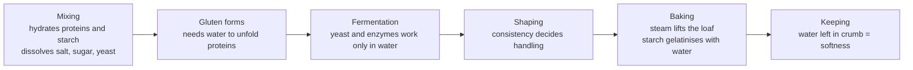

# 02.4 · Water in Bread

Water is the cheapest ingredient in bread and the one that changes it most: one or two percent more or less turns a firm dough into a sticky one. This lesson explains what water does, how bakers express it as hydration, what hard and soft water change, and ends with you baking the same dough at two hydrations.

## Why it matters

Without water, flour proteins cannot form gluten, yeast cannot ferment, salt cannot dissolve and starch cannot set into crumb. The amount of water decides the dough's consistency (*consistance*), which decides how it mixes, ferments, shapes and bakes. Water is also the ingredient you use to control dough temperature, because it is the easiest one to warm or cool (Module 5). Getting the water right is the first daily adjustment a professional makes.

## Key terms

| French | Say it | English meaning |
|---|---|---|
| hydratation | *ee-dra-tah-SYOHN* | hydration: water as a % of flour weight |
| consistance | *kohn-sees-TAHNSS* | consistency: how firm or soft the dough is |
| pâte ferme / bâtarde / douce | *paht FAIRM / bah-TARD / DOOSS* | firm / medium / soft dough |
| pouvoir d'absorption | *poo-VWAR dab-sorp-SYOHN* | the flour's water absorption capacity |
| bassinage | *bah-see-NAHZH* | adding extra water at the end of mixing to soften a dough |
| contre-frasage | *KOHN-truh frah-ZAHZH* | adding extra flour to firm up a dough that is too soft |
| eau potable | *oh po-TAH-bluh* | drinking water: the only water allowed in food production |
| dureté de l'eau (°f) | *dewr-TAY duh LOH* | water hardness in French degrees: 1 °f = 10 mg of calcium carbonate per litre |

## How it works

### What water does at each stage

| Role | What happens | If too little water | If too much water |
|---|---|---|---|
| Builds gluten | proteins absorb about twice their weight of water and link up | short, tight, tearing dough | slack, sticky dough that spreads |
| Dissolves | salt, sugar and yeast must be in solution to act | salt grains, uneven fermentation | — |
| Allows fermentation | yeast and amylases work only in water | slow fermentation | faster, more active fermentation |
| Sets consistency | firm, medium or soft dough | hard to shape, dense crumb | hard to handle, shape not held |
| Baking | water turns to steam (oven spring); starch gelatinises with water | small volume, tight crumb | open, irregular crumb, can be gummy if under-baked |
| Keeping | water held in the crumb keeps it soft | stales faster | stays moist longer, but risk of mould |

### Hydration is a baker's percentage

Hydration = water ÷ flour × 100. A dough with 1,000 g flour and 650 g water is at 65 % hydration. Typical ranges (see [base formulas](../../references/formulas.md)):

| Product | Hydration | Consistency |
|---|---|---|
| Pain de mie, viennoiserie détrempe | 50–60 % (part milk) | firm |
| Pain courant (T55) | 62–65 % | medium (bâtarde) |
| Tradition (T65) | 68–72 % | soft |
| Pain complet (T150) | 72–78 % | soft, but the bran holds the water |

The same hydration does not give the same consistency with every flour. A flour **absorbs more water** when it has:

- more protein (gluten holds about twice its weight in water);
- more damaged starch (damaged granules absorb several times their weight);
- more bran (fibre and pentosans hold water) — higher types;
- lower moisture in the bag: a flour at 13 % moisture is drier than one at 15.5 % and needs a little more water.

That is why a recipe gives a hydration, but the baker finishes the adjustment by feel: **bassinage** (a little water at the end of mixing) to soften, **contre-frasage** (a little flour) to firm up. Lesson 03.5 practises both.

### Water quality

- Bakeries must use **drinking water** (*eau potable*); the décret on pain de tradition française names it explicitly. French tap water is drinking water.
- **Hardness** is mainly calcium and magnesium, measured in French degrees (°f). Medium-hard water (roughly 10–20 °f) suits bread best. Very soft water (below about 5 °f) gives a slacker, stickier dough. Very hard water (above about 30 °f) tightens the gluten and can slow fermentation. Most bakers simply adjust the water quantity; the effect is smaller than a change of flour.
- **Chlorine** in tap water at normal levels does not harm yeast in a dough. Water with a strong taste or smell will show in the bread.
- **Temperature** of the water is chosen each time to reach the target dough temperature (Module 5). Never use water above about 40 °C on yeast directly.

## Worked example

A formula for pain courant says: T55 flour 100 %, water 64 %. Today you mix 10 kg of flour.

1. Water = 10,000 × 64 / 100 = 6,400 g.
2. A new delivery of flour is drier (13.5 % moisture instead of 15 %). The miller's sheet also shows 1 point more protein. You expect it to absorb more. You hold back 200 g of the water at the start (6,200 g), mix, and check the consistency at the end of the first speed.
3. The dough feels firm. You add the 200 g as bassinage, then another 100 g. Final water = 6,400 g + 100 g = 6,500 g, so the real hydration is 6,500 ÷ 10,000 × 100 = 65 %.
4. Write "hydration 65 % with flour batch 4521" on the production sheet. Tomorrow you start at 65 %.

Holding back a little water and adding it later is safer than having to add flour: contre-frasage changes the formula and the dough weight.

## Practice

> [!WARNING]
> You will bake at 240 °C with steam. Use oven gloves. For steam, put an empty metal tray on the lowest shelf while the oven preheats and pour a small glass of hot water into it when you load the bread, then close the door at once and stand back. Never pour water into a hot glass dish.

### You need

- Minimum: scale (1 g; 0.1 g for yeast and salt if you have one), probe thermometer, two bowls, scraper, two clear containers with lids or bowls with film, baking tray, metal tray for steam, oven gloves, sharp knife or lame, [bake log](../../templates/bake-log.md).
- Professional equivalent: a spiral mixer with water meter and water cooler, dough at 23–25 °C, deck oven with steam.

### Ingredients

Two small doughs, identical except for water.

| Ingredient | Dough A (62 %) | Dough B (72 %) | Baker's % |
|---|---|---|---|
| T55 flour (or plain/all-purpose) | 300 g | 300 g | 100 |
| Water | 186 g | 216 g | 62 / 72 |
| Salt | 5.4 g | 5.4 g | 1.8 |
| Fresh yeast (or instant dry 1.5 g) | 4.5 g | 4.5 g | 1.5 |

### Steps

1. Measure flour temperature and room temperature. Choose a water temperature so the dough ends at 23–25 °C (as a quick rule for hand mixing: water ≈ 70 − flour temp − room temp; Module 5 explains it).
2. Dissolve the yeast in the water, add flour, mix by hand to a rough dough, rest 10 minutes, add salt, then knead 8–10 minutes (slap and fold for the wet dough B).
3. Measure each dough's temperature. Note how each feels: sticky? firm? does it hold a ball?
4. Put each in a container, mark the level, and leave to ferment (pointage) 60–90 minutes at room temperature, with one fold at 30 minutes.
5. Divide each into two 240 g pieces, pre-shape into balls, rest 15 minutes, shape into short bâtards (about 18 cm).
6. Proof (apprêt) 45–60 minutes covered, until a gentle finger press springs back slowly.
7. Preheat the oven to 240 °C with the empty metal tray inside for at least 45 minutes. Score each piece once, load, add steam, bake 22–25 minutes.
8. Cool on a rack for at least 1 hour, then weigh, measure height and cut.

### Targets

- Dough temperature at end of mixing: 23–25 °C for both.
- Divided pieces 240 g ± 5 g.
- Bake loss (weight lost) recorded for each loaf.

### How you know it worked

Dough A is firm and easy to shape; its loaves keep a tall shape with a tighter, more regular crumb. Dough B is sticky and harder to shape; its loaves spread more but have a more open, irregular crumb, a thinner crisp crust and stay soft longer. If B did not spread at all, your flour is very absorbent: note it for future formulas.

### Self-check

- [ ] I calculated both water weights correctly from the hydration.
- [ ] Both doughs reached 23–25 °C.
- [ ] I recorded consistency, height, bake loss and crumb for each.
- [ ] I can explain why the same hydration feels different with another flour.

## What goes wrong

| Symptom | Likely cause | Fix now | Prevent next time |
|---|---|---|---|
| Dough sticks to everything and spreads | Hydration too high for this flour; weak flour | Give folds; flour the bench lightly; shape with wet hands | Lower hydration 2–3 points; hold back water and use bassinage |
| Dough tears, dense crumb, thick crust | Hydration too low | Bassinage at end of mixing | Start 2 points higher; check flour moisture |
| Lumps of salt or yeast in the dough | Not dissolved: dough too dry or added too late | Knead longer | Add salt with enough water; dissolve yeast first |
| Dough too warm or too cold | Wrong water temperature | Adjust fermentation time | Calculate water temperature (Module 5) |
| Gummy crumb in the wet loaf | Under-baked or cut too warm | Return to oven 5–10 min | Bake to deep colour; cool fully before cutting |

## Review

- Water builds gluten, dissolves salt, sugar and yeast, makes fermentation possible, sets the consistency, creates steam in the oven and keeps the crumb soft.
- Hydration = water ÷ flour × 100; pain courant about 62–65 %, tradition 68–72 %, wholemeal higher.
- Flour absorption depends on protein, damaged starch, bran and the flour's own moisture: hold back some water and finish by bassinage.
- Use drinking water; medium-hard water is ideal; water temperature is the main tool to hit the dough temperature.
