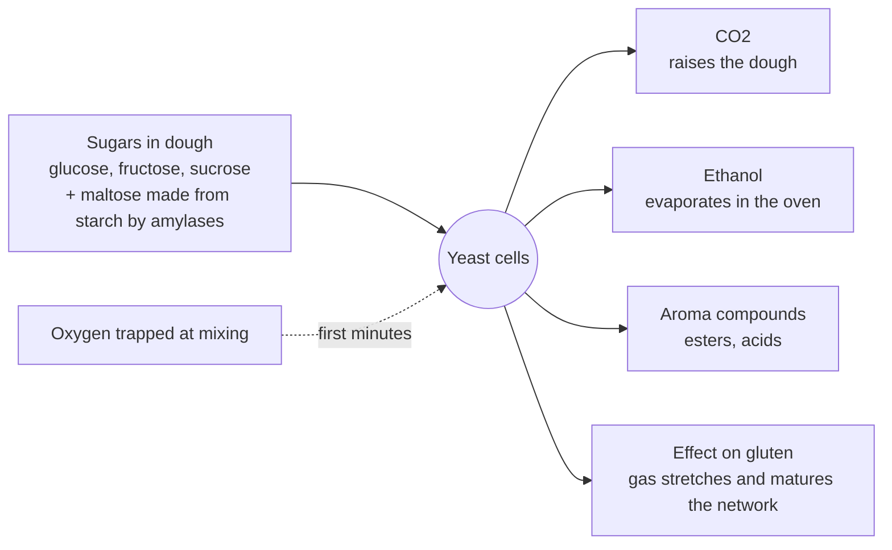

# 02.6 · Yeast

Baker's yeast is a living single-celled fungus, *Saccharomyces cerevisiae*, sold by the billion in every block. It makes the gas that raises bread and much of its flavour. This lesson covers the forms of yeast a bakery uses, what yeast needs, how to convert between fresh and dry, and ends with an activity test comparing fresh and dry yeast at home.

## Why it matters

Most fermentation problems are yeast problems in disguise: old yeast, yeast killed by hot water, yeast slowed by cold, too much salt or too much sugar, or a wrong conversion from fresh to dry. Yeast is also a perishable, refrigerated product: it must be received, stored and rotated correctly. The référentiel asks you to define the roles of yeast and to name its types, storage and appropriate uses (S2.1.6–S2.1.7).

## Key terms

| French | Say it | English meaning |
|---|---|---|
| levure (de boulangerie) | *luh-VOOR* | baker's yeast, *Saccharomyces cerevisiae* |
| levure pressée / fraîche | *luh-VOOR preh-SAY / FRESH* | fresh pressed (compressed) yeast, sold in blocks |
| levure liquide | *luh-VOOR lee-KEED* | liquid (cream) yeast, pumped and dosed automatically |
| levure sèche active | *luh-VOOR sesh ak-TEEV* | active dry yeast: must be rehydrated |
| levure sèche instantanée | *luh-VOOR sesh an-stahn-tah-NAY* | instant dry yeast: added straight to the flour |
| fermentation alcoolique | *fair-mahn-tah-SYOHN al-ko-LEEK* | alcoholic fermentation: sugars → CO₂ + ethanol |
| levure osmotolérante | *luh-VOOR oz-mo-to-lay-RAHNT* | sugar-tolerant yeast for very sweet doughs |
| gaz carbonique (CO₂) | *gahz kar-bo-NEEK* | carbon dioxide, the gas that raises the dough |

## How it works

### What yeast does in a dough

- In the first minutes, while there is oxygen from mixing, yeast breathes (respiration) and multiplies a little. Oxygen is used up quickly; after that, yeast ferments: each sugar molecule gives **carbon dioxide** and **ethanol**, plus small amounts of aroma compounds.
- Yeast eats simple sugars. Flour contains only 1–2 %, so through a long fermentation the yeast depends on **maltose** made from damaged starch by the flour's amylases (lesson [02.3](lesson-03.md)). Added sugar (sucrose) is split by the yeast's own enzyme (invertase).
- CO₂ dissolves in the dough water, then gathers in the tiny air bubbles trapped during mixing; the gluten films stretch and the dough rises. Ethanol evaporates in the oven.

### What changes yeast activity

| Factor | Effect |
|---|---|
| Temperature | Almost inactive at 0–4 °C (storage). Slow at 10–20 °C (retarding). Steady at 23–27 °C (normal dough). Fastest gas around 35 °C, but with poorer flavour and dough control. Damaged above about 45 °C; dies around 46–50 °C in the dough (early in baking). |
| Salt | Slows yeast by osmosis (lesson [02.5](lesson-05.md)). Direct contact with salt before mixing damages it. |
| Sugar | A little sugar speeds it up; above about 10 % of the flour, osmotic pressure slows it, hence more yeast and sugar-tolerant (osmotolerant) yeast for brioche-type doughs. |
| Fat | Coats the dough and slows gas production slightly in rich doughs. |
| Acidity | Yeast tolerates acid well (levain breads), unlike many bacteria. |
| Quantity | More yeast, faster rise, less time for flavour; less yeast, longer fermentation and more aroma (tradition uses far less yeast than pain courant). |

### Forms of yeast

| Form | Dry matter | Storage | Shelf life (maker data) | Use |
|---|---|---|---|---|
| Liquid / cream yeast | about 20–25 % | +4 °C, stirred | about 3–5 weeks | large bakeries with automatic dosing |
| Fresh pressed yeast (*levure pressée*) | about 30–32 % (about 68 % water) | 0–4 °C, strict cold chain | about 2–10 weeks at 4 °C (check the DLC) | the standard in French artisan bakeries (500 g blocks) |
| Active dry yeast | about 92–95 % | room temperature, dry | about 2 years unopened | rehydrate 10–15 min in water at 35–38 °C first |
| Instant dry yeast | about 95 % | room temperature, vacuum-packed; fridge once opened | about 2 years unopened | straight into the flour; do not put it in contact with iced water |
| Frozen semi-dry yeast | high | −18 °C | about 2 years | frozen raw dough products |

**Checking fresh yeast:** good yeast is cream-beige, firm, breaks cleanly, smells pleasantly of yeast. Old yeast darkens to brown at the edges, turns soft and sticky or dry and crumbly, and smells cheesy or sour. If in doubt, run the activity test in the Practice section.

### Converting between forms

Dry yeast contains less water and is more concentrated. The usual conversions (by weight):

| From fresh pressed yeast | Multiply by | Example: 30 g fresh |
|---|---|---|
| Instant dry | about 0.33 (Lesaffre: dose 3–4 times lower) | about 10 g |
| Active dry | about 0.4–0.5 | about 12–15 g |

Add the missing water to the formula (30 g fresh − 10 g instant = about 20 g more water) if you want the exact same dough; on a home batch the difference is small.

### Doses by product

From the course's [base formulas](../../references/formulas.md), in fresh yeast as % of flour: pain courant 1.5–2.0 %; tradition 0.5–1.0 % (long fermentation); campagne with levain 0.3–0.5 %; pain de mie and viennois 3–4 %; croissant 3.5–4.5 %. Cold retarded doughs and warmer kitchens use less; very sweet doughs use more.

## Worked example

A formula for 5 kg of T55 flour asks for 1.8 % fresh yeast. The fresh yeast delivery has not arrived; you have instant dry yeast.

1. Fresh yeast = 5,000 × 1.8 / 100 = 90 g.
2. Instant yeast ≈ 90 × 0.33 ≈ 30 g.
3. Water compensation: 90 − 30 = 60 g extra water if you want identical dough weight; add it to the water (here 5,000 × 64 % = 3,200 g → 3,260 g).
4. The water temperature for a 24 °C dough happens to come out at 12 °C because the room is hot. Instant yeast should not touch very cold water: mix flour and water for 1–2 minutes first, then add the instant yeast.
5. Record the substitution on the production sheet and tell the next shift; when the fresh yeast arrives, check its temperature at reception (it must be cold, 0–4 °C) and put it straight into the cold room.

## Practice

### You need

- Minimum: scale (0.1 g ideal), 3 identical clear glasses or jars, a marker or tape, a spoon, a thermometer, a timer, a warm spot at about 26–28 °C (oven with light on, or a box with a jug of warm water).
- Professional equivalent: the same test done when a batch of yeast is suspect, or a fermentometer.

### Ingredients

| Ingredient | Glass 1: fresh | Glass 2: instant dry | Glass 3: active dry |
|---|---|---|---|
| T55 or plain flour | 50 g | 50 g | 50 g |
| Water at 30 °C | 50 g | 50 g | 50 g (of which 15 g to rehydrate) |
| Yeast | 3 g fresh | 1 g instant | 1.2 g active dry |
| Sugar | 2 g | 2 g | 2 g |

### Steps

1. Rehydrate the active dry yeast in 15 g of the water at 35–38 °C for 10 minutes. Leave the other two dry.
2. In each glass mix the water, sugar and yeast, then the flour, into a smooth batter. Scrape the sides.
3. Mark the batter level on each glass and write the start time. Put the three glasses together in the warm spot.
4. Every 15 minutes for 90 minutes, mark the top of the batter. Note the time each glass doubles.
5. Smell each one at the end: fresh, sour, alcoholic?
6. If you have a second sample of fresh yeast that is old or past its date, run it in a fourth glass.

### Targets

- Water 30 °C ± 2 °C; same flour, same sugar, same place for all glasses.
- Readings every 15 min ± 2 min.

### How you know it worked

Correctly converted, all three rise at a similar rate and double in roughly 30–60 minutes at 26–28 °C (the exact time depends on your yeast and room). A glass that barely moves in 60 minutes holds dead or old yeast, or yeast that was killed by too-hot water. Old fresh yeast is clearly slower than new.

### Self-check

- [ ] I can name five forms of yeast and how each is stored.
- [ ] I can convert fresh yeast to instant and active dry, and add the water difference.
- [ ] I recorded the doubling time of each glass.
- [ ] I can describe fresh yeast that is good and yeast that should be rejected.

## What goes wrong

| Symptom | Likely cause | Fix now | Prevent next time |
|---|---|---|---|
| No rise at all | Yeast killed by water above about 45 °C, or yeast forgotten | Remix with new yeast if the batch can be saved; report it | Measure water temperature; tick yeast on the sheet |
| Very slow rise | Old or warm-stored yeast; dough too cold; too much salt or sugar | Put dough in a warmer place (24–27 °C) | Check DLC and colour at reception; store at 0–4 °C; first in, first out |
| Dough rises too fast, sour/alcoholic smell | Too much yeast (often dry yeast used at fresh dose) or dough too warm | Shorten fermentation, divide earlier | Convert correctly (instant ≈ one-third of fresh) |
| Rich brioche dough barely moves | High sugar slows normal yeast | Give a longer, warmer proof | More yeast or osmotolerant yeast for sweet doughs |
| Instant yeast patches unmixed, uneven rise | Instant yeast added onto iced water | — | Mix flour and cold water first, then add the yeast |

## Review

- Yeast turns sugars into CO₂ (rise), ethanol and aromas; it uses maltose made from starch for most of the fermentation.
- Activity depends on temperature (store 0–4 °C, ferment 23–27 °C, dies around 46–50 °C), salt, sugar and dose.
- Forms: liquid, fresh pressed (68 % water, 0–4 °C), active dry (rehydrate), instant dry (direct), frozen semi-dry (frozen doughs).
- Instant dry ≈ one-third of fresh weight; active dry ≈ 40–50 %; add the water difference.
- Check fresh yeast at reception and before use: colour, texture, smell, date.
