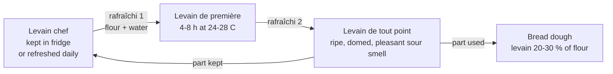

# 02.7 · Levain

Levain (sourdough) is a living culture of wild yeasts and lactic acid bacteria kept going with flour and water. It raises bread more slowly than baker's yeast but gives acidity, aroma and keeping quality, and in France it has a legal definition. This lesson explains the microbiology, the law and the refreshment routine, and starts a 7-day levain at home.

## Why it matters

Pain au levain, pain de campagne and many tradition breads rely on a levain, and you will need yours ready for [Modules 4](../module-04/lesson-05.md) and [10](../module-10/lesson-03.md). A levain is also the ingredient that most often fails silently: too young, too old, too cold, too acidic. Knowing what lives in it and what each refreshment does lets you control it instead of guessing. The law matters because "au levain" on a label is a promise the bread must keep in a laboratory test.

## Key terms

| French | Say it | English meaning |
|---|---|---|
| levain | *luh-VAN* | sourdough: flour + water fermented by wild yeasts and lactic bacteria |
| levain chef | *luh-VAN SHEF* | the mother culture kept from one batch to the next |
| rafraîchi | *rah-freh-SHEE* | refreshment (feeding): adding fresh flour and water |
| levain de première / de tout point | *luh-VAN duh pruh-MYAIR / duh too PWAN* | intermediate build / final levain ready for the dough |
| levain dur / liquide | *luh-VAN DOOR / lee-KEED* | firm levain (about 50–60 % water) / liquid levain (about 100–125 % water) |
| bactéries lactiques | *bak-tay-REE lak-TEEK* | lactic acid bacteria (LAB) |
| acidité lactique / acétique | *ah-see-dee-TAY lak-TEEK / ah-say-TEEK* | mild, creamy acidity / sharp, vinegary acidity |
| pH | *pay-ASH* | acidity scale: lower = more acidic |

## How it works

### The legal definitions (décret n°93-1074)

- **Levain (article 4):** a dough made of wheat and/or rye flour and drinking water, possibly with salt, left to a **natural acidifying fermentation** whose purpose is to make the dough rise. Its flora is mainly **lactic acid bacteria and yeasts**. Baker's yeast may be added, but **only at the final kneading and at most 0.2 % of the flour** used at that stage. A dehydrated levain is allowed if it still contains a living flora (in the order of a billion bacteria and one to ten million yeasts per gram) and raises the dough correctly once rehydrated.
- **"Au levain" (article 3):** bread may carry this mention only if its crumb has a **pH of 4.3 or less** and at least **900 ppm of acetic acid** produced by the fermentation.

So a bread mixed with 1 % baker's yeast and a little levain "for taste" cannot be sold as "pain au levain". The full bread law, including tradition and maison, is taught in [lesson 09.1](../module-09/lesson-01.md).

### What lives in a levain

| Organism | What it does | Products |
|---|---|---|
| Wild yeasts (often *Kazachstania* or *Saccharomyces* species) | ferment sugars | CO₂ (rise), ethanol, aromas |
| Homofermentative lactic bacteria | ferment sugars | almost only lactic acid (mild, creamy) |
| Heterofermentative lactic bacteria (e.g. *Fructilactobacillus sanfranciscensis*, found in most French levains) | ferment sugars, especially maltose | lactic acid + acetic acid + some CO₂ |

The French BAKERY research project, which collected levains from about forty bakers, found a wide and original diversity of species, and different communities in farmer-bakers, artisan bakers and industrial bakeries. Your levain will have its own mix, shaped by your flour, water, temperature and routine. Lactic bacteria usually outnumber yeasts many times over.

The acidity they produce:

- drops the pH (fresh dough about 6; ripe levain about 3.5–4);
- tastes sour and aromatic;
- slows staling and mould, so levain bread keeps longer;
- tightens the gluten at first, but weakens it if the levain is over-ripe (acid plus protease enzymes).

### Steering the levain: hydration and temperature

| Choice | Effect on flavour and behaviour |
|---|---|
| Firm levain (dur), cooler (about 20–24 °C) | more acetic acid: sharper, stronger flavour; slower, more stable |
| Liquid levain, warmer (about 26–30 °C) | more lactic acid: milder, creamier flavour; faster |
| Rye or wholemeal flour | more food and more wild microbes: faster, more acidic |
| More levain kept per feed (e.g. 50 %) | ripens faster, more acidic |
| Less levain kept per feed (e.g. 10–20 %) | ripens slower, milder; good for overnight |

### The refreshment routine

Ratios from the course's [base formulas](../../references/formulas.md): firm levain 100 flour + 50–60 water, refreshed with 20–50 % of mature levain, ripe in 4–8 h at 24–28 °C; liquid levain 100 flour + 100–125 water, ripe in 3–6 h at 24–28 °C. "Ripe" means at or just after its peak: domed or just beginning to fall, full of bubbles, smelling of yoghurt, fruit and a little vinegar, not of nail-polish remover (a sign it is hungry and over-ripe).

### Pros and cons

| For | Against |
|---|---|
| deep flavour, crust colour, aroma | slow: hours of fermentation and daily refreshments |
| keeps longer (acidity slows staling and mould) | less predictable; depends on temperature and routine |
| no added yeast needed (legal "au levain") | over-acid levain weakens gluten: flat, dense bread |
| uses only flour, water and time | needs space, containers and discipline (also on days off) |

## Worked example

Tomorrow at 6 a.m. you mix pain de campagne needing **600 g of ripe liquid levain** (100 % hydration). Your chef is in the fridge. The fournil is at 25 °C. You want the levain to peak at about 6 a.m.

1. With 20–50 % seed a liquid levain at 25 °C is ripe in roughly 3–6 h: you would have to refresh at midnight or later. To ripen overnight in about 9 h, use a smaller seed, 10 % of the flour, and refresh at 9 p.m. (Check against your own levain's log: every culture has its own speed.)
2. Build a little extra for losses and the next chef: about 660 g in total.
3. Let flour = F, water = F, seed = 0.1 F. Total = 2.1 F = 660 g → F ≈ 314 g.
4. So: **31 g ripe levain + 314 g flour + 314 g water at 27 °C** (659 g).
5. Take the chef out at 4 p.m. and give it a small refreshment (1:1:1) so the seed is active at 9 p.m.
6. At 6 a.m. weigh 600 g for the dough; keep about 50 g as the new chef, feed it and put it back in the fridge.

## Practice

> [!CAUTION]
> A healthy levain has bubbles, a creamy colour and a sour, fruity smell. Throw it away and start again if you see fuzzy mould, or pink, orange or red streaks or liquid. Use clean containers and a clean spoon at each feed.

### You need

- Minimum: a 1 litre glass jar or clear plastic container with a loose lid, an elastic band to mark the level, a scale (1 g), a thermometer, a spoon, a warm spot at 24–27 °C, a notebook or the [bake log](../../templates/bake-log.md). Optional: pH strips (range 3–6).
- Professional equivalent: a levain container in a fermentation cabinet or levain machine at controlled temperature.

### Ingredients

| Ingredient | Day 1 | Days 2–7, each feed | Baker's % of the feed |
|---|---|---|---|
| Rye flour (T130/T170) or wholemeal wheat (T150) | 50 g | 50 g | 100 |
| Water at about 28 °C | 50 g | 50 g | 100 |
| Levain kept from the previous day | — | 50 g (discard the rest) | 100 |

### Steps

1. **Day 1:** mix 50 g flour and 50 g water to a thick paste in the jar. Mark the level with the elastic band. Cover loosely and keep at 24–27 °C.
2. **Day 2:** whatever happened, keep 50 g, discard the rest, add 50 g flour and 50 g water. Mark the level.
3. **Days 3–7:** feed the same way once a day. From the day it doubles reliably, feed twice a day (every 12 h).
4. Before each feed, log: date and time, room temperature, highest rise since the last feed (× 1, × 1.5, × 2…), time to reach the peak if you saw it, smell, bubbles, pH if you have strips.
5. On day 7, do a **float test**: drop a teaspoon of levain at its peak into water. A levain full of gas floats (a useful sign, not a law).
6. Keep your levain: either feed it daily at room temperature, or store it in the fridge and refresh it 1–2 times before baking. You will use it in [Modules 4](../module-04/lesson-05.md) and [10](../module-10/lesson-03.md).

### Targets

- Temperature 24–27 °C (log it every feed).
- By day 5–7: the levain at least doubles within 4–8 h after a 1:1:1 feed, three feeds in a row.
- pH at peak about 3.5–4.2 (if you have strips).

### How you know it worked

Days 2–3 often show a burst of bubbles and odd smells (other bacteria), then a quiet day: that is normal. By days 5–7 the rise becomes regular and predictable, the smell becomes pleasantly sour and fruity, and the texture is airy and stringy. A levain that doubles on schedule three times in a row is ready to raise bread.

### Self-check

- [ ] My log has every feed, with temperature, rise and smell.
- [ ] I can state the art. 3 and art. 4 rules (pH 4.3, 900 ppm acetic acid, 0.2 % yeast at final mixing).
- [ ] I can explain how a firmer, cooler levain changes the flavour compared with a liquid, warm one.
- [ ] I can calculate a levain build for a given quantity and time.

## What goes wrong

| Symptom | Likely cause | Fix now | Prevent next time |
|---|---|---|---|
| No activity after day 3 | Too cold; chlorinated or very hot water; white flour only | Move to 26–28 °C; switch to rye or wholemeal | Keep a thermometer by the jar |
| Grey liquid on top, nail-polish smell | Hungry, over-ripe: fed too rarely | Pour off the liquid, feed twice a day for 2 days | Feed at the peak; keep less seed or cool it |
| Rises well but bread is flat and sour | Levain used over-ripe; acidity weakened the gluten | Use less levain in the next dough | Use it at its peak; refresh more often |
| Bread too sharp and vinegary | Firm levain kept cool for long; too much levain | Use a liquid levain, warmer | Adjust hydration and temperature |
| Fuzzy mould or pink/orange streaks | Contamination | Discard everything, clean the jar | Clean tools; cover the jar; keep it fed |
| Bread sold "au levain" fails a check (pH above 4.3) | Too much baker's yeast, too short fermentation | Relabel it as ordinary bread | Respect the 0.2 % yeast limit; longer fermentation |

## Review

- Levain = wheat and/or rye flour + drinking water (+ salt) with a natural acidifying fermentation by lactic bacteria and yeasts; baker's yeast at most 0.2 % of the flour at final mixing (décret 93-1074 art. 4).
- "Au levain" bread: crumb pH ≤ 4.3 and ≥ 900 ppm acetic acid (art. 3).
- Firm and cool favours acetic (sharp) acidity; liquid and warm favours lactic (mild) acidity.
- Refresh on a schedule (chef → première → tout point) and use the levain at its peak.
- Exam-relevant (S3.3): see [the CAP exam reference](../../references/cap-exam.md).
