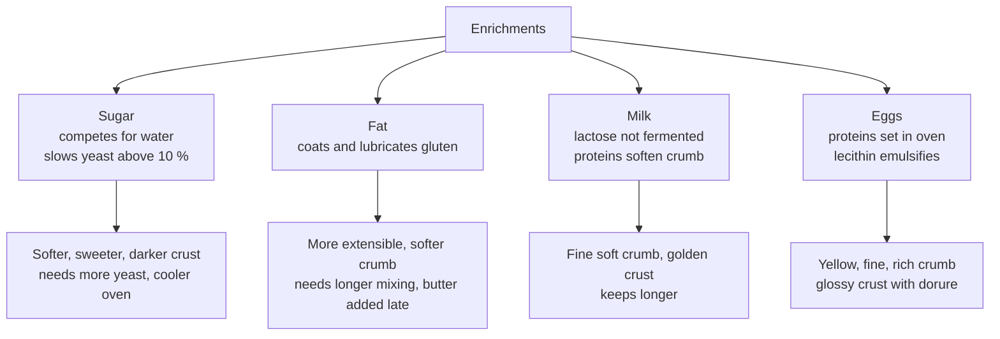

# 02.8 · Sugar, Fats, Milk and Eggs

A pain au lait, a brioche or a pain de mie is still bread, but sugar, fat, milk and eggs change almost everything about it: how it mixes, how fast it ferments, how it bakes and how long it stays soft. This lesson gives each enrichment its technological function and storage rules, then has you bake a lean and an enriched roll side by side.

## Why it matters

[Module 12](../module-12/lesson-03.md) (pâte levée: pain au lait, pain brioché, brioche) and [Module 11](../module-11/lesson-03.md) (croissant) depend on these ingredients. Each one changes gluten, fermentation and colour in a predictable way, so you can adjust: more yeast for sugar, more mixing for butter, lower oven for colour. They are also perishable and allergenic (milk and eggs are two of the 14 regulated allergens), so receiving and storing them correctly is part of food safety ([Module 17](../module-17/lesson-07.md)).

## Key terms

| French | Say it | English meaning |
|---|---|---|
| sucre semoule / cristal / glace | *SOO-kruh suh-MOOL / krees-TAHL / GLAHSS* | caster / granulated / icing sugar |
| cassonade, vergeoise | *kah-so-NAHD, vair-ZHWAHZ* | cane brown sugar, beet brown sugar |
| beurre doux / demi-sel | *buhr DOO / duh-mee-SELL* | unsalted / lightly salted butter |
| beurre de tourage | *buhr duh too-RAHZH* | firm, plastic butter for laminating (croissant) |
| margarine | *mar-gah-REEN* | emulsion of vegetable fats and water, used like butter |
| crème | *KREM* | cream from milk |
| lait entier / demi-écrémé / en poudre | *leh ahn-TYAY / duh-mee ay-kray-MAY / ahn POO-druh* | whole / semi-skimmed / powdered milk |
| jaune / blanc / coquille | *ZHOHN / BLAHN / ko-KEE* | yolk / white / shell |
| ovoproduits | *o-vo-pro-DWEE* | egg products: pasteurised liquid, frozen or dried eggs |
| dorure | *do-ROOR* | egg wash brushed on before baking |

## How it works

### The common thread: enrichments weaken gluten and change fermentation

### Sugar

- **Origins and types:** sucrose (saccharose) from sugar beet or sugar cane. Bakeries use caster sugar (semoule, dissolves fast, the dough standard), granulated (cristal, decoration and pearl sugar), icing sugar (glace, finishing), brown sugars (cassonade from cane, vergeoise from beet), plus invert sugar, honey and glucose syrup for moisture.
- **Roles in a viennoiserie dough:**
  - feeds the yeast at small doses; slows it above about 10 % of the flour (osmosis, lesson [02.6](lesson-06.md));
  - sweetness and flavour;
  - crust colour: sugars brown through the Maillard reaction (with proteins) and caramelisation, so sweet doughs bake at a lower temperature (about 170–200 °C) to avoid a dark crust over a raw centre;
  - softness and keeping: sugar holds water (hygroscopic), so the crumb stays moist;
  - weakens gluten by competing for water: rich doughs mix longer and sometimes take sugar in stages.

### Milk

- **Forms:** liquid UHT milk (whole about 3.5 % fat, semi-skimmed about 1.5 %, skimmed almost none), and milk powder (skimmed or whole), which stores at room temperature and is dosed at 3–5 % of flour with water.
- **Roles:** milk proteins and fat give a finer, softer, whiter crumb; lactose is not fermented by baker's yeast, so it stays in the dough and gives a golden crust; flavour; nutritional value; slower staling.
- **Calculation:** milk is about 87–90 % water. Replacing all the water by milk gives a slightly firmer dough; formulas for pain au lait use about 50–55 % milk (see [base formulas](../../references/formulas.md)).
- Use pasteurised or UHT milk; store opened liquid milk at refrigerated temperature and respect the date after opening.

### Fats: butter, margarine, cream

| Product | Composition | Use | Storage |
|---|---|---|---|
| Butter (beurre) | at least 82 % milk fat, at most 16 % water; demi-sel 0.5–3 % salt, salé over 3 % | brioche, pain au lait, viennoiserie, "pur beurre" products | +4 to +6 °C in its wrapping, away from air, light and strong smells; respect the DLC |
| Butter for laminating (beurre de tourage / beurre sec) | firmer, more plastic, higher melting range | croissant, pain au chocolat (lesson [11.3](../module-11/lesson-03.md)) | cold, flat plaques |
| Concentrated butter | about 99.8 % fat, no water | pastry, frying | cool, dry |
| Margarine | emulsion of vegetable fats and water (about 80 % fat for full-fat margarine) | cheaper viennoiserie; special laminating margarines | cool; follow the label |
| Cream (crème) | fat from milk, roughly 30–35 % for whipping cream; lighter creams less | fillings, some brioches, crème pâtissière ([Module 12](../module-12/lesson-02.md)) | refrigerated, closed, date after opening |

**Role of fat in a dough:**

- it coats and lubricates the gluten strands: the dough becomes more **extensible** and less elastic;
- at moderate doses (5–10 %) it improves volume and gives a softer, finer crumb and a thinner, softer crust;
- at high doses (brioche 50–60 %) it weakens the network so much that butter is added **after** the gluten has formed, at the end of mixing, and the flour must be strong (gruau);
- it slows staling and carries flavour (butter flavour is the reference: products made with margarine cannot be sold as "pur beurre");
- in laminated doughs it makes the layers ([Module 11](../module-11/lesson-03.md)).

### Eggs and egg products

**The egg:** shell about 10 % of the weight, white about 60 %, yolk about 30 %. A 60 g egg gives about 6 g shell, 34 g white and 20 g yolk.

| Part | Composition (approx.) | Role in dough |
|---|---|---|
| White | about 88 % water, 10–11 % protein | structure: proteins coagulate from about 62 °C; moisture |
| Yolk | about 50 % water, 30 % fat (with lecithin), 16 % protein | emulsifier (lecithin) → fine, soft crumb; colour; richness |
| Whole egg | about 75 % water | counts as part of the liquid; colour, flavour, structure, volume |

Eggs also make the **dorure** (egg wash) that gives viennoiserie its glossy brown crust.

**Freshness and storage:** use eggs in date order, keep them in a cool place at a stable temperature away from strong smells, break them in a separate container (never directly over the dough), and wash hands after handling shells.

**Egg products (ovoproduits):** pasteurised liquid whole egg, yolk or white (chilled, in bottles or bricks), frozen eggs, dried egg powder.

| Advantages | Drawbacks |
|---|---|
| pasteurised: much lower risk of *Salmonella* | higher price per kg than shell eggs |
| no shells in the fournil, no shell contamination | short life once opened (see the label) |
| exact dosing by weight, no waste | must stay cold: +4 °C maximum for egg products (except UHT) under French retail rules |
| quick to use for large batches | flavour and colour sometimes slightly flatter |

Rules of use: store at +4 °C maximum, respect the DLC, close and date the pack after opening, use within the time on the label, never pour unused egg back into the pack.

## Worked example

A pain au lait formula for 2 kg of T45 flour: milk 52 %, eggs 10 %, sugar 10 %, butter 18 %, salt 2 %, fresh yeast 3.5 %. The bakery uses liquid whole egg in 1 kg bricks.

1. Milk = 2,000 × 52 / 100 = 1,040 g.
2. Egg = 2,000 × 10 / 100 = 200 g of liquid whole egg (about 3 or 4 shell eggs' worth).
3. Sugar = 200 g; butter = 360 g; salt = 40 g; yeast = 70 g.
4. Effective water: milk 1,040 × 0.88 ≈ 915 g, egg 200 × 0.75 = 150 g, butter 360 × 0.16 ≈ 58 g → about 1,123 g, i.e. about 56 % of the flour. That is why rich doughs look "dry" on paper but end soft.
5. Mixing order: flour, milk, eggs, sugar, salt, yeast (kept apart from salt), mix to a developed dough; add the butter, softened (about 15–18 °C), at the end and mix until smooth.
6. The liquid egg brick is opened today: write the opening date on it and put it back at ≤ +4 °C.

## Practice

> [!CAUTION]
> Raw eggs can carry *Salmonella*: crack them into a separate bowl, wash your hands after handling shells, and do not taste raw dough. Milk, eggs and wheat are allergens: label the rolls if you share them. The oven runs at 200–230 °C: use oven gloves.

### You need

- Minimum: scale (0.1 g for yeast and salt), thermometer, two bowls, scraper, two baking trays with paper, pastry brush, oven gloves, airtight bag, [bake log](../../templates/bake-log.md).
- Professional equivalent: spiral mixer (lean dough), planetary or spiral mixer with a slower speed for the butter (rich dough), egg wash in a closed container in the fridge.

### Ingredients

| Ingredient | Lean roll (L) | Baker's % | Enriched roll (E) | Baker's % |
|---|---|---|---|---|
| T55 flour (or T45 for E) | 250 g | 100 | 250 g | 100 |
| Water | 160 g | 64 | — | — |
| Whole milk | — | — | 125 g | 50 |
| Whole egg (beaten) | — | — | 25 g | 10 |
| Caster sugar | — | — | 25 g | 10 |
| Butter (soft, about 16 °C) | — | — | 25 g | 10 |
| Salt | 4.5 g | 1.8 | 5 g | 2 |
| Fresh yeast (instant: one-third) | 5 g | 2 | 9 g | 3.5 |
| Egg wash (1 egg + pinch of salt) | — | — | brush | — |

### Steps

1. Mix dough L: water, yeast, flour, rest 10 min, salt, knead 8–10 min to a smooth dough.
2. Mix dough E: milk, egg, sugar, yeast, flour; knead 6–8 min; add salt; knead until smooth; then add the butter in pieces and knead 5–6 min more until it disappears and the dough is smooth and shiny.
3. Measure both dough temperatures (target 24–26 °C). Note which feels softer and which springs back more.
4. Ferment both covered for 60 minutes; note which has risen more.
5. Divide each into six 60 g pieces, shape into tight balls, place on separate trays.
6. Proof covered until about doubled (L about 45–60 min; E usually longer, 60–90 min). Record the times.
7. Egg-wash E gently. Bake L at 230 °C with steam for 14–16 min; bake E at 200 °C without steam for 12–15 min.
8. Cool. Eat one of each. Store one of each in an airtight bag and taste again after 24 hours.

### Targets

- Dough temperature 24–26 °C; pieces 60 g ± 2 g.
- Proof and bake times recorded for both.

### How you know it worked

The enriched rolls have a thinner, softer, deep golden glossy crust, a fine, yellowish, soft crumb and a sweet, buttery taste; they took longer to proof. The lean rolls have a crisp crust and a more open, chewier crumb. After 24 hours the enriched roll is still soft; the lean roll has staled and its crust has softened.

### Self-check

- [ ] I can give four types of sugar and three roles of sugar in viennoiserie.
- [ ] I can state the fat content of butter and why butter goes in at the end of a rich dough.
- [ ] I can name the parts of the egg, their share and their role, and two pros and two cons of egg products.
- [ ] I compared crust, crumb, volume and keeping of both rolls in my log.

## What goes wrong

| Symptom | Likely cause | Fix now | Prevent next time |
|---|---|---|---|
| Rich dough greasy and will not come together | Butter added too early or too warm (melting) | Chill dough 15 min, then mix again | Add butter at about 15–18 °C after the gluten has formed |
| Enriched rolls dark outside, raw inside | Oven too hot for a sugary dough | Cover with paper, lower to 180 °C, bake longer | Bake sweet doughs at 170–200 °C |
| Very slow proof | Sugar and fat slow yeast; dough too cold | Proof warmer (26–28 °C, never above about 30 °C for butter doughs) | More yeast for sweet doughs; correct dough temperature |
| Pale, dull viennoiserie | No or thin egg wash; oven too cool | — | Egg wash evenly, twice for a deep shine |
| Liquid egg brick smells off | Kept too warm or too long after opening | Discard; report | +4 °C maximum; date on opening; follow label |

## Review

- Sugar feeds yeast in small doses but slows it above about 10 %; it sweetens, colours the crust, keeps the crumb soft and weakens gluten.
- Milk gives a fine, soft crumb and golden crust (unfermented lactose); it is about 88 % water.
- Butter is at least 82 % fat; fat makes dough extensible and crumb soft, and in large amounts goes in at the end of mixing.
- Eggs: shell 10 %, white 60 %, yolk 30 %; proteins set the structure, lecithin emulsifies; egg products are safer but must stay at +4 °C maximum.
- Exam-relevant (S2.1, S2.2): see [the CAP exam reference](../../references/cap-exam.md).
