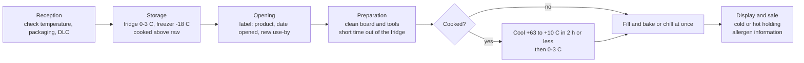

# 02.10 · Savoury Fillings and Bought-in Products

Most French bakeries sell more than bread: sandwiches, quiches, croque-monsieur, pizzas, feuilletés. These use ham, cheese, eggs, cream, vegetables and ready-made sauces, which are far more dangerous to mishandle than flour. This lesson covers how these products are stored and used, the legal temperatures, and ends with a storage plan and a cooling test you run at home.

## Why it matters

Flour, salt and sugar are dry and stable; a filling is wet, protein-rich and often eaten without further cooking, which is exactly what bacteria such as *Listeria*, *Salmonella* and *Staphylococcus aureus* need. One mistake in temperature or dating can make customers ill and close a business. The CAP expects you to cite storage rules and precautions for ready-to-use products (S2.3) and to apply food-safety measures in production (C2.6). [Module 17](../module-17/lesson-05.md) covers hygiene and HACCP in depth; this lesson focuses on the products.

## Key terms

| French | Say it | English meaning |
|---|---|---|
| garniture salée | *gar-nee-TOOR sah-LAY* | savoury filling |
| produit prêt à l'emploi (PAI) | *pro-DWEE preh tah lahm-PLWAH* | ready-to-use product (sauce, grated cheese, cooked ham, frozen vegetables…) |
| sous vide | *soo VEED* | vacuum-packed |
| conserve (appertisé) | *kohn-SAIRV (ah-pair-tee-ZAY)* | canned, heat-sterilised product, stable at room temperature until opened |
| surgelé / congelé | *soor-zhuh-LAY / kohn-zhuh-LAY* | quick-frozen (industrial) / frozen |
| DLC | *day-el-SAY* | date limite de consommation: use-by date (safety) — "à consommer jusqu'au" |
| DDM | *day-day-EM* | date de durabilité minimale: best-before date (quality) — "à consommer de préférence avant" |
| chaîne du froid | *shen dew FRWAH* | cold chain |
| refroidissement rapide | *ruh-frwah-dees-MAHN rah-PEED* | rapid cooling of a cooked preparation |
| décongélation | *day-kohn-zhay-lah-SYOHN* | thawing |

## How it works

### Two families of products

| Family | Examples | Main risks | Key precautions |
|---|---|---|---|
| Fresh animal products | cooked ham, chicken, smoked salmon, cheese, eggs, cream, milk | bacterial growth if warm; *Listeria* in ready-to-eat foods; *Salmonella* from eggs | cold chain; DLC; clean utensils; separate raw and cooked |
| Fresh vegetable products | salad, tomatoes, herbs, onions, mushrooms | soil bacteria, parasites | wash, sort, decontaminate per the bakery's procedure, keep cold once cut |
| Ready-to-use products (PAI) | grated cheese, diced ham, pizza sauce, béchamel, frozen vegetables, canned tuna or olives | wrong storage after opening; thawing at room temperature | follow the label; date on opening; use first in, first out |

Ready-to-use products save time and give a regular result, but each has its own rules before and after opening:

| Product type | Before opening | After opening |
|---|---|---|
| Vacuum-packed (ham, cheese, cooked chicken) | refrigerated as the label says; vacuum does not replace cold | rewrap or transfer to a closed container, label with opening date and new use-by, refrigerate |
| Canned (tuna, olives, tomato) | room temperature, dry, check the can is not swollen, dented or rusty | transfer to a clean closed container (never store in the opened can), label, refrigerate, short life |
| Frozen (vegetables, raw dough, minced meat) | freezer, at the temperature on the label (usually −18 °C) | thaw in the fridge (0–4 °C); never refreeze what has been thawed |
| Chilled sauces (béchamel, pizza sauce) | refrigerated | as the label says, typically a few days; close and date |

### The legal temperatures (arrêté of 21 December 2009)

Annex I of the arrêté sets maximum temperatures for retail. The ones a bakery meets most:

| Product | Maximum temperature |
|---|---|
| Minced meat | +2 °C |
| Meat preparations; poultry; egg products (except UHT) | +4 °C |
| Prepared dishes made in advance (préparations culinaires élaborées à l'avance) | +3 °C |
| Other very perishable foods | temperature set by the manufacturer, +4 °C at retail |
| Other perishable foods | temperature set by the manufacturer, +8 °C at retail |
| Hot holding of dishes served hot | at least +63 °C |
| Ice cream; frozen minced meat; frozen fish | −18 °C |

The manufacturer's label always applies when it is stricter. In practice bakeries keep a cold room or fridge for fillings at 0–3 °C and a freezer at −18 °C, and record the temperatures daily (template: [temperature log](../../templates/temperature-log.md)).

Two more rules from the same arrêté:

- **Cooling** (annex IV): a cooked preparation must not stay between +63 °C and +10 °C for more than **2 hours** at its core, then is stored at 0 to +3 °C. Large deep pots cool far too slowly: use shallow trays, a blast chiller or an ice bath.
- **Thawing** (annex VI): in a refrigerated unit between 0 °C and the product's maximum storage temperature (by default 0 to +4 °C), never on the bench. Thawed food is not refrozen unless a validated hazard analysis allows it.

### Use-by and best-before

- **DLC** (use-by, "à consommer jusqu'au…"): safety. After this date the product is not used, whatever it looks like.
- **DDM** (best-before, "à consommer de préférence avant…"): quality (canned goods, flour, dry products). After it, quality may drop but it is not automatically unsafe; a bakery follows its own procedure.
- **After opening**, a product gets a new, shorter use-by (*DLC secondaire*) set by the label or the bakery's own hazard analysis. Write it on the container.

### Allergens in fillings

Fillings bring many of the 14 regulated allergens: milk (cheese, cream, béchamel), eggs, fish, crustaceans, mustard, celery, sesame, nuts. For products sold unwrapped in the shop, French rules (décret n° 2015-447) require the allergen information to be available in writing to customers. Keep the label or technical sheet of every bought-in product so you know what each filling contains ([lesson 17.6](../module-17/lesson-06.md)).

## Worked example

A bakery makes 40 "jambon-beurre" sandwiches and 12 quiches lorraines each morning. Write the storage rules for the fillings.

| Product | Form | Store at | After opening / preparing | Notes |
|---|---|---|---|---|
| Cooked ham | vacuum-packed, sliced | 0–3 °C (label: +4 °C max) | in a closed box, dated, use within the label's time after opening (for example 3 days) | top shelf, above raw products |
| Butter | 250 g blocks | +4 to +6 °C | covered; kept cold until spreading | allergen: milk |
| Quiche filling (cream + eggs + lardons) | made in the morning from pasteurised liquid egg and UHT cream | 0–3 °C until used | used the same day; lardons cooked and cooled first | allergens: milk, eggs |
| Grated emmental | bag, modified atmosphere | refrigerated per label | closed, dated | allergen: milk |
| Unsold quiches | baked | 0–3 °C after cooling; or discard | cooled from +63 °C to +10 °C in 2 h or less | sale the next day only if the bakery's procedure allows it |

The lardons are cooked at 7:00 and spread on a shallow tray in the cold room: probe at 7:20 reads 38 °C, at 7:50 reads 9 °C → cooling time about 50 minutes, conforms. A deep pot of lardons would have stayed above 10 °C much longer.

## Practice

> [!WARNING]
> Hot béchamel can burn badly; stir with a long spoon and handle the pot with a cloth. Clean and disinfect the thermometer probe between products (alcohol wipe or hot water and drying). Milk is an allergen.

### You need

- Minimum: probe thermometer, a deep pot or bowl, a shallow tray (baking tray or gratin dish), a larger tray with ice and water, clingfilm, a marker and labels, a timer, the [temperature log](../../templates/temperature-log.md).
- Professional equivalent: cold room with recorded temperatures, blast chiller (cellule de refroidissement), labelled gastronorm containers.

### Ingredients

| Ingredient | Weight |
|---|---|
| Milk | 1,000 g |
| Butter | 50 g |
| Flour (T45/T55) | 50 g |
| Salt, pepper, nutmeg | to taste |

### Steps

1. **Fridge check:** put a glass of water in the middle of your fridge for 2 hours, then probe it. Record the temperature. If it is above 4 °C, turn the thermostat colder.
2. **Storage plan:** choose a savoury filling you would sell (for example croque-monsieur: ham, cheese, béchamel). In a table list every product, its form (fresh, vacuum-packed, canned, frozen), storage temperature, DLC or DDM, rule after opening, and where it goes in your fridge.
3. **Cooling test:** make the béchamel (melt butter, cook flour 2 min, add milk, boil 2 min while whisking). Probe: it should be above 85 °C.
4. Split it: half into the deep pot, half spread 2–3 cm thick in the shallow tray set on the ice bath. Cover both with clingfilm touching the surface.
5. Probe the centre of each every 15 minutes. Note the time each reaches 63 °C, then 10 °C. Move each to the fridge once it reaches 10 °C (or at 2 hours, whatever happens).
6. Label the containers with product name, date and time made, and use-by (for example 2 days).

### Targets

- Fridge at 4 °C or below (ideally 0–3 °C for fillings).
- Shallow-tray béchamel from +63 °C to +10 °C in 2 hours or less.

### How you know it worked

Your storage plan has no blank cells and every perishable item is at or below its legal temperature. The shallow tray on ice cools from 63 °C to 10 °C well within 2 hours, while the deep pot is usually still in the danger zone (above 10 °C) after 2 hours: that is the reason for shallow trays and blast chillers.

### Self-check

- [ ] I can state the maximum temperatures for minced meat, egg products, prepared dishes and very perishable foods.
- [ ] I can explain the difference between DLC and DDM and what changes after opening.
- [ ] I logged the cooling of both béchamel portions and identified which conforms.
- [ ] My storage plan names every allergen in my filling.

## What goes wrong

| Symptom | Likely cause | Fix now | Prevent next time |
|---|---|---|---|
| Opened ham found without a date | Opening not labelled | Discard if its opening date is unknown | Label every opened product immediately |
| Béchamel still at 25 °C after 2 hours | Cooled in a deep pot at room temperature | Discard (rule broken) | Shallow trays, ice bath or blast chiller |
| Frozen vegetables thawed on the bench overnight | Thawing outside the cold | Discard | Thaw in the fridge at 0–4 °C; plan the day before |
| Swollen or rusty can | Spoiled or damaged | Do not open; set aside and report to the supplier | Check cans at reception |
| Cold room reads 7 °C | Door left open, overloaded, fault | Move products to another cold unit; assess what was exposed; report | Daily temperature log; do not overload |
| Customer asks if a quiche contains mustard and nobody knows | Allergen information not kept | Do not guess; check the technical sheets | Keep sheets and the written allergen table up to date |

## Review

- Fillings are wet, protein-rich and often eaten without further cooking: cold chain, dates and clean handling come first.
- Retail maximums (arrêté of 21 December 2009): minced meat +2 °C, prepared dishes +3 °C, egg products and very perishables +4 °C, hot holding at least +63 °C.
- Cool cooked preparations from +63 °C to +10 °C in 2 hours or less; thaw in the cold (0–4 °C); do not refreeze thawed food.
- DLC is safety, DDM is quality; label every opened product with a new use-by.
- Exam-relevant (S2.3, C2.6): see [the CAP exam reference](../../references/cap-exam.md).
