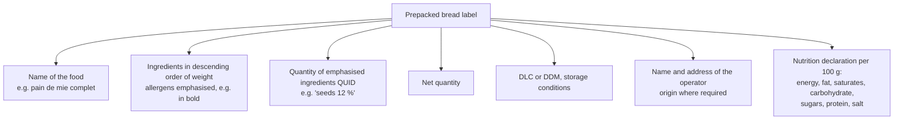

# 02.11 · Bread, Nutrition and the Label

Bread is a staple food: in France it is eaten every day by most people, so small changes in its salt, fibre or sugar matter for public health. This lesson explains what bread brings to the diet, the nutrition recommendations a baker applies, how to read a bread label, and ends with you comparing four bread labels with real numbers.

## Why it matters

Customers ask "is wholemeal better?", "how much salt is in your baguette?", "why doesn't your bread have a Nutri-Score?". A baker must answer correctly, and a sales assistant repeats what you say ([Module 19](../module-19/lesson-02.md)). The référentiel asks you to compare the nutritional characteristics of bakery products from documents and to justify the recommendations professionals apply on salt, sugar and fat (S4.1). Labels and their rules are part of S4.3. Labelling rules change, so this lesson is dated: check the sources if you read it much later.

## Key terms

| French | Say it | English meaning |
|---|---|---|
| glucides (dont sucres) | *glew-SEED (dohn SOO-kruh)* | carbohydrates (of which sugars) |
| amidon | *ah-mee-DOHN* | starch, the main carbohydrate in bread |
| fibres alimentaires | *FEE-bruh ah-lee-mahn-TAIR* | dietary fibre |
| protéines / lipides | *pro-tay-EEN / lee-PEED* | proteins / fats |
| matières grasses saturées | *mah-TYAIR GRAHSS sah-tew-RAY* | saturated fats |
| déclaration nutritionnelle | *day-klah-rah-SYOHN new-tree-syo-NEL* | nutrition declaration (the nutrition table) |
| préemballé / non préemballé (vrac) | *pray-ahm-bah-LAY / VRAK* | prepacked / unwrapped, sold loose |
| féculents | *fay-kew-LAHN* | starchy foods (bread, pasta, rice, potatoes, pulses) |
| PNNS | *pay-en-en-ESS* | Programme national nutrition santé: the French public nutrition programme |
| Nutri-Score | *new-tree-SKOR* | A-to-E front-of-pack nutrition logo |

## How it works

### What is in bread

Typical values per 100 g (they vary by recipe; always use the real label):

| Constituent | White baguette | Wholemeal bread (pain complet) | Brioche | Main role in the body |
|---|---|---|---|---|
| Water | about 30–35 g | about 35–40 g | about 25–30 g | — |
| Energy | about 270–285 kcal | about 240–260 kcal | about 380–420 kcal | — |
| Carbohydrates | about 55–58 g | about 45–50 g | about 45–50 g | energy (starch: slow; sugars: fast) |
| of which sugars | about 2–3 g | about 2–4 g | about 12–16 g | fast energy; excess linked to weight gain and tooth decay |
| Fibre | about 2.5–3.5 g | about 6–8 g | about 2 g | gut function, satiety; most French adults eat too little |
| Protein | about 8–10 g | about 9–11 g | about 8–9 g | building and repairing tissue |
| Fat | about 1–1.5 g | about 1.5–2.5 g | about 12–18 g | energy, fat-soluble vitamins; excess saturated fat raises cardiovascular risk |
| Salt | 1.3–1.4 g (agreement max 1.4 g) | about 1.1–1.3 g (max 1.3 g) | about 0.8–1.2 g | sodium regulates body water; excess raises blood pressure |

Higher flour types keep more of the grain's minerals (iron, magnesium), B vitamins and fibre (lesson [02.1](lesson-01.md)), which is why wholemeal bread is nutritionally richer.

**Energy from a label:** carbohydrates and proteins give about 4 kcal/g, fats about 9 kcal/g, fibre about 2 kcal/g. Salt = sodium × 2.5.

### Food groups and the recommendations

Bread belongs to the **starchy foods** (*féculents*) group, with pasta, rice, potatoes and pulses. Current French public guidance from Santé publique France (Manger Bouger) asks people to eat **at least one wholegrain starchy food a day** and to choose wholemeal or semi-wholemeal versions of cereal products, because they are naturally rich in fibre; the reference intake is **at least 25 g of fibre a day**, a level reached by only 8 % of women and 17 % of men.

For food professionals the national programme's message is to **limit salt, sugar and fat**. In bakery this means:

- **Salt:** respect the bread salt agreement (lesson [02.5](lesson-05.md)): 1.4 g/100 g for pains courants since October 2023, 1.3 g for wholemeal and cereal breads, 1.1 g for pain de mie since October 2025.
- **Fibre:** offer wholemeal, semi-wholemeal, rye and seeded breads; explain them to customers.
- **Sugar and fat:** viennoiserie and brioche are occasional foods; avoid adding sugar to everyday bread.

The PNNS recommendations (the fourth programme covered 2019–2023) remain the public reference on mangerbouger.fr; in February 2026 the government published the **Stratégie nationale pour l'alimentation, la nutrition et le climat (SNANC) 2025–2030**, which now frames food and nutrition policy. Check mangerbouger.fr and agriculture.gouv.fr for the current recommendations.

### Reading a bread label

**Prepacked bread** (sliced bread, packaged brioche, supermarket baguette in a sealed bag) must carry the EU mandatory information (Regulation (EU) No 1169/2011, "INCO"):

**Unwrapped bakery bread** sold over the counter is "non-prepacked". The EU nutrition table is not required here, and Annex V of the INCO regulation also exempts food, including handcrafted food, supplied directly by the manufacturer of small quantities to the final consumer. What remains compulsory in France is the **allergen information in writing** for customers (décret n° 2015-447) and the correct legal **name** of the product (tradition, maison, au levain: [lesson 09.1](../module-09/lesson-01.md)). That is why the artisan baguette has no nutrition table but must have an allergen list available.

### The Nutri-Score

The Nutri-Score grades a food from A (green) to E (red) per 100 g, counting energy, sugars, saturated fat and salt against fibre, protein, and fruit, vegetables and pulses. Its status in France (checked October 2026):

- it is **voluntary** for producers (EU law does not allow France to make it compulsory);
- a **new, stricter calculation** was made official in France by an arrêté of 14 March 2025; products using it show a "Nouveau calcul" box, and businesses in the scheme have **two years** from that date to update their packs;
- the new calculation separates wholegrain starchy foods (such as wholemeal bread) more clearly from refined ones and scores salty and sweet products more strictly.

Artisan bread sold unwrapped usually has no Nutri-Score: it has no nutrition table to calculate it from.

## Worked example

A customer compares your baguette with a supermarket "pain de mie complet". Their label (per 100 g): energy 262 kcal, fat 4.5 g (saturates 0.6 g), carbohydrate 42 g (sugars 4.5 g), fibre 7.0 g, protein 10 g, salt 1.05 g. Your baguette, measured by a laboratory for your bakery: carbohydrate 56 g, fibre 3.0 g, protein 9 g, fat 1.2 g, salt 1.32 g.

1. **Energy of your baguette** ≈ 56 × 4 + 9 × 4 + 1.2 × 9 + 3.0 × 2 = 224 + 36 + 10.8 + 6 ≈ **277 kcal per 100 g**.
2. **Check their label:** 42 × 4 + 10 × 4 + 4.5 × 9 + 7 × 2 = 168 + 40 + 40.5 + 14 = 262.5 ≈ 262 kcal. It matches.
3. **Salt:** your baguette 1.32 g/100 g, below the 1.4 g threshold; their pain de mie 1.05 g, below the 1.1 g threshold for pain de mie since October 2025.
4. **Per portion:** a quarter baguette (60 g) has about 0.8 g salt and 1.8 g fibre; two slices of their bread (50 g) about 0.5 g salt and 3.5 g fibre.
5. **What you tell the customer:** "The wholemeal sliced bread has more than twice the fibre; our baguette has less fat and no added sugar, and its salt respects the national limit. If fibre is your priority, try our pain complet."

## Practice

### You need

- Minimum: four bread labels (packaged breads in a shop, or the photos/online sheets of four breads: for example white sliced bread, wholemeal sliced bread, a seeded or rye bread, a brioche), a calculator, a notebook or spreadsheet.
- Professional equivalent: the technical sheets and laboratory analyses of the bakery's own products.

### Ingredients

None to bake: this is a document exercise.

### Steps

1. For each bread, copy: name, ingredient list, allergens (in bold), net weight, DLC/DDM, and the nutrition table per 100 g.
2. Recalculate the energy from carbohydrates, protein, fat and fibre. Is it within about 5 % of the label?
3. Rank the four breads by salt, fibre, sugars and saturated fat per 100 g.
4. Check each against the salt agreement thresholds (pain courant 1.4 g, wholemeal/cereal 1.3 g, pain de mie 1.1 g).
5. Calculate salt and fibre for one realistic portion (for example 50 g of sliced bread, 60 g of baguette, one 45 g brioche slice).
6. Note whether each shows a Nutri-Score and whether it says "Nouveau calcul".
7. Write a three-sentence answer to a customer who asks which of the four breads is "the healthiest for every day".

### Targets

- All four tables copied without gaps; energy recalculated to ±5 %.
- Salt per portion calculated to 0.1 g.

### How you know it worked

Your recalculated energy matches the labels within a few percent, you can show which bread breaks or respects its salt threshold, and your customer answer uses numbers (fibre, salt, sugar) rather than "it's healthier".

### Self-check

- [ ] I can list the mandatory information on a prepacked bread label.
- [ ] I can explain why an artisan baguette sold loose has no nutrition table but still needs allergen information.
- [ ] I can state the Nutri-Score's status (voluntary; new calculation since the arrêté of 14 March 2025).
- [ ] I can justify, with figures, why a baker limits salt and promotes wholegrain breads.

## What goes wrong

| Symptom | Likely cause | Fix now | Prevent next time |
|---|---|---|---|
| Recalculated energy far from the label | Read per portion instead of per 100 g, or forgot fat × 9 | Recheck the column and factors | Always work per 100 g first |
| Salt and sodium confused | Some labels or analyses give sodium | Salt = sodium × 2.5 | Note the unit on every figure |
| Shop staff tell customers "this bread is gluten-free because it's wholemeal" | Wrong product information | Correct it at once; wholemeal wheat contains gluten | Brief staff with written product sheets ([Module 19](../module-19/lesson-02.md)) |
| Bakery's packaged sliced bread sold without a nutrition table | Prepacked product treated like loose bread | Withdraw or relabel; check whether the small-quantity exemption applies | Check labelling rules for each sales channel |
| "Our bread has Nutri-Score A" printed with the old calculation | Logo not updated | Recalculate with the new method | Update packs within the transition period |

## Review

- Bread is mainly starch (energy), with protein, little fat, and fibre that rises sharply in wholemeal bread; its salt is limited by the 2022 agreement.
- Current French guidance: at least one wholegrain starchy food a day, at least 25 g fibre a day; professionals limit salt, sugar and fat. The SNANC 2025–2030 (published February 2026) now frames national food policy.
- Prepacked bread carries the INCO mandatory information including a nutrition table; unwrapped artisan bread needs written allergen information and its correct legal name.
- The Nutri-Score is voluntary; the new calculation became official in France on 14 March 2025 with two years to update packs.
- Exam-relevant (S4.1, S4.3): see [the CAP exam reference](../../references/cap-exam.md).
