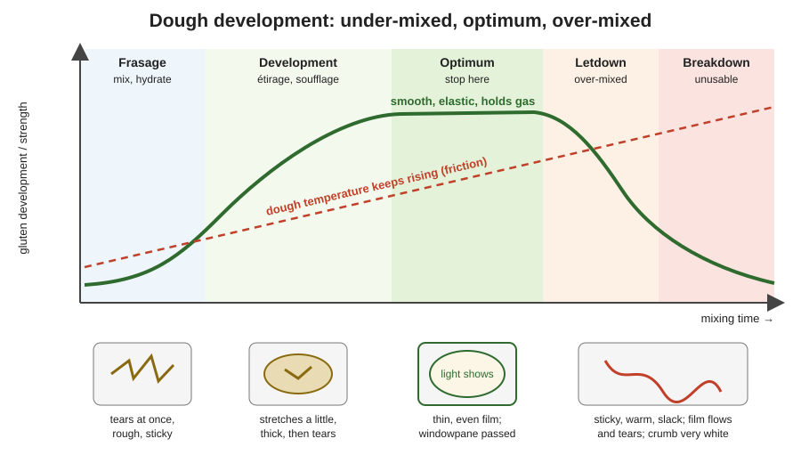

# 03.1 · How a Gluten Network Forms

Flour, water, salt and yeast are not yet a dough: mixing turns them into one, and how far you mix decides how the dough will ferment, shape and bake. This lesson follows a dough from the first turn of the mixer to full development, shows you how to read its stage with your hands, and ends with you testing your own dough at three moments of hand kneading.

## Why it matters

Bakers say most of a loaf's quality is decided in the mixer, because development cannot be undone: a dough that was mixed too little can be strengthened later by folds and time, but a dough that was mixed too much stays weak, warm and white. The CAP référentiel asks you to define the phases of mixing and the effect of mixing on the product (S3.1), and to explain the mechanical action on proteins that builds gluten (S4.1). Module 2 showed what gluten is made of (lesson [02.3](../module-02/lesson-03.md)); this lesson shows how you build it, on purpose, to the right level.

> [!NOTE]
> This is the first lesson of a practical module, so a reminder that applies to all of them: watching someone bake does not make you able to bake. Do the practice at home. The Academy cannot grade photos, so you compare your result with the targets and the rubric yourself, and that self-assessment does not replace the official practical exam.

## Key terms

| French | Say it | English meaning |
|---|---|---|
| pétrissage | *pay-tree-SAHZH* | mixing and kneading: the whole operation that turns ingredients into a developed dough |
| réseau glutineux | *ray-ZOH glew-tee-NUH* | gluten network: the continuous web of linked proteins |
| développement | *day-vlop-MAHN* | how far the gluten network has been built |
| test de la fenêtre / du voile | *test duh lah fuh-NAY-truh / dew VWAHL* | windowpane test: stretching a piece of dough into a thin film to judge development |
| pâte lisse | *paht LEESS* | smooth dough: the surface sign of good development |
| pâte collante | *paht ko-LAHNT* | sticky dough: under-developed, too wet or over-mixed |
| sous-pétri / sur-pétri | *soo pay-TREE / sewr pay-TREE* | under-mixed / over-mixed |
| alvéole | *al-vay-OLL* | gas cell in the dough and later in the crumb |

## How it works

### Four things happen at once

When the mixer starts, or your hand first stirs the bowl:

1. **Hydration.** Water wets the flour. Gluten proteins (gliadins and glutenins) absorb about twice their weight of water, damaged starch absorbs much more, intact starch only a little. Salt, sugar and yeast dissolve. At this point the mass is rough, lumpy and sticky.
2. **Unfolding and linking.** Hydrated proteins unfold. The mechanical work of mixing stretches them, lines them up and brings them into contact, so they bond to each other: weak bonds (hydrogen bonds, which form and break all the time) and stronger sulphur–sulphur links (disulphide bridges) between glutenin chains. Little by little the proteins become one continuous network of thin films with the starch granules embedded in it.
3. **Air incorporation.** Each fold traps air. The dough ends mixing with thousands of tiny air cells (*alvéoles*). Yeast makes no new bubbles: its CO₂ dissolves in the dough water and then moves into these existing cells. **The number of cells you create in the mixer is the number of cells the crumb can have.**
4. **Warming.** Work becomes heat. A dough always comes out of the mixer warmer than the average of its ingredients (lesson 03.4).

### Stages you can see and feel

| Stage | What you see and feel | Inside the dough |
|---|---|---|
| Frasage (first minutes) | rough, lumpy, sticky; dry flour disappears | water reaching every particle; no network yet |
| Development | dough starts to come away from the bowl, becomes smoother, less sticky, resists stretching | proteins aligning, network forming, air cells multiplying |
| Optimum | smooth, satiny, elastic, springs back slowly; stretches into a thin translucent film | continuous network, fine cells, best gas retention |
| Letdown (over-mixing) | dough becomes warm, sticky and slack again, loses spring, film flows then tears | excess work breaks bonds; the network releases water |
| Breakdown | wet, stringy, almost liquid; cannot be used for bread | network destroyed |

In a bakery the optimum is reached on a spiral mixer in minutes; by hand it takes about 10–15 minutes of steady kneading for a 65 % dough. **Over-mixing is a machine fault**: by hand you will tire long before you reach letdown.

### The windowpane test

Cut a piece of dough the size of a walnut. Flatten it, then stretch it slowly between the fingertips of both hands, turning it as you go, as if making a tiny pizza.

- Tears at once with ragged edges → under-developed.
- Stretches a little, stays thick and opaque, then tears → partly developed.
- Becomes a thin film you can see light through, and a hole tears with smooth round edges → developed.

The test is not pass or fail. It tells you where the dough is, and the right answer depends on what happens next. A dough that will have a short pointage (about 1 hour) needs to be nearly fully developed at the end of mixing. A dough that will ferment for many hours, or be given several folds, can leave the mixer less developed: time and folds keep building the network. That is the principle behind the slow methods of lesson 03.3.

### Why "more" is not "better"

The network keeps strengthening during fermentation (yeast activity, acidity, folds, time). A dough mixed to its maximum in the mixer has no room left to build structure later; it tends to give big volume, a very regular white crumb, a bland taste and bread that stales fast. A dough mixed less, then fermented longer, keeps flavour and an open, creamy crumb. Choosing *how much* to mix is the first technical decision on every technical sheet.

## Worked example

You are mixing PC-02 (the pain courant on pâte fermentée sheet from lesson [01.6](../module-01/lesson-06.md)) on a spiral mixer: frasage 4 minutes in first speed, then 6 minutes in second speed. At 6 minutes the dough has not come away from the bowl and tears when you stretch it. Is the dough under-mixed, or is something else wrong?

1. **Check the facts first.** Thermometer: 23.5 °C (in target). Consistency: softer than usual. Production sheet: today's flour batch is new.
2. **Read the stage.** Rough edges on the tear and no smooth surface = under-developed, not over-mixed (an over-mixed dough would be smooth but slack, warm and sticky after having been good).
3. **Cause.** A softer dough develops more slowly: more water dilutes the proteins and the hook has less resistance to work against. The new flour may also be weaker.
4. **Correction now.** Mix 1–2 more minutes in second speed and test again after each minute. Do not add flour without measuring it (lesson 03.5).
5. **Record it.** "Batch 4521: 8 min in 2nd speed to reach windowpane at 64 %." Tomorrow you start with that time, and you report the flour change to the head baker.

## Practice

You make the PD-01 dough from lesson [01.6](../module-01/lesson-06.md) by hand, take a windowpane sample at three moments, then finish the dough as rolls so nothing is wasted.

> [!WARNING]
> The last part uses an oven at 230 °C with steam. Use dry oven gloves; pour water only into a preheated metal tray on the lowest shelf, close the door at once and stand back. Never pour water into a hot glass dish.

### You need

- Minimum: scale (1 g; 0.1 g for salt and yeast if you have one), probe thermometer, large bowl, dough scraper, a lidded container with the level marked, timer, baking tray, metal tray for steam, oven gloves, [bake log](../../templates/bake-log.md).
- A small plate and a phone camera (or a notebook) to record each windowpane.
- Professional equivalent: spiral mixer, with the windowpane test done on a piece taken from the bowl after stopping the machine.

### Ingredients

| Ingredient | Baker's % | Weight |
|---|---|---|
| Flour T55 (or plain/all-purpose flour) | 100 | 500 g |
| Water | 65 | 325 g |
| Salt | 1.8 | 9 g |
| Fresh yeast (or instant dry, 2.5 g) | 1.5 | 7.5 g |

### Steps

1. Measure flour and room temperature; calculate the water temperature with the hand-mix estimate from lesson [01.7](../module-01/lesson-07.md) for a 24 °C dough ([Module 5](../module-05/lesson-02.md) teaches the full base-temperature method).
2. Dissolve the yeast in the water, add the flour and salt, and mix with the scraper for 4 minutes until no dry flour is left (frasage).
3. **Sample 1 (end of frasage):** take a walnut-size piece, do the windowpane test, note what happens and photograph it. Put the piece back.
4. Knead on an unfloured worktop (slap, stretch, fold, quarter turn) for 5 minutes. **Sample 2:** test, record, put back.
5. Knead 5 more minutes (10 in total). **Sample 3:** test, record. If the film is still not translucent, knead 3 more minutes and test again; write down the total time.
6. Measure the dough temperature. Pointage 1 hour at about 24 °C in the marked container, with one fold at 30 minutes.
7. Divide into 8 pieces of 105 g, pre-shape into balls, rest 15 minutes, flatten to 1.5 cm, proof about 40 minutes, then bake at 230 °C with steam for 15–18 minutes, as in lesson 01.7.
8. Fill in the bake log, including the three windowpane observations and the total kneading time.

### Targets

- Frasage 4 minutes; samples at 0, 5 and 10 minutes of kneading (plus any extra).
- Dough temperature at the end of kneading 23–25 °C, recorded to 0.5 °C.
- Eight pieces of 105 g ± 2 g.

### How you know it worked

Your three samples show a clear progression: torn and ragged, then thick and opaque, then a thin film. The dough became smoother and less sticky without any extra flour, and its temperature rose by a degree or two while you kneaded. The rolls have a fine, even crumb.

### Self-check

- [ ] I recorded and photographed the windowpane at three stages.
- [ ] I can describe what the proteins, starch, water and air were doing at each stage.
- [ ] I recorded my total kneading time to reach a thin film, so I can use it next time.
- [ ] I can explain why a long-fermented dough can leave the mixer less developed.

## What goes wrong

| Symptom | Likely cause | Fix now | Prevent next time |
|---|---|---|---|
| Dough never gets past "thick and opaque" | Kneading too gentle or too short; weak flour; very soft dough | Knead 3–5 more minutes; rest 5 minutes then test (the network relaxes) | Knead the full time; check hydration and flour strength |
| Windowpane tears even after 15 minutes | Stretching too fast; dough too firm; whole-grain flour (bran cuts the film) | Let the sample rest 2 minutes and stretch slowly | Judge bran doughs by smoothness and spring, not only the film |
| Dough sticks to hands and worktop throughout | Adding flour each time it sticks keeps it under-developed; or hydration too high | Use the scraper and keep kneading; stop adding flour | Weigh water exactly; trust development to reduce stickiness |
| Dough was good, then went sticky and slack in a mixer | Over-mixed (letdown) and warm | Use it at once with a short pointage, or for flat products | Watch the dough, not only the timer; stop at the optimum |
| Rolls dense with tight crumb | Under-developed and under-proofed | — | Develop to the stage the sheet asks; ferment to the dough, not the clock |

## Review

- Mixing does four things: hydrates, links proteins into a network, traps the air cells the crumb will have, and warms the dough.
- Stages: frasage, development, optimum, then over-mixing (letdown, breakdown); over-mixing is a machine fault.
- The windowpane test tells you the stage; how developed the dough should be depends on how long it will ferment and how many folds it will get.
- More mixing gives more volume and a whiter, blander crumb; less mixing plus longer fermentation gives more flavour.
- The exam asks you to explain mixing phases and their effects (S3.1, S4.1); see [the CAP exam reference](../../references/cap-exam.md).
