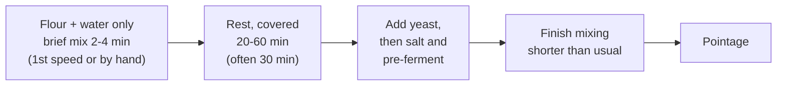

# 03.2 · Hydration, Consistency and Autolyse

The water in a formula decides the dough's consistency, and consistency decides how the dough mixes, how warm it gets and how it handles afterwards. This lesson connects hydration to what you feel in the bowl, then teaches the autolyse, a simple rest of flour and water that lets the dough build gluten without work. You finish by mixing the same dough with and without an autolyse and comparing them.

## Why it matters

Lesson [02.4](../module-02/lesson-04.md) taught you to calculate hydration. In production you also have to *read* consistency, because the same percentage gives a different dough with every flour, and because consistency changes the whole mixing: a soft dough develops slowly, a firm one quickly and gets hotter. The référentiel names the autolyse among the corrective actions you must be able to explain and lists it in the mixing techniques for pain courant, tradition and other breads (S3.1, C2.3). It is one of the main tools artisan bakers use to get flavour, extensibility and volume from a short mix.

## Key terms

| French | Say it | English meaning |
|---|---|---|
| consistance | *kohn-sees-TAHNSS* | consistency: how firm or soft a dough is to the touch |
| pâte ferme | *paht FAIRM* | firm dough: holds its shape, resists the hand |
| pâte bâtarde | *paht bah-TARD* | medium dough: the usual consistency for pain courant |
| pâte douce (molle) | *paht DOOSS (MOLL)* | soft dough: slack, slightly sticky, spreads |
| autolyse | *oh-toh-LEEZ* | rest of flour and water only, after a brief mix and before kneading |
| protéases | *pro-tay-AHZ* | enzymes in flour that cut proteins and relax the gluten |
| eau de réserve | *oh duh ray-ZAIRV* | water held back at the start, added later if the dough needs it |
| pâte croûtée | *paht kroo-TAY* | dough with a dry skin, from being left uncovered |

## How it works

### Consistency is the result, hydration the means

Hydration is a number on the sheet; consistency is what you feel. As starting points with a medium-strength white flour:

| Consistency | Typical hydration (white flour) | Products | Mixing behaviour |
|---|---|---|---|
| Ferme (firm) | about 55–60 % | pain de mie, viennoiserie détrempe, some shaped breads | develops fast, heats more, needs care not to over-mix |
| Bâtarde (medium) | about 62–66 % | pain courant, baguettes | balanced; standard mixing times |
| Douce (soft) | about 68–75 % | tradition, campagne, ciabatta-type breads | develops slowly, sticks longer, heats less; benefits from autolyse and folds |

Why consistency changes mixing: in a firm dough the proteins are close together and the hook or your hand meets strong resistance, so each turn does a lot of work (fast development, more friction heat). In a soft dough the proteins are diluted and slide past each other, so each turn does less work: development is slower and the dough stays cooler. That is why a very soft dough is usually started with part of the water (**eau de réserve**) and finished with bassinage (lesson [03.5](lesson-05.md)).

The professional checks consistency at the end of frasage, not at the end of mixing: that is the moment to adjust water, while the gluten is not yet developed.

### The autolyse

The autolyse was developed by Professor Raymond Calvel in 1974, when two-speed mixers had made French bread whiter, blander and quicker to stale. The method:

During the rest, with no mechanical work:

- **Hydration completes.** Every particle, including bran, takes up water evenly.
- **Gluten bonds form on their own.** Hydrated proteins link up as they would during kneading, only slower; the dough you come back to is already smoother and stretches further.
- **Proteases relax the network.** Flour enzymes cut a few protein chains, so the dough becomes more **extensible**: easier to shape and score, with better oven spring.
- **Amylases start to free sugars** that the yeast will use and the crust will colour with.

Results in the mixer: less kneading is needed to reach the same development, so less air is beaten in, the dough heats less and is **less oxidised** (lesson [03.4](lesson-04.md)): creamier crumb, more aroma.

Why salt and yeast stay out: salt tightens the gluten and slows the enzymes, which defeats the purpose; yeast would start fermenting and acidifying. Fresh yeast is added at the start of the final mix; salt a little later, once the yeast is dispersed. A pâte fermentée contains salt and yeast, so it goes in after the autolyse, near the end of frasage. A liquid levain is sometimes included in the autolyse by bakers who want its water from the start; that is a variant, not the classic method.

### When an autolyse helps, and when it does not

| Helps | Does not help, or harms |
|---|---|
| Tradition dough (no additives, long fermentation, needs extensibility) | Very weak or already extensible flour: the dough becomes slack |
| Strong or tenacious flour (high P/L) that resists shaping | Flour with too much amylase (low falling number): sticky dough |
| Wholemeal and high-type flours (bran softens) | Very short production slots: 30 minutes of bowl time is 30 minutes of mixer not used |
| Soft doughs that develop slowly | Firm viennoiserie détrempes, where extensibility is not the problem |

## Worked example

Order for tomorrow: tradition baguettes on 8 kg of T65 tradition flour, hydration 70 %, with an autolyse. Sheet: salt 1.8 %, fresh yeast 0.8 %, pâte fermentée 15 %.

1. **Total water:** 8,000 × 70 / 100 = 5,600 g.
2. **Water in the autolyse:** the flour batch is new, so keep 2 % of the flour weight as eau de réserve: 8,000 × 2 / 100 = 160 g. Autolyse water = 5,600 − 160 = 5,440 g (68 %).
3. **Autolyse:** flour + 5,440 g water, 3 minutes first speed, cover, 30 minutes.
4. **Final mix:** add yeast 8,000 × 0.8 / 100 = 64 g; after 1 minute, salt 144 g and pâte fermentée 1,200 g. Check consistency at the end of the first speed: slightly firm, so add the 160 g reserve slowly (bassinage).
5. **Mixing time:** the sheet without autolyse says 5 minutes in second speed; with the autolyse the dough reaches the same windowpane after about 3–4 minutes. Stop on the test, not the clock.
6. **Dough weight:** 8,000 + 5,600 + 144 + 64 + 1,200 = 15,008 g. Write the real water used and the second-speed time on the production sheet.

## Practice

Two small PD-01 doughs: one direct, one with a 30-minute autolyse. You measure how long each needs to reach the same windowpane, then bake both.

> [!WARNING]
> You will bake at 240 °C with steam. Use oven gloves; put an empty metal tray on the lowest shelf while preheating and pour a small glass of hot water into it when you load, then close the door at once and stand back. Never pour water into a hot glass dish.

### You need

- Minimum: scale (1 g, and 0.1 g if you have one), probe thermometer, two bowls, two marked containers, scraper, timer, ruler, baking tray, metal tray for steam, oven gloves, lame or sharp knife, [bake log](../../templates/bake-log.md).
- Professional equivalent: spiral mixer with a timer; the autolyse rests in the mixer bowl, covered.

### Ingredients

| Ingredient | Baker's % | Dough A (direct) | Dough B (autolyse) |
|---|---|---|---|
| Flour T55 or T65 (or plain/all-purpose) | 100 | 300 g | 300 g |
| Water | 65 | 195 g | 195 g |
| Salt | 1.8 | 5.4 g | 5.4 g |
| Fresh yeast (or instant dry 1.5 g) | 1.5 | 4.5 g | 4.5 g |

### Steps

1. Calculate the water temperature for a 24 °C dough with the [01.7](../module-01/lesson-07.md) hand-mix estimate. For dough B use water about 2 °C warmer: it will rest 30 minutes and be kneaded for less time, so it gains less heat.
2. **Dough B first:** mix only flour and water with the scraper for 2 minutes until no dry flour remains. Cover. Start a 30-minute timer.
3. After 20 minutes, **mix dough A** completely: dissolve yeast in water, add flour and salt, frasage 3 minutes, then knead. Test the windowpane every 2 minutes from minute 6; note the minute it passes.
4. At 30 minutes, uncover dough B. Stretch a corner and note how far it goes compared with a freshly mixed dough. Add the yeast (crumbled), squeeze it through, then the salt, and knead. Test every 2 minutes from minute 2; note when it passes.
5. Measure both dough temperatures. Pointage 1 hour at about 24 °C with one fold at 30 minutes.
6. Divide each dough in two (about 250 g), pre-shape, rest 15 minutes, shape into bâtards of about 20 cm. Note how easily each one lengthens.
7. Proof 45–60 minutes until a finger press springs back slowly. Score each loaf once and bake at 240 °C with steam for 22–25 minutes.
8. Cool 1 hour. Measure height, cut, compare crumb colour, cell structure and taste. Fill in the bake log.

### Targets

- Both doughs 23–25 °C at the end of kneading.
- Kneading time to windowpane recorded for both, to the minute.
- Divided pieces within ± 5 g.

### How you know it worked

Dough B reached the windowpane several minutes sooner, stretched further without tearing during shaping, and gives a loaf with similar or better volume, a slightly creamier crumb and an ear that opens more easily. If you see no difference, your flour may already be very extensible: note it, it is useful information about that flour.

### Self-check

- [ ] I kept salt and yeast out of the autolyse.
- [ ] I recorded kneading time, temperature and shaping behaviour for both doughs.
- [ ] I can explain the four things that happen during an autolyse.
- [ ] I can name two cases where I would not use an autolyse.

## What goes wrong

| Symptom | Likely cause | Fix now | Prevent next time |
|---|---|---|---|
| Autolysed dough slack and sticky after mixing | Flour too extensible or high amylase; autolyse too long | Fold during pointage; shape a little tighter | Shorten the autolyse to 15–20 min or skip it with this flour |
| Autolysed dough too cold at the end | Less kneading means less friction heat | Ferment somewhere warmer, longer | Use slightly warmer water ([Module 5](../module-05/lesson-02.md) makes this exact) |
| Dry skin on the dough after the rest | Bowl not covered | Knead the skin in; it may leave hard specks | Always cover the autolyse |
| Yeast lumps in the finished dough | Fresh yeast added to a firm, developed autolyse without breaking it up | Knead longer, squeezing the dough | Crumble yeast finely or dissolve it in a little of the reserve water |
| Dough too firm at end of frasage | Flour absorbs more than expected | Add the eau de réserve slowly | Keep 1–3 % of water in reserve with a new flour |

## Review

- Hydration is the number; consistency (ferme, bâtarde, douce) is the result you check at the end of frasage, while you can still adjust water.
- Firm doughs develop faster and heat more; soft doughs develop slower and stay cooler.
- Autolyse: flour and water only, rested 20–60 minutes; gluten forms without work, proteases add extensibility, mixing is shorter and less oxidising.
- Salt, yeast and pâte fermentée go in after the autolyse.
- Exam-relevant (S3.1 corrective actions, mixing techniques): see [the CAP exam reference](../../references/cap-exam.md).
