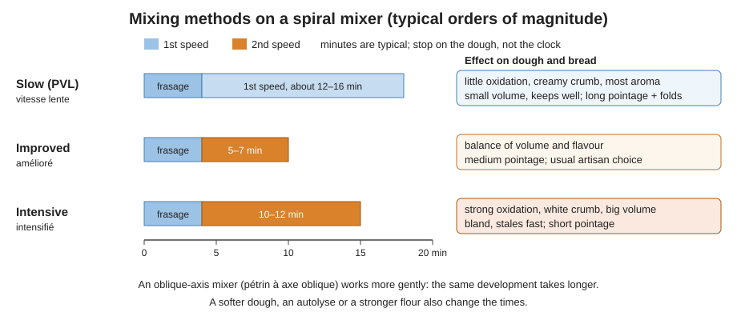

# 03.3 · Mixing Phases and Methods

French bakers do not just "mix": they choose a method, slow, improved or intensive, and that choice changes the colour of the crumb, the taste, the volume, how long the bread keeps and how long the dough must ferment. This lesson names the phases of mixing, compares the three methods with typical times on a spiral mixer, and ends with you simulating two of them by hand.

## Why it matters

The référentiel asks you to define the phases of mixing and the effect of each method on the product (S3.1), and the production competency C2.3 lists improved and intensive mixing for pain courant, slow and improved mixing for the other breads, with the autolyse for both. On a technical sheet, the mixing line (method, minutes in first and second speed, target temperature) is the line that sets every time after it: a change of method without a change of pointage gives a failed batch. In the practical test mixing is done by machine; see [the CAP exam reference](../../references/cap-exam.md).

## Key terms

| French | Say it | English meaning |
|---|---|---|
| frasage | *frah-ZAHZH* | first phase: ingredients blended into a rough, even dough, in first speed |
| étirage / soufflage | *ay-tee-RAHZH / soo-FLAHZH* | second phase: the dough is stretched and folded, traps air and develops |
| pétrin à spirale | *pay-TRAN ah spee-RAHL* | spiral mixer: a spiral hook turns while the bowl turns; the usual bread mixer |
| pétrin à axe oblique | *pay-TRAN ah AX oh-BLEEK* | oblique-axis (fork) mixer: a gentle, traditional mixer |
| 1re / 2e vitesse | *pruh-MYAIR / duh-ZYEM vee-TESS* | first (slow) / second (fast) speed |
| pétrissage à vitesse lente (PVL) | *vee-TESS LAHNT* | slow mixing: first speed only |
| pétrissage amélioré | *ah-may-lyo-RAY* | improved mixing: short second speed; the usual artisan method |
| pétrissage intensifié | *an-tahn-see-FYAY* | intensive mixing: long second speed |
| salage différé | *sah-LAHZH dee-fay-RAY* | delayed salting: salt added late in mixing |

## How it works

### The phases

1. **Frasage** (first speed, about 3–5 minutes). Water, flour and the other ingredients are blended until no dry flour is left and the dough is even. This is when you check consistency and adjust water (lesson 03.2).
2. **Étirage and soufflage** (the kneading proper, first or second speed). The hook stretches the dough against the bowl (*étirage*), folds it back over itself and traps air (*soufflage*). The gluten network forms and the dough becomes smooth and elastic (lesson 03.1). Depending on the method this lasts from a few minutes to more than 15.

### Order of ingredients

| When | What | Why |
|---|---|---|
| First, in the bowl | water at the calculated temperature | flour poured onto water raises less dust and does not stick to the bottom |
| Then | flour, poured low and gently | flour dust is the first cause of occupational asthma in bakeries: do not shake bags, use a lid on the mixer |
| Start of frasage | fresh yeast, crumbled (or dissolved in the water) | even dispersion |
| During or end of frasage | salt | at the start it slows oxidation and fermentation slightly; delayed salting (*salage différé*) shortens mixing but whitens the crumb |
| End of frasage | pâte fermentée, cut into pieces | it is already a developed, salted dough; it only needs to be blended in |
| End of mixing | bassinage water if needed | to soften a dough that is too firm (lesson 03.5) |

### The three methods

| | Slow (PVL) | Improved (amélioré) | Intensive (intensifié) |
|---|---|---|---|
| Typical spiral-mixer time | frasage 4 min + about 12–16 min in first speed | frasage 4 min + about 5–7 min in second speed | frasage 4 min + about 10–12 min in second speed |
| Development at the end | low: the dough is soft and not smooth | good, slightly below maximum | maximum |
| Oxidation | very little: creamy crumb | moderate | strong: very white crumb |
| Temperature rise | small | moderate | large (lesson 03.4) |
| Pointage needed | long (often 2–3 h), with folds | medium (about 45 min–1 h 30) | short (often 20–40 min) |
| Bread | irregular open crumb, thick crust, most aroma, keeps best, smaller volume; dough harder to shape | balanced volume and taste; easier shaping | big volume, regular fine crumb, thin crust that flakes, bland, stales fast |
| Typical use | tradition, levain breads | pain courant and tradition in most artisan shops | industrial and fast production; rare in artisan shops today |

These times are orders of magnitude for a medium-firm dough of about 5–10 kg of flour on a spiral mixer. A softer dough, an autolyse, a stronger flour, a smaller batch or an **oblique-axis mixer** (gentler, so second-speed times are much longer) all change them. The fixed rule: stop on the dough (smoothness, windowpane, temperature), not on the timer.

### Why the methods exist

Intensive mixing spread in France in the 1950s–60s with the two-speed mixer: it gave very white, voluminous baguettes after a short pointage, which suited a faster rhythm of work. Its cost was flavour and keeping quality, because heavy oxidation destroys flour pigments and aroma and a short fermentation produces fewer aroma compounds. Improved mixing, the autolyse and slow mixing are the artisan answer: develop the dough less in the mixer and let **time** build strength and flavour during pointage. You will meet this trade-off again in Module 4.

### By hand

A hand-mixed dough is closest to slow mixing: low intensity, little oxidation, little heat. You can move it towards improved mixing by kneading vigorously (slap and fold) to the windowpane, or keep it "slow" by kneading gently and giving folds during a longer pointage.

## Worked example

The head baker gives you two lines for tomorrow and asks you to fill in the mixing on the technical sheets.

**Line 1: pain courant, PC-02** (lesson [01.6](../module-01/lesson-06.md)), 5,400 g flour, pâte fermentée 15 %, shop opens at 7:00, pointage slot 45 minutes.

1. A 45-minute pointage needs a well-developed dough, and PC-02 already brings strength through its pâte fermentée. → **Improved mixing.**
2. Sheet: water then flour; frasage 4 min in first speed with yeast and salt; pâte fermentée in the last minute of frasage; 6 min in second speed; check windowpane and 23–25 °C.

**Line 2: tradition**, T65 tradition flour, 70 %, pointage 2 h 30 with two folds, extra-creamy crumb wanted for a "pain à l'ancienne" display.

1. A long pointage with folds will build the strength; the aim is aroma and a creamy crumb, so oxidation must be minimal. → **Slow mixing**, or an autolyse followed by a very short improved mix.
2. Sheet: autolyse 30 min; frasage 4 min; about 12 min in first speed; check consistency at the end of frasage and add bassinage if needed; target 22–24 °C.

**What if** someone mixes line 1 intensively (12 min in second speed) and keeps the 45-minute pointage? The dough comes out several degrees warmer and fully developed: it will be over-fermented at 45 minutes, sticky at dividing, and the bread white and bland. Mixing and pointage are one decision.

## Practice

Two small doughs made by hand on the same day: one simulating slow mixing (gentle kneading, less yeast, long pointage with folds), one simulating improved mixing (vigorous kneading to the windowpane, normal pointage). The timing is staggered so both are baked together.

> [!WARNING]
> You will bake at 240 °C with steam: use oven gloves, steam into a preheated metal tray only, and stand back. If you use a stand mixer for dough B, never put a hand or scraper in the bowl while it turns: switch off and wait for the hook to stop.

### You need

- Minimum: scale (1 g; 0.1 g for salt and yeast), probe thermometer, two bowls, two marked containers, scraper, timer, baking tray, metal tray for steam, oven gloves, lame, [bake log](../../templates/bake-log.md).
- Optional: a stand mixer with a dough hook for dough B (lowest speed for frasage, the next speed for kneading, as its manual allows).
- Professional equivalent: a spiral mixer with first and second speeds and a timer.

### Ingredients

| Ingredient | Baker's % A / B | Dough A (slow) | Dough B (improved) |
|---|---|---|---|
| Flour T55 or T65 (or plain/all-purpose) | 100 | 300 g | 300 g |
| Water | 65 | 195 g | 195 g |
| Salt | 1.8 | 5.4 g | 5.4 g |
| Fresh yeast (instant: one-third) | 1.0 / 1.5 | 3.0 g | 4.5 g |

Dough A has less yeast because its pointage is twice as long: a method change is also a formula change.

### Steps

1. **0:00 — Dough A.** Calculate the water for a 24 °C dough (lesson [01.7](../module-01/lesson-07.md) estimate). Yeast into water, then flour and salt. Frasage 4 minutes with the scraper. Then knead **gently** for 4 minutes in the bowl: lift and fold, no slapping. Measure the temperature. Pointage 2 h at about 24 °C, with folds at 30, 60 and 90 minutes.
2. **0:55 — Dough B.** Same water calculation. Frasage 4 minutes, then knead **vigorously** (slap, stretch, fold) until the windowpane passes, about 10–12 minutes. Measure the temperature. Pointage 1 h with one fold at 30 minutes.
3. Note for each: temperature at the end of mixing, colour of the dough (creamy or whiter), smoothness.
4. **About 2:05 — both doughs.** Divide each into two pieces of about 250 g, pre-shape, rest 15 minutes, shape into bâtards of about 20 cm. Note which shapes more easily.
5. Proof 45–60 minutes until a finger press springs back slowly. Preheat the oven to 240 °C with the steam tray for at least 45 minutes.
6. Score each loaf once, bake 22–25 minutes with steam. Label the tray so you know which is which.
7. Cool 1 hour. Compare height, crust, crumb colour and cells, taste. Keep one loaf of each in a bag and taste again the next day.

### Targets

- Both doughs 23–25 °C after mixing; dough B usually a little warmer.
- Dough A: 4 min frasage + 4 min gentle kneading; dough B: kneaded to the windowpane, time recorded.
- Pieces within ± 5 g; both baked in the same oven load.

### How you know it worked

Dough A left the bowl rough and grew smooth and strong through its three folds; it gives a more irregular, creamier crumb, a thicker crust and more taste, and is still pleasant the next day. Dough B was smooth at the end of mixing and gives a slightly bigger, more regular loaf with a whiter crumb. If both are identical, check your temperatures and timings: one of them probably drifted.

### Self-check

- [ ] I can name the two phases of mixing and what happens in each.
- [ ] I can give typical first- and second-speed times for the three methods and say what they change.
- [ ] I changed the yeast and pointage when I changed the method, and I can explain why.
- [ ] I recorded temperatures, colours and the next-day tasting for both doughs.

## What goes wrong

| Symptom | Likely cause | Fix now | Prevent next time |
|---|---|---|---|
| Flour cloud when starting the mixer | Flour poured from height onto a dry bowl; second speed started too soon | Stop, close the lid, wait for dust to settle | Water first, flour poured low; frasage in first speed only |
| Lumps of pâte fermentée in the dough | Added too late or in one block | Mix 1–2 more minutes in first speed | Cut it into pieces and add at the end of frasage |
| Slow-mixed dough tight and tearing at shaping | Not enough folds or pointage too short to develop it | Longer détente before shaping | Give the folds; slow mixing needs its long pointage |
| Intensively mixed dough over-fermented at dividing | Method changed without shortening pointage; dough too warm | Divide early; cooler proof | Write method and pointage together on the sheet |
| Bread white, bland, stales next day | Intensive mixing, strong oxidation, short fermentation | — | Improved or slow mixing, autolyse, pâte fermentée |

## Review

- Mixing has two phases: frasage (blend, first speed, adjust consistency) and étirage/soufflage (develop and trap air).
- Water first, then flour poured gently; yeast at the start, salt during frasage, pâte fermentée at its end, bassinage at the end of mixing.
- Slow mixing: least oxidation, most flavour, long pointage. Intensive: most volume, white and bland, short pointage. Improved sits in between and is the usual artisan choice.
- Changing the mixing method means changing yeast, temperature and pointage too.
- Exam-relevant (S3.1, C2.3, mechanical mixing at the practical test): see [the CAP exam reference](../../references/cap-exam.md).
