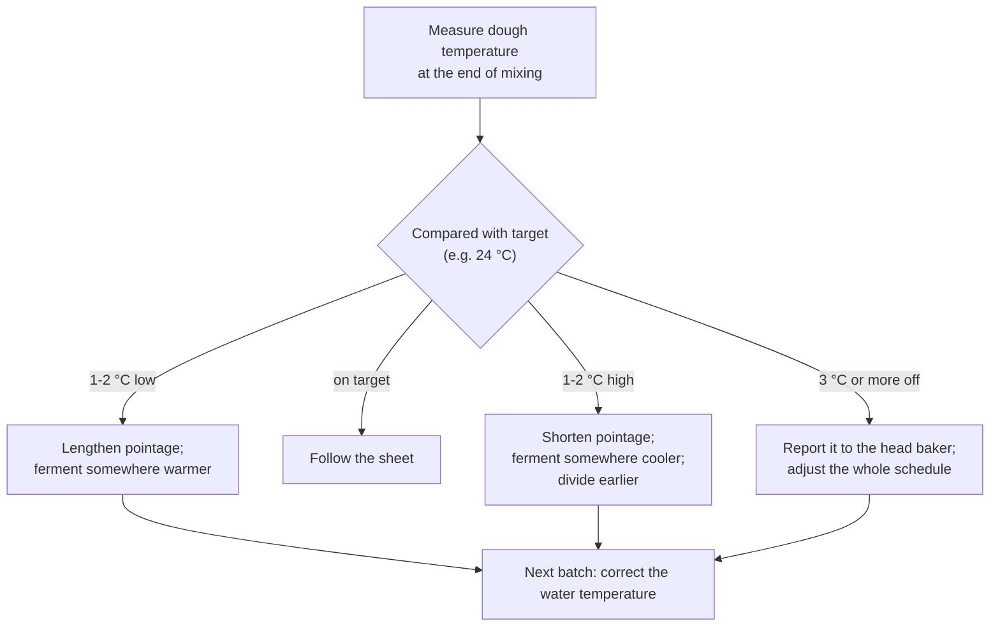

# 03.4 · Oxidation, Dough Temperature and Mixing

Every minute in the mixer does two things besides building gluten: it works oxygen into the dough and it turns mechanical energy into heat. Both change the bread as much as the formula does. This lesson explains oxidation and dough temperature, shows what over-mixing looks like, and ends with a home test comparing a warm dough with a correctly tempered one.

## Why it matters

A crumb that is chalk-white and tasteless, a dough that is sticky at the divider, a batch that over-ferments before the oven is free: these are mixing faults, and they all come from oxygen and heat. The référentiel asks you to explain the effect of dough temperature and propose corrections (S3.1), and the action of air on flour constituents (S4.1). You do not need chemistry formulas for the exam; you need to predict what a mixing choice will do to the bread and correct it.

## Key terms

| French | Say it | English meaning |
|---|---|---|
| oxydation | *ok-see-dah-SYOHN* | oxidation: reactions with the oxygen worked into the dough |
| blanchiment de la mie | *blahn-shee-MAHN duh lah MEE* | whitening of the crumb from over-oxidation |
| caroténoïdes | *ka-ro-tay-no-EED* | yellow-cream pigments of flour, linked to bread aroma |
| lipoxygénase | *lee-pok-see-zhay-NAHZ* | flour enzyme that uses oxygen and bleaches the pigments; also in bean and soy flour |
| température de pâte | *tahm-pay-rah-TOOR duh PAHT* | dough temperature measured at the end of mixing |
| échauffement | *ay-shohf-MAHN* | temperature rise of the dough during mixing (friction) |
| pâte surpétrie | *paht sewr-pay-TREE* | over-mixed dough |
| tolérance | *to-lay-RAHNSS* | how long a dough stays usable before over-fermenting |

## How it works

### What oxygen does

Air folded in during kneading brings oxygen. Three reactions use it:

| Reaction | What happens | Effect on bread |
|---|---|---|
| **Bleaching** | the flour enzyme lipoxygenase oxidises flour fats and, at the same time, destroys the yellow-cream carotenoid pigments | whiter crumb; loss of the aromas linked to those pigments and fats: blander taste |
| **Strengthening** | oxygen helps form extra sulphur–sulphur links between gluten proteins | tighter, more elastic dough, better gas retention, more volume |
| **Activating ascorbic acid** | ascorbic acid (E300) only works once oxygen has turned it into dehydroascorbic acid during mixing | the additive strengthens the dough only if the dough is mixed with air |

A little oxidation is useful (strength, volume). Too much gives the "white, cottony, tasteless" baguette that Calvel fought in the 1970s. Oxidation increases with:

- **mixing intensity and time**, above all in second speed (intensive mixing oxidises most);
- **delayed salting**: salt slows the bleaching, so adding it late leaves the pigments unprotected for longer (lesson [02.5](../module-02/lesson-05.md));
- **bean or soy flour**, which bring extra lipoxygenase (lesson [02.9](../module-02/lesson-09.md));
- **ascorbic acid**, which adds strength but also pushes towards a tighter, whiter loaf if overdosed.

Pain de tradition française may contain no additives at all (décret of 1993, art. 2), so there is no ascorbic acid to activate: tradition gets its strength from time, folds and pre-ferments instead, and is mixed gently to keep its creamy crumb and aroma.

The tools that limit oxidation: autolyse (lesson 03.2), slow or improved rather than intensive mixing (lesson 03.3), salt in during frasage, and pre-ferments that bring strength without extra mixing.

### Why the dough warms up

The dough leaves the mixer warmer than the ingredients went in, because the work of the hook (or your hands) turns into heat by friction. The rise depends on:

- **mixing time and speed**: second speed heats much faster than first;
- **consistency**: a firm dough resists more and heats more than a soft one;
- **batch size and mixer type**: a small batch in a big bowl heats differently from a full bowl; an oblique-axis mixer heats less than a spiral;
- **room and bowl temperature**.

As orders of magnitude for a bread dough: hand kneading adds about 1–3 °C, slow mixing a few degrees, improved mixing more, and intensive mixing can add 10 °C or more. These figures vary with every mixer: [Module 5](../module-05/lesson-02.md) shows how to measure your own mixer's heating and calculate the water temperature from it (the base-temperature method). Until then, the hand-mix estimate of lesson [01.7](../module-01/lesson-07.md) is enough at home.

### Why the dough temperature matters

The target for pain courant is 23–25 °C at the end of mixing; for tradition often 22–24 °C because its fermentation is longer (see the [base formulas](../../references/formulas.md)). Yeast, enzymes and gluten all react to temperature:

| Dough at end of mixing | Fermentation | Dough | Bread |
|---|---|---|---|
| Too cold (below about 22 °C) | slow; pointage and apprêt take much longer | tight, firm, less extensible | if not given extra time: small volume, dense crumb, pale crust |
| On target (23–25 °C) | matches the times on the sheet | balanced | as designed |
| Too warm (above about 26 °C) | fast; little tolerance; the dough over-ferments before the oven is ready | soft, sticky, weaker gluten, hard to divide and shape | less aroma, irregular shapes, flat or torn loaves, risk of sourness |

Do not try to "fix" a cold dough by mixing it much longer in second speed: you warm it, but you also over-develop and oxidise it. A minute or two more in first speed is acceptable if the dough is not yet at its optimum.

### Recognising an over-mixed dough

An over-mixed dough was smooth and elastic, then became shiny-wet, sticky and slack again, flows when you stretch it, and is warm (lesson 03.1). It ferments fast, sticks to the divider, spreads after shaping and gives an over-white crumb. It cannot be repaired: use it quickly, with a shorter pointage, firm shaping and a cooler proof, or turn it into flat products, and record what happened.

## Worked example

PC-02 batch, 5,400 g flour, target 24 °C, pointage 45 minutes. The mixer timer failed and the dough had about 10 minutes in second speed instead of 6. Thermometer: 28.5 °C. The dough is very smooth, a bit sticky and very white.

1. **Diagnosis.** 4.5 °C over target and longer second speed → over-developed, over-oxidised and too warm. Fermentation will run much faster than planned.
2. **Correction now.** Shorten the pointage: check the dough from 25 minutes, not 45. Put the tub in the coolest place available. Divide as soon as the dough is ready; use a cooler proofer setting if possible, and check the apprêt by the finger test, not the clock.
3. **Expect** a whiter, blander bread with less keeping quality. It can still be sold as pain courant if shape and bake are correct.
4. **Report.** Write it on the production sheet and tell the head baker: "Batch 2, 10 min in second speed (timer fault), dough at 28.5 °C, pointage cut to 30 min." This is the C4.4 reflex: a production fault is reported, not hidden.
5. **Next time.** Repair or replace the timer; until then, time second speed with a hand timer.

## Practice

Part A (everyone): two identical PD-01 doughs, one made at the target temperature and one made warm, fermented side by side. Part B (only if you own a stand mixer): over-mix a small dough on purpose and watch it fail.

> [!WARNING]
> Part A ends with an oven at 240 °C and steam: use oven gloves, steam into a preheated metal tray only, and stand back. In Part B never put a hand or scraper in the bowl while the hook turns; switch off and wait for it to stop. Stop at once if the mixer motor gets hot or labours: home mixers are not built for long kneading.

### You need

- Minimum: scale (1 g; 0.1 g for salt and yeast), probe thermometer, two bowls, two identical clear containers with the level marked, scraper, timer, ruler, baking tray, metal tray for steam, oven gloves, lame, [temperature log](../../templates/temperature-log.md), [bake log](../../templates/bake-log.md).
- Part B: a stand mixer with a dough hook.
- Professional equivalent: spiral mixer with timer, dough thermometer, temperature-controlled fermentation room.

### Ingredients

Part A, per dough (make two):

| Ingredient | Baker's % | Weight |
|---|---|---|
| Flour T55 (or plain/all-purpose) | 100 | 300 g |
| Water | 65 | 195 g |
| Salt | 1.8 | 5.4 g |
| Fresh yeast (or instant dry 1.5 g) | 1.5 | 4.5 g |

Part B: the same formula on 300 g of flour.

### Steps

**Part A: dough temperature**

1. Dough A (target 24 °C): calculate the water with the [01.7](../module-01/lesson-07.md) estimate.
2. Dough B (target about 28 °C): warm the flour to about 25 °C (in a bowl in the oven with only the light on, checking with the probe), and use water at about 35 °C. Never above 40 °C: hotter water damages yeast.
3. Mix and knead each by hand for 10 minutes. Measure and record both dough temperatures, and how sticky each feels.
4. Put each in its marked container, side by side at room temperature. Every 15 minutes, record the height of each dough.
5. When dough B has doubled, note the time, then divide both doughs into four pieces of about 120 g, round them, rest 10 minutes and shape into small rolls. Note which is stickier and harder to shape.
6. Proof both until the finger test is right (they will not be ready at the same time; bake each when it is ready), then bake at 240 °C with steam for 15–18 minutes.
7. Compare volume, shape, crumb and taste.

**Part B: over-mixing (stand mixer only)**

8. Mix the dough on the lowest speed for 3 minutes, then on the kneading speed recommended in the manual until it passes the windowpane. Record time and temperature.
9. Keep mixing. Every 3 minutes switch off, take the temperature and a windowpane sample, and note colour and stickiness. Stop at the first clear signs of letdown (sticky, slack, shiny, flows) or after 15 extra minutes, or earlier if the motor heats.
10. Put a pinch of the over-mixed dough next to a pinch of plain flour-and-water paste and compare the colour. Discard the over-mixed dough or bake it as a flatbread.

### Targets

- Dough A 23–25 °C; dough B 27–29 °C; both recorded to 0.5 °C.
- Height recorded every 15 minutes for both.
- Part B: temperature and windowpane recorded every 3 minutes.

### How you know it worked

Dough B doubled noticeably sooner, was stickier and slacker at dividing, and its rolls spread more and taste flatter. In Part B the dough temperature rose steadily, the windowpane became thin, then the dough turned sticky and slack, and it is visibly whiter than the plain paste. By hand you will not reach letdown: that is why over-mixing is a machine fault.

### Self-check

- [ ] I can name the three things oxygen does in a dough and the four factors that increase oxidation.
- [ ] I recorded both dough temperatures and their rise curves.
- [ ] I can say what I would do now, and next time, with a dough 2 °C too warm and one 2 °C too cold.
- [ ] I can describe an over-mixed dough well enough to recognise one.

## What goes wrong

| Symptom | Likely cause | Fix now | Prevent next time |
|---|---|---|---|
| Very white, cottony, bland crumb | Over-oxidation: long second speed, delayed salt, bean/soy flour | — | Shorter or slower mixing; salt in during frasage; autolyse |
| Dough sticky and slack at the divider, very warm | Over-mixed and/or dough too warm | Divide quickly; firm shaping; cooler, shorter proof | Stop on the windowpane; correct the water temperature |
| Batch ready long before the oven is free | Dough temperature above target | Move dough somewhere cooler; shorten pointage | Measure the dough every batch; colder water |
| Dough tight and slow, small dense loaves | Dough temperature below target | Ferment longer, somewhere warmer | Warmer water next batch ([Module 5](../module-05/lesson-02.md) method) |
| Very tight dough that tears at shaping, in pain courant | Too much ascorbic acid or over-strengthened flour plus intensive mixing | Longer détente before shaping | Check the flour's additives; less intensive mixing |

## Review

- Oxygen worked in during mixing whitens the crumb (pigments destroyed), strengthens gluten and activates ascorbic acid; too much gives white, bland bread.
- Oxidation grows with second-speed time, delayed salt, bean or soy flour; autolyse and gentler mixing limit it.
- Friction warms the dough: more with second speed, firm doughs and intensive mixing. Measure the dough temperature at every mix.
- Too warm: fast, sticky, little tolerance. Too cold: slow and tight. Correct pointage now, water temperature next time, and report big gaps.
- Exam-relevant (S3.1 dough temperature and corrections; S4.1 oxidation): see [the CAP exam reference](../../references/cap-exam.md).
