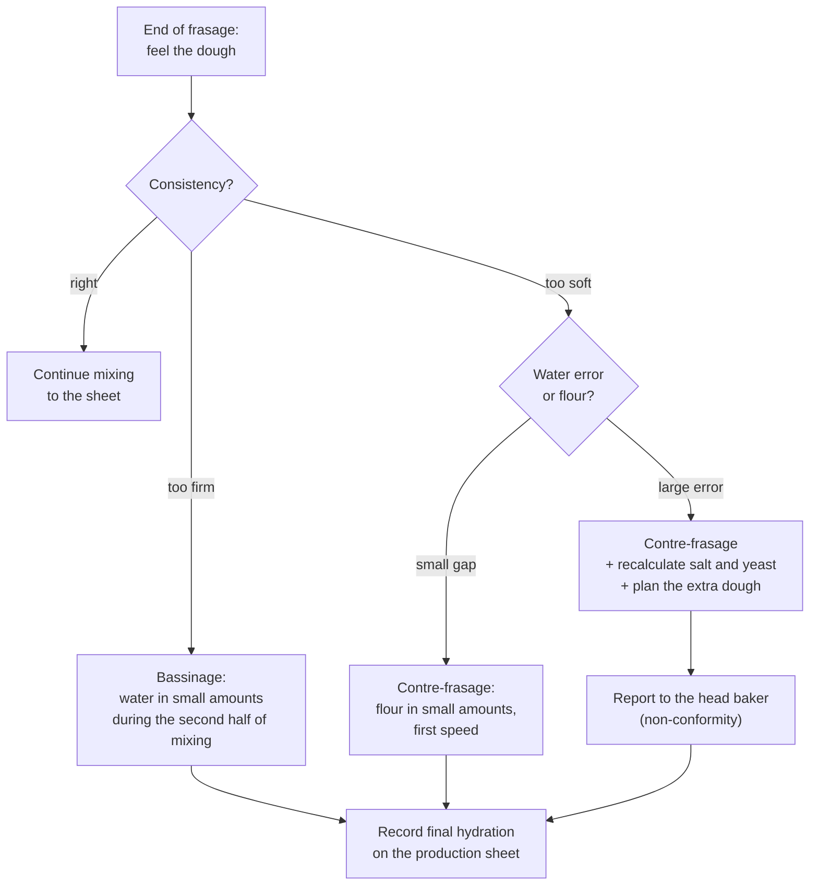

# 03.5 · Dough Strength: Elasticity, Extensibility and Correcting Consistency

A good dough is neither too strong nor too weak, neither too firm nor too soft, and a baker has to recognise which it is in a few seconds and correct it while it is still in the mixer. This lesson gives you the professional words for dough strength, the factors that move it, and the two corrections every boulanger uses daily: bassinage and contre-frasage. You finish by deliberately making one dough too firm and one too soft and correcting both.

## Why it matters

The référentiel asks you to explain the role of bassinage, the effect of consistency, and to propose corrections (S3.1); C4.4 asks you to report faults found during production. In a bakery, flour changes from one delivery to the next, a water meter can be wrong, a trainee can forget to hold back water: the dough on the sheet is never exactly the dough in the bowl. Lessons [02.2](../module-02/lesson-02.md) and [02.4](../module-02/lesson-04.md) told you to finish the water by feel with bassinage and contre-frasage; this lesson shows how, with the numbers.

## Key terms

| French | Say it | English meaning |
|---|---|---|
| force | *FORSS* | dough strength: resistance to deformation and ability to hold its shape |
| ténacité | *tay-na-see-TAY* | tenacity: resistance to being stretched |
| pâte forte / pâte faible | *paht FORT / paht FEB-luh* | strong dough (resists, springs back, may tear) / weak dough (stretches easily, spreads) |
| pâte qui relâche | *paht kee ruh-LAHSH* | dough that slackens and spreads after shaping |
| bassinage | *bah-see-NAHZH* | adding water at the end of mixing to soften a dough |
| contre-frasage | *KOHN-truh frah-ZAHZH* | adding flour to firm up a dough that is too soft |
| rabat | *rah-BAH* | fold during pointage: strengthens a weak dough |
| non-conformité | *nohn kohn-for-mee-TAY* | non-conformity: a result that does not match the sheet, to be reported |

## How it works

### Two axes: strength and consistency

Bakers judge two things that are easy to confuse:

- **Consistency** (*ferme*, *bâtarde*, *douce*) is mostly about **water**: how firm the dough feels under the hand (lesson [03.2](lesson-02.md)).
- **Strength** (*forte* or *faible*) is about the **gluten network**: how much the dough resists stretching and springs back (**elasticity, tenacity**) compared with how far it stretches without tearing (**extensibility**).

A dough can be firm and weak (low-protein flour, little water), or soft and strong (strong flour, high hydration, well mixed). The fix depends on which axis is wrong.

| Dough | What you feel | Typical consequences |
|---|---|---|
| Pâte trop ferme (too firm) | hard to the touch, tears when stretched | difficult shaping, small volume, tight crumb, thick crust |
| Pâte trop douce (too soft) | sticks, flows, does not hold a ball | sticks at the divider, loaves spread (*relâchent*), flat |
| Pâte forte (too strong) | springs back, shrinks after rolling, tears | shaping hard, scoring tears, loaves round and tight, "bursting" |
| Pâte faible (too weak) | stretches with no resistance, spreads | flat loaves, poor oven spring, ears do not open |
| Pâte croûtée | a dry skin on the surface | hard specks in the crumb, marks on the crust |

### What moves dough strength

| Makes the dough stronger (more elastic, tenacious) | Makes the dough weaker (more extensible, slacker) |
|---|---|
| strong flour (high W, high P/L) | weak flour (low W, low P/L) |
| less water (firmer) | more water (softer) |
| more mixing, up to the optimum | less mixing; over-mixing (letdown) |
| oxidation, ascorbic acid | autolyse (proteases); deactivated yeast |
| salt | no salt or too little |
| pre-ferments (pâte fermentée, levain): acidity | very young or very old, over-ripe pre-ferment |
| longer pointage, folds (rabats) | very short pointage |
| cold dough (handles firmer) | warm dough |
| | rest (détente): relaxes elasticity for shaping |

You correct strength mostly **before and after** mixing (flour choice, autolyse, folds, pointage, détente; [Module 4](../module-04/lesson-01.md) covers the fermentation side). You correct **consistency during mixing**, with bassinage or contre-frasage.

### Bassinage: softening a dough that is too firm

- **When:** the dough is too firm at the end of frasage, or the formula is designed with water held back (*eau de réserve*), common for high hydrations and new flours.
- **How:** add the water gradually, in a thin stream or in small amounts, while the mixer turns, usually during the second half of mixing (often in second speed on a spiral mixer, slower on an oblique-axis mixer); wait until each addition is absorbed before adding more. The dough first looks broken and slippery, then comes back together smooth.
- **How much:** usually a few percent of the flour weight. Beyond that, the mixing time grows and the dough cools (cold water) or warms (long mixing).
- **Effect:** softer, more extensible dough, smoother surface, a more open crumb. A long bassinage on a developed dough slackens it ("breaks the force").
- **Record it:** final hydration = (water in + bassinage) ÷ flour × 100.

### Contre-frasage: firming a dough that is too soft

- **When:** too much water went in (weighing or meter error, wrong formula) or the flour absorbs much less than expected.
- **How:** add flour gradually, early (end of frasage, first speed), in small amounts, until the consistency is right. Added late, flour does not hydrate evenly and leaves dry specks.
- **The catch:** contre-frasage changes the formula. More flour means the salt, yeast and pre-ferment percentages all fall and the dough weight rises. A small contre-frasage (1–2 % of the flour) can be ignored; a large one needs salt and yeast added in proportion, and the extra dough planned (more pieces, or less dough kept back).
- **Prevention beats correction:** holding back water and adding it by bassinage is safer than adding flour, because bassinage only changes the water.

### Deciding and reporting

A useful report (C4.4) states the facts, the correction, the consequence and the cause if known: "Batch 3 pain courant: water meter delivered 300 g too much. Contre-frasage with 469 g flour, salt and yeast corrected. Dough +785 g, 2 extra baguettes. Meter to be checked."

## Worked example

Sheet PC-02 (lesson [01.6](../module-01/lesson-06.md)) on 5,400 g of flour: water 64 % (3,456 g), salt 1.8 % (97 g), fresh yeast 1.5 % (81 g), pâte fermentée 15 % (810 g). Planned dough: 9,844 g.

**Case 1: dough too firm.** A new flour batch absorbs more water. At the end of frasage the dough is firm and tears.

1. Add water in small amounts during the second half of mixing until the dough is medium (bâtarde). You used 160 g.
2. Final hydration = (3,456 + 160) ÷ 5,400 × 100 = 3,616 ÷ 5,400 × 100 = 67.0 %.
3. Salt and yeast are unchanged (they are percentages of flour). Dough weight rises by 160 g, about half a baguette: no planning change.
4. Note on the sheet: "flour batch 4602: hydration 67 %." Tomorrow, start at 66 % and keep 1 % in reserve.

**Case 2: dough too soft.** The water meter delivered 3,756 g (300 g too much, 69.6 %).

1. Flour needed to return to 64 %: 3,756 ÷ 0.64 = 5,869 g. Flour to add: 5,869 − 5,400 = **469 g**, in small amounts during frasage.
2. Salt for 5,869 g at 1.8 %: 105.6 g. Already in: 97 g. Add **9 g**.
3. Yeast for 5,869 g at 1.5 %: 88 g. Already in: 81 g. Add **7 g**.
4. Pâte fermentée is now 810 ÷ 5,869 = 13.8 % instead of 15 %: acceptable, but the dough may need a few more minutes of pointage. Judge it by the dough.
5. New dough weight: 5,869 + 3,756 + 106 + 88 + 810 = 10,629 g, that is 785 g more than planned: two extra baguettes at 350 g, the rest kept as pâte fermentée for tomorrow.
6. Report it, with the numbers, as in the example above.

Typical slips to avoid: adding only 300 g of flour "because 300 g of water were too much" (that keeps the dough at 66.7 %, too soft); or calculating the extra salt on the dough weight instead of the flour weight.

## Practice

You make two small doughs that are deliberately wrong, correct them by hand, recalculate the formula, then bake both.

> [!WARNING]
> You will bake at 240 °C with steam: use oven gloves, steam into a preheated metal tray only, and stand back. Never pour water into a hot glass dish.

### You need

- Minimum: scale (1 g, and a 0.1 g pocket scale for the salt and yeast corrections), probe thermometer, two bowls, a small cup of water at dough temperature, a small bowl of the same flour (weighed: 80 g), teaspoon, scraper, two marked containers, ruler, baking tray, metal tray for steam, oven gloves, lame, calculator, [production sheet](../../templates/production-sheet.md), [non-conformity report](../../templates/non-conformity-report.md).
- Professional equivalent: a spiral mixer, with bassinage water poured in a thin stream while it turns, and flour for contre-frasage added in first speed.

### Ingredients

| Ingredient | Baker's % (target) | Dough A (too firm) | Dough B (too soft) |
|---|---|---|---|
| Flour T55 (or plain/all-purpose) | 100 | 300 g | 300 g + flour for contre-frasage |
| Water | 65 | 174 g to start (58 %) | 225 g (75 %) |
| Salt | 1.8 | 5.4 g | 5.4 g + correction |
| Fresh yeast (or instant dry, one-third) | 1.5 | 4.5 g | 4.5 g + correction |

Weigh a cup with 40 g of water for dough A's bassinage and the bowl with 80 g of flour for dough B, so you can find what you used by weighing what is left.

### Steps

1. Calculate a water temperature for a 24 °C dough ([01.7](../module-01/lesson-07.md) estimate) and use it for both doughs and the bassinage cup.
2. **Dough A.** Mix flour, 174 g water, yeast and salt for 4 minutes (frasage). Feel it: firm, tearing. Knead 3 minutes.
3. **Bassinage:** flatten the dough, add a teaspoon of water (about 5 g), fold it in and squeeze until absorbed (the dough looks broken, then comes back). Repeat until the dough is medium and smooth, then knead to the windowpane. Weigh the cup: water used = 40 − what is left.
4. **Dough B.** Mix flour, 225 g water, yeast and salt for 2 minutes. Feel it: sloppy, sticking.
5. **Contre-frasage:** sprinkle a tablespoon of flour (about 10 g), mix it in fully, repeat until the dough is medium. Do it now, before kneading. Weigh the bowl: flour used = 80 − what is left.
6. **Recalculate dough B** on the production sheet: total flour, hydration, the salt and yeast needed at 1.8 % and 1.5 % of the new flour, and what you must add. Add the missing salt and yeast, then knead to the windowpane.
7. **Stretch test** on both: pull a strip of each slowly. Note how far it goes before tearing and whether it springs back.
8. Record both dough temperatures. Pointage 1 hour with one fold at 30 minutes. Divide each into two pieces, shape into bâtards of about 20 cm, proof until the finger test is right, score and bake at 240 °C with steam for 22–25 minutes.
9. Fill in a [non-conformity report](../../templates/non-conformity-report.md) for dough B as if the 225 g of water had been a meter error at work.

Answers: example calculation for dough B

If you added 46 g of flour: total flour 346 g; hydration 225 ÷ 346 × 100 = 65.0 %. Salt needed 346 × 1.8 % = 6.2 g, already 5.4 g, add 0.8 g. Yeast needed 346 × 1.5 % = 5.2 g, already 4.5 g, add 0.7 g. Dough weight about 225 + 346 + 6.2 + 5.2 = 582 g instead of 505 g.

Exact flour to return to 65 %: 225 ÷ 0.65 = 346 g, so 46 g to add. Dough A: if you added 21 g of water, hydration = (174 + 21) ÷ 300 × 100 = 65 %.

### Targets

- Both doughs corrected to a medium (bâtarde) consistency before full kneading.
- Water and flour added weighed to the gram; final hydrations calculated to 0.1 %.
- Dough temperatures 23–25 °C.
- Salt and yeast corrections for dough B within 0.1 g of your calculation.

### How you know it worked

Both doughs end up at a similar consistency and both reach the windowpane. Your calculated final hydrations are close to 65 % (often 64–67 %: your flour decides). Dough B weighs noticeably more than dough A. If dough B shows dry flour specks or a tighter crumb, the flour went in too late: next time, correct during frasage.

### Self-check

- [ ] I can tell a consistency problem (water) from a strength problem (gluten).
- [ ] I corrected dough A by bassinage and dough B by contre-frasage, and recorded the amounts.
- [ ] I recalculated hydration, salt and yeast after the contre-frasage.
- [ ] I wrote a non-conformity report with facts, correction, consequence and cause.

## What goes wrong

| Symptom | Likely cause | Fix now | Prevent next time |
|---|---|---|---|
| Dough slippery and broken after bassinage | Water added too fast or too much at once | Keep mixing slowly until it comes together; add the rest in smaller amounts | Small additions, wait for each to be absorbed |
| Dry specks or flour streaks in the crumb | Contre-frasage too late, after development | Mix a little longer in first speed | Correct at the end of frasage |
| Corrected dough under-salted, bland, over-active | Flour added without correcting salt and yeast | Add the missing salt as early as possible | Recalculate on the new flour weight every time |
| Dough springs back, shrinks, tears at scoring | Too strong: strong flour, firm, cold or not rested | Longer détente; less tension at shaping | Autolyse; slightly more water; check the flour |
| Dough spreads after shaping | Too weak or too soft | Fold during pointage; tighter shaping; less proof | Less water; more mixing up to the optimum; stronger flour |
| Fault repeated on several days with no record | Corrections made but not reported | Report it now | Write every correction on the sheet; tell the head baker |

## Review

- Consistency (firm, medium, soft) is about water; strength (strong, weak) is about the gluten network. Diagnose the right axis before correcting.
- Bassinage softens: small amounts of water during the second half of mixing. Contre-frasage firms: small amounts of flour, early, in first speed.
- After contre-frasage, recalculate: new flour = water ÷ hydration; salt and yeast on the new flour; plan the extra dough.
- Holding water back and using bassinage is safer than correcting with flour.
- Report every significant correction (C4.4). Exam-relevant (S3.1, C4.4): see [the CAP exam reference](../../references/cap-exam.md).
