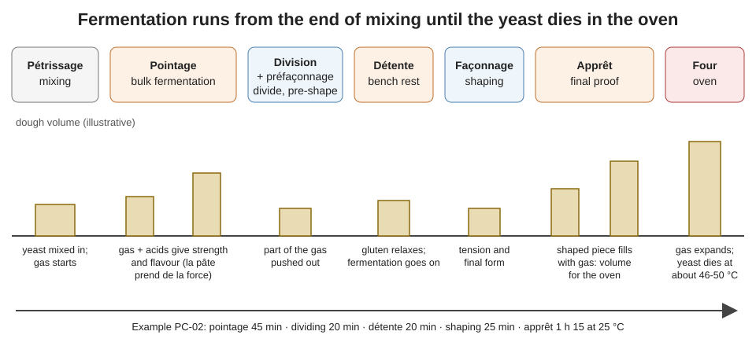

# 04.1 · What Fermentation Does

Fermentation is everything the yeast and bacteria do to the dough between the end of mixing and the first minutes in the oven. This lesson explains what they make, why a baker needs each product, and where fermentation happens in the bread-making sequence, and it ends with a balloon test that lets you watch yeast produce gas at home.

## Why it matters

Mixing gives the dough its structure; fermentation gives it life. A dough mixed perfectly but fermented badly still makes a poor loaf: flat or tight, pale or too dark, bland or sour. Fermentation is also the stage a beginner controls least, because it does not stop when you look away. Understanding what is happening inside the dough is the first step to judging it, and judging it is a core skill of the practical exam. The référentiel asks you to define the role of bread fermentation, identify its stages and explain how temperature, time and the fermenting agent interact (S3.3), and to characterise alcoholic and lactic fermentation (S4.2).

> [!NOTE]
> This is the first lesson of a practical module, so a reminder that applies to all of them: watching someone bake does not make you able to bake. Do the practice at home. The Academy cannot grade photos, so you compare your result with the targets and the rubric yourself, and that self-assessment does not replace the official practical exam.

## Key terms

| French | Say it | English meaning |
|---|---|---|
| fermentation panaire | *fair-mahn-tah-SYOHN pah-NAIR* | bread fermentation: the whole process from mixing to oven |
| fermentation alcoolique | *fair-mahn-tah-SYOHN al-ko-LEEK* | alcoholic fermentation by yeast: sugar → CO₂ + ethanol |
| fermentation lactique | *fair-mahn-tah-SYOHN lak-TEEK* | lactic fermentation by bacteria: sugar → lactic (and acetic) acid |
| gaz carbonique | *gahz kar-bo-NEEK* | carbon dioxide (CO₂), the gas that raises the dough |
| pointage | *pwan-TAHZH* | bulk fermentation: the first rise of the whole dough |
| détente | *day-TAHNT* | bench rest after dividing and pre-shaping |
| apprêt | *ah-PRAY* | final proof of the shaped pieces |
| agent de fermentation | *ah-ZHAHN duh fair-mahn-tah-SYOHN* | fermenting agent: baker's yeast, levain or a pre-ferment |
| maturation | *mah-tew-rah-SYOHN* | maturing: the slow change in dough strength and flavour during fermentation |

## How it works

### The two fermentations in a dough

Baker's yeast (lesson [02.6](../module-02/lesson-06.md)) uses a little oxygen in the first minutes, then, once the oxygen trapped at mixing is gone, it ferments:

$$\text{C}_6\text{H}_{12}\text{O}_6 \rightarrow 2\,\text{C}_2\text{H}_5\text{OH} + 2\,\text{CO}_2$$

By mass: **180 g of glucose → 92 g of ethanol + 88 g of carbon dioxide**, plus heat and small amounts of aroma compounds (esters, higher alcohols). This is alcoholic fermentation.

At the same time, lactic acid bacteria, which come in with the flour and in much larger numbers with a levain or pre-ferment (lesson [02.7](../module-02/lesson-07.md)), ferment sugars into **lactic acid** and, for some species, **acetic acid** and a little CO₂. This is lactic fermentation. In a short direct dough it is small; in a levain bread it is large.

| | Alcoholic fermentation | Lactic fermentation |
|---|---|---|
| Agent | yeasts (baker's yeast, wild yeasts) | lactic acid bacteria |
| Starting material | simple sugars: glucose, fructose, maltose (via the yeast's enzymes) | the same sugars |
| Main products | CO₂, ethanol, aromas | lactic acid, acetic acid (some species), a little CO₂ |
| What the baker gets | volume, light crumb, part of the flavour | acidity, flavour, longer keeping, a stronger then (if excessive) weaker gluten |

### Where the sugar comes from

Flour contains only about 1-2 % simple sugars. Over a fermentation of several hours, the yeast lives mostly on **maltose**, cut from damaged starch by the flour's amylases (lesson [02.3](../module-02/lesson-03.md)). Whatever sugar is still left when the dough enters the oven feeds the **Maillard reaction and caramelisation** that colour the crust. That is why an over-fermented dough bakes pale: the yeast has eaten the sugars the crust needed.

### The four roles of fermentation

1. **Gas and volume.** CO₂ first dissolves in the dough water, then, once the water is saturated, diffuses into the tiny air bubbles trapped at mixing. Those bubbles grow and the gluten films stretch around them ([lesson 03.1](../module-03/lesson-01.md) explains the network). Yeast creates no new bubbles: it only fills the ones mixing made.
2. **Maturing the dough.** The stretching of the films by the gas, and the acids, change the gluten: the dough gains strength and tenacity during pointage (*la pâte prend de la force*). Too little fermentation leaves a dough slack and sticky; too much leaves it tough, then, if it goes on, weak and torn.
3. **Flavour.** Ethanol, organic acids and esters make the taste and smell of bread. Most flavour molecules form slowly and better at moderate temperatures: yeast makes gas fastest in the mid-30s °C, but flavour suffers, which is why bakers ferment around 22-27 °C and sometimes much colder (lesson 04.6).
4. **Crust colour and keeping.** Residual sugars colour the crust; acids slow staling and mould.

### The stages

| Stage | What fermentation does there | Lesson |
|---|---|---|
| Pointage (bulk) | builds strength and flavour in the whole mass | 04.2 |
| Division and détente | fermentation continues while the pieces relax | 04.3 |
| Apprêt (final proof) | fills the shaped piece with gas to the right volume for the oven | 04.4 |
| First minutes in the oven | gas expands with heat, CO₂ comes out of solution, ethanol evaporates: the loaf rises (oven spring) until the yeast dies at about 46-50 °C in the dough | [Module 7](../module-07/lesson-05.md) |

Fermentation therefore does not stop when you shape the bread: the clock runs from the end of mixing until the oven. The three factors the référentiel asks you to link are **temperature** (warmer = faster), **time** (longer = more gas, more acid, more flavour) and **the fermenting agent** (how much yeast, which pre-ferment, levain or not). Change one and the other two must move: less yeast needs more time or more warmth.

## Worked example

A baker asks: "How much sugar does the yeast actually use to raise one baguette?" Use the PC-02 baguette pâton from lesson [01.6](../module-01/lesson-06.md): 350 g of dough.

1. **Flour in the pâton.** PC-02 totals 182.3 %. Flour = 350 × 100 ÷ 182.3 ≈ 192 g (ignoring the flour inside the pâte fermentée).
2. **Volume before fermentation.** Freshly mixed lean dough weighs roughly 1.2 g per cm³: 350 ÷ 1.2 ≈ 290 cm³.
3. **Volume at the end of apprêt.** A proofed baguette is about three times that: about 870 cm³. Gas held ≈ 870 − 290 = 580 cm³ = 0.58 L.
4. **Mass of that CO₂.** At about 24 °C and normal pressure, 1 L of CO₂ weighs about 1.8 g: 0.58 × 1.8 ≈ 1.05 g of CO₂.
5. **Sugar needed.** 88 g of CO₂ come from 180 g of glucose: 1.05 × 180 ÷ 88 ≈ 2.1 g of sugar, giving about 1.1 g of ethanol at the same time.
6. **Compare with the flour.** 2.1 ÷ 192 ≈ 1.1 % of the flour weight.

These are orders of magnitude, not lab values: the dough also loses gas at dividing and shaping, and a good part of the CO₂ stays dissolved or escapes, so the real consumption is higher. The conclusion holds: the gas you see needs about as much sugar as the flour holds naturally, so the yeast depends on maltose from starch for anything longer than a short fermentation, and a fermentation that runs far too long leaves nothing for the crust.

## Practice

### You need

- Minimum: four identical clean 500 mL plastic bottles, four balloons (stretch them a few times first), a funnel, a soft tape measure or a piece of string and a ruler, a scale (0.1 g ideal), a thermometer, a jug, a marker, a timer, a fridge.
- Professional equivalent: a fermentometer or a graduated test tube of dough in the proofing cabinet.

### Ingredients

| Bottle | Water | Sugar | Fresh yeast (or instant) | Extra | Where it stays |
|---|---|---|---|---|---|
| A — reference | 100 g at 30 °C | 10 g | 6 g (2 g) | — | room, about 22-26 °C |
| B — salt | 100 g at 30 °C | 10 g | 6 g (2 g) | 4 g salt | room, beside A |
| C — cold | 100 g at 8 °C | 10 g | 6 g (2 g) | — | fridge |
| D — hot | 100 g at 60 °C | 10 g | 6 g (2 g) | — | room, beside A |

The salt in B is a deliberately high dose (4 % of the water) so the effect shows in 90 minutes.

> [!CAUTION]
> Water at 60 °C can scald. Mix kettle water with cold water in a jug, check it with the thermometer, and pour with the funnel into a bottle standing in the sink.

### Steps

1. Label the bottles A-D. Prepare each water at its temperature and check it.
2. Through the funnel, put the sugar (and the salt for B) into each bottle, then the water, then the crumbled yeast. Close with your thumb and shake for 10 seconds.
3. Stretch a balloon over each neck. Write the start time. Put C in the fridge, the others side by side.
4. Every 15 minutes for 90 minutes, measure the circumference of each balloon at its widest point (C: take it out, measure, put it back at once). Note the room temperature.
5. At the end, gently squeeze each balloon near your nose and release: smell the gas (a sharp, slightly alcoholic smell in A).
6. Draw one line per bottle on a graph: time across, circumference up.

### Targets

- Water temperatures within ±2 °C of the table; yeast weighed to 0.1 g if possible.
- Seven readings per bottle (0 to 90 min), at 15 min ± 2 min intervals.

### How you know it worked

Bottle A inflates clearly within 30-45 minutes and keeps growing. B rises noticeably more slowly: salt holds water away from the yeast. C barely moves while cold: the yeast is alive but almost inactive. D stays flat: yeast is killed at that temperature. If A does not inflate, your yeast is old or the bottle leaks; repeat with fresh yeast (lesson 02.6). Exact sizes depend on your yeast and room; the order A > B > C, D is what matters.

### Self-check

- [ ] I can write the alcoholic fermentation equation and give the mass of CO₂ from 180 g of glucose.
- [ ] My graph shows four lines and I can explain the order with temperature and salt.
- [ ] I can name the four roles of fermentation and say which one makes the crust colour.
- [ ] I can place pointage, détente and apprêt in the order of production.

## What goes wrong

| Symptom | Likely cause | Fix now | Prevent next time |
|---|---|---|---|
| Dough hardly rises at all | Yeast dead (hot water), forgotten, or very old | If it can still be mixed, add fresh yeast dissolved in a little water and remix; report it | Check the yeast and the water temperature at weighing; tick each ingredient |
| Bread rises well but tastes flat and "yeasty" | Fast, warm fermentation with much yeast: gas but little flavour | — | Less yeast and more time, or a pre-ferment (lesson 04.5) |
| Pale crust even after a full bake | Over-fermented: residual sugars used up | Bake a little longer and hotter for colour | Shorten fermentation or cool the dough |
| Very dark, reddish crust and dense crumb | Under-fermented: much sugar left, little gas | — | Give pointage and apprêt their full time |
| Sour, alcoholic smell from the dough tub | Fermentation too long or too warm | Divide at once and shorten the apprêt | Control dough temperature and timing |

## Review

- Bread fermentation is alcoholic (yeast: sugar → CO₂ + ethanol + aromas) plus some lactic (bacteria: sugar → lactic and acetic acids).
- 180 g of glucose → 88 g CO₂ + 92 g ethanol; the yeast lives mostly on maltose cut from starch.
- Fermentation gives volume, a matured dough, flavour, and leaves sugars for crust colour.
- It runs from the end of mixing to the oven: pointage, détente and apprêt are its stages; temperature, time and fermenting agent are linked.
- Exam-relevant (S3.3, S4.2): see [the CAP exam reference](../../references/cap-exam.md).
