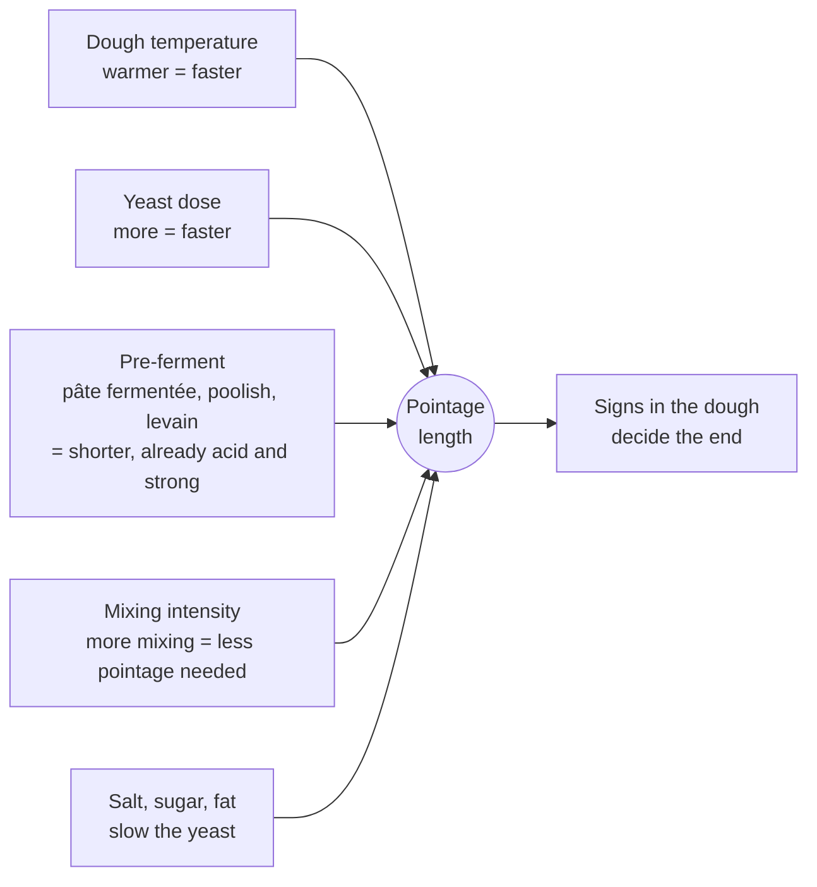

# 04.2 · Pointage: Bulk Fermentation

Pointage is the first fermentation, when the whole dough rests in one mass between mixing and dividing. It is where the dough builds most of its strength and much of its flavour. This lesson explains what happens during pointage, what sets its length and how to adjust it, and you track a bulk fermentation in two marked containers at two temperatures.

## Why it matters

Pointage is the stage where an hour's difference changes the whole batch. Too short, and the dough is slack, sticky, bland, hard to shape and bakes into a tight, dark loaf. Too long, and it is tough, then sour and weak, and the bread is flat and pale. Production sheets give a time, but the time assumes the dough is at its target temperature. When it is not, the professional adjusts and then confirms by the dough itself. This decision comes up every day in a bakery and in the practical exam.

## Key terms

| French | Say it | English meaning |
|---|---|---|
| pointage (en masse) | *pwan-TAHZH (ahn MASS)* | bulk fermentation of the whole dough |
| bac à pâte | *bak ah PAHT* | dough tub for pointage |
| rabat | *rah-BAH* | fold: stretching the dough and folding it over itself during pointage |
| prise de force | *preez duh FORSS* | the dough gaining strength (tenacity) during pointage |
| pâte jeune / pâte vieille | *paht ZHUHN / paht vee-YAY* | young (under-fermented) dough / old (over-fermented) dough |
| pétrissage amélioré / intensifié | *pay-tree-SAHZH ah-may-lyo-RAY / an-tahn-see-FYAY* | improved / intensive mixing (more mixing, shorter pointage) |
| TPV (température de pâte visée) | *tay-pay-VAY* | target dough temperature |

## How it works

### What pointage does

During pointage the yeast fills the bubbles made at mixing, and three things change at once:

- **Strength.** The growing gas stretches the gluten films slowly, and the acids formed tighten the network. The dough becomes less sticky, more elastic and holds its shape better: *la pâte prend de la force*. A fold (rabat) adds strength mechanically and evens out temperature and gas.
- **Flavour.** Most of the organic acids and aromas of a direct bread form during pointage, because it is the longest stage in one warm mass.
- **Gas reserve.** The bubbles that will be divided, shaped and refilled during apprêt are set up now. Each piece keeps a share of them.

Pointage time and mixing are linked: the more the dough is mixed (more oxidation and strength from the machine), the less pointage it needs to gain strength, but the less flavour it builds. Typical ranges in French practice, at about 24 °C:

| Mixing method | Typical pointage | Result |
|---|---|---|
| Intensive mixing (pétrissage intensifié) | 15-30 min | high volume, white crumb, little flavour |
| Improved mixing (pétrissage amélioré), e.g. PC-02 | 45 min-1 h 15 | the usual pain courant balance |
| Slow mixing (pétrissage lent), e.g. tradition | 1 h 30-3 h with folds, or retarded overnight | creamy crumb, more flavour, needs folds for strength |

Mixing methods are taught in [lesson 03.3](../module-03/lesson-03.md); this lesson takes the dough as it leaves the mixer.

### What sets the length

**Temperature is the strongest lever.** In the usual range (about 18-30 °C), yeast activity roughly doubles for every 10 °C, so each degree changes the speed by roughly 7 %. Treat this as a rule of thumb for planning, not a law: your dough has the final say. That is why the dough temperature is measured at the end of every mix and written down, and why a sheet that says "pointage 45 min" also says "TPV 24 °C". How to hit the target temperature is [Module 5](../module-05/lesson-02.md).

### Signs that pointage is complete

- Volume clearly increased: for a pain courant pointage of about 45 min, often about 1.3-1.5 times; for a long pointage with folds, about 1.5-2 times. Read it in a straight-sided marked container, not by eye in a bowl.
- Surface domed and smooth, with some bubbles at the sides of the tub.
- The dough feels lighter, airy, slightly elastic; it comes away from the tub cleanly.
- A floured finger pressed in leaves a dent that fills back slowly.
- Smell: fresh, slightly acidic and alcoholic, never sharp or vinegary.

## Worked example

You mix the PC-02 batch from lesson [01.6](../module-01/lesson-06.md) (5,400 g flour, 15 % pâte fermentée). The sheet says: pointage 45 min at 24 °C. The spiral mixer was warm after the previous batch and the dough comes out at **26 °C**. Next day, in a cold fournil, it comes out at **21 °C**.

1. **26 °C: 2 °C above target.** Speed ≈ 1.07 × 1.07 ≈ 1.14 times faster. Time ≈ 45 ÷ 1.14 ≈ 39 min. Plan to check at 35 min.
2. The faster dough also runs fast in détente and apprêt: put the tub somewhere cooler (about 22-23 °C) if you can, and warn the oven: the batch will be ready earlier.
3. **21 °C: 3 °C below target.** Speed ≈ 1 ÷ (1.07 × 1.07 × 1.07) ≈ 0.82. Time ≈ 45 ÷ 0.82 ≈ 55 min. Put the tub somewhere warm (25-26 °C) to help it.
4. In both cases, the decision to divide is taken on the signs: volume, dome, feel, finger dent. The calculated time only tells you when to start looking.
5. Write the actual dough temperature, the actual pointage time and what you did on the production sheet. Correct the water temperature for the next batch ([Module 5](../module-05/lesson-02.md) shows the calculation).

## Practice

You make the hand-mixed PD-01 dough from lesson [01.7](../module-01/lesson-07.md) and split it into two containers to see what temperature does to pointage.
> [!WARNING]
> If you use your oven with only the light on as a warm place, put a note on the door so nobody switches it on with plastic containers inside, and check its temperature with your thermometer before putting the dough in. When you bake the rolls at the end, use dry oven gloves, and make steam only in a preheated metal tray, never a glass dish; pour and step back.

### You need

- Minimum: scale (1 g; 0.1 g for yeast and salt), probe thermometer, large bowl, scraper, two identical straight-sided clear containers of about 1 L with lids, marker or tape, a ruler, timer, a warm place at 26-27 °C (oven with light on, or a box with a jug of warm water) and a cool place at 19-21 °C.
- Professional equivalent: a dough tub in a fermentation room or a temperature-controlled cabinet.

### Ingredients

| Ingredient | Baker's % | Weight |
|---|---|---|
| Flour T55 (or plain flour, 10-12 % protein) | 100 | 500 g |
| Water at the estimated temperature for a 24 °C dough | 65 | 325 g |
| Fine salt | 1.8 | 9 g |
| Fresh yeast (or instant at one-third) | 1.5 | 7.5 g (2.5 g) |
| **Total** | **168.3** | **841.5 g** |

Professional batch: PC-02, 5,400 g flour, 9,844 g of dough in one tub.

### Steps

1. Measure flour and room temperatures; calculate the water temperature with the estimate from lesson [01.7](../module-01/lesson-07.md) (target 24 °C).
2. Mix and knead by hand as in lesson [01.7](../module-01/lesson-07.md) (frasage 4 min, kneading 10 min). Measure and record the dough temperature.
3. Divide the dough into two equal halves (about 420 g each). Shape each loosely into a ball and put one in each lightly oiled container, smooth side up, pressed flat to the bottom.
4. Mark the starting level of each container with tape; write the time. Put container W in the warm place and container C in the cool place.
5. Every 15 minutes, measure the height of each dough with the ruler (from the bottom of the container to the top of the dome) and note the temperature of each place.
6. At 40 minutes, fold each dough once (four folds with a wet hand), press it level again and re-measure the height as your new reference.
7. Decide for each container, using the signs in this lesson, when pointage is complete. Note the time. At the end, measure the temperature in the centre of each dough.
8. Compare: how much earlier was W ready? Compare the feel: tension, stickiness, bubbles, smell.
9. Use the dough: divide each half into four rolls of about 105 g and bake them as in lesson [01.7](../module-01/lesson-07.md), or bake each half as a small boule.

### Targets

- Dough temperature after kneading 23-25 °C, recorded.
- A height reading every 15 min ± 2 min for both containers, plus the temperature of each place.
- Pointage judged complete at about 1.5-2 times the volume (heights adjusted for the fold), with the time written down.

### How you know it worked

Container W reaches the same rise noticeably sooner than container C, often 20-40 minutes sooner over this range of temperatures. The warm dough feels more airy and smells a little more alcoholic; the cool dough at the same time is denser and more sticky. Your two curves of height against time show the difference clearly, and your decision times match the signs, not just the clock.

### Self-check

- [ ] I measured and recorded the dough temperature after kneading.
- [ ] I have two height curves with temperatures noted.
- [ ] I decided the end of pointage on the signs and can list the ones I used.
- [ ] I can recalculate a pointage time for a dough 2 °C too warm or too cold and say why I still check the dough.

## What goes wrong

| Symptom | Likely cause | Fix now | Prevent next time |
|---|---|---|---|
| Dough slack and sticky at dividing, little rise | Pointage too short or dough too cold (pâte jeune) | Give more time somewhere warmer; add a fold | Measure dough temperature; start checking at the adjusted time |
| Dough tough, tears when pre-shaped | Too much strength: long pointage with folds on a strong flour, or over-mixed | Divide and give a longer détente | Fewer folds or shorter pointage with strong flour |
| Sour, alcoholic smell, dough collapsing, big bubbles at the surface | Pointage too long or too warm (pâte vieille) | Divide at once, pre-shape firmly, shorten the apprêt | Lower the dough temperature or the yeast; set a timer for the first check |
| Dough rose fast but crust pale and flavour flat | Dough too warm: gas without flavour | Shorten apprêt | Hit the TPV; cooler fermentation |
| Dried skin on the dough in the tub | Tub uncovered | Brush off or fold it in; cover | Always cover the tub; oil it lightly |

## Review

- Pointage builds strength (prise de force), flavour and the gas reserve in the whole mass.
- Its length depends on dough temperature, yeast, pre-ferment, mixing intensity and the recipe's salt and sugar.
- Rule of thumb: about 7 % faster per °C warmer; use it to plan, then decide by the dough.
- Signs of a finished pointage: clear rise in a marked tub, domed surface, airy feel, slow-filling finger dent, clean smell.
- Exam-relevant (S3.3): see [the CAP exam reference](../../references/cap-exam.md).
