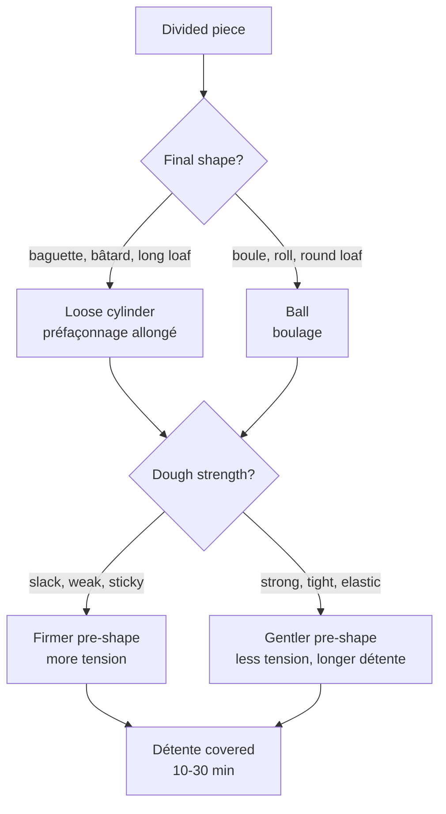

# 04.3 · Dividing, Pre-shaping and Détente

Between pointage and shaping, the dough is cut into pieces of the right weight, given a first loose shape and left to relax. These three short steps decide whether your loaves are all the same weight and whether shaping goes smoothly or fights you. This lesson explains each step and its timing, and you divide, pre-shape and measure the détente of eight pieces at home.

## Why it matters

A baguette sold at a stated weight must weigh it; twenty-four pieces that range from 330 to 370 g bake unevenly, sell unevenly and cost money. Dividing is also a race: fermentation does not pause while you cut, so the first piece and the last piece must not end up at different stages. And a piece shaped too soon after pre-shaping tears and shrinks back, while one left too long spreads and loses its gas. The référentiel lists the détente, its role and its length, among the stages of fermentation (S3.3), and dividing to shaping among the stages of bread-making (S3.1).

## Key terms

| French | Say it | English meaning |
|---|---|---|
| division | *dee-vee-ZYOHN* | dividing the dough into pieces |
| pâton | *pah-TOHN* | a piece of dough, divided or shaped |
| coupe-pâte | *koop-PAHT* | dough cutter (bench scraper) |
| diviseuse (hydraulique) | *dee-vee-ZUHZ (ee-droh-LEEK)* | (hydraulic) divider: cuts one load into 10-20 equal pieces by volume |
| préfaçonnage / boulage | *pray-fah-so-NAHZH / boo-LAHZH* | pre-shaping / rounding into a ball |
| détente | *day-TAHNT* | bench rest that lets the gluten relax before shaping |
| croûtage | *kroo-TAHZH* | skin forming on uncovered dough |
| tolérance de poids | *to-lay-RAHNSS duh PWAH* | allowed weight difference for a piece |

## How it works

### Dividing

- **By weight, always.** Pieces are weighed on a scale, or cut by a divider whose setting is checked on the scale.
- **As few cuts as possible.** Aim for one clean cut and at most one small add-on per piece, placed inside when you pre-shape. Each extra scrap is a weak spot that shows in the crumb and tears in shaping.
- **Cut, do not tear.** Use the coupe-pâte in one firm stroke; tearing stretches the gluten and squeezes out gas unevenly.
- **Quickly, and in order.** Fermentation goes on during dividing. The first pieces divided are the first pre-shaped and the first shaped, so the whole batch stays at the same stage. A professional divides 40-50 pieces by hand in about 15-20 minutes.
- **Little flour.** Just enough on the bench to stop sticking; flour trapped in the dough makes streaks and holes.

A **hydraulic divider** presses one load of dough into a round tub and cuts it into 10 or 20 equal pieces **by volume**. Equal volume means equal weight only if the dough's density is the same everywhere, so a dough with large gas pockets gives uneven pieces. Check a few pieces from each load on the scale.

### Pre-shaping

The pre-shape gives each piece an even, smooth form to start from and some tension, and it lets you feel the dough's strength.

Overworking at this stage degasses the dough and makes it tighter, so later shaping is harder and the crumb denser.

### Détente

During the détente, the gluten stressed by dividing and pre-shaping **relaxes**: its elasticity drops and its extensibility returns, so the piece can be lengthened without tearing or springing back. At the same time **fermentation continues**: the pieces swell a little and their time counts in the total fermentation.

- **Length:** usually 10-30 minutes; about 15-20 minutes for baguettes from a pain courant dough. Longer for a strong or cold dough or a tight pre-shape; shorter for a slack, warm dough or a loose pre-shape.
- **Covered:** under a cloth, plastic sheet or in a cabinet, so no skin forms (croûtage). A dried skin cracks at shaping and does not stretch in the oven.
- **Ready when** the piece has softened, slightly swollen, and a gentle stretch lengthens it without it pulling back hard.
- **Too long** and the piece spreads, gains too much gas and loses its form; shaping then has to degas it more.

## Worked example

You divide the PC-02 batch from lesson [01.6](../module-01/lesson-06.md): 9,844 g of dough for 24 baguettes of 350 g (tolerance ±5 g) and 20 rolls of 60 g (±2 g). The bakery has a 20-part hydraulic divider.

1. **Plan the cuts.** Baguettes: 24 × 350 = 8,400 g. One divider load of 20 × 350 = 7,000 g; the other 4 baguettes (1,400 g) and the 20 rolls (1,200 g) by hand.
2. **What is left.** 9,844 − 7,000 − 1,400 − 1,200 = 244 g. This is the margin built into the batch for losses; any clean, well-fermented surplus can be kept in the cold as tomorrow's pâte fermentée if the bakery's sheet allows it.
3. **Check the divider.** You weigh five pieces from the load: 352, 347, 349, 355, 344 g. Average = 1,747 ÷ 5 = 349.4 g: the setting is right. But 355 g and 344 g are outside 345-355 g.
4. **Correct the pieces.** Take 5 g from the 355 g piece and add it inside the 344 g piece when pre-shaping (or weigh all 20 and adjust the ones outside the tolerance).
5. **Find the cause.** The spread comes from uneven gas in the load: the dough was pressed in without being gently flattened first. Next load, flatten the dough evenly in the tub before pressing.
6. **Order.** Pre-shape the 20 divider pieces into loose cylinders first, then the hand-cut baguettes, then the rolls into balls. Shape in the same order after 20 minutes of détente.
7. Write the weights checked and the correction on the production sheet.

## Practice

> [!WARNING]
> At the end you bake at 230 °C with steam. Use dry oven gloves; pour water only into a preheated metal tray, never a glass dish, and step back from the steam. Score with the blade moving away from your fingers and put the lame's cover back on straight after.

### You need

- Minimum: scale (1 g), dough scraper (coupe-pâte), a clean worktop, a little flour, a cloth or plastic sheet to cover, a ruler, a timer, baking paper and trays, a metal tray for steam, oven gloves, the [bake log](../../templates/bake-log.md).
- Professional equivalent: bench, coupe-pâte and scale, or a hydraulic divider; détente on boards in a rack or in a détente cabinet.

### Ingredients

PD-01 dough (lesson [01.7](../module-01/lesson-07.md)), made and fermented as in lesson [04.2](lesson-02.md):

| Ingredient | Baker's % | Weight |
|---|---|---|
| Flour T55 (or plain flour) | 100 | 500 g |
| Water | 65 | 325 g |
| Fine salt | 1.8 | 9 g |
| Fresh yeast (or instant at one-third) | 1.5 | 7.5 g (2.5 g) |
| **Total** | **168.3** | **841.5 g** → 8 pieces of 105 g |

### Steps

1. Mix, knead and give the dough its pointage (1 h 15 at about 24 °C, one fold at 40 min). Record the dough temperature.
2. Turn the dough out onto a very lightly floured worktop, smooth side down. Start the timer.
3. Cut 8 pieces of **105 g**: cut a strip, then pieces from the strip, each with one clean cut. Weigh each; correct with at most one small add-on. Write each weight. Stop the timer: that is your dividing time.
4. Pre-shape in the order you cut: pieces 1-4 into loose balls, pieces 5-8 into loose cylinders about 10 cm long. Place them in order on the worktop, seam down, and cover.
5. **Détente test.** Immediately, take piece 5 and roll it into a sausage with exactly 6 back-and-forth strokes of both hands, light even pressure. Measure its length at once and again 1 minute later (how much it shrank back).
6. After 15 minutes, do the same with piece 6; after 30 minutes, piece 7. Note how each feels (tight, tearing, easy, slack).
7. Switch the oven on at 230 °C with a tray in the middle and the metal steam tray at the bottom.
8. Shape pieces 1-4 into round rolls and pieces 5-8 (the test pieces too) into small baguettes of about 20 cm. Apprêt about 40 minutes covered, until the poke test says ready (lesson 04.4).
9. Score the small baguettes once along their length, load with steam and bake 15-18 minutes. Cool on a rack.

### Targets

- 8 pieces of 105 g ±2 g, each with at most one add-on.
- Dividing time for 8 pieces: 8 minutes or less (a professional pace is about 20 seconds per piece).
- Three détente readings: length straight after rolling and 1 minute later, at 0, 15 and 30 minutes.

### How you know it worked

Your weights all sit within 103-107 g. The piece rolled straight after pre-shaping is short and shrinks back noticeably; the one rolled after 15 minutes lengthens much further with the same 6 strokes and barely shrinks; the 30-minute piece lengthens easily but starts to feel soft and gassy. The baked rolls and small baguettes are similar in size to each other.

### Self-check

- [ ] All eight weights are recorded and within ±2 g.
- [ ] I timed my dividing and know my pace.
- [ ] I can explain from my three test pieces why shaping waits for the détente.
- [ ] I can choose between a ball and a cylinder pre-shape, and loose or firm, for a given dough.
- [ ] I kept the pieces covered and in order.

## What goes wrong

| Symptom | Likely cause | Fix now | Prevent next time |
|---|---|---|---|
| Pieces from 95 to 115 g | Cut by eye, or many small add-ons | Re-weigh and correct before pre-shaping | Weigh every piece; cut strips of even width |
| Divider pieces vary by ±10 g | Uneven gas in the load; dough not spread evenly in the tub | Weigh and correct each piece | Flatten the dough evenly before pressing; check five pieces per load |
| Piece tears or springs back at shaping | Détente too short, or pre-shape too tight on a strong dough | Cover and wait 5-10 more minutes | Longer détente; looser pre-shape |
| Pieces spread flat and gassy at shaping | Détente too long or too warm, or dough over-fermented | Shape at once with firm tension; shorten the apprêt | Shorter détente; cooler place |
| Dry, cracked skin on the pieces | Pieces left uncovered (croûtage) | Lightly mist before shaping | Always cover during détente |
| Streaks or holes of raw flour in the crumb | Too much bench flour trapped in the folds | Brush off excess flour | Use the minimum of flour |
| Last pieces visibly more fermented than the first | Dividing too slow; shaping not in the same order | Shape the most advanced first | Divide faster; keep pieces in order |

## Review

- Divide by weight, with clean cuts and at most one add-on, quickly and in order: fermentation does not wait.
- A hydraulic divider cuts by volume: check pieces on the scale and correct those outside the tolerance.
- Pre-shape to match the final shape, firmer for weak dough, gentler for strong dough.
- The détente (10-30 min, covered) relaxes the gluten so the piece can be shaped without tearing; fermentation continues during it.
- Exam-relevant (S3.1, S3.3): see [the CAP exam reference](../../references/cap-exam.md).
