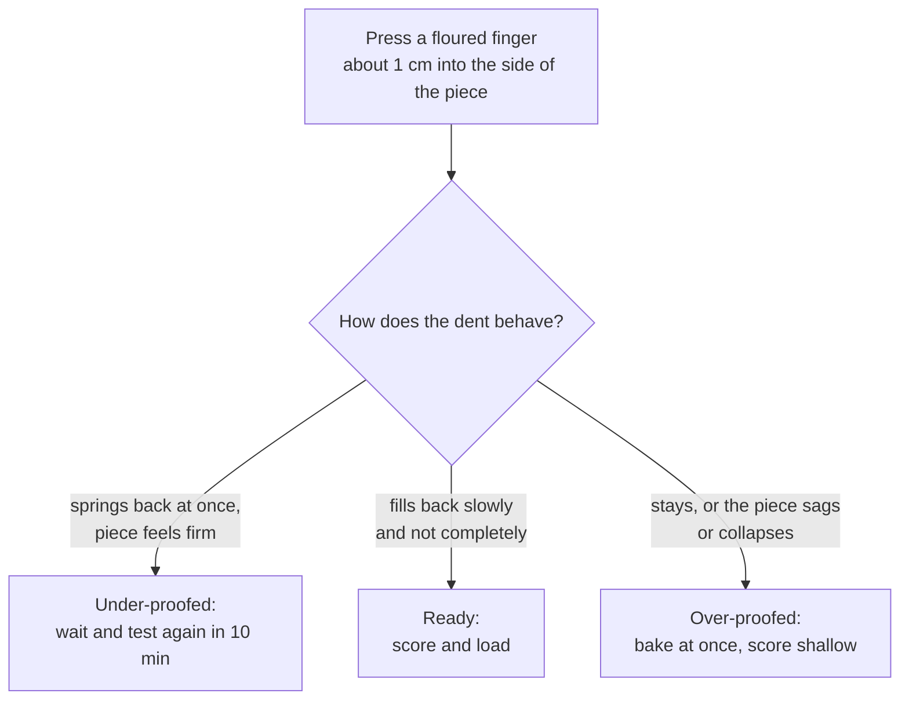

# 04.4 · Apprêt: Final Proof

The apprêt is the last fermentation: the shaped pieces rest until they hold enough gas to bake. It is short compared with the whole process but it is the stage that decides the volume, the scoring and the crumb you get. This lesson covers the conditions, the supports and the precautions of the apprêt, how to read the poke test, and you bake a timed series of rolls to see under-proofed, ready and over-proofed side by side.

## Why it matters

A batch can be mixed, fermented and shaped perfectly and still be lost in the last half hour. Loaded too early, the bread is tight and bursts at the sides; too late, it spreads, the scores stay flat and the crust is pale. A professional also has to manage the apprêt against the oven: when the oven is busy, the pieces keep rising. The référentiel lists for the apprêt the choice of supports, the duration and the precautions of use (S3.3).

## Key terms

| French | Say it | English meaning |
|---|---|---|
| apprêt | *ah-PRAY* | final proof of the shaped pieces |
| chambre de pousse / armoire de fermentation | *SHAHM-bruh duh POOSS / ar-MWAHR duh fair-mahn-tah-SYOHN* | proofing room / proofing cabinet, with controlled temperature and humidity |
| couche | *KOOSH* | heavy linen cloth folded into pleats to hold baguettes |
| banneton | *bahn-TOHN* | proofing basket (cane, wicker or lined) for boules and levain breads |
| plaque perforée / filet à baguettes | *plahk pair-fo-RAY / fee-LAY ah bah-GET* | perforated tray / baguette tray with channels |
| test du doigt | *test dew DWAH* | poke test with a floured finger |
| sous-apprêté / sur-apprêté | *sooz-ah-pray-TAY / sewr-ah-pray-TAY* | under-proofed / over-proofed |
| hygrométrie (HR) | *ee-gro-may-TREE* | relative humidity of the air |

## How it works

### What happens during apprêt

Shaping has pushed out part of the gas and given the piece tension. During the apprêt, the yeast refills the bubbles; the piece grows, softens and becomes lighter. It must reach a point where:

- it holds enough gas to give volume and a light crumb;
- there is still some sugar and some yeast activity left for **oven spring** (the rise in the first minutes of baking);
- the gluten films are stretched but not yet at breaking point, so the scores open cleanly.

Most crusty breads are loaded at about three-quarters to full apprêt: a slightly young piece gives more oven spring and bolder scores; a fully proofed one gives a lighter crumb but less spring. Each product sheet says which.

### Conditions

| Factor | Usual setting | Why |
|---|---|---|
| Temperature | about 24-28 °C for bread (PC-02: 25 °C) | warm enough for steady gas, not so warm the outside runs ahead of the centre |
| Humidity | about 75-85 % RH in a cabinet; at home, a cover | stops the surface drying (croûtage); too wet leaves condensation drops and a sticky skin |
| Length | about 45 min-2 h for direct breads | set by dough temperature, yeast, size of the piece and how much the dough fermented before |

Butter-rich products (croissants) proof cooler so the butter does not melt; that is taught in [lesson 11.6](../module-11/lesson-06.md).

### Supports

| Support | For | Precautions |
|---|---|---|
| Couche (floured linen) on boards | baguettes, bâtards, ficelles | pleats between pieces hold their shape; flour lightly; dry and brush after use |
| Banneton | boules, levain and campagne breads, soft doughs | flour well (rice or rye flour); seam up; turn out onto the peel or loader just before baking |
| Perforated tray, baguette tray | pieces baked straight on the tray, rack ovens | no transfer needed; less bottom crust than on a stone |
| Plain tray with baking paper | rolls, home baking | space the pieces so they do not touch |

Whatever the support: do not move pieces late in the apprêt (they are fragile and lose gas), keep them out of draughts, and keep the pieces of one load at the same stage.

### Reading the poke test

Combine it with the other signs: volume (often a little over double the shaped piece), a light, airy feel when you lift the support slightly, and a slightly domed, smooth surface. The poke test is harder to read on cold dough and on very wet doughs; there, rely more on volume and feel.

## Worked example

Saturday, PC-02 batch (lesson [01.6](../module-01/lesson-06.md)): the baguettes go into the 25 °C cabinet at 4:45, planned apprêt 1 h 15, load at 6:00. At 5:30 the colleague on the oven tells you the oven will be free only at 6:20, 20 minutes late.

1. **Where are the pieces?** 45 minutes of a 75-minute apprêt are done; about 30 minutes of "25 °C progress" remain.
2. **Time now available:** 5:30 to 6:20 = 50 minutes.
3. **Slow them down.** Move the boards to a cooler place at about 20 °C (the fournil, away from the oven). With the rule of thumb from lesson [04.2](lesson-02.md), 5 °C cooler ≈ 1.07⁵ ≈ 1.4 times slower: the 30 minutes of progress now take about 42 minutes, so the pieces are ready at about 6:12 (a little earlier in reality, because the pieces cool gradually rather than at once).
4. **Decide.** Loading at 6:20 means about 8 minutes past ready: acceptable if you score a little shallower and load at once. Leaving them in the 25 °C cabinet would have meant 20 minutes past ready, with real risk of flat, pale baguettes.
5. **Do not open-and-close the cabinet** to check repeatedly; poke-test one piece at 6:05 and 6:15.
6. **Record it.** Write the delay and what you did on the production sheet. If it caused a defect, report it with the [non-conformity report](../../templates/non-conformity-report.md). The real fix is upstream: plan oven loads so they do not collide (organigramme, Module 14), or start the batch later.

## Practice

> [!WARNING]
> You load the oven four times. Use dry oven gloves every time, keep the door open for as short a time as possible, and make steam only in the preheated metal tray (pour and step back). Never pour water into a hot glass dish.

### You need

- Minimum: scale, thermometer, bowl, scraper, lidded container, two baking trays with baking paper, a metal tray for steam, oven gloves, ruler, pencil, a cover (large upturned box or clean plastic sheet), a warm place at 24-26 °C, timer, the [bake log](../../templates/bake-log.md).
- Professional equivalent: proofing cabinet at 25 °C, 75-80 % RH, with trays or couches on racks.

### Ingredients

PD-01 dough, as in lesson [01.7](../module-01/lesson-07.md): flour T55 500 g (100 %), water 325 g (65 %), salt 9 g (1.8 %), fresh yeast 7.5 g (1.5 %) or instant 2.5 g. Total 841.5 g → 8 rolls of 105 g.

### Steps

1. Mix and knead to 23-25 °C; pointage 1 h 15 with one fold; divide 8 × 105 g; détente 15 min (lessons 04.2 and 04.3).
2. Preheat the oven to 230 °C with a tray in the middle and the steam tray at the bottom.
3. Shape 8 tight round rolls. Write the shaping time: this is apprêt minute 0. Place them on baking paper in pairs, and write the pair's planned bake time on the paper in pencil: **A = 15 min, B = 35 min, C = 55 min, D = 80 min**.
4. Measure the diameter and height of one roll right after shaping. Cover and keep at 24-26 °C (record the actual temperature).
5. At each planned time: poke-test one roll of that pair and write what the dent did (springs back at once / fills slowly / stays / collapses). Measure the diameter and height of the other roll. Slide the pair onto the hot tray, steam, bake 15-18 minutes until golden.
6. Cool every roll on a rack and label it A-D. When all are cool (about 30 minutes after the last), measure height and diameter of each, then cut one of each pair in half across.
7. Lay the halves in order and compare: volume, shape (round or flattened), crust colour, crumb (tight or open, even or irregular), tears on the side. Score each with the [quality rubric](../../templates/quality-rubric.md).

### Targets

- Dough at 23-25 °C after kneading; apprêt place 24-26 °C, recorded.
- Four poke-test results written before each bake, with the time.
- Height and diameter for each pair before and after baking.

### How you know it worked

Your series should show the whole range. A (15 min): dent springs back at once; small, round, dense roll, often torn at the side, darker crust. B (35 min) or C (55 min): dent fills slowly; good volume, even crumb, golden crust, which tells you your "ready" window at your temperature. D (80 min): dent stays or the roll sags; flatter, wider roll, paler crust, coarser crumb near the top. If all four look the same, your place was too cold or too warm: check your temperature record and repeat with times adjusted.

### Self-check

- [ ] I wrote a poke-test result for each pair before baking.
- [ ] I can point to the pair that was best and say which signs showed it was ready.
- [ ] I can describe what an under-proofed and an over-proofed roll look like inside and out.
- [ ] I can name a suitable support for baguettes, boules and rolls.
- [ ] I can slow down an apprêt when the oven is late and say by roughly how much.

## What goes wrong

| Symptom | Likely cause | Fix now | Prevent next time |
|---|---|---|---|
| Bread bursts along the side, tight crumb, dark crust | Under-proofed: loaded too early | — | Wait for a slow-filling dent; check the cabinet temperature |
| Bread flat and wide, scores do not open, pale crust | Over-proofed: apprêt too long or too warm | Bake at once, shallower scores | Poke-test from the early end of the window; plan oven loads |
| Dry skin, cracks, dull crust | Humidity too low or pieces uncovered | Mist lightly before loading | Cover pieces; set the cabinet to 75-85 % RH |
| Wet spots, sticky surface, pieces stick to the couche | Humidity too high (condensation) or couche under-floured | Dust lightly, handle gently | Lower humidity; flour the couche and bannetons properly |
| Pieces deflate when transferred to the oven | Over-proofed and handled roughly | Load gently, bake at once | Load at three-quarters to full apprêt; transfer smoothly |
| Pieces of one load at different stages | Shaped in a random order, or cabinet hotter at the top | Bake the most advanced first | Shape in order; know your cabinet's hot spots |

## Review

- The apprêt refills the shaped piece with gas; it must stop with enough gas for volume and enough life left for oven spring.
- Usual conditions: about 24-28 °C, 75-85 % RH or a cover, about 45 min-2 h for direct breads.
- Choose the support for the product: couche for baguettes, banneton for boules and levain breads, trays for rolls.
- Poke test: springs back at once → wait; fills slowly → load; stays or sags → bake at once.
- Exam-relevant (S3.3): see [the CAP exam reference](../../references/cap-exam.md).
