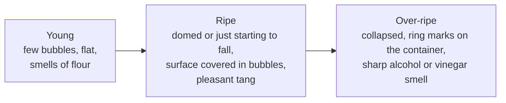

# 04.5 · Pre-ferments: Pâte Fermentée, Poolish and Levain

A pre-ferment is part of the flour and water fermented in advance, then added to the final dough. It brings acidity, aroma and strength that a short direct fermentation cannot. This lesson compares the direct method with the three pre-ferments the CAP expects, shows how to choose one for a product, and you make the same bread direct and on poolish to taste the difference.

## Why it matters

Most bread sold in French bakeries is not made by the plain direct method: pain courant is often made on pâte fermentée, many baguettes on poolish, campagne and many traditions on levain. Each choice changes the dough on the bench, the schedule of the day and the bread the customer tastes. The référentiel asks you to choose a fermentation method for a given product (S3.3), and the exam's technical sheets assume you know what each pre-ferment does. The calculations of pre-ferment formulas come in [lesson 06.4](../module-06/lesson-04.md); here you learn what they do and when to use them.

## Key terms

| French | Say it | English meaning |
|---|---|---|
| méthode directe (en direct) | *may-TOD dee-REKT* | direct method: all ingredients mixed at once |
| pré-fermentation / pré-ferment | *pray-fair-mahn-tah-SYOHN* | pre-fermentation: part of the dough fermented in advance |
| pâte fermentée | *paht fair-mahn-TAY* | fermented dough kept from an earlier batch (with salt) |
| poolish | *poo-LEESH* | liquid pre-ferment: equal weights of flour and water, a little yeast, no salt |
| levain dur / levain liquide | *luh-VAN DOOR / luh-VAN lee-KEED* | firm / liquid sourdough |
| mûr / à maturité | *MEWR / ah mah-tew-ree-TAY* | ripe: at the right point to use |
| affaissement | *ah-fess-MAHN* | the slight collapse of a pre-ferment just past its peak |

## How it works

### The four methods side by side

| | Direct | Pâte fermentée | Poolish | Levain (dur or liquide) |
|---|---|---|---|---|
| What it is | everything mixed at once | a piece of finished dough (flour, water, salt, yeast) from an earlier batch | flour 100 + water 100 + yeast, no salt | flour + water fermented by wild yeasts and lactic bacteria (lesson [02.7](../module-02/lesson-07.md)) |
| Typical quantity | — | 10-20 % of the flour (PC-02: 15 %) | poolish flour often 20-40 % of the total flour | 20-30 % of the flour, ripe levain |
| Ripening | — | 3-12 h, kept cold (about 4 °C) for the longer times | 3-16 h at 18-24 °C; less yeast for longer | 3-8 h at 24-28 °C after the last refreshment |
| Yeast | 1.5-2 % fresh in the dough | normal dose in the final dough, pointage shorter | 0.1-1 % fresh on the poolish flour, then a reduced dose in the final dough | none, or at most 0.2 % at final mixing for a legal "levain" bread |
| Effect on the dough | strength must come from mixing and pointage | adds acidity and strength: shorter pointage, more tolerant dough | more extensible dough, easy to shape long | strong acidity: tighter at first; weakens if the levain is over-ripe |
| Effect on the bread | mild flavour, stales faster | fuller taste, better colour and keeping, no extra work | creamy crumb, fine crisp crust, nutty aroma | marked acidity and aroma, longest keeping |
| Constraint | short flavour, depends on a perfect pointage | needs yesterday's dough kept cold and dated | must be made the day before or at dawn; timing matters | daily refreshments, slow, less predictable |

The référentiel calls the direct method *non différé*; the pre-ferments are its *pré-fermentations*.

### Why a pre-ferment changes the dough

- **Acidity** (lactic and acetic acids) tightens the gluten and gives a dough that "holds" with less pointage. Too much acid, from an over-ripe pre-ferment, weakens it again.
- **Enzymes** have worked for hours in the poolish's wet mass, softening the gluten a little and releasing sugars: the dough is more extensible and the crust colours well.
- **Flavour molecules** are already formed, so even a short final fermentation tastes of a long one.
- **Organisation**: part of the fermentation was done in advance, so the final dough needs less time on production day.

### Judging ripeness

A poolish is ripe when its surface is covered with small bubbles and it has just begun to sink in the centre; the container shows a line where it peaked. A pâte fermentée is ripe when it has roughly doubled and smells pleasantly acidic. A levain is ripe at or just after its peak (lesson [02.7](../module-02/lesson-07.md)). Used young, a pre-ferment brings little; used over-ripe, it brings excess acid and a weak, sticky dough.

### The levain rules, in one line

Under décret n°93-1074, a bread made on levain may have baker's yeast added only at the final mixing and at most 0.2 % of the flour used at that stage (art. 4), and a bread sold "au levain" must have a crumb pH of 4.3 or less and at least 900 ppm of acetic acid (art. 3). Lesson [02.7](../module-02/lesson-07.md) explains them; [lesson 09.1](../module-09/lesson-01.md) places them among the other legal bread names.

### Choosing a method for a product

| Product | Usual method | Why |
|---|---|---|
| Pain courant baguettes, large volume | pâte fermentée, or poolish | flavour and keeping with a short day; additives allowed |
| Pain de tradition française | pâte fermentée, poolish or levain, long pointage or retarded | no additives allowed: flavour and strength must come from fermentation |
| Pain de campagne, pain au levain | levain (often firm), sometimes with a little yeast | acidity and aroma expected; "au levain" must meet the legal tests |
| Pain de mie, pain viennois | direct (sometimes a little pâte fermentée) | soft, mild, regular crumb; rich doughs ferment fast anyway |

## Worked example

Friday afternoon. Tomorrow's order: 30 baguettes de tradition, 12 pains de campagne, 6 pains de mie, plus the PC-02 pain courant on 6,000 g of flour. You must choose the methods and prepare the pre-ferments today.

1. **Tradition.** No additives allowed, so flavour and strength must come from fermentation. The baker's sheet uses a poolish made at 18:00 for a 6:00 mix (12 h): less yeast in the poolish, about 0.1-0.2 % on its flour, at 18-20 °C. Note it on tomorrow's sheet and put a reminder at the poolish station.
2. **Campagne.** Levain: the chef must be refreshed tonight so the levain de tout point is ripe at mixing (routine in lesson [02.7](../module-02/lesson-07.md)).
3. **Pain de mie.** Direct: a soft, regular crumb is wanted, and the enriched dough ferments well on its own.
4. **PC-02 pâte fermentée.** Tomorrow: 6,000 g of flour × 15 % = **900 g** of pâte fermentée. Keep a margin for what sticks to the tub: plan **950 g**.
5. **Where does it come from?** Today's batch (lesson [04.3](lesson-03.md)) had only 244 g of surplus. You need about 950 − 244 ≈ 710 g more dough. PC-02 makes 182.3 g of dough per 100 g of flour, so 710 × 100 ÷ 182.3 ≈ 390 g more flour: raise today's batch from 5,400 g to **5,800 g** of flour (all other ingredients from the sheet's percentages).
6. **Store it right.** At the end of pointage, take 950 g, put it in a lidded, oiled tub labelled "pâte fermentée PC-02, date and time", and put it in the cold room at about 4 °C. Tomorrow it goes in at the end of frasage, as the sheet says.

The full calculation of pre-ferment formulas, including the flour and water inside a poolish or levain, is in [lesson 06.4](../module-06/lesson-04.md).

## Practice

> [!WARNING]
> You bake at 240 °C with steam. Use dry oven gloves, make steam only in a preheated metal tray (never a glass dish), pour and step back. Score with the blade moving away from your fingers and cover the lame after use.

### You need

- Minimum: scale (1 g) and ideally 0.1 g, thermometer, two bowls, scraper, two lidded containers (one of about 1 L for the poolish), marker, cloth, baking paper, two trays, metal steam tray, oven gloves, lame or sharp knife, the [bake log](../../templates/bake-log.md) and the [quality rubric](../../templates/quality-rubric.md).
- Professional equivalent: a poolish tank or tub in a cool room, two doughs on the spiral mixer, a deck oven.

### Ingredients

**Day 1, evening: poolish.** You cannot weigh 0.3 g of yeast on a 1 g scale, so dissolve 1 g of fresh yeast in 100 g of water and use 30 g of that solution.

| Poolish | Weight | % of poolish flour |
|---|---|---|
| Flour T55 | 150 g | 100 |
| Water at about 20 °C (120 g + 30 g of the yeast solution) | 150 g | 100 |
| Fresh yeast (inside the 30 g of solution) | 0.3 g | 0.2 |

**Day 2: two doughs, same totals.**

| Ingredient | Dough D (direct, PD-01) | Dough P (on poolish) | Baker's % of total flour |
|---|---|---|---|
| Poolish (above) | — | 300 g | (30 % of the flour in it) |
| Flour T55 | 500 g | 350 g | 100 in total |
| Water | 325 g | 175 g | 65 in total |
| Fine salt | 9 g | 9 g | 1.8 |
| Fresh yeast | 7.5 g | 5 g | 1.5 / about 1.1 in total |
| **Dough weight** | **841.5 g** | **839 g** | |

### Steps

1. **Day 1, about 19:00.** Mix the poolish to a smooth batter in the 1 L container. Mark the level. Cover and leave at 18-21 °C (a cool room; in a warm kitchen above 24 °C, make it at 22:00 instead).
2. **Day 2, about 7:00-9:00.** Check the poolish: domed or just starting to sink, surface covered in bubbles, pleasant tangy smell. Write what you see and how high it rose.
3. Mix dough D as in lesson [01.7](../module-01/lesson-07.md), target 24 °C. Note the time and dough temperature.
4. 20 minutes later, mix dough P: poolish and water first, then the flour, yeast and salt; knead 8-10 minutes (it develops faster). Target 24 °C.
5. **Pointage.** D: 1 h 15, one fold at 40 min. P: about 1 h, one fold at 30 min. Decide each end by the signs (lesson [04.2](lesson-02.md)). At the end, stretch a small piece of each between your fingers: which stretches further without tearing?
6. Divide each dough into two pieces of about 410 g, pre-shape as loose cylinders, détente 20 minutes covered (lesson [04.3](lesson-03.md)). Preheat the oven to 240 °C with a tray and the steam tray.
7. Shape four bâtards of about 25 cm. Mark the paper D or P. Apprêt covered at 24-26 °C until the poke test says ready (about 45-60 min; lesson [04.4](lesson-04.md)).
8. Score each bâtard with one long cut, load with steam and bake about 25 minutes until deep golden. Bake D and P in the same load if they fit, or D first.
9. Cool at least 1 hour. Compare by eye, by cutting one of each, and by tasting blind if someone can label the slices. Keep one of each in a bag and taste again after 24 hours.

### Targets

- Poolish at 18-21 °C for 11-14 h; ripe signs recorded before use.
- Both doughs at 24 °C ± 1 °C after kneading.
- Four bâtards of 410 g ± 5 g, about 25 cm long.
- Comparison recorded for: dough extensibility, pointage time, volume (height × width), crust colour, crumb, taste at day 0 and day 1.

### How you know it worked

Dough P stretches further and shapes more easily, and often needs less pointage. Bread P usually has a slightly more open, creamier crumb, a finer and more coloured crust, a rounder, nuttier, slightly tangy taste, and stays pleasant longer on day 1; bread D tastes milder and "yeastier". If P was flat and sour, the poolish was over-ripe: make it later or cooler next time. If P tasted like D, the poolish was young.

### Self-check

- [ ] I recorded the poolish's ripeness signs before using it.
- [ ] I can list one effect of a poolish on the dough and two on the bread.
- [ ] I can choose a method for tradition, campagne, pain courant and pain de mie and justify each.
- [ ] I can calculate how much pâte fermentée to keep for tomorrow's batch.
- [ ] I can state the legal yeast limit for a bread made on levain.

## What goes wrong

| Symptom | Likely cause | Fix now | Prevent next time |
|---|---|---|---|
| Poolish flat, few bubbles at mixing time | Too young: too cold or too little yeast | Leave it 1-2 h somewhere warmer, or use it and lengthen pointage | Make it earlier or warmer; check the yeast dose |
| Poolish collapsed, smells of alcohol or vinegar | Over-ripe: too warm or too long | Use less of it, mix cooler, shorten pointage | Make it later or cooler, with less yeast |
| Dough on pâte fermentée sticky and weak | Pâte fermentée too old or kept warm | Shorten pointage, give a fold | Keep it at about 4 °C, dated, and use within the sheet's time |
| Pâte fermentée forgotten in the cold room | No label or no reminder | Make the batch direct with a longer pointage | Label, date and list it on tomorrow's sheet |
| Levain bread dense and very sour | Over-ripe levain or too much of it | — | Use it at its peak; refresh more often (lesson [02.7](../module-02/lesson-07.md)) |
| Bread sold "au levain" made with 1 % yeast | Method does not meet décret 93-1074 art. 4 | Relabel without "levain" | Respect 0.2 % yeast at final mixing |

## Review

- Direct = everything at once; pâte fermentée = a piece of earlier dough (10-20 %); poolish = flour 100 + water 100 + a little yeast, no salt; levain = wild yeasts and lactic bacteria.
- Pre-ferments bring acidity, enzymes, flavour and keeping, and shorten production-day fermentation.
- Use them ripe: young brings little, over-ripe brings too much acid and a weak dough.
- Choose the method for the product: tradition relies on fermentation for everything; pain de mie is usually direct.
- Exam-relevant (S3.3): see [the CAP exam reference](../../references/cap-exam.md).
