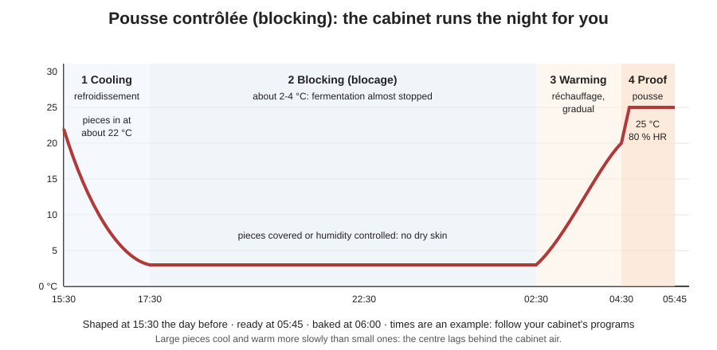
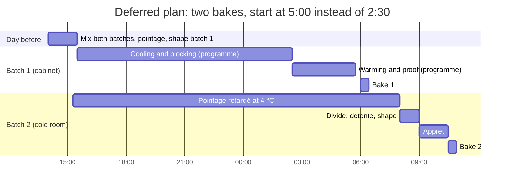

# 04.6 · Controlled and Retarded Fermentation

Cold slows yeast almost to a stop, and bakers use that to move fermentation in time: dough mixed in the afternoon becomes bread at dawn, without anyone working through the night. This lesson explains the three deferred techniques the CAP lists, what they change in the dough, the bread and the bakery's day, and you make a bread with an overnight cold pointage at home.

## Why it matters

Deferred fermentation is how most French bakeries now organise production: it removes night work, lets the shop bake fresh bread several times a day, and gives the bread more flavour. It also brings its own defects (blisters, pale or over-acid crust, slack cold dough) and its own equipment (cold rooms, programmable proofing cabinets). The référentiel asks you to explain the deferred techniques and their effects on the organisation of production (S3.3), and organising your own work is a core competency (C1.2).

## Key terms

| French | Say it | English meaning |
|---|---|---|
| fermentation différée | *fair-mahn-tah-SYOHN dee-fay-RAY* | deferred fermentation: slowed or paused by cold to move it in time |
| pointage retardé (au froid) | *pwan-TAHZH ruh-tar-DAY (oh FRWAH)* | retarded bulk fermentation: the bulk dough rests in the cold, often overnight |
| pousse lente | *pooss LAHNT* | slow proof: shaped pieces proof for hours at a cool temperature |
| pousse contrôlée / pousse avec blocage | *pooss kohn-tro-LAY / pooss ah-VEK blo-KAHZH* | controlled proof with blocking: shaped pieces cooled, held, then warmed by a programme |
| armoire de pousse contrôlée | *ar-MWAHR duh pooss kohn-tro-LAY* | programmable retarder-proofer cabinet |
| chambre froide positive | *SHAHM-bruh FRWAHD po-zee-TEEV* | cold room above 0 °C (about 0-4 °C) |
| réchauffage / remontée | *ray-sho-FAHZH / ruh-mohn-TAY* | warm-up phase after blocking |
| cloques | *KLOK* | small blisters on the crust, typical of long cold fermentation |

## How it works

### What the cold does

Yeast is almost inactive at 0-4 °C and slow at 10-16 °C (lesson [02.6](../module-02/lesson-06.md)). Lactic bacteria slow down less than yeast in the cold, so a long cold fermentation produces **relatively more acid and aroma for the gas made**: more flavour, a deeper crust colour, often small blisters (cloques). But a dough does not cool instantly: a 10 kg tub or a large loaf takes hours to reach the cold-room temperature at its centre, and keeps fermenting meanwhile. That is why retarded doughs are mixed cooler and with less yeast.

### The three techniques

| | Pointage retardé | Pousse lente | Pousse avec blocage (contrôlée) |
|---|---|---|---|
| What is cooled | the bulk dough, before dividing | the shaped pieces | the shaped pieces |
| Usual temperature | about 2-6 °C | about 10-16 °C, no blocking | cooled to about 2-4 °C, held, then warmed and proofed (programme) |
| Usual length | about 12-24 h (some traditions longer) | several hours, e.g. overnight | from a few hours to about a day, by programme |
| Dough adjustments | less yeast, cooler TPV (about 20-22 °C), short pointage before cooling | much less yeast, firm shaping | slightly less yeast, cooler TPV, firm shaping |
| Next steps | divide cold, longer détente, longer apprêt | bake when ready | bake at the programmed time |
| Typical use | tradition, levain breads: flavour and a free afternoon | small bakeries without a programmable cabinet | baguettes and viennoiserie baked at set times, several bakes a day |

In the référentiel's list of methods for the two main breads, both pain courant and tradition have *non différé* (same day) and *pousse lente*; pain courant adds *pousse contrôlée*, and tradition adds *pointage retardé au froid*.

### The blocking cycle

A programmable cabinet runs four phases: **cooling** the pieces quickly, **blocking** them at about 2-4 °C so fermentation almost stops, **warming** gradually so the outside does not race ahead of the centre, and **proofing** at the usual apprêt conditions. Humidity is controlled throughout so the pieces do not dry out. The exact settings depend on the cabinet and the product; follow the manufacturer's programmes and your sheet, then adjust from your results.

### Effects to expect

| Effect | Why | What to do |
|---|---|---|
| More flavour, slightly acidic | acids keep forming while yeast is slowed | choose the length for the flavour you want |
| Deeper crust colour, small blisters | sugars released by enzymes; moisture at the surface | normal in moderation; less humidity at the end if excessive |
| Cold dough is stiff, then slack as it warms | cold butter-free dough is firm; acids and enzymes soften it over time | longer détente; gentle handling; firm shaping |
| Longer apprêt after the cold | the pieces must warm before fermenting at full speed | plan it; check with the poke test |
| Dry skin or condensation | cabinet humidity wrong, pieces uncovered | cover in the cold room; set humidity |

Food-safety note: dough is a food. In the cold room keep it covered, labelled (product, date, time) and away from raw products, like any other preparation ([Module 17](../module-17/lesson-08.md)).

## Worked example

The owner of a small bakery wants the baker to stop starting at 2:30. Baguettes must still be in the shop at 7:00, and the shop wants a second baguette bake for 11:30. Production: 24 baguettes per bake, PC-02 dough. Equipment: one programmable cabinet, one cold room at 4 °C.

1. **First bake by blocking.** Mix the 7:00 batch the day before at about 14:00, with the yeast reduced (e.g. from 1.5 % to about 1.2 %) and a cooler target dough temperature (about 22 °C). Pointage 45 min, divide, détente, shape by 15:30. Load the cabinet with the programme in the diagram: ready at 5:45.
2. **Second bake by pointage retardé.** Mix the second batch the same afternoon, again cooler and with less yeast. After about 30 minutes at room temperature, the covered tub goes into the cold room.
3. **Next morning.** The baker arrives at 5:00, preheats the oven and bakes the cabinet batch at 6:00. At 8:00 the retarded dough (still at about 6-8 °C) is divided; détente 40 min because it is cold; shaped at 9:00; apprêt about 1 h 30 at 25 °C; baked 10:30-10:55, cooled for 11:30.
4. **Check the plan.**

(The chart runs from the afternoon of day 1 through the night to the morning of day 2.)

5. **Consequences for organisation.** The afternoon now has a mixing session; the cabinet must be cleaned and reprogrammed daily; the cold room needs space for tubs; a power cut or a wrong programme can lose a whole batch, so the baker checks the cabinet's display and the dough temperature on arrival and writes them on the sheet.

## Practice

> [!WARNING]
> You bake at 240 °C with steam. Use dry oven gloves; steam only in a preheated metal tray, never a glass dish; pour and step back. Score with the blade moving away from your fingers.

### You need

- Minimum: scale (0.1 g for yeast), probe thermometer, fridge thermometer (or your probe in a glass of water left in the fridge for an hour), bowl, scraper, a lidded container of about 2 L with room to triple, marker, baking paper, trays, metal steam tray, oven gloves, lame, the [bake log](../../templates/bake-log.md) and the [temperature log](../../templates/temperature-log.md).
- Professional equivalent: dough tub in a cold room at 2-4 °C, or a programmable retarder-proofer.

### Ingredients

| Ingredient | Baker's % | Weight | Compared with PD-01 |
|---|---|---|---|
| Flour T55 (or plain flour) | 100 | 500 g | same |
| Water, cooler (target dough 22 °C) | 65 | 325 g | same weight, cooler |
| Fine salt | 1.8 | 9 g | same |
| Fresh yeast (or instant at one-third) | 0.6 | 3 g (1 g) | less than half |
| **Total** | **167.4** | **837 g** | |

### In Israel

- **Mixing to 22 °C in summer:** 3 × 22 − 29 − 30 − 2 = **5 °C**, colder than most fridge water. Put the flour in the fridge for an hour first and mix in the coolest room (lesson [05.2](../module-05/lesson-02.md)).
- **Room time before the fridge:** at 28-30 °C, cut the 45 minutes to 20-30 minutes before the fold.
- **Your fridge:** check it reads 3-5 °C; a fridge opened often in hot weather drifts up. Put the container at the back of a middle shelf, not in the door.
- **Next morning:** in a warm kitchen the cold dough wakes up fast: check the rise and temperature after 20 minutes rather than 30-60.
- **Yeast:** 1 g of instant dry yeast (שמרים יבשים, *shmarim yeveshim*) needs a 0.1 g scale; if you only have a 1 g scale, use the solution method of lesson [04.5](lesson-05.md) (checked 2026-10-09).

### Steps

1. **Evening, about 20:00.** Check your fridge temperature: it should be about 3-5 °C. Write it down.
2. Calculate the water temperature with the estimate from lesson [01.7](../module-01/lesson-07.md), aiming 2 °C lower than usual (target dough 22 °C). Mix and knead as usual. Record the dough temperature.
3. Put the dough in the oiled container, mark the level, cover. Leave 45 minutes at room temperature, give one fold, then put it in the fridge. Write the time.
4. **Next morning, 12-16 h later.** Take the container out. Write the time, the rise (× 1.5, × 2…) and the dough temperature in the centre straight away. Look at the bubbles at the sides and smell it.
5. If it has risen less than about 1.5 times, leave it at room temperature until it has (often 30-60 min). Then divide into two pieces of about 415 g and pre-shape loosely.
6. Détente 30-45 minutes, covered: cold dough needs longer. Preheat the oven to 240 °C with a tray and the steam tray.
7. Shape two bâtards of about 25 cm. Apprêt at 24-26 °C until the poke test says ready; expect 1 h-1 h 45 because the pieces must warm. Measure the dough temperature of one piece when you load.
8. Score, steam, bake about 25 minutes. Cool at least 1 hour, then compare with your same-day bread from lesson [04.2](lesson-02.md) or [04.5](lesson-05.md) (notes or a fresh bake): crust colour and blisters, crumb, flavour.

### Targets

- Dough at 22 °C ± 1 °C after kneading; fridge at 5 °C or below.
- 12-16 h in the fridge, with the times recorded.
- Dough temperature recorded at three points: after kneading, out of the fridge, at loading.
- Two bâtards of 415 g ± 5 g.

### How you know it worked

The dough comes out of the fridge risen, firm and cold (often 5-8 °C), with many small bubbles and a pleasantly tangy smell. The bread has a deeper, often lightly blistered crust, a more irregular, slightly creamy crumb and a fuller, slightly acidic taste than the same-day bread, even with less than half the yeast. If it barely rose overnight, your fridge is colder or your dough was cooler than planned: give it more time at room temperature next morning. If it collapsed and smelled of alcohol, the dough went in too warm or the fridge is too warm.

### Self-check

- [ ] I recorded the fridge temperature and the dough temperature at three points.
- [ ] I can name and describe pointage retardé, pousse lente and pousse avec blocage.
- [ ] I can list the four phases of a blocking cycle and why the warming is gradual.
- [ ] I can say how cold fermentation changes yeast dose, dough temperature, détente and apprêt.
- [ ] I can explain one benefit and one risk of deferred fermentation for the bakery's organisation.

## What goes wrong

| Symptom | Likely cause | Fix now | Prevent next time |
|---|---|---|---|
| Retarded dough over-risen, collapsed, sour | Dough too warm going in, too much yeast, or cold room too warm | Divide at once, firm pre-shape, short apprêt | Cooler TPV, less yeast, check the cold room temperature |
| Dough barely risen after the night | Cold room colder than planned; dough mixed too cold | Leave it at room temperature until it has risen | Record temperatures; adjust yeast or start time |
| Pieces from the cabinet over-proofed at the set time | Programme too warm or too short in blocking; pieces went in warm | Bake at once | Lower TPV; check the programme; cool pieces quickly |
| Under-proofed pieces at the set time, cold centre | Warming too short, pieces too large | Leave in proof longer | Longer warming for large pieces |
| Many large blisters on the crust | Long cold fermentation with moisture on the surface | — | Less humidity at the end; shorter blocking |
| Dry skin, cracked crust | Pieces uncovered in the cold room or cabinet humidity too low | Mist before loading | Cover; set humidity |
| Whole batch lost overnight | Power cut or wrong programme not noticed | Report it (non-conformity) | Check the display and temperatures on arrival; alarm if available |

## Review

- Cold almost stops yeast; deferred fermentation moves fermentation in time and adds flavour.
- Pointage retardé cools the bulk dough; pousse lente proofs shaped pieces slowly at a cool temperature; pousse avec blocage cools, holds, warms and proofs shaped pieces by programme.
- Cold doughs need less yeast, a cooler dough temperature, a longer détente and a longer apprêt.
- Deferred fermentation removes night work and allows several bakes a day, but needs equipment, checks and records.
- Exam-relevant (S3.3, C1.2): see [the CAP exam reference](../../references/cap-exam.md).
