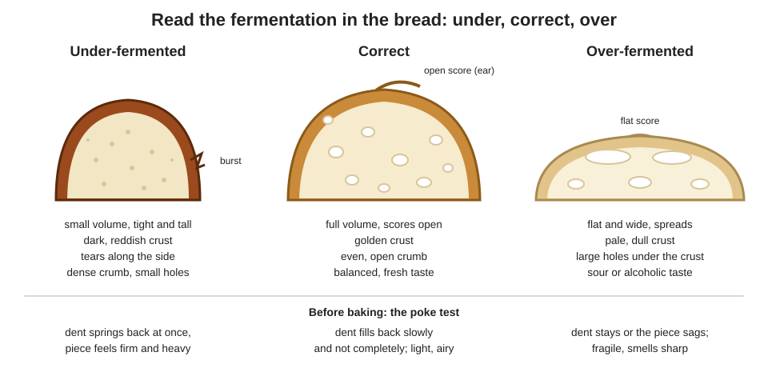
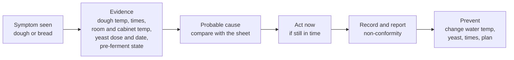

# 04.7 · Judging Fermentation by the Dough

Times on a production sheet assume a dough at its target temperature, with fresh yeast and a ripe pre-ferment. Real doughs are rarely that obliging, so a baker judges fermentation by the dough itself and reads the result in the bread. This lesson gathers the signs of under, correct and over fermentation at each stage, shows how to trace a defect back to its cause and report it, and you bake a deliberate under/correct/over series and diagnose it.

## Why it matters

"Judge by the dough, not by the clock" is the rule behind every lesson of this module. In the practical exam and at work, you will be expected to notice a dough that is running fast or slow, act before it is too late, and explain afterwards what happened. That is two competencies at once: controlling your products (C3.2) and reporting non-conformities and malfunctions during production (C4.4). The référentiel also lists dough defects and bread defects among the stages of bread-making (S3.1). The full troubleshooting reference is [references/troubleshooting.md](../../references/troubleshooting.md); this lesson focuses on fermentation. The general diagnosis method for any fault is in lesson [16.1](../module-16/lesson-01.md).

## Key terms

| French | Say it | English meaning |
|---|---|---|
| sous-fermenté / pâte jeune | *soo-fair-mahn-TAY / paht ZHUHN* | under-fermented / young dough |
| sur-fermenté / pâte vieille | *sewr-fair-mahn-TAY / paht vee-YAY* | over-fermented / old dough |
| à point | *ah PWAN* | just right, ready |
| pain cintré / éclaté | *pan san-TRAY / ay-kla-TAY* | bread burst along the side (often under-proofed) |
| pain plat / qui s'affaisse | *pan PLAH / kee sah-FESS* | flat bread / bread that sags (often over-proofed) |
| alvéolage | *al-vay-o-LAHZH* | crumb structure: the size and spread of the holes |
| fiche de non-conformité | *feesh duh nohn-kohn-for-mee-TAY* | non-conformity report |
| rendre compte | *RAHN-druh KOHNT* | to report back (to the manager) |

## How it works

### The signs at each stage

| Stage | Under-fermented | Correct | Over-fermented |
|---|---|---|---|
| End of pointage | little rise; dense, sticky, slack; smells of flour | clear rise in the marked tub, domed, airy, slightly elastic; fresh, slightly acidic smell | big rise, then sinking; large bubbles bursting; very soft or tough and torn; sharp alcohol or vinegar smell |
| Dividing and shaping | pieces sticky, resist little, tear easily | pieces hold their form, shape cleanly | pieces gassy, slack or tearing; lose gas when handled |
| End of apprêt | poke: dent springs back at once; piece firm, heavy | poke: dent fills slowly and not completely; light, airy | poke: dent stays, piece sags; fragile; may collapse when moved |
| In the oven | strong but uneven rise; tears at the side | steady oven spring; scores open | little or no oven spring; spreads; scores stay flat |
| Baked bread | small, tall; dark reddish crust; burst side; dense, tight crumb | full volume, golden crust, open scores, even crumb | flat, wide; pale, dull crust; large holes under the crust, coarse crumb; sour taste |

Some symptoms have more than one cause. A pale crust can be over-fermentation **or** an oven that is too cool; a flat loaf can be over-proofing **or** too much water, a weak flour or slack shaping ([lessons 02.3](../module-02/lesson-03.md), [03.5](../module-03/lesson-05.md)). That is why you check the evidence before you name a cause.

### From symptom to cause

The usual causes of fermentation faults, and what to check:

| Cause | What it does | Evidence to look for |
|---|---|---|
| Dough too warm or too cold | about 7 % faster or slower per °C (lesson [04.2](lesson-02.md)) | dough temperature after mixing vs the TPV |
| Room, cabinet or cold room off target | speeds or slows the stage it affects | thermometer readings, cabinet display |
| Yeast dose wrong or yeast old | too much: rushes; too little or old: slow | weighing record, conversion (fresh vs dry), use-by date |
| Pre-ferment young or over-ripe | brings too little or too much acid and activity | its state and age at mixing |
| Salt forgotten | dough ferments fast, sticky, slack, bland | salt ticked on the sheet? taste a crumb of dough |
| Times not adapted | sheet followed to the minute on a dough that was off target | clock times vs signs written down |

### Acting in time

- **Running fast** (warm dough): divide earlier, cool the place, shorten détente and apprêt, bake the most advanced first.
- **Running slow** (cold dough): give more time somewhere warmer; do not bake by the clock.
- **Already over at apprêt:** bake at once, a little hotter, with shallow scores; small pieces can sometimes be reshaped and proofed again briefly.
- **Already under at loading time:** wait if the oven allows it; if it does not, load the least young pieces first.

Then record the facts and report them. A non-conformity report is not about blame: it tells the manager what happened, what you did and how to avoid it next time.

## Worked example

Tuesday, PC-02 batch (lesson [01.6](../module-01/lesson-06.md)). The shop complains: baguettes flat, pale, with big holes under the crust and a sour taste. Monday's batch was fine. You compare the two production records.

| | Monday | Tuesday |
|---|---|---|
| Room temperature | 22 °C | 27 °C (heatwave) |
| Water temperature used | 18 °C | 18 °C |
| Dough temperature after mixing | 24 °C | 27.5 °C |
| Pointage | 45 min | 45 min |
| Apprêt (cabinet 25 °C) | 1 h 15 | 1 h 15 |
| Poke test at loading | fills slowly | not recorded |

1. **Symptom → family.** Flat, pale, big holes under the crust, sour: all signs of over-fermentation.
2. **Evidence.** The dough was 3.5 °C above the TPV of 24 °C, but the times were the sheet's times. Yeast, salt and pâte fermentée were as usual.
3. **Size of the error.** About 7 % faster per °C: 1.07^3.5 ≈ 1.27, so the dough fermented about a quarter faster. Over pointage and apprêt (2 h in total), that is roughly the equivalent of 30 extra minutes of fermentation at 24 °C.
4. **Probable cause.** The water temperature was not lowered for the hot day, and the times were not adapted to the warm dough; the poke test was skipped.
5. **What should have happened.** Pointage checked from about 35 minutes; apprêt checked from about 55 minutes with the poke test; better still, colder water ([Module 5](../module-05/lesson-02.md) shows how to calculate it).
6. **The report.** Using the [non-conformity report](../../templates/non-conformity-report.md):
   - *Facts:* 24 baguettes, batch of 14/07, flat, pale, coarse crumb under the crust, sour; dough at 27.5 °C instead of 24 °C; times not adapted; no poke test recorded.
   - *Immediate action:* baguettes sold at a reduced price or kept back, as the manager decides; manager informed at 7:10.
   - *Probable cause:* dough too warm (water not adjusted to the room), fermentation times not adapted.
   - *Prevention:* calculate the water temperature every day; if the dough is off target, adjust the times and check by the signs; write the poke test result on the sheet.

## Practice

> [!WARNING]
> You load the oven three times at 240 °C with steam. Use dry oven gloves; steam only in a preheated metal tray, never a glass dish; pour and step back. Score with the blade moving away from your fingers and cover the lame after use.

### You need

- Minimum: scale, thermometer, bowl, scraper, lidded container, baking paper, trays, metal steam tray, oven gloves, lame, ruler, bread knife, the [quality rubric](../../templates/quality-rubric.md), the [bake log](../../templates/bake-log.md) and a printed or copied [non-conformity report](../../templates/non-conformity-report.md).
- Professional equivalent: the same series run on a few pieces of a production batch during training, cut and compared at the bench.

### Ingredients

PD-01 dough (lesson [01.7](../module-01/lesson-07.md)): flour T55 500 g (100 %), water 325 g (65 %), salt 9 g (1.8 %), fresh yeast 7.5 g (1.5 %) or instant 2.5 g. Total 841.5 g → 3 bâtards of 280 g.

### In Israel

- **Timing in summer:** in a 28-30 °C kitchen every stage runs sooner (about 7 % per °C, lesson [05.4](../module-05/lesson-04.md)). Plan the three loads by the poke test, not the clock, and write the actual times.
- **Flour and yeast:** white flour (קמח לבן, *kemakh lavan*) as the T55 ([Flour in Israel](../../references/flour-in-israel.md)); instant dry yeast (שמרים יבשים, *shmarim yeveshim*) 2.5 g if you have no fresh (checked 2026-10-09).
- **Compare the loaves soon:** in humid summer air the crust softens quickly as it cools; cut and score them with the rubric within 1-2 hours.

### Steps

1. Mix and knead to 23-25 °C. Pointage 1 h 15 with a fold at 40 min, judged by the signs. Write your observations at the end of pointage using the table above.
2. Divide 3 × 280 g, pre-shape, détente 15-20 minutes. Preheat the oven to 240 °C with a tray and the steam tray.
3. Shape three bâtards of about 20 cm, as identical as you can. Label the papers U, C and O. Apprêt covered at 24-26 °C.
4. **U (under):** at about 20 minutes, poke-test it: the dent should spring back at once. Write the result, score once along the length, bake with steam about 22-25 minutes.
5. **C (correct):** poke-test from about 35 minutes every 10 minutes; when the dent fills slowly and not completely, write the time, score and bake.
6. **O (over):** leave it 40-45 minutes past C's time. Poke-test it, write what happens, score and bake.
7. Cool all three for at least 1 hour. Measure height and width; note scoring (open, flat, ear), crust colour and any tears.
8. Cut each loaf lengthwise. Describe the crumb: hole size and spread, density, any large holes under the crust. Smell and taste each.
9. Score each loaf with the quality rubric. For each, write a three-line diagnosis: **symptoms → fermentation state → evidence** (poke result and time).
10. Write a non-conformity report for loaf O as if it were a production batch of 20 bâtards: facts, action, probable cause, prevention.

### Targets

- Dough 23-25 °C after kneading; apprêt place 24-26 °C, recorded.
- Poke-test result and time written for each loaf before baking.
- Three bâtards of 280 g ± 3 g; height and width measured after cooling.
- Three written diagnoses and one complete non-conformity report.

### How you know it worked

The three loaves are clearly different, in the directions shown in the diagram: U small, tall, darker, often burst at the side with a tight crumb; C the best volume, golden, scores open, even crumb; O flatter and wider, paler, scores barely open, coarser crumb and larger holes near the top, a sharper taste. Your diagnoses point to the evidence (poke result, time) rather than only to the look. If U and C look the same, you baked U too late; if C and O look the same, your room was cool: next time leave O longer.

### Self-check

- [ ] I recorded the signs at the end of pointage and the poke test before each bake.
- [ ] I can tell under, correct and over apart from the outside and from the crumb.
- [ ] Each diagnosis names the evidence, not just the symptom.
- [ ] My non-conformity report has facts, action, probable cause and prevention.
- [ ] I can list two causes other than fermentation for a flat loaf and for a pale crust.

## What goes wrong

| Symptom | Likely cause | Fix now | Prevent next time |
|---|---|---|---|
| Diagnosis "over-fermented" for a pale crust, but times and temperatures were normal | Oven too cool or bake too short | Bake longer, check the oven with a thermometer | Check evidence before naming a cause |
| Flat loaf with a tight crumb (not coarse) | Dough too wet, weak flour or slack shaping, not over-fermentation | Firmer shaping on the next batch | Check hydration and flour; shaping tension ([lesson 03.5](../module-03/lesson-05.md)) |
| Dough rushes, sticky, bland | Salt forgotten | If not yet divided, salt can sometimes be worked in; otherwise report | Tick salt on the sheet at weighing |
| Batch ready long before the oven is free | Dough too warm, or poor oven planning | Cool the pieces, bake the most advanced first | Adjust water temperature; plan loads |
| Defect noticed but not reported | "It was only one batch" | Write the report now | Report every non-conformity: that is how causes get fixed |

## Review

- Judge fermentation by the dough at every stage: volume, feel, smell, poke test; read it again in the crust and crumb.
- Under: small, dark, burst, tight crumb. Over: flat, pale, flat scores, coarse holes under the crust, sour.
- Before naming a cause, check the evidence: dough temperature, times, yeast, pre-ferment, salt, equipment temperatures.
- Act in time (divide earlier, cool, wait, bake at once), then record and report the non-conformity with a prevention.
- Exam-relevant (S3.3, C4.4): see [the CAP exam reference](../../references/cap-exam.md).
