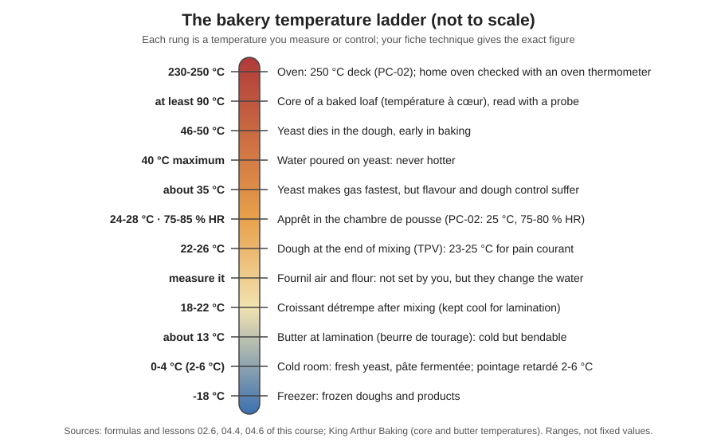

# 05.1 · Temperatures That Matter in a Bakery

A baker controls bread mostly through temperature: of the flour, the room, the water, the dough, the proofing cabinet and the oven. This lesson maps every temperature that matters from storage to cooling, explains what each one changes in the dough, and ends with a temperature audit of your own kitchen that you will use for every calculation in this module.

## Why it matters

The same formula gives a different bread in January and in July if nobody measures. Fermentation speed, dough strength, butter layers and baking all depend on temperature, and most dough faults that look like "bad luck" are a temperature nobody read. The référentiel asks you to explain the effect of dough temperature and propose corrections, to know the role of the base temperature and the water cooler (S3.1), and to spot a break in the cold chain on a temperature record (S4.2). In a bakery, temperatures are read and written down every day: that habit starts here.

> [!NOTE]
> This is the first lesson of a practical module, so the usual reminder: watching someone bake does not make you able to bake. Do the practice at home. The Academy cannot grade photos, so you compare your result with the targets and the rubric yourself, and that self-assessment does not replace the official practical exam.

## Key terms

| French | Say it | English meaning |
|---|---|---|
| température du fournil | *tahm-pay-rah-TOOR doo foor-NEE* | room temperature of the bakehouse, measured at the bench |
| température de la farine | *tahm-pay-rah-TOOR duh lah fah-REEN* | flour temperature, measured inside the sack or bin |
| eau de coulage | *OH duh koo-LAHZH* | the water weighed into the dough (as opposed to bassinage water added later) |
| température de pâte | *tahm-pay-rah-TOOR duh PAHT* | dough temperature at the end of mixing; compared with the TPV on the sheet |
| thermomètre à sonde | *tair-mo-MET-ruh ah SOHND* | probe thermometer: dough, water, flour, core of the bread |
| thermomètre de four | *tair-mo-MET-ruh duh FOOR* | oven thermometer that stays inside the oven |
| température à cœur | *tahm-pay-rah-TOOR ah KUR* | core temperature: in the centre of a loaf or a product |
| chaîne du froid | *SHEN doo FRWAH* | cold chain: keeping chilled and frozen products cold without a break |
| relevé de températures | *ruh-luh-VAY duh tahm-pay-rah-TOOR* | temperature record: readings with date, time and initials |

## How it works

### Two kinds of temperature

Some temperatures you **set**: the water, the proofing cabinet, the cold room, the oven. Others you **only read**: the flour, the fournil air, a piece of pâte fermentée taken from the cold room. A good baker reads the second kind every batch, because they decide what the first kind must be. A sack of flour that sat in a 30 °C store over the weekend makes a different dough from one kept at 18 °C, unless the water is changed to compensate (lesson 05.2).

### The ladder from freezer to oven

| Temperature | Usual range | What it controls | Too low | Too high |
|---|---|---|---|---|
| Cold room / fridge | 0-4 °C (dough retarding 2-6 °C) | keeps yeast, pâte fermentée, butter, dairy, eggs | ice crystals in some products | cold chain broken: yeast weakens, pre-ferments over-ripen, food-safety risk |
| Flour | whatever the store is | a third of the "heat budget" of the dough | cold dough unless the water is warmer | warm dough unless the water is colder |
| Fournil (room) | measured, not chosen | bowl, bench and dough warm or cool towards it | dough cools on the bench, slow fermentation | dough warms on the bench, little tolerance |
| Water | calculated each batch | the one input you adjust freely | — | above about 40 °C on yeast: yeast damaged (lesson [02.6](../module-02/lesson-06.md)) |
| Dough after mixing (TPV) | 23-25 °C pain courant, 22-24 °C tradition | fermentation speed, dough strength | slow, tight, small volume | fast, sticky, bland, over-fermented (lesson [03.4](../module-03/lesson-04.md)) |
| Pre-ferment | as kept: cold room or fournil | part of the dough's heat | cools the dough | warms the dough |
| Butter for lamination | about 13 °C, cold but bendable | layers in croissant dough | butter breaks into pieces | butter melts into the dough, no layers |
| Apprêt | 24-28 °C, 75-85 % HR (PC-02: 25 °C) | final proof speed | long apprêt | outside proofs faster than the centre; butter leaks from viennoiserie |
| Oven | 230-250 °C for lean breads | oven spring, crust, colour | pale, thick crust, poor spring | dark crust before the crumb is baked |
| Core of the loaf | at least about 88-93 °C | crumb set, starch cooked | gummy crumb | — (an overbaked loaf is dry, not "too hot") |

Two figures you already know tie everything together: yeast activity changes by roughly **7 % per °C** of dough temperature (lesson [04.2](../module-04/lesson-02.md)), so 2 °C off target is roughly 15 % faster or slower; and friction from kneading adds about **1-3 °C** by hand and **10 °C or more** in intensive mixing (lesson [03.4](../module-03/lesson-04.md)).

### Measuring correctly

A temperature is only useful if it is measured the same way every time:

- **Check the thermometer** in iced water first (0 °C ±1 °C, lesson [01.4](../module-01/lesson-04.md)); write any offset on it.
- **Flour**: push the probe at least 5 cm into the middle of the sack or bin, not the surface.
- **Room**: at the bench, at dough height, away from the oven, a window and the sun; give the probe 2 minutes in the air.
- **Water**: in the weighed water, just before it goes in. Tap water changes as it runs: measure what you actually pour.
- **Dough**: in the centre of the mass right after mixing, before the dough goes into the tub.
- **Fridge or cold room**: a glass of water left on the shelf for an hour gives the real product temperature better than an air reading taken with the door open.
- **Oven**: an oven thermometer on the middle shelf. The dial and the "preheated" signal are often wrong; ovens are also uneven, hotter at the sides, top and bottom.
- **Core of the bread**: probe into the centre from the side or the base at the end of baking.

Each reading goes on the record with the time. A reading nobody wrote down did not happen.

## Worked example

Monday, 4:30, Boulangerie du Marché, early July. The head baker asks you to do the opening temperature round before the first PC-02 mix (TPV 24 °C). Your readings:

| Point | Reading | Normal |
|---|---|---|
| Cold room (glass of water on the shelf) | 7 °C | 0-4 °C |
| Flour sacks in the store | 26 °C | follows the store |
| Fournil at the bench | 27 °C | follows the season |
| Tap water | 22 °C | follows the season |
| Water cooler outlet | 4 °C | as set |
| Proofing cabinet: display / probe in a glass of water | 25 °C / 28 °C | 25 °C |
| Deck oven: display / oven thermometer | 250 °C / 238 °C | 250 °C |

1. **Cold room at 7 °C: report first.** It holds the fresh yeast and the pâte fermentée. Tell the head baker at once, write the reading on the cold-room record and on a non-conformity note (C4.4). The yeast and the pâte fermentée are checked before use: the pâte fermentée has probably fermented further overnight and the yeast may be weaker; the head baker decides whether to use them. Dairy and eggs follow the shop's hygiene plan (Module 17).
2. **Flour 26 °C and fournil 27 °C: expect very cold water.** Even before friction, the 3-factor sum already holds 26 + 27 = 53 °C of the 72 °C budget for a 24 °C dough (lesson 05.2), so the water must be far below the 22 °C tap: use the water cooler, and plan ice if the cooler cannot go low enough (lesson 05.3).
3. **Cabinet 3 °C hotter than displayed.** With the 7 % rule, 1.07³ ≈ 1.23: an apprêt planned at 1 h 15 would be ready in about 61 minutes. Correct the setting, report the faulty display, and poke-test from 55 minutes.
4. **Oven 12 °C below its display.** Wait until the oven thermometer reads the target before loading, or expect a longer, paler bake. Report it for the technician.
5. **Record everything.** The round took ten minutes and saved a batch of over-proofed baguettes and a cold-chain problem nobody would have seen until the bread was bad.

## Practice

You audit the temperatures of your own kitchen at three moments of a day, test your oven, and calculate whether your tap water can give a 24 °C dough at each moment. Keep the audit: lessons 05.2-05.4 and the module project use it.

> [!WARNING]
> Step 6 heats the oven to 230 °C. Use dry oven gloves to place and read the oven thermometer, open the door slowly and keep your face back from the hot air.

### You need

- Minimum: probe thermometer checked in iced water (lesson [01.4](../module-01/lesson-04.md)), an oven thermometer that can stay in the oven, two glasses, a timer, the audit table below, the [temperature log](../../templates/temperature-log.md).
- Optional: a fridge thermometer, an infrared thermometer (it reads surfaces only, not air or dough centres).
- Professional equivalent: probe thermometers on every bench, cold-room and cabinet displays with alarms, a recorded daily temperature round, a water cooler with its own display.

### Ingredients

No dough today. You only need your usual bag of flour (it is measured, not used) and water.

### In Israel

Checked 2026-10-08.

- **Summer kitchens are warm.** Israel's coastal plain averages about 30 °C at midday in August with humidity around two-thirds (Israel Meteorological Service data); an indoor kitchen without air conditioning (*mazgan* מזגן) often sits between 26 and 32 °C, while an air-conditioned room is cooler. Measure both: the air-conditioned room is your "fournil" in summer.
- **Cold tap water is not cold in summer.** Supply pipes and roof tanks exposed to the sun warm the "cold" line, sometimes close to room temperature or above (plumbers' explanation on Midrag). Measure the first water out of the tap and the water after 30 seconds of running: they can differ by several degrees. Never use the hot tap (from the solar heater, *dud shemesh* דוד שמש) for dough: heat cold water in a kettle instead.
- **Flour follows the cupboard.** A bag kept next to the oven or under a sunny window can be 30 °C in summer. Store bread flour in the coolest cupboard, and in summer keep the bag you are using in a closed box in the fridge if there is room. Which flour to buy: see [Flour in Israel](../../references/flour-in-israel.md).
- **Fridge and freezer.** The Ministry of Health's rules for food businesses require chilled food at no more than 5 °C and frozen food at -18 °C; use the same targets at home (aim for 3-5 °C on the middle shelf). Door shelves run warmer: never keep yeast or dough there.
- **Thermometers.** Look for a *madchom digitali* (מדחום דיגיטלי, digital probe thermometer) reading to 0.1 °C and a *madchom tanur* (מדחום תנור, oven thermometer) in kitchen-equipment shops and online; check both in iced water or against each other before use.

### Steps

1. **Check your probe** in iced water. Write its offset.
2. **Place two glasses of water** in the fridge, one on the middle shelf and one in the door, at least an hour before the first reading.
3. **Morning reading** (soon after you get up): room at the worktop, flour (probe 5 cm into the bag), tap water (first water out, then after running 30 seconds), fridge water from a bottle kept in the fridge, fridge middle shelf, fridge door. Write the time.
4. **Afternoon reading** (the warmest time of day): repeat step 3.
5. **Evening reading**: repeat step 3. If you have a cooler room (air-conditioned, or a cool corridor), measure it too, and any "warm spot" you might use for proofing in winter (oven with only the light on for 30 minutes, top of the fridge).
6. **Oven test.** Put the oven thermometer on the middle shelf. Set the oven to 230 °C, start a timer. Write the oven thermometer reading when the oven signals "preheated", then every 5 minutes until it stops rising. Note the real preheat time and the difference between the dial and the thermometer.
7. **Can your water make a 24 °C dough?** For each reading, use the hand-mix estimate from lesson [01.7](../module-01/lesson-07.md): water ≈ 72 − flour − room − 2. Compare the answer with your tap water (running) and your fridge water.

| Moment | Time | Room | Flour | Tap (first / running) | Fridge bottle | Fridge middle / door | Water needed for 24 °C | Tap enough? |
|---|---|---|---|---|---|---|---|---|
| Morning | | | | | | | | |
| Afternoon | | | | | | | | |
| Evening | | | | | | | | |

### Targets

- Every reading to 0.5 °C, with the time, corrected for your thermometer's offset.
- Three moments of the day; in summer, at least one in the warmest part of the afternoon.
- Fridge middle shelf at 5 °C or below; any reading above it noted with an action.
- Oven: real preheat time to 230 °C and the dial error, both written down.

### How you know it worked

You have a filled audit table and an oven note, and you can say, without guessing, at which time of day your tap water is warm enough or too warm for a 24 °C dough, how cold your fridge really is and how long your oven truly needs. Most learners find their oven needs 10-20 minutes more than its signal, and that in summer the calculated water is colder than the tap: lesson 05.3 deals with that.

### Self-check

- [ ] I checked my thermometer before the audit and corrected every reading for its offset.
- [ ] I can name the temperatures a baker sets and the ones they only read.
- [ ] I can give the usual range for dough, apprêt, cold room, butter for lamination, oven and core of the loaf.
- [ ] I know my real oven preheat time and dial error.
- [ ] I know when my tap water is too warm for a 24 °C dough.

## What goes wrong

| Symptom | Likely cause | Fix now | Prevent next time |
|---|---|---|---|
| Dough temperature very different from the calculation | Flour or room measured at the surface or near a heat source; thermometer offset ignored | Adapt pointage to the real dough temperature | Measure flour inside the bag, room at the bench; apply the offset |
| Bread pale and under-risen though times were followed | Oven colder than its dial; loaded at the "preheated" signal | Bake longer; next load, wait for the oven thermometer | Oven thermometer in the oven; real preheat time on the sheet |
| Apprêt always faster than the sheet | Cabinet or warm spot hotter than displayed | Poke-test earlier | Check the cabinet with a probe in a glass of water |
| Fresh yeast weak, pâte fermentée sour | Cold room or fridge above 4-5 °C, or kept in the door | Check before use; report | Daily cold-room reading; keep yeast on a middle shelf |
| Gummy crumb in a well-coloured loaf | Core not baked: oven too hot, bake too short | Return to the oven | Check the core with a probe at the end of the bake |

## Review

- A baker sets the water, cabinet, cold room and oven, and reads the flour, room and pre-ferment temperatures that decide what the settings must be.
- Know the ladder: cold room 0-4 °C, butter about 13 °C, dough 23-25 °C for pain courant, apprêt 24-28 °C, water never above 40 °C on yeast, core at least about 90 °C, oven 230-250 °C.
- About 7 % faster or slower fermentation per °C of dough; friction adds 1-3 °C by hand, 10 °C or more in intensive mixing.
- Measure the same way every time, with a checked thermometer, and write it down; report readings out of range.
- Exam-relevant (S3.1 base temperature and dough temperature; S4.2 temperature records): see [the CAP exam reference](../../references/cap-exam.md).
