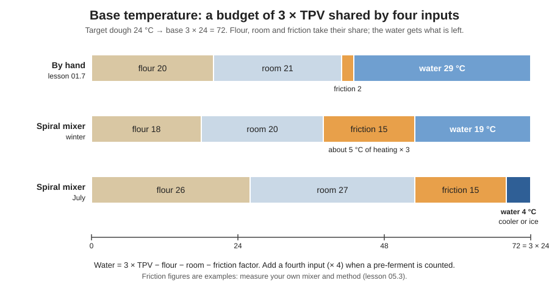

# 05.2 · The Base Temperature Method

In lesson [01.7](../module-01/lesson-07.md) you estimated the water temperature with a quick hand-mix rule. This lesson shows the professional method behind it, the température de base, explains why it works, and shows the two ways it is written on French technical sheets and exam papers. You finish by calculating your water and mixing a dough that lands on its target temperature.

## Why it matters

Every technical sheet gives a target dough temperature (TPV), and the dough reaches it only if the water is right. Water is the one input you can set freely, so the baker calculates it at every mix, from the readings of the day. The référentiel lists the dough temperature and the base temperature among the stages of bread-making (S3.1), and the calculations of production (C1.3) include it: a real EP1 paper (2019) printed a brioche sheet with "TB 48 °C, fournil 22 °C, farine 22 °C" and asked for the water. Getting it wrong costs either a slow, tight dough or a fast, sticky one that ruins the schedule.

## Key terms

| French | Say it | English meaning |
|---|---|---|
| température de base (TB) | *tahm-pay-rah-TOOR duh BAHZ* | base temperature: the total of the input temperatures that gives the target dough temperature |
| TPV (température de pâte visée) | *tay-pay-VAY* | target dough temperature on the sheet |
| eau de coulage | *OH duh koo-LAHZH* | the water weighed into the dough; its temperature is what you calculate |
| échauffement | *ay-shohf-MAHN* | how many degrees mixing adds to the dough |
| facteur de friction | *fak-TUR duh freek-SYOHN* | friction factor: the mixing heat as it appears in the calculation (degrees of heating × number of factors) |
| nombre de facteurs | *NOHM-bruh duh fak-TUR* | number of temperatures added up: 3 (flour, room, water) or 4 with a pre-ferment |
| refroidisseur d'eau | *ruh-frwah-dee-SUR DOH* | water cooler: supplies cold water to the mixer |

## How it works

### Where the dough's heat comes from

When you mix ingredients at different temperatures, the dough settles somewhere between them; then mixing adds heat by friction (lesson [03.4](../module-03/lesson-04.md)). The base-temperature method treats the main inputs as equal partners: the dough temperature is roughly the **average** of the flour, room and water temperatures, plus the heat of mixing. The room counts because the bowl, the air and the bench pull the dough towards it.

Written as a budget, for a dough without pre-ferment (3 factors):

$$3 \times \text{TPV} = \text{flour} + \text{room} + \text{water} + \text{friction factor}$$

so

$$\text{water} = 3 \times \text{TPV} - \text{flour} - \text{room} - \text{friction factor}$$

The **friction factor** is the mixing heat expressed in the same "budget" units: about the number of degrees the mixing adds to the dough, times the number of factors. A spiral mixer that warms the dough by about 5 °C has a friction factor of about 3 × 5 = 15 in a 3-factor calculation.

The bars show the logic: the base is fixed by the target, flour and room take what they take, friction takes its share, and **the water gets what is left**. In July the flour and room eat most of the budget, so the water must be very cold.

### Your 01.7 estimate is the same method

Lesson [01.7](../module-01/lesson-07.md) used *water ≈ 3 × 24 − flour − room − 2*. That is this formula with TPV 24 °C, three factors and a small friction factor of 2 for gentle hand kneading. The full method generalises it in three ways:

- **any target**: 22 °C for a tradition dough, 25 °C for pain complet ([base formulas](../../references/formulas.md)), cooler for a dough going into the fridge (lesson [04.6](../module-04/lesson-06.md));
- **your own friction factor**, measured for your mixer or your hands (lesson [05.3](lesson-03.md));
- **a fourth factor** when a pre-ferment is added (× 4 instead of × 3, lesson [05.3](lesson-03.md)).

### Two ways the base temperature is written

| Written on the sheet | What it means | Water |
|---|---|---|
| "TPV 24 °C", friction factor known | base = 3 × TPV = 72; friction subtracted separately (the course's [temperature log](../../templates/temperature-log.md)) | 72 − flour − room − friction |
| "TB 57 °C" | the bakery's base for this product and mixer, **friction already taken out**: TB = 3 × TPV − friction factor | 57 − flour − room |

French bakeries and exam papers usually give the second form: each bakery knows the TB that gives its target on its mixer, and the baker only subtracts the fournil and the flour. Both give the same water. In the EP1 2019 brioche sheet, TB 48 − (22 + 22) = **4 °C**: a rich dough mixed long in a fast mixer heats a lot, so its TB is low and its water near freezing. On an exam, **use the TB the paper gives**: never replace it with a value you remember.

To turn one form into the other: TB = n × (TPV − heating). A mixer that heats 5 °C, TPV 24, 3 factors: TB = 3 × (24 − 5) = 57.

Try both forms in the simulation: it opens on the EP1 2019 brioche sheet (printed TB); switch to "TPV + friction factor" or pick the 05.2 worked example and compare the working with the steps above.

[Simulation: Water temperature with the base-temperature method](../../simulations/water-temperature/index.html?preset=ep1-brioche)

### Limits of the water

- Water cannot be colder than about 1-2 °C in practice; if the calculation gives less, the water alone cannot do it (ice, colder flour or a shorter mix, lesson [05.3](lesson-03.md)).
- Water should not be above about **40 °C** where it meets yeast (lessons [02.4](../module-02/lesson-04.md) and [02.6](../module-02/lesson-06.md)). If winter calculations go above that, warm the room or the flour instead, or accept a cooler dough and a longer pointage.
- With very cold water, instant yeast should not meet the water directly: mix it into the flour first (lesson [02.6](../module-02/lesson-06.md)).

### Mixing two waters

To get water at a given temperature from a cold source (cooler, fridge bottle) and the tap, take this share of cold water:

$$\text{cold water} = \text{total water} \times \frac{\text{tap} - \text{wanted}}{\text{tap} - \text{cold}}$$

## Worked example

Wednesday, Boulangerie du Marché. The pâte fermentée has run out, so the head baker asks you to mix today's pain courant as a direct dough: 5,400 g of T55, water 64 % = 3,456 g, TPV 24 °C, improved mixing on the spiral. The mixer's card says "échauffement environ 5 °C en pétrissage amélioré". Readings: flour 21 °C, fournil 23 °C, tap water 19 °C, water cooler 4 °C.

1. **Friction factor.** About 5 °C of heating × 3 factors = 15.
2. **Water temperature.** 3 × 24 = 72; 72 − 21 − 23 − 15 = **13 °C**. (Same answer from the TB: 72 − 15 = 57; 57 − (21 + 23) = 13.)
3. **Is the tap enough?** No: the tap is 19 °C. Set the water dosing unit to 13 °C, or blend: cold share = 3,456 × (19 − 13) ÷ (19 − 4) = 3,456 × 0.4 ≈ **1,382 g** of 4 °C water + 2,074 g of tap water.
4. **Mix and measure.** Dough at the end of mixing: 24.5 °C. Within 23-25 °C: follow the sheet's pointage and write the reading on the [temperature log](../../templates/temperature-log.md) with the inputs.
5. **What the reading tells you for next time.** The mixer heated slightly more than the card says; lesson [05.3](lesson-03.md) shows how to turn each reading into your own friction factor.

## Practice

You calculate water temperatures on paper, then mix a PD-01 dough at home that must land at 24 °C ± 1 °C, and use it for flat rolls as in lesson 01.7.

> [!WARNING]
> If you bake the rolls, the oven is at 230 °C with steam: use dry oven gloves, steam only into a preheated metal tray (never a glass dish), pour and stand back. Heat water in a kettle, not from the hot tap, and never use water above 40 °C on yeast.

### You need

- Minimum: scale (1 g; 0.1 g for salt and yeast), checked probe thermometer, bowl, scraper, lidded container, kettle, a bottle of water kept in the fridge, calculator, your audit from lesson [05.1](lesson-01.md), the [temperature log](../../templates/temperature-log.md). For the rolls: as in lesson [01.7](../module-01/lesson-07.md).
- Professional equivalent: water dosing unit with temperature setting, water cooler, spiral mixer with a known friction factor, dough thermometer.

### Ingredients

PD-01, by hand:

| Ingredient | Baker's % | Weight |
|---|---|---|
| Flour T55 (or white bread flour) | 100 | 500 g |
| Water, at the calculated temperature | 65 | 325 g |
| Fine salt | 1.8 | 9 g |
| Fresh yeast (or instant 2.5 g) | 1.5 | 7.5 g |
| **Total** | **168.3** | **841.5 g** |

### In Israel

- **Flour:** use white flour for PD-01 (see [Flour in Israel](../../references/flour-in-israel.md) for the label and the water adjustment).
- **Summer:** with a 30 °C kitchen and flour at 29 °C, 72 − 29 − 30 − 6 = 7 °C: tap water at 26-30 °C cannot do it. Keep a bottle of water in the fridge (about 4-5 °C) and blend it with tap water using the formula above, or mix in the air-conditioned room with flour kept there.
- **Winter:** with an 18 °C kitchen and 17 °C flour, 72 − 17 − 18 − 6 = 31 °C: warm part of the water in a kettle and blend, checking with the probe.

Check your own summer or winter readings in the simulation before you mix (it opens on the summer kitchen):

[Simulation: Water temperature in a summer kitchen](../../simulations/water-temperature/index.html?preset=summer-israel)

### Steps

1. **Exercises first.** Work through the exercises below; check your answers.
2. **Measure** flour (in the bag) and room (at the worktop), and your tap water.
3. **Friction factor.** If you have your lesson [01.7](../module-01/lesson-07.md) or [03.4](../module-03/lesson-04.md) records, calculate it: 3 × dough temperature − flour − room − water of that bake. If not, use 6 (about 2 °C of heating by hand).
4. **Calculate** the water for TPV 24 °C. Blend tap, fridge or kettle water to that temperature ±0.5 °C, weigh 325 g, check it again.
5. **Mix and knead** by hand for 10 minutes as in lesson [01.7](../module-01/lesson-07.md) (instant yeast into the flour first if the water is below about 20 °C).
6. **Measure the dough** in the centre straight after kneading. Fill in the temperature log: target, inputs, friction factor, water, result, difference.
7. **Use the dough:** finish it as the [01.7](../module-01/lesson-07.md) flat rolls, judging pointage by the dough.

### Exercises

1. PD-01 by hand: TPV 24 °C, flour 19 °C, room 21 °C, friction factor 6. Water?
2. Tradition dough, slow mixing: TPV 23 °C, flour 20 °C, fournil 22 °C, friction factor 12. Water?
3. A sheet gives TB 54 °C. Fournil 22 °C, flour 20 °C. Water?
4. EP1 2019 brioche: TB 48 °C, fournil 22 °C, flour 22 °C. Water?
5. A bakery wants TPV 25 °C on a mixer that heats about 6 °C (3 factors). What TB should it write on its sheets?
6. Winter, by hand: TPV 24 °C, flour 15 °C, room 16 °C, friction factor 6. Water, and is it acceptable?
7. You need 650 g of water at 12 °C. Tap 27 °C, fridge bottle 5 °C. How much of each?

Answers

1. 72 − 19 − 21 − 6 = **26 °C**.
2. 3 × 23 = 69; 69 − 20 − 22 − 12 = **15 °C**.
3. 54 − (22 + 20) = **12 °C** (friction is already inside the TB).
4. 48 − (22 + 22) = **4 °C**.
5. TB = 3 × (25 − 6) = **57 °C**.
6. 72 − 15 − 16 − 6 = **35 °C**: acceptable, under 40 °C; warm the room or flour if it ever goes higher.
7. Cold share = 650 × (27 − 12) ÷ (27 − 5) = 650 × 15 ÷ 22 ≈ **443 g** fridge water + **207 g** tap water.

### Targets

- All seven exercises correct (or each mistake understood).
- Water within ±0.5 °C of your calculation.
- Dough at 24 °C ± 1 °C after kneading, recorded in the temperature log with every input.

### How you know it worked

Your dough reads 23-25 °C and you can show, on the log, the calculation that predicted it. If it missed by more than 1 °C, that is not a failure: it is the measurement that gives you your own friction factor in lesson 05.3. Write it down rather than adjusting your figures to look right.

### Self-check

- [ ] I can write the water formula for 3 factors and explain what each term is.
- [ ] I can convert between a TPV with a friction factor and a TB given on a sheet.
- [ ] I can explain why my [01.7](../module-01/lesson-07.md) estimate is a special case of the method.
- [ ] I know the limits of the water (about 1-2 °C cold, 40 °C hot) and what to do beyond them.
- [ ] My dough landed within ±1 °C, or I recorded by how much it missed.

## What goes wrong

| Symptom | Likely cause | Fix now | Prevent next time |
|---|---|---|---|
| Dough 2-3 °C warmer than the target | Friction underestimated; warm flour or room not measured | Shorten pointage, ferment cooler | Measure all inputs; use your measured friction factor |
| Dough 2-3 °C colder than the target | Water cooled after weighing; cold bowl; friction overestimated | Longer pointage, warmer place | Measure the water as it goes in; record the result |
| Water calculated "below zero" | Very warm flour and room, high friction | Use the coldest water you have and adapt fermentation | Ice and other levers (lesson [05.3](lesson-03.md)) |
| Exam answer wrong although the arithmetic is right | Friction subtracted again from a TB that already includes it | — | TB given → water = TB − room − flour only |
| Yeast sluggish after a very cold mix | Instant yeast put straight into ice-cold water | Allow more time | Instant yeast into the flour first |

## Review

- Base = TPV × number of factors (3, or 4 with a pre-ferment); water = base − flour − room (− pre-ferment) − friction factor.
- A TB written on a sheet or an exam paper already includes friction: water = TB − fournil − flour.
- Your [01.7](../module-01/lesson-07.md) estimate is the same method with a small friction factor; the full method changes the target, the friction and the number of factors.
- Water stays between about 1-2 °C and 40 °C; beyond that, use other levers.
- Exam-relevant (S3.1 base temperature, C1.3 calculations): see [the CAP exam reference](../../references/cap-exam.md).
