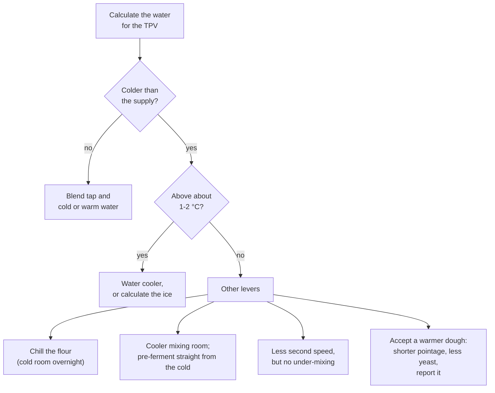

# 05.3 · Friction, Pre-ferments and Ice

The base-temperature method is only as good as its friction factor, and it needs two extensions in real work: a fourth factor when a pre-ferment goes into the dough, and ice when the water must be colder than anything the tap can give. This lesson shows how to measure your own friction factor, how to calculate with a pre-ferment, and how much ice to use, and you measure your hands' friction factor at home.

## Why it matters

A friction factor copied from a book belongs to someone else's mixer. The same dough heats by 2 °C by hand and by 10 °C or more in an intensive spiral mix, and the difference lands directly on the dough temperature, then on the whole schedule. Pâte fermentée and levain arrive at their own temperature, often straight from the cold room. In summer the water must often be colder than the supply, and bakeries use water coolers and ice for that. The référentiel asks you to explain mixing methods, the effect of dough temperature and its corrections, and the role of the water cooler (S3.1); the calculations themselves are production calculations (C1.3). Lesson [21.3](../module-21/lesson-03.md) practises them as timed EP1 questions.

## Key terms

| French | Say it | English meaning |
|---|---|---|
| échauffement | *ay-shohf-MAHN* | degrees the dough gains while mixing |
| facteur de friction | *fak-TUR duh freek-SYOHN* | friction factor: heating × number of factors, used in the calculation |
| pétrissage lent / amélioré / intensifié | *pay-tree-SAHZH LAHN / ah-may-lyo-RAY / an-tahn-see-fee-AY* | slow, improved, intensive mixing (lesson [03.3](../module-03/lesson-03.md)) |
| refroidisseur d'eau | *ruh-frwah-dee-SUR DOH* | water cooler: chills the mixing water and keeps it at a set temperature |
| doseur d'eau | *doh-ZUR DOH* | water meter: delivers a set weight of water at a set temperature to the mixer |
| glace pilée | *GLASS pee-LAY* | crushed ice, melts fast in the mixer |
| eau glacée | *OH glah-SAY* | iced water |
| température du levain / de la pâte fermentée | *tahm-pay-rah-TOOR duh luh-VAN / duh lah PAHT fair-mahn-TAY* | temperature of the pre-ferment, the fourth factor |

## How it works

### Friction: what heats a dough

Mixing turns mechanical work into heat. The dough gains more heat when:

- **mixing is longer or faster**: second speed heats much faster than first;
- **the dough is firmer**: a stiff dough resists the hook more than a soft one;
- **the batch fills the bowl differently**: a small batch in a big spiral bowl and a full bowl do not heat the same; record the batch size with the friction factor;
- **the mixer is a spiral rather than an oblique-axis mixer**, which heats less;
- **the room and bowl are warm**.

Usual orders of magnitude for a bread dough (consistent with lesson [03.4](../module-03/lesson-04.md)); your own measurement always wins:

| Mixing | Heating of the dough | Friction factor, 3 factors | Friction factor, 4 factors |
|---|---|---|---|
| By hand, gentle folds in the bowl | about 0-1 °C | about 0-3 | about 0-4 |
| By hand, 10 minutes of kneading | about 1-3 °C | about 3-9 | about 4-12 |
| Home stand mixer, about 7 minutes | about 4-5 °C | about 12-15 | about 16-20 |
| Spiral, slow mixing (first speed) | a few degrees, about 2-4 °C | about 6-12 | about 8-16 |
| Spiral, improved mixing | about 4-7 °C | about 12-21 | about 16-28 |
| Spiral, intensive mixing | 10 °C or more | 30 or more | 40 or more |

The home figures match those published by King Arthur Baking for hand kneading and a stand mixer, converted from Fahrenheit.

### Measuring your own friction factor

After a batch, work backwards (the King Arthur method):

$$\text{friction factor} = n \times \text{dough temperature} - (\text{flour} + \text{room} + \text{water} \;[+\text{pre-ferment}])$$

with n = 3, or 4 when a pre-ferment is counted. Example from lesson [01.7](../module-01/lesson-07.md): Sam's flour 20 °C, kitchen 21 °C, water 29 °C, dough 25.5 °C. Friction factor = 3 × 25.5 − (20 + 21 + 29) = 76.5 − 70 = **6.5**, about 2 °C of heating: normal hand kneading, and the reason her dough came out warmer than the estimate's allowance of 2 predicted.

Rules that keep the number useful:

- One friction factor **per product, method and batch size**: "PC-02, improved, 5.4 kg" is not "tradition, slow, 3 kg".
- **Recalculate it after every batch** and use the average of the last few. If one batch is far off, move only part of the way (King Arthur's advice: correct by the difference you saw, not more).
- The method treats flour, room, water and pre-ferment as equal partners. They are not (water stores far more heat per gram than flour, and the room acts only through the bowl and air), but the measured friction factor absorbs the difference **as long as you always calculate the same product the same way**. That is why a TB on a bakery sheet is only valid for that bakery's mixer and product.

### Pre-ferments: the fourth factor

A pre-ferment brings its own temperature: pâte fermentée from the cold room at 4-8 °C, a poolish ripened at 18-24 °C, a levain at 24-28 °C ([base formulas](../../references/formulas.md)). With a pre-ferment, the budget becomes **4 × TPV**:

$$\text{water} = 4 \times \text{TPV} - \text{flour} - \text{room} - \text{pre-ferment} - \text{friction factor}$$

The friction factor must then be measured with 4 factors too (it is about 4 × the heating). Never mix the two conventions: a 3-factor friction factor in a 4-factor calculation gives water that is far too warm.

### Ice

Water cannot be colder than 0 °C, and the supply is often much warmer. Melting ice absorbs a lot of heat: melting 1 g of ice takes about as much heat as cooling 80 g of water by 1 °C. So to get water at the wanted temperature from tap water and ice:

$$\text{ice} = \text{total water} \times \frac{\text{tap} - \text{wanted}}{\text{tap} + 80}$$

and the rest of the water weight is tap water. The ice **is** part of the water: total water weight stays the same.

- Use crushed ice or small cubes, add it with the water at the start of frasage, and check no lumps remain at the end of frasage.
- Freezer ice is colder than 0 °C, so it cools slightly more than the formula says; that is a small safety margin in summer.
- The limit: if all of the water were ice, it could bring the mix only to about 0 °C. When the calculated water is below about 1-2 °C, ice alone will not reach the target.

The simulation opens on this lesson's PC-02 worked example (four factors, ice). Change the flour, fournil or friction factor and watch the water, the ice and the fermentation speed move; push the readings up until the water drops below 1-2 °C.

[Simulation: Water temperature with a pre-ferment and ice](../../simulations/water-temperature/index.html?preset=pc02)

### When the water cannot do it

In bakeries the **water cooler** (refroidisseur d'eau) is the everyday answer: it chills mains water and holds it in an insulated tank or chills it on demand, and a water meter (doseur) delivers the weight and temperature asked for at each mix. Ice is the backup and the summer extra.

## Worked example

July, Boulangerie du Marché. PC-02 (lesson [01.6](../module-01/lesson-06.md)): 5,400 g T55, water 64 % = 3,456 g, pâte fermentée 15 % = 810 g from the cold room, TPV 24 °C, improved mixing. The water cooler is out of order this morning; the technician comes at noon.

1. **Your friction factor for this product.** Last week's record for PC-02: flour 19 °C, fournil 21 °C, pâte fermentée 8 °C, water 24 °C, dough 24.5 °C. Friction factor (4 factors) = 4 × 24.5 − (19 + 21 + 8 + 24) = 98 − 72 = **26** (about 6.5 °C of heating).
2. **Today's readings.** Flour 22 °C, fournil 25 °C, pâte fermentée 6 °C, tap water 26 °C.
3. **Water temperature.** 4 × 24 = 96; 96 − 22 − 25 − 6 − 26 = **17 °C**.
4. **Ice.** 3,456 × (26 − 17) ÷ (26 + 80) = 3,456 × 9 ÷ 106 ≈ **293 g of ice** and 3,456 − 293 = **3,163 g of tap water**.
5. **Mix.** Ice and water in first, flour on top, frasage; pâte fermentée at the end of frasage as the sheet says; check no ice is left. Dough at the end: 24.6 °C. Within range.
6. **Update the record.** Today's friction factor = 4 × 24.6 − (22 + 25 + 6 + 17) = 98.4 − 70 = 28.4. The average of the last two batches is about 27: use 27 tomorrow. Note on the sheet: "refroidisseur en panne, 293 g de glace".

## Practice

You measure your own hand-mixing friction factor from one dough, use it to calculate a second dough, and check the ice formula with a glass of water. If you own a stand mixer, you measure its friction factor too.

> [!WARNING]
> If you bake the doughs, the oven is at 230-240 °C with steam: use dry oven gloves, steam only into a preheated metal tray, pour and stand back. A stand mixer: never put a hand or scraper in the bowl while the hook turns; switch off and wait for it to stop.

### You need

- Minimum: scale (1 g; 0.1 g for salt and yeast), checked probe thermometer, two bowls, scraper, two lidded containers, ice cubes, a jug, kettle, calculator, the [temperature log](../../templates/temperature-log.md) (one per dough), your lesson [05.1](lesson-01.md) audit.
- Optional: a stand mixer with a dough hook.
- Professional equivalent: spiral mixer with timer and speeds recorded, water cooler and water meter, flaked-ice machine, a friction factor written on each technical sheet.

### Ingredients

Two PD-01 doughs (three with a stand mixer), each:

| Ingredient | Baker's % | Weight |
|---|---|---|
| Flour T55 (or white bread flour) | 100 | 500 g |
| Water, at the calculated temperature | 65 | 325 g |
| Fine salt | 1.8 | 9 g |
| Fresh yeast (or instant 2.5 g) | 1.5 | 7.5 g |

### In Israel

Checked 2026-10-08.

- **Ice at home:** freezer cubes (*kubiyot kerach*, קוביות קרח) are enough for home batches; weigh them, since cube sizes vary. For larger amounts, bags of ice (*sakit kerach*, שקית קרח) are sold in many supermarkets and convenience shops in summer: buy ice made for drinks, not for cool boxes.
- **Fridge water first:** a bottle of water kept in the fridge (about 4-5 °C) often replaces ice for a 500 g home batch. Calculate the blend as in lesson 05.2.
- **Summer flour:** put the bag of white flour ([Flour in Israel](../../references/flour-in-israel.md)) in the fridge the evening before a summer bake, closed in a box against smells and humidity. It can cut 10 °C or more off the flour reading and spare most of the ice.
- **Pre-ferments in summer:** a levain or poolish left in a 30 °C kitchen ripens much faster than the [base formulas](../../references/formulas.md) say. Ripen it in the air-conditioned room or for part of the time in the fridge, and record its temperature as the fourth factor.
- **Friction:** the figures in the table apply in Israel too; only the inputs change. Measure your friction factor in the season you bake.

### Steps

**Part A: measure your friction factor (dough 1)**

1. Measure flour, room and tap water. Calculate the water for TPV 24 °C with friction factor 6 (or your own value from lesson [05.2](lesson-02.md)). Weigh 325 g at that temperature.
2. Mix and knead by hand for exactly 10 minutes as in lesson [01.7](../module-01/lesson-07.md). Time it.
3. Measure the dough temperature in the centre. Calculate your friction factor: 3 × dough − (flour + room + water). Write it on the log.

**Part B: use it (dough 2, 30-60 minutes later)**

4. Measure flour, room and water again (they may have changed). Calculate the water with **your** friction factor from step 3.
5. Mix and knead the same way, the same 10 minutes. Measure the dough. It should land within ±1 °C of 24 °C. Calculate this dough's friction factor too and average the two.

**Part C: the ice check (10 minutes)**

6. Measure the tap water. Calculate the ice needed for 325 g of water at 10 °C. Weigh the ice, then add tap water to a total of 325 g. Stir until the ice has melted and measure. Compare with 10 °C.

**Part D: stand mixer (optional)**

7. Mix a third dough in the stand mixer: 3 minutes on the lowest speed, then the kneading speed until the dough is smooth (note the minutes). Measure and calculate the mixer's friction factor. Write the time and speeds next to it.

8. Use the doughs: bake them as flat rolls or bâtards (lessons [01.7](../module-01/lesson-07.md) and [04.3](../module-04/lesson-03.md)), or ferment one in the fridge overnight (lesson [04.6](../module-04/lesson-06.md)). Judge pointage by the dough.

### Exercises

1. Record: flour 18 °C, room 20 °C, water 30 °C, dough 25 °C, by hand, no pre-ferment. Friction factor?
2. Tradition with 20 % levain: TPV 23 °C, flour 21 °C, fournil 24 °C, levain 26 °C, friction factor (4 factors) 16. Water?
3. You need 3,000 g of water at 8 °C. Tap 24 °C. How much ice and how much tap water?
4. TPV 24 °C, flour 28 °C, room 30 °C, hand kneading friction factor 9, no pre-ferment, tap 27 °C. Water? Ice for 325 g?
5. A baker uses a 3-factor friction factor of 15 in a 4-factor calculation with pâte fermentée at 6 °C (TPV 24 °C, flour 20 °C, fournil 22 °C). What water results, and what should it have been with a 4-factor friction factor of 20?

Answers

1. 3 × 25 − (18 + 20 + 30) = 75 − 68 = **7**.
2. 4 × 23 = 92; 92 − 21 − 24 − 26 − 16 = **5 °C** (cooler or ice).
3. Ice = 3,000 × (24 − 8) ÷ (24 + 80) = 3,000 × 16 ÷ 104 ≈ **462 g**; tap water 3,000 − 462 = **2,538 g**.
4. 72 − 28 − 30 − 9 = **5 °C**. Ice = 325 × (27 − 5) ÷ (27 + 80) = 325 × 22 ÷ 107 ≈ **67 g**, tap water **258 g**. (Fridge water at 4-5 °C would do it without ice.)
5. With 15: 96 − 20 − 22 − 6 − 15 = **33 °C**, too warm. With 20: 96 − 20 − 22 − 6 − 20 = **28 °C**. Mixing conventions gives a dough several degrees too warm.

### Targets

- Friction factor of your hand kneading measured on two doughs and averaged; written with the kneading time.
- Dough 2 within 24 °C ± 1 °C.
- Ice check: water within ±1.5 °C of 10 °C after the ice has melted.
- All five exercises correct.

### How you know it worked

Your hand friction factor usually comes out between about 3 and 9; the second dough lands within a degree of 24 °C because it used your number, not a guess. The ice check lands close to 10 °C, often a little below (freezer ice is colder than 0 °C). You now have a personal friction factor that you will write on every temperature log.

### Self-check

- [ ] I can list five things that make a dough heat more during mixing.
- [ ] I measured my friction factor twice and know its average.
- [ ] I can calculate water with a pre-ferment as fourth factor and know why the friction factor must use the same convention.
- [ ] I can calculate ice and know the point where ice alone is not enough.
- [ ] I can name three other levers when the water cannot reach the target.

## What goes wrong

| Symptom | Likely cause | Fix now | Prevent next time |
|---|---|---|---|
| Dough always 2-4 °C warmer than calculated | Friction factor from a book, lower than your mixer's | Shorter pointage, cooler place | Measure your friction factor; update it every batch |
| Dough far too warm in a dough with pâte fermentée | 3-factor friction factor used in a 4-factor calculation, or pre-ferment temperature not counted | Shorter pointage; report | One convention per product, written on the sheet |
| Lumps of ice in the dough at the end of frasage | Large cubes added late | Keep mixing in first speed until melted; check temperature | Crushed ice, added with the water at the start |
| Dough too cold after ice | Ice weighed on top of the full water weight | Longer, warmer pointage | Ice is part of the water: total stays the same |
| Warm dough in summer even with iced water | Calculation below 1-2 °C: water alone cannot reach it | Accept and shorten pointage; report | Chill the flour, cool the room, review the mixing time |
| Over-oxidised, warm dough after "fixing" a cold one | Long second speed used to warm a cold dough | Divide quickly, cool proof | Correct the water next time, not the mixing (lesson [03.4](../module-03/lesson-04.md)) |

## Review

- Friction heats a dough by about 1-3 °C by hand, a few degrees in slow mixing, more in improved and 10 °C or more in intensive mixing; it rises with time, speed, firmness and batch size.
- Friction factor = n × dough − sum of the inputs; measure it per product, method and batch size and update it every batch.
- With a pre-ferment, use 4 × TPV and a 4-factor friction factor; never mix conventions.
- Ice = water × (tap − wanted) ÷ (tap + 80), and it is part of the water weight; below about 1-2 °C, chill the flour, cool the room or adapt the fermentation.
- Exam-relevant (S3.1 mixing methods, base temperature, water cooler; C1.3): see [the CAP exam reference](../../references/cap-exam.md).
