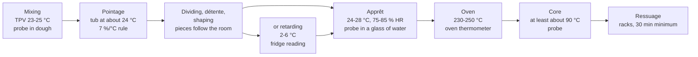

# 05.4 · Temperature Through the Whole Process

Hitting the target at the end of mixing is only the first reading. The dough then cools or warms in the tub, on the bench, in the cabinet and in the oven, and each stage has its own target and its own check. This lesson follows the temperature from mixing to cooling, shows how to adapt the schedule when a reading is off, adds the special case of viennoiserie, and you keep a complete temperature log of a full bake.

## Why it matters

A dough that left the mixer on target can still over-proof in a cabinet that runs hot, or bake pale in an oven that is 15 °C under its dial. A baker who reads the temperature only once finds the problem in the finished bread; one who reads it at every stage corrects it while the dough can still be saved. The référentiel covers every stage of bread-making from dough temperature to baking and cooling (S3.1) and viennoiserie doughs, whose layers depend on temperature (S3.4). Recording and reporting what went wrong during production is a competency of its own (C4.4).

## Key terms

| French | Say it | English meaning |
|---|---|---|
| relevé de températures | *ruh-luh-VAY duh tahm-pay-rah-TOOR* | temperature log: each reading with time and initials |
| chambre de pousse / étuve | *SHAHM-bruh duh POOSS / ay-TOOV* | proofing cabinet: warm and humid, for the apprêt |
| hygrométrie (HR) | *ee-gro-may-TREE* | relative humidity of the proofing air |
| température à cœur | *tahm-pay-rah-TOOR ah KUR* | core temperature of the loaf at the end of baking |
| ressuage | *ruh-sew-AHZH* | cooling on racks, while steam and heat leave the bread |
| détrempe | *day-TRAHMP* | the dough (flour, water, milk, yeast…) before butter is laminated into it |
| beurre de tourage | *BUR duh too-RAHZH* | butter for lamination, worked cold but bendable |
| four à sole | *FOOR ah SOLL* | deck oven: bread baked directly on a hot stone or steel floor |

## How it works

### The dough after the mixer

A dough is a mass that slowly moves towards the temperature around it. A 10 kg tub of dough changes temperature slowly, so the end-of-mixing reading largely sets the pointage. Divided pieces are small: on a bench they reach the room temperature much faster, and in the cabinet they follow the cabinet air. So **the bigger the mass, the more the mixing temperature matters; the smaller the piece, the more the room or cabinet matters.** That is why the sheet gives a temperature for each stage, not only the TPV.

### Stage by stage

| Stage | Target (pain courant, PC-02) | Check | If off |
|---|---|---|---|
| End of mixing | 24 °C (23-25 °C) | probe in the centre of the dough | adapt pointage with the 7 % rule; correct the water next batch (lessons 05.2-05.3) |
| Pointage | tub covered, about 24 °C | dough temperature at the end; volume and feel | move the tub warmer or cooler; divide by the signs (lesson [04.2](../module-04/lesson-02.md)) |
| Dividing and shaping | fournil temperature | room reading; pieces covered | long détente in a cold fournil; work fast in a hot one |
| Retarding (if used) | 2-6 °C in the cold room | cold-room reading on the record | over-proofed at the set time = too warm (lesson [04.6](../module-04/lesson-06.md)) |
| Apprêt | 25 °C, 75-80 % HR | cabinet checked with a probe, not only its display | poke test decides (lesson [04.4](../module-04/lesson-04.md)) |
| Oven | 250 °C deck, steam at loading | oven thermometer or the oven's checked probe | wait, or adjust bake time and colour target |
| Core of the bread | at least about 90 °C (lean breads usually finish well above) | probe at the end of the bake, on one test loaf | return to the oven if under |
| Ressuage | racks, 30 minutes minimum | — | bagging warm bread traps steam: soft crust, mould sooner |

### The 7 % rule through the day

Fermentation speeds up or slows down by roughly **7 % per °C** (lesson [04.2](../module-04/lesson-02.md)): 1.07 for 1 °C, about 1.15 for 2 °C, 1.23 for 3 °C, 1.31 for 4 °C, 1.40 for 5 °C. Use it to plan pointage and apprêt when a reading is off, then let the dough's signs (volume, feel, poke test) confirm. Because pieces move towards the cabinet or room temperature, the rule over-states the effect on apprêt of a dough that was warm at mixing: the place where the pieces proof matters more.

### Viennoiserie: temperature decides the layers

Laminated doughs (croissant, pain au chocolat, S3.4) depend on butter staying in separate sheets between dough layers:

- **Détrempe cool**: 18-22 °C after mixing ([base formulas](../../references/formulas.md)), so the dough is firm enough to roll and does not ferment much during lamination. Its water is calculated exactly as for bread, often with iced water.
- **Butter about 13 °C at lamination**: cold but bendable, close to the détrempe's firmness. Colder, it breaks into pieces; warmer, it smears into the dough.
- **Rest in the cold between turns** to firm both again.
- **Proof below the butter's softening point**: keep laminated dough below about 27 °C, or the butter melts and leaks from the pieces in the oven. Viennoiserie is proofed cooler than bread would allow.

Rich doughs such as brioche are mixed long with a lot of butter, which heats them, so their TB is low and their water very cold (the EP1 2019 brioche: TB 48 °C, water 4 °C, lesson [05.2](lesson-02.md)). [Modules 11](../module-11/lesson-03.md) and [12](../module-12/lesson-01.md) take these products in detail.

## Worked example

Saturday, early July. PC-02 for 24 baguettes and 20 rolls. The ice bag ran out halfway through weighing, so the water went in at 22 °C instead of the calculated 14 °C. Your temperature log:

| Time | Point | Reading | Target | Decision |
|---|---|---|---|---|
| 4:00 | Flour / fournil / pâte fermentée / water | 23 / 26 / 6 / 22 °C | water 14 °C | ice short: recorded |
| 4:15 | Dough, end of mixing | 26.0 °C | 24 °C | 2 °C warm: pointage 45 ÷ 1.15 ≈ 39 min; tub in the coolest corner; check from 35 min |
| 4:52 | Dough, end of pointage | 26.5 °C | — | volume and feel right: divide now |
| 5:20 | Cabinet (probe in glass of water) | 25.0 °C, 78 % HR | 25 °C, 75-80 % | pieces start warmer than the cabinet: poke-test from 1 h |
| 6:25 | Poke test / oven thermometer | ready / 247 °C | 250 °C | load baguettes |
| 6:47 | Core of a test baguette | 97 °C | at least about 90 °C | out; ressuage on racks |
| 7:20 | Bread to the shop | — | 7:00 | 20 minutes late |

1. **What the log shows.** A water error of 8 °C produced a dough 2 °C warm (consistent with the friction factor of 27 in lesson 05.3: (23 + 26 + 6 + 22 + 27) ÷ 4 = 26). The pointage was cut by the rule and confirmed by the dough; the apprêt started from warm pieces.
2. **Why the bread was late.** The oven had been switched on late and reached only 247 °C at 6:25; the bread itself was fine.
3. **Corrections for next time** (written under the log): two bags of ice in stock for the summer, checked the evening before; oven switched on 15 minutes earlier on summer Saturdays.
4. **Report.** "PC-02 du 12/07: eau à 22 °C (glace manquante), pâte à 26 °C, pointage réduit à 37 min; four à 247 °C à 6:25, livraison magasin à 7:20." The head baker sees cause, action and consequence in three lines (C4.4).

## Practice

You keep a full temperature log of one bake, from the ingredients to the cooled bread, and write the correction for the next batch. The example uses PD-01 as two bâtards; you can use any bread from the earlier lessons.

> [!WARNING]
> The oven is at 240 °C with steam. Use dry oven gloves; steam only into a preheated metal tray (never a glass dish), pour and stand back. Probe the bread's core with the tray on a heat-proof surface, not inside the oven, and score with the blade moving away from your fingers.

### You need

- Minimum: scale (0.1 g for salt and yeast), checked probe thermometer, oven thermometer, bowl, scraper, lidded container with the level marked, a cover for the apprêt, baking paper, tray, metal steam tray, oven gloves, lame, wire rack, timer, the [temperature log](../../templates/temperature-log.md) and the [bake log](../../templates/bake-log.md), your friction factor from lesson 05.3.
- Professional equivalent: probe thermometers at every station, cabinet and cold-room displays with alarms, a deck oven with a calibrated probe, a daily temperature record.

### Ingredients

| Ingredient | Baker's % | Weight |
|---|---|---|
| Flour T55 (or white bread flour) | 100 | 500 g |
| Water, at the calculated temperature | 65 | 325 g |
| Fine salt | 1.8 | 9 g |
| Fresh yeast (or instant 2.5 g) | 1.5 | 7.5 g |
| **Total** | **168.3** | **841.5 g** |

### In Israel

Checked 2026-10-08.

- **Apprêt in a summer kitchen.** At 30 °C your pieces proof about 1.4 times faster than at 25 °C (1.07⁵). Proof in the air-conditioned room, or start the poke test early and be ready to bake. In winter, the oven with only the light on (checked with the probe) gives a 24-26 °C spot.
- **Humidity.** Summer air on the coast is humid, so dough skins less; in an air-conditioned room it dries faster: always cover.
- **Fridge for retarding.** Keep the fridge at 5 °C or below, the limit the Ministry of Health sets for chilled food in food businesses; check it before an overnight dough.
- **Storing the bread.** In humid summer heat bread moulds sooner: once fully cooled, keep what you eat in a day or two in a bag and freeze the rest (-18 °C) in slices.
- **Butter for later modules.** In summer, laminate only in the coolest room or early morning, with butter straight from the fridge brought to about 13 °C; [Modules 11](../module-11/lesson-03.md) and [12](../module-12/lesson-01.md) give the details. Flour: [Flour in Israel](../../references/flour-in-israel.md).

### Steps

1. **Before mixing.** Read and write flour, room, tap water, fridge (if you will retard) and the place you will use for pointage and apprêt. Calculate the water with your friction factor (lesson 05.3). Switch the oven on later so it is truly at 240 °C by baking time (your real preheat time from lesson 05.1).
2. **Mixing.** Mix and knead as in lesson 01.7. Measure the dough: write time and temperature. If it is off by more than 1 °C, calculate the new pointage with the 7 % rule.
3. **Pointage.** Fold at 40 minutes. At the end, measure the dough again and write the volume and the room temperature.
4. **Dividing and shaping.** Divide into two pieces of about 415 g, pre-shape, détente, shape two bâtards of about 25 cm (lesson [04.3](../module-04/lesson-03.md)). Write the room temperature and one piece's temperature after shaping.
5. **Apprêt.** Cover. Measure the proofing place (probe in a glass of water). Poke-test from the early end; write the time and the result.
6. **Oven.** Read the oven thermometer just before loading and write it. Score, steam, bake about 25 minutes.
7. **Core.** Take one bâtard out on its tray, probe the centre from the base: at least about 90 °C. If under, bake 5 more minutes and measure again. Write it.
8. **Ressuage.** Cool on a rack for at least 1 hour; measure the core at the end (it should be close to room temperature) and write it.
9. **Review.** Under the log write: target versus actual at each stage, what you changed during the bake, and the correction for next time (water, place, oven).

### Targets

- At least eight readings with times: inputs, end of mixing, end of pointage, after shaping, apprêt place, oven, core, after cooling.
- Dough within 24 °C ± 1 °C, or the pointage adapted with the rule and the reason written.
- Core at least about 90 °C at the end of baking.
- One written correction for the next batch.

### How you know it worked

Your log reads like the worked example: each reading has a time, each deviation has a decision, and the last lines say what changes next time. The bread is evenly baked with a set crumb, and you can explain from the log, not from memory, why the pointage or the apprêt took the time it did. If the bread disappointed, the log usually shows where: a warm proof, a cool oven or a core that was never checked.

### Self-check

- [ ] I measured and wrote the temperature at every stage, with the time.
- [ ] I adapted at least one stage time from a reading and confirmed it by the dough.
- [ ] I can explain why small pieces follow the room or cabinet more than the mixing temperature.
- [ ] I can give the détrempe, butter and proof temperature limits for laminated doughs and say why.
- [ ] I wrote a correction for the next batch.

## What goes wrong

| Symptom | Likely cause | Fix now | Prevent next time |
|---|---|---|---|
| Pointage over before the oven is ready | Dough warm after mixing; warm fournil | Move the tub somewhere cooler; divide by the signs | Correct the water; oven timing on the log |
| Pieces over-proofed though the dough was on target | Cabinet or proofing place warmer than displayed | Bake at once, shallower scoring | Check the cabinet with a probe in a glass of water |
| Pale crust, weak oven spring | Oven below its dial; loaded too early | Longer bake | Oven thermometer; real preheat time |
| Dark crust, gummy centre | Oven too hot for the size; core not checked | Lower the oven, bake longer | Probe the core of a test loaf |
| Soft crust, damp bread next day | Bread bagged warm | Unbag and dry on a rack | Full ressuage on racks |
| Croissants leaking butter in the oven, flat layers | Butter too warm at lamination or proof above about 27 °C | — | Cool détrempe, butter about 13 °C, cooler proof |

## Review

- The dough's temperature changes at every stage: big masses keep the mixing temperature, small pieces follow the room or cabinet.
- Each stage has a target and a check: TPV, pointage place, fournil, cold room 2-6 °C, apprêt 24-28 °C, oven checked with a thermometer, core at least about 90 °C, ressuage on racks.
- Use the 7 % per °C rule to adapt times, and let the dough confirm.
- Viennoiserie: cool détrempe, butter about 13 °C, cold rests, proof below about 27 °C.
- Exam-relevant (S3.1, S3.4, C4.4): see [the CAP exam reference](../../references/cap-exam.md).
