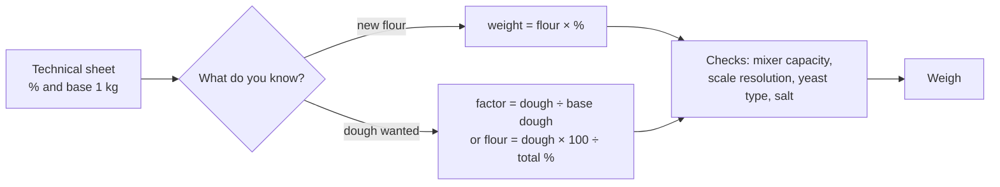

# 06.1 · Scaling a Formula

A technical sheet is written once, for 1 kg of flour, and then made at whatever size the day's orders need. This lesson shows the two ways to scale it (from the flour, or with a scaling factor), what does not scale with the batch, and the checks a professional makes before weighing: mixer capacity, scale resolution, yeast type and salt.

## Why it matters

The written phase of the production test asks you to complete technical sheets for an order, and the référentiel marks the exactness of your calculations under C1.3 (see [The CAP Boulanger Exam](../../references/cap-exam.md)). In a bakery, the same PC-02 sheet is made at 4 kg on a quiet Monday and at 15 kg on a Saturday. One wrong multiplication gives a dough that is too wet, too salty or too big for the mixer, and you find out only when it is too late to start again. Lesson [01.5](../module-01/lesson-05.md) gave you the three baker's-percentage formulas; this module turns them into a professional routine, starting with scaling.

## Key terms

| French | Say it | English meaning |
|---|---|---|
| base 1 kg (de farine) | *bahz uhn kee-LO* | the column of a technical sheet giving each weight for 1 kg of flour |
| lot / fournée | *LO / foor-NAY* | batch of dough / one oven load |
| coefficient | *ko-ay-fee-SYAHN* | scaling factor: new quantity ÷ base quantity |
| capacité du pétrin | *ka-pa-see-TAY dü pay-TRAN* | mixer capacity: the maximum (and minimum) dough the bowl can work |
| sac de farine | *sak duh fah-REEN* | flour sack; 25 kg is the usual size in French bakeries |
| levure sèche instantanée | *luh-VÜR sesh an-stahn-tah-NAY* | instant dry yeast: about one third of the fresh yeast weight |
| arrondir | *ah-rohn-DEER* | to round (the flour first, then the rest from it) |

## How it works

### Two ways to scale, one answer

**From the flour (the method of lesson [01.5](../module-01/lesson-05.md)).** Fix the flour for the new batch, then multiply it by each percentage. Every weight comes straight from the sheet's percentages, so nothing drifts.

**With a scaling factor.** Divide the new quantity by the base quantity and multiply every base weight by that factor:

$$\text{factor} = \frac{\text{new flour (or new dough)}}{\text{base flour (or base dough)}}$$

From 1 kg to 4.5 kg of flour the factor is 4.5; to make 13,672 g of PC-02 dough from a base of 1,823 g the factor is 13,672 ÷ 1,823 = 7.5. Both methods give the same weights if you start from the sheet's exact base. They part company when you scale a recipe whose grams were already rounded: every rounding is multiplied by the factor. Scale from the percentages, not from yesterday's rounded batch.

PD-01 (lesson [01.6](../module-01/lesson-06.md)) at three sizes:

| Ingredient | % | Base 1 kg | 10 kg (factor 10) | 4.5 kg (factor 4.5) |
|---|---|---|---|---|
| Flour T55 | 100 | 1,000 g | 10,000 g | 4,500 g |
| Water | 65 | 650 g | 6,500 g | 2,925 g |
| Salt | 1.8 | 18 g | 180 g | 81 g |
| Fresh yeast | 1.5 | 15 g | 150 g | 67.5 g |
| **Total** | **168.3** | **1,683 g** | **16,830 g** | **7,573.5 g** |

### What does not scale with the batch

- **Mixing times** belong to the mixer, not to the recipe. A spiral mixer's times on the sheet hold across its working range; a dough mixed by hand at home takes longer than the machine times (lesson [03.3](../module-03/lesson-03.md)).
- **Dough temperature** is reached by the water temperature, not by the size of the batch ([Module 5](../module-05/lesson-02.md), Temperature Management). A big dough mass holds its heat longer in the tub, so a large batch can run slightly ahead of a small one.
- **Fermentation times** are tied to the dough's temperature and signs, not to its weight (lesson [04.2](../module-04/lesson-02.md)).
- **Oven loads**: ten times the dough is not ten times the oven. Count the loads and their times.

### Mixer capacity: split before you weigh

Every mixer has a maximum dough load on its plate or in its manual, and a minimum below which the hook cannot catch the dough. If the scaled batch is too big, split it into equal batches, each calculated from the percentages. Example: PC-02 on 15 kg of flour makes 15,000 × 182.3 ÷ 100 = 27,345 g of dough. A 25 kg mixer cannot take it, so make two batches of 7.5 kg of flour (13,672.5 g each). The largest single PC-02 batch the mixer accepts is 25,000 × 100 ÷ 182.3 = 13,713 g of flour: round **down** to 13,700 g (24,975 g of dough). Capacity is the one place you round the flour down.

### Small weights, units and yeast types

- **Resolution.** Yeast at 1.5 % of 500 g is 7.5 g: a 1 g kitchen scale is not precise enough, use a 0.1 g pocket scale (lesson [01.4](../module-01/lesson-04.md)). In a 10 kg batch, 150 g of yeast is fine on the bench scale.
- **Units.** 1,000 g = 1 kg. A litre of water weighs 1 kg, which is why bakers weigh water instead of measuring its volume; milk is slightly heavier (about 1.03 kg per litre), so weigh it too.
- **Yeast type.** The course's formulas use fresh yeast. Instant dry yeast: about one third of the fresh weight; active dry yeast: about 40-50 % ([base formulas](../../references/formulas.md), lesson [02.6](../module-02/lesson-06.md)). 67.5 g of fresh yeast becomes about 22.5 g of instant dry yeast.
- **Sacks.** 13,700 g of flour is half a 25 kg sack plus 1,200 g: plan which sack you open and note its lot number on the requisition.

### Salt: check the formula before you scale it

A formula found in a book or a supplier's leaflet may not respect the French bread salt agreement. Lesson [02.5](../module-02/lesson-05.md) shows the check: per 100 g of flour, a lean dough weighs about 168 g; after about 20 % baking loss the bread weighs about 135 g. Salt at 1.8 % of flour gives about 1.34 g per 100 g of bread, under the 1.4 g limit for pain courant; 2.0 % gives about 1.48 g, over it. Scaling does not change these ratios: if the formula is wrong at 1 kg, it is wrong at 10 kg.

## Worked example

Monday morning, the chef hands you a supplier's leaflet: "Pain courant: farine 10 kg, eau 65 %, sel 2 %, levure 1 %". You must produce the batch for the morning and a smaller one of 4.5 kg of flour for the afternoon. The mixer takes 25 kg of dough.

**Step 1 — the batch as written.**

| Ingredient | % | Calculation | 10 kg batch |
|---|---|---|---|
| Flour T55 | 100 | 10,000 × 1.00 | 10,000 g |
| Water | 65 | 10,000 × 0.65 | 6,500 g |
| Salt | 2 | 10,000 × 0.02 | 200 g |
| Fresh yeast | 1 | 10,000 × 0.01 | 100 g |
| **Total** | **168** | | **16,800 g** |

**Step 2 — salt check.** Bread ≈ 168 × 0.80 ≈ 134 g per 100 g of flour; salt 2 ÷ 134 × 100 ≈ **1.49 g per 100 g of bread**. That is above the 1.4 g limit for pain courant. You tell the chef; the bakery's own PC-02 and PD-01 use 1.8 %, so the salt becomes 10,000 × 0.018 = **180 g** (about 1.34 g per 100 g of bread). The total becomes 16,780 g.

**Step 3 — capacity.** 16,780 g is under 25 kg: one batch.

**Step 4 — the afternoon batch, factor 0.45.** From the corrected percentages: flour 4,500 g, water 2,925 g, salt 81 g, fresh yeast 45 g. Total 7,551 g. Check with the factor: 16,780 × 0.45 = 7,551 g. Same answer.

**Step 5 — yeast type.** The cold room is out of fresh yeast for the afternoon. Instant dry yeast at one third: 45 ÷ 3 = **15 g**, mixed with the flour (not dissolved in cold water).

**The typical slips.** Taking 2 % of the dough instead of the flour (16,800 × 0.02 = 336 g of salt: about 2.5 g per 100 g of bread). Scaling the afternoon batch from a rounded morning sheet that someone had written as "sel 0.2 kg, levure 0.1 kg", which carries the uncorrected salt into the second batch. Putting 100 g of instant yeast in place of 100 g of fresh: three times too much.

## Practice

You scale the course's two technical sheets and a home recipe, then check capacity, yeast and salt. Work with a calculator and the [production sheet template](../../templates/production-sheet.md).

### You need

- Calculator, paper or a spreadsheet, the PC-02 and PD-01 sheets (lesson [01.6](../module-01/lesson-06.md)).
- Professional equivalent: the bakery's binder of fiches techniques and the mixer's capacity plate.

### Steps

1. Write the base 1 kg column of PD-01 and PC-02 from their percentages.
2. Solve exercises 1-6 below, writing each step (flour, factor, each ingredient, total, check).
3. Check each total with the other method (factor if you used the flour, or the reverse).
4. Open the answers. For every error, name the slip: percent of dough, rounding drift, wrong yeast conversion, capacity rounded up.

**1.** Scale PD-01 from its 1 kg base to 10 kg and to 4.5 kg of flour.

**2.** Scale PC-02 to 7.5 kg of flour. Give every ingredient, including the pâte fermentée, and the total.

**3.** A home version of PD-01 was written, rounded, as: flour 750 g, water 488 g, salt 14 g, yeast 11 g. Scale it to 2 kg of flour (a) by multiplying these grams by the factor, (b) from the percentages. Which ingredients differ, and by how much?

**4.** The 4.5 kg PD-01 batch must be made with instant dry yeast. How much?

**5.** What is the largest PC-02 batch (flour) a mixer with a 25 kg dough capacity can take? An order needs 15 kg of flour: how do you split it?

**6.** A recipe card gives: flour 100, water 70, salt 2.2, fresh yeast 1.5. Is it acceptable for a baguette sold as pain courant in France? Use a 20 % baking loss.

Answers

**1.** 10 kg: flour 10,000 g, water 6,500 g, salt 180 g, yeast 150 g, total 16,830 g. 4.5 kg: flour 4,500 g, water 2,925 g, salt 81 g, yeast 67.5 g, total 7,573.5 g.

**2.** Flour 7,500 g, water 4,800 g, salt 135 g, fresh yeast 112.5 g, pâte fermentée 1,125 g; total 13,672.5 g (check: 7.5 × 1,823 = 13,672.5).

**3.** Factor 2,000 ÷ 750 = 2.667. (a) From the rounded grams: water 1,301 g, salt 37.3 g, yeast 29.3 g. (b) From the percentages: water 1,300 g, salt 36 g, yeast 30 g. Salt is 1.3 g too high and yeast 0.7 g too low: small here, but the drift grows with every rescaling. Always scale from the percentages.

**4.** 67.5 ÷ 3 = 22.5 g of instant dry yeast.

**5.** 25,000 × 100 ÷ 182.3 = 13,713 g, rounded down to 13,700 g of flour (24,975 g of dough). For 15 kg: two batches of 7,500 g of flour, 13,672.5 g of dough each.

**6.** Total 173.7 %; bread ≈ 173.7 × 0.80 = 139 g per 100 g of flour; salt 2.2 ÷ 139 × 100 ≈ 1.58 g per 100 g of bread. Above 1.4 g: lower the salt to about 1.8 % (1.8 ÷ 138.6 × 100 ≈ 1.30 g) before using it.

### Targets

- All six exercises right, every weight within 0.5 g of the answers.
- Each total checked with the second method.
- Exercise 3 explained in one sentence: why scaling from rounded grams drifts.

### How you know it worked

Given any sheet and any batch size, you produce a weighed list in under five minutes, you know before weighing whether it fits the mixer, and you spot a salt or yeast error by sight.

### In Israel

- **Bag sizes.** Supermarket flour usually comes in 1 kg bags (check yours). A 1 kg PD-01 batch is exactly one bag: flour 1,000 g, water 650 g, salt 18 g, yeast 15 g fresh or 5 g instant dry. Buy one bag more than the calculation says: a bag is rarely the full weight left after a previous bake.
- **Yeast.** Instant dry yeast (שמרים יבשים, *shmarim yeveshim*) is sold in every supermarket in sachets or jars; fresh yeast (שמרים טריים, *shmarim triyim*) is found in the chilled section of some shops and bakery-supply stores. Scale the fresh weight from the sheet, then convert (one third for instant dry). Check the label says instant (אינסטנט) or not, and the use-by date (checked 2026-10-08).
- **Flour blends.** To approximate a French T65 with Israeli flours, the [flour-in-Israel reference](../../references/flour-in-israel.md) suggests half white flour (קמח לבן, *kemakh lavan*) and half 80 % flour. Scale the blend like any multi-flour formula: for 1 kg, 500 g white + 500 g 80 %, together 100 %. The 80 % flour needs about +3 to +6 points of water over white flour; taking +4 for that half gives about 0.5 × 65 + 0.5 × 69 = 67 % for the blend. Following the reference, hold back 2-3 points (start at 640-650 g of water) and finish by bassinage.
- **Warm kitchen.** In a 26-32 °C summer kitchen the formula scales the same, but the water must be colder ([Module 5](../module-05/lesson-02.md)) and the times shorter: judge by the dough (lesson [04.2](../module-04/lesson-02.md)).

### Self-check

- [ ] I scale from the percentages, never from a rounded batch.
- [ ] I check the dough total against the mixer capacity and round the flour down only for capacity.
- [ ] I choose the scale by the size of the weight (0.1 g for small yeast and salt quantities).
- [ ] I convert fresh to instant dry yeast at about one third.
- [ ] I check a new formula's salt against 1.4 g per 100 g of pain courant.

## What goes wrong

| Symptom | Likely cause | Fix now | Prevent next time |
|---|---|---|---|
| Scaled dough firmer or slacker than usual | Scaled from rounded grams, or water taken as a % of the dough | Bassinage or extra flour to the right consistency; note the correction | Scale from the sheet's percentages; write "× flour" on the sheet |
| Mixer labours, dough climbs the hook, motor trips | Batch over the mixer's capacity | Stop, remove part of the dough and mix it after | Check dough total against capacity; split into equal batches |
| Dough ferments far too fast | Instant dry yeast weighed as if it were fresh | Cooler place, shorter pointage, earlier dividing; report it | Write the yeast type on the sheet; convert at one third |
| Bread too salty, or over the salt limit | Formula taken unchecked from a leaflet or book; 2 % of dough | Report the batch as non-conforming | Check every new formula against 1.4 g per 100 g of bread |
| Yeast or salt clearly off in a small batch | 1 g scale used for 7.5 g | Re-weigh on a 0.1 g scale if not yet mixed | Use the scale that fits the weight |

## Review

- Scale from the flour or with a factor (new ÷ base); both give the same answer if you start from the sheet's percentages, never from rounded grams.
- Mixing times, dough temperature, fermentation and oven loads do not scale with the batch.
- Check before weighing: mixer capacity (round the flour down only here), scale resolution, yeast type (instant dry ≈ one third of fresh) and salt (1.8 % of flour meets 1.4 g per 100 g of pain courant).
- Exact calculations on the technical sheet are marked in the production test; see [The CAP Boulanger Exam](../../references/cap-exam.md).
