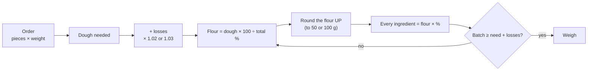

# 06.2 · From Dough Weight Back to Ingredients

Production rarely starts from the flour: it starts from an order, a tub, a mixer or what is left in the cold room. This lesson trains the reverse calculations, from what you need or what you have back to the flour and every ingredient, including the awkward case where one ingredient is fixed in grams.

## Why it matters

The exam's written phase gives you an order and asks for the quantities, so the calculation you meet first is a reverse one (see [The CAP Boulanger Exam](../../references/cap-exam.md)). In a bakery the reverse problems come every day: only 120 g of yeast is left before the delivery, the pâte fermentée tub holds less than the sheet asks for, a colleague has already weighed the water and you must find the flour that goes with it. If you can only calculate forwards, each of these becomes a guess, and a guess ends in pieces missing at dividing or a dough that is not the bakery's standard.

## Key terms

| French | Say it | English meaning |
|---|---|---|
| besoin en pâte | *buh-ZWAN ahn PAHT* | dough requirement: pieces × piece weight for the order |
| farine mise en œuvre | *fah-REEN meez ahn UH-vruh* | flour actually used in a batch |
| rupture (de stock) | *rüp-TÜR* | running out of an ingredient |
| reste de pâte | *rest duh PAHT* | dough left over after dividing |
| marge | *MARZH* | margin: the extra built into a batch for losses |
| arrondi supérieur / inférieur | *ah-rohn-DEE sü-pay-RYUHR / an-fay-RYUHR* | rounded up / rounded down |

## How it works

### The reverse chain

This is lesson [01.5](../module-01/lesson-05.md)'s third formula used as a routine. The course adds losses by multiplying (× 1.02 for 2 %), as lesson 01.5 did; some bakeries divide by 0.98 instead, which gives a few grams more. Use one convention and write it on the sheet.

### Five reverse problems

| You know | You want | Formula |
|---|---|---|
| Pieces and piece weight | Flour | (pieces × weight × (1 + losses)) × 100 ÷ total % |
| A dough weight available (tub, leftover, mixer) | Flour, or number of pieces | flour = dough × 100 ÷ total %; pieces = dough ÷ (1 + losses) ÷ piece weight, rounded down |
| One ingredient in stock | The largest batch | max flour = stock ÷ % × 100 |
| One ingredient already weighed | The flour that goes with it | flour = weight ÷ % × 100 |
| Grams of a recipe | Its percentages | % = grams ÷ flour × 100 (lesson 01.5) |

### Rounding: up for orders, down for limits

- An **order** must be covered: round the flour **up**, then check the batch is at least the need plus losses.
- A **limit** (stock, tub, mixer) must not be passed: round the flour **down**.
- Pieces: always round **down** (you cannot sell 37.7 baguettes).

### When one ingredient is fixed in grams

Sometimes one ingredient is set by what you have, not by the percentage: the pâte fermentée kept back yesterday, a bag of seeds, a tray of soaked grains. Take its weight out of the dough first, then calculate the flour from the other ingredients' percentages:

$$\text{flour} = \frac{(\text{dough needed} - \text{fixed ingredient}) \times 100}{\text{total \% without that ingredient}}$$

Then write the fixed ingredient's real percentage on the sheet, so the chef sees the change.

## Worked example

Friday, Boulangerie Au Pain de la Halle. Order for Saturday: **30 baguettes at 350 g** for the shop and **120 rolls at 60 g** for a restaurant, all on PC-02 (flour 100, water 64, salt 1.8, fresh yeast 1.5, pâte fermentée 15; total 182.3 %). Losses 2 %, flour rounded up to the next 100 g.

**Step 1 — dough needed.** (30 × 350) + (120 × 60) = 10,500 + 7,200 = 17,700 g. With 2 %: 17,700 × 1.02 = 18,054 g.

**Step 2 — flour.** 18,054 × 100 ÷ 182.3 = 9,903 g, rounded up to **10,000 g**.

**Step 3 — the batch.** Water 6,400 g, salt 180 g, fresh yeast 150 g, pâte fermentée 1,500 g. Total 18,230 g ≥ 18,054 g. It fits a 25 kg mixer.

**Step 4 — the problem.** The cold-room tub holds only **1,200 g** of pâte fermentée. At 15 % that covers 1,200 ÷ 15 × 100 = 8,000 g of flour: not enough for the order.

**Step 5 — recalculate with the pâte fermentée fixed.** The fresh ingredients total 100 + 64 + 1.8 + 1.5 = 167.3 %. Flour = (18,054 − 1,200) × 100 ÷ 167.3 = 10,074 g, rounded up to **10,100 g**.

| Ingredient | % | Weight |
|---|---|---|
| Flour T55 | 100 | 10,100 g |
| Water | 64 | 6,464 g |
| Salt | 1.8 | 182 g |
| Fresh yeast | 1.5 | 151.5 g, weigh 152 g |
| Pâte fermentée | 11.9 (was 15) | 1,200 g |
| **Total** | | **18,097 g** |

Check: 18,097 g ≥ 18,054 g.

**Step 6 — tell the chef.** "Pâte fermentée: only 1.2 kg in the tub, so 11.9 % instead of 15 % on 10.1 kg of flour. The batch still covers the order with 2 %. Expect slightly less strength and flavour; I will watch the pointage and give it a few more minutes if the dough needs it." Note it on the sheet and keep more pâte fermentée tonight for Monday (lesson [04.5](../module-04/lesson-05.md)).

**The typical slip.** Keeping 15 % and simply using 8,000 g of flour "because that is what the pâte fermentée allows": the batch then makes 14,584 g, about 3.1 kg short of the 17,700 g the order needs before losses.

## Practice

Six reverse problems from realistic bakery and home situations. Write every step; check each answer by calculating forwards again.

### You need

- Calculator, paper, the PD-01 and PC-02 sheets from lesson [01.6](../module-01/lesson-06.md), the [production sheet template](../../templates/production-sheet.md).
- Professional equivalent: the order book, the stock sheet and the mixer and tub capacities.

### Steps

1. Read each problem and write which of the five reverse problems it is.
2. Decide whether you round up (order) or down (limit).
3. Solve it, then check forwards.
4. Open the answers and name any slip.

**A.** Order: 16 bâtards at 400 g and 40 rolls at 50 g, PD-01 (total 168.3 %), 3 % losses, flour rounded up to the next 100 g. Give the flour, every ingredient and the total.

**B.** Only 120 g of fresh yeast is left until Monday's delivery. PD-01 uses 1.5 %. What is the largest batch (flour), and how many 350 g baguettes can it make with 2 % losses?

**C.** A colleague has weighed 2,925 g of water for PD-01 and gone on break. How much flour, salt and yeast go with it?

**D.** Your largest dough tub holds 12 kg of dough. What is the largest PC-02 batch, flour rounded to a practical figure?

**E.** At home you have one 1 kg bag of flour. How many 80 g rolls of PD-01 can you make, keeping 2 % for losses, and how much dough is left?

**F.** A 25 kg tub of PD-01 dough is ready to divide. How many 350 g baguettes, keeping 2 % for losses?

Answers

**A.** Need 6,400 + 2,000 = 8,400 g; with 3 %: 8,652 g. Flour 8,652 × 100 ÷ 168.3 = 5,141 g, rounded up to 5,200 g. Water 3,380 g, salt 93.6 g, yeast 78 g. Total 8,751.6 g ≥ 8,652 g.

**B.** Max flour = 120 ÷ 1.5 × 100 = 8,000 g. Dough 8,000 × 1.683 = 13,464 g; usable 13,464 ÷ 1.02 = 13,200 g; 13,200 ÷ 350 = 37.7, so **37 baguettes**. Tell the manager now if the order needs more.

**C.** Flour = 2,925 ÷ 65 × 100 = 4,500 g; salt 81 g; yeast 67.5 g.

**D.** 12,000 × 100 ÷ 182.3 = 6,583 g, rounded **down** to 6,500 g (11,849.5 g of dough).

**E.** 1,000 g of flour makes 1,683 g of dough; usable 1,683 ÷ 1.02 = 1,650 g; 1,650 ÷ 80 = 20.6, so **20 rolls** (1,600 g), with 83 g of dough left in the bowl, on the scraper and as a spare.

**F.** 25,000 ÷ 1.02 = 24,510 g usable; 24,510 ÷ 350 = 70.03, so **70 baguettes**.

### Targets

- Six answers right, each with the correct rounding direction.
- Every answer checked forwards.
- Problem B finished with one sentence you would say to the manager.

### How you know it worked

Faced with "we only have…" or "the tub holds…", you find the largest batch or the number of pieces in under three minutes and say it with the numbers.

### In Israel

- **Cups and spoons.** Many Israeli home recipes give flour in cups (כוס, *kos*) and salt or yeast in teaspoons (כפית, *kapit*). A cup of flour weighs very different amounts depending on how it is filled. Before converting a cup recipe to percentages, weigh your own cup of flour three times, spooned in and levelled, and use the average; weigh a level teaspoon of salt and of dry yeast on the 0.1 g scale. Then convert the recipe to grams and to baker's percentages (lesson 01.5).
- **Stock limits at home.** The usual limit is the flour: one or two 1 kg bags. Work out the batch from the flour you have, as in problem E, before you promise a number of rolls (checked 2026-10-08).
- **Flour.** Use white flour (קמח לבן, *kemakh lavan*) for PD-01 and PC-02; see the [flour-in-Israel reference](../../references/flour-in-israel.md) for what it stands in for and how to adjust the water.

### Self-check

- [ ] I name the type of reverse problem before calculating.
- [ ] I round the flour up for an order and down for a limit; pieces always down.
- [ ] I take a fixed ingredient out of the dough before calculating the flour.
- [ ] I check every reverse answer by calculating forwards.
- [ ] I tell the manager the numbers when stock limits an order.

## What goes wrong

| Symptom | Likely cause | Fix now | Prevent next time |
|---|---|---|---|
| Pieces missing at the end of dividing | Flour rounded down for an order, or no loss allowance | Tell the manager at once; make the missing pieces from a small extra batch | Round up for orders; always add 2-3 % |
| Dough overflows the tub or the mixer | Capacity limit rounded up | Split the dough between two tubs | Round down for any limit |
| Batch weighed with only part of the pre-ferment, dough short | Fixed ingredient kept at its % with less flour | Recalculate with the pre-ferment fixed in grams; add a small extra batch if already mixed | Take the fixed ingredient out first, then calculate |
| Flour does not match water already weighed | Flour taken from the order, not from the water | Recalculate flour from the water ÷ % × 100 | Label every weighed container with ingredient and batch |
| Order accepted that stock cannot cover | Maximum batch never calculated | Warn the manager before production starts | Check stock against the order the day before |

## Review

- Order → dough → + losses → ÷ total % → flour rounded up → every ingredient → check.
- Limits (stock, tub, mixer) give a maximum: round down. Pieces: always round down.
- An ingredient fixed in grams comes out of the dough before you calculate the flour; write its real % on the sheet.
- Check every reverse answer forwards, and give the manager the numbers when stock limits the order.
- Calculations from an order are part of the production test; see [The CAP Boulanger Exam](../../references/cap-exam.md).
