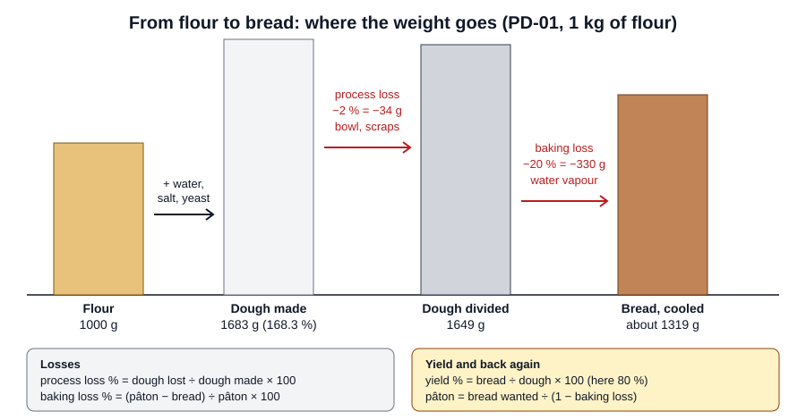

# 06.3 · Dividing, Losses and Yield

Between the flour you weigh and the bread you sell, weight disappears twice: dough left in the bowl and on the bench, then water driven off in the oven and on the cooling rack. This lesson puts numbers on both, shows how to work back from the baked weight a customer expects to the pâton you divide, and ends with you measuring your own baking loss.

## Why it matters

The référentiel asks you to check the weights and quantities of finished products (C3.2) and to make the calculations production needs (C1.3). Losses decide whether an order is covered, what each loaf really costs (lesson 06.5) and even whether a bread respects the salt limit, because salt stays in the bread while water leaves. A bakery that guesses its losses either runs short or divides heavier than it needs to, every day. Your own numbers, measured on your own oven, are worth more than any table.

## Key terms

| French | Say it | English meaning |
|---|---|---|
| pertes de fabrication | *pairt duh fah-bree-kah-SYOHN* | process losses: dough left in the bowl, on tools, as scraps |
| perte au four / à la cuisson | *pairt oh FOOR / ah lah kwee-SOHN* | baking loss: water (and a little else) driven off in the oven and while cooling |
| poids cuit | *pwah KWEE* | baked weight, after cooling |
| rendement | *rahnd-MAHN* | yield: bread out ÷ dough in, or bread per 100 kg of flour |
| échantillon | *ay-shahn-tee-YOHN* | sample: the pieces you weigh to check a batch |
| moyenne / écart | *mwah-YEN / ay-KAR* | average / spread between the lightest and heaviest piece |
| chute | *SHÜT* | scrap: small piece left after dividing |

## How it works

### Where the weight goes

**Process losses** are the dough that never becomes a piece: the film in the bowl, what sticks to the hook, the scraper and the bench, and scraps from dividing. Lesson [01.5](../module-01/lesson-05.md) covered them with an allowance of 2-3 %; measure yours to know if that is enough.

**Baking loss** is mostly water. The crust dries out completely and the crumb loses a little; the bread keeps losing water vapour as it cools (ressuage). So always say when you weighed: straight out of the oven, or cooled. This course uses about **20 %** for baguettes as its planning figure (lesson [02.5](../module-02/lesson-05.md)). The share depends on the shape: a thin baguette or a small roll has more crust per gram than a large loaf, so it loses a larger share; a longer or hotter bake and a drier room raise it; a tin loaf loses less. Use the course's figure to plan, and your own measurements to decide.

### Five calculations

$$\text{pieces} = \frac{\text{dough available}}{\text{piece weight}} \quad\text{(rounded down; the rest is the leftover)}$$

$$\text{baking loss \%} = \frac{\text{pâton} - \text{baked weight}}{\text{pâton}} \times 100$$

$$\text{yield \%} = \frac{\text{baked weight}}{\text{pâton}} \times 100 = 100 - \text{baking loss \%}$$

$$\text{pâton} = \frac{\text{baked weight wanted}}{1 - \text{baking loss}}$$

$$\text{bread per 100 kg of flour} = \text{total \%} \times (1 - \text{process loss}) \times (1 - \text{baking loss})$$

For PD-01: 168.3 × 0.98 × 0.80 ≈ **132 kg of bread per 100 kg of flour**.

The common slip in the fourth formula: adding the loss to the baked weight (400 × 1.16 = 464 g) instead of dividing (400 ÷ 0.84 = 476 g). Losses are a share of the **pâton**, so you must divide.

### Checking finished weights (C3.2)

Weigh a sample, not one piece: at least five from different places in the load. Calculate the average (is the divider or the bake on target?) and look at each piece against the tolerance (is the dividing even?). An average on target with pieces outside the tolerance is a dividing problem (lesson [04.3](../module-04/lesson-03.md)); all pieces light by the same amount is a baking or pâton-weight problem.

### Losses and salt

Salt does not evaporate. When water leaves, salt per 100 g of bread rises. A pain courant at 1.8 % salt of flour respects the 1.4 g per 100 g limit at about 20 % loss (lesson 02.5); small rolls that lose more can drift up to the limit or over it. Use your measured loss for the check, not the planning figure.

## Worked example

You divided the PC-02 batch of lesson [04.3](../module-04/lesson-03.md): 9,844 g of dough for 24 baguettes at 350 g and 20 rolls at 60 g. This time you measure everything.

**Step 1 — process loss.** The dough tipped out of the mixer and tub weighs 9,760 g. Loss = 9,844 − 9,760 = 84 g, that is 84 ÷ 9,844 × 100 = **0.85 %**. Well inside the 2 % allowance.

**Step 2 — dividing.** Pieces: 24 × 350 + 20 × 60 = 9,600 g. Leftover: 9,760 − 9,600 = **160 g**. So the 244 g margin of lesson 04.3 splits into 84 g lost and 160 g of clean dough that can go into tomorrow's pâte fermentée (lesson [04.5](../module-04/lesson-05.md)).

**Step 3 — baking loss, baguettes.** After 1 hour on the racks you weigh five baguettes: 282, 279, 285, 276, 280 g. Average 1,402 ÷ 5 = **280.4 g**. Loss = (350 − 280.4) ÷ 350 × 100 = **19.9 %**, yield 80.1 %.

**Step 4 — baking loss, rolls.** Five rolls: 47, 46, 46, 47, 46 g. Average 46.4 g. Loss = (60 − 46.4) ÷ 60 × 100 = **22.7 %**. Small pieces lose a larger share, as expected.

**Step 5 — salt check with real losses.** PC-02 dough contains 1.8 g of salt per 167.3 g of fresh ingredients, so 1.076 % of the dough (the pâte fermentée has the same ratio; [lesson 06.4](../module-06/lesson-04.md)).
- Baguette: 350 × 1.076 % = 3.77 g of salt in 280.4 g of bread → **1.34 g per 100 g**: conforms.
- Roll: 60 × 1.076 % = 0.65 g of salt in 46.4 g → **1.39 g per 100 g**: conforms, but only just. If the rolls were baked longer and lost 25 %, they would reach about 1.43 g, over the limit. Note it for the chef.

**Step 6 — a new product.** The chef wants a boule sold at **400 g baked**, and a test bake of that shape lost 16 %. Pâton = 400 ÷ 0.84 = 476.2 g: divide at **480 g** (rounded up to the next 5 g, so the loaf is never light).

**Step 7 — record.** Write the measured losses on the production sheet: process 0.85 %, baguettes 19.9 %, rolls 22.7 %, boule 16 %. Next week's orders use these numbers.

## Practice

> [!WARNING]
> You bake at 240 °C with steam. Use dry oven gloves, make steam only in a preheated metal tray (never a glass dish), pour the water and step back. Score with the blade moving away from your fingers and cover the lame after use. Weigh hot bread on a board, not in your hand.

You make one PD-01 dough, measure the process loss, divide it, bake two bâtards and one small roll, and calculate your own baking losses straight out of the oven and after cooling. Then you do six calculation exercises.

### You need

- Minimum: scale (1 g) and ideally a 0.1 g scale, thermometer, bowl, scraper, lidded container, baking paper, two trays, metal steam tray, oven gloves, lame or sharp knife, wire rack, a board to weigh hot bread on, timer, the [bake log](../../templates/bake-log.md).
- Professional equivalent: a bench scale or a scale on the divider line, a deck oven, cooling racks and a production sheet with a "poids cuit" column.

### Ingredients

| Ingredient | Weight | Baker's % |
|---|---|---|
| Flour T55 | 500 g | 100 |
| Water at about 24 °C | 325 g | 65 |
| Fine salt | 9 g | 1.8 |
| Fresh yeast (or 2.5 g instant dry) | 7.5 g | 1.5 |
| **Total** | **841.5 g** | **168.3** |

### Steps

1. Weigh the empty mixing bowl and write its weight. Weigh the empty lidded container (or tare it).
2. Mix and knead PD-01 by hand as in lesson [01.7](../module-01/lesson-07.md); target dough temperature 24 °C.
3. Scrape the dough into the container as you normally would (do not chase the last gram). Weigh the dough in the container: this is your recovered dough. Process loss = (841.5 − recovered) ÷ 841.5 × 100.
4. Pointage about 1 h 15 with one fold at 40 minutes; judge by the signs (lesson [04.2](../module-04/lesson-02.md)).
5. Divide two pieces of **400 g** (± 2 g). Weigh what is left: that is your small roll. Write its exact weight.
6. Pre-shape, détente 20 minutes, shape two bâtards of about 25 cm and one round roll; apprêt covered until the poke test says ready (lesson [04.4](../module-04/lesson-04.md)). Preheat the oven to 240 °C with a tray and the steam tray.
7. Score and bake with steam: the roll about 15 minutes, the bâtards about 25 minutes, until deep golden.
8. Within 2 minutes of each piece leaving the oven, weigh it on the board: "hot weight".
9. Cool on the rack for 1 hour and weigh each piece again: "cooled weight".
10. For each piece calculate: oven loss (pâton − hot) ÷ pâton, cooling loss (hot − cooled) ÷ pâton, total baking loss (pâton − cooled) ÷ pâton, yield.
11. Calculate salt per 100 g of bread for a bâtard and for the roll with your measured losses: salt in the piece = pâton × 1.8 ÷ 168.3.
12. Do exercises 1-6 below.

**1.** A pain de campagne dough weighs 4,300 g after mixing. How many loaves at 450 g, and how much is left?

**2.** A pâton of 420 g gives a loaf of 352 g after cooling. Baking loss and yield?

**3.** A customer wants loaves of 300 g baked; that shape loses 18 %. What pâton do you divide, rounded up to the next 5 g?

**4.** Ten cooled baguettes, target 250 g ± 5 g: 248, 252, 251, 247, 249, 256, 250, 244, 252, 251 g. Average? How many outside tolerance? Is the problem the dividing or the bake?

**5.** How much bread do 10 kg of flour of PD-01 give with 2 % process loss and 20 % baking loss?

**6.** PD-01 rolls (salt 1.8 %) lose 25 % in a long bake. Salt per 100 g of bread? Conforming?

Answers

**1.** 4,300 ÷ 450 = 9.6: **9 loaves** (4,050 g), **250 g** left.

**2.** Loss (420 − 352) ÷ 420 × 100 = **16.2 %**; yield **83.8 %**.

**3.** 300 ÷ 0.82 = 365.9 g, divide at **370 g**. (Not 300 × 1.18 = 354 g: that loaf would come out at about 290 g.)

**4.** Average 2,500 ÷ 10 = **250.0 g**: on target. **2 pieces** (256 g and 244 g) are outside 245-255 g. Average right, spread too wide: a **dividing** problem (lesson 04.3), not the bake.

**5.** 10,000 × 1.683 × 0.98 × 0.80 = **13,195 g**, about 13.2 kg of bread.

**6.** Salt per 60 g roll: 60 × 1.8 ÷ 168.3 = 0.642 g; bread 60 × 0.75 = 45 g; 0.642 ÷ 45 × 100 = **1.43 g per 100 g**: over 1.4 g. Shorten the bake or lower the salt for these rolls.

### Targets

- Dough at 24 °C ± 1 °C; two bâtards at 400 g ± 2 g; the roll weighed to the gram.
- Process loss measured and below 3 %.
- Hot and cooled weights recorded within the stated times; baking loss of each piece calculated to 0.1 %.
- Exercises 1-6 right.

### How you know it worked

You have three baking-loss figures from your own oven: the roll's is higher than the bâtards', and the cooled loss is higher than the hot one. You can say how many grams your kitchen loses in the bowl, and you can work back from any baked weight to the pâton.

### In Israel

- **Flour.** Use white flour (קמח לבן, *kemakh lavan*) for PD-01; see the [flour-in-Israel reference](../../references/flour-in-israel.md). If you test an 80 % flour loaf, expect more water in the dough and record its loss separately: a wetter dough has more water to lose.
- **Warm kitchen.** In a 26-32 °C summer kitchen, use colder water to hit 24 °C (the base-temperature method is in [Module 5](../module-05/lesson-02.md)) and expect a shorter pointage and apprêt: judge by the signs, not the times above.
- **Dry or humid air.** Cooling losses depend on the air. On a dry, hot hamsin day bread loses water faster on the rack; on a humid coastal day, more slowly. Weigh at the same times (2 minutes, 1 hour) so your figures compare, and note the weather in the bake log.
- **Oven.** Many Israeli home ovens are 60 cm built-in or freestanding models; if both bâtards do not fit on one tray with space around them, bake them one after the other and record each separately (checked 2026-10-08).

### Self-check

- [ ] I measured process loss, and I know whether 2 % is enough in my kitchen.
- [ ] I always say whether a weight is hot or cooled.
- [ ] I divide by (1 − loss) to find a pâton, never multiply by (1 + loss).
- [ ] I check a sample of pieces for average and spread.
- [ ] I can check salt per 100 g of bread with a measured loss.

## What goes wrong

| Symptom | Likely cause | Fix now | Prevent next time |
|---|---|---|---|
| Loaves under the weight the customer expects | Pâton worked out by adding the loss % instead of dividing; or bake longer than planned | Report it; re-divide heavier for the next batch | pâton = baked ÷ (1 − loss); use your measured loss |
| Pieces short at the end of dividing | Process loss higher than the allowance | Small extra batch; tell the manager | Measure process loss; scrape bowls and tubs well; raise the allowance |
| Average weight right but some pieces outside tolerance | Uneven dividing | Adjust pieces at pre-shaping | Check the divider and flatten dough evenly (lesson 04.3) |
| All pieces light by the same amount | Longer or hotter bake, or dry, warm cooling area | Note the actual bake time | Keep bake times; weigh at fixed times; record conditions |
| Small rolls taste salty or exceed the salt limit | Larger baking loss concentrates the salt | Shorten the bake if colour allows | Check salt per 100 g with the rolls' measured loss |

## Review

- Weight is lost twice: process losses (bowl, tools, scraps, usually 1-3 %) and baking loss (water; about 20 % for baguettes as the course's planning figure, more for small pieces).
- Baking loss % = (pâton − baked) ÷ pâton × 100; pâton = baked wanted ÷ (1 − loss).
- Check a sample: the average tells you about the setting and the bake, the spread about the dividing.
- Salt per 100 g of bread rises with the baking loss; check small pieces with their real loss.
- Weight checks of finished products are assessed in the production test; see [The CAP Boulanger Exam](../../references/cap-exam.md).
