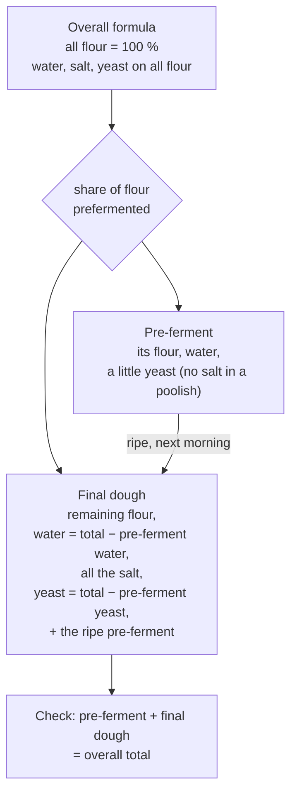

# 06.4 · Pre-ferment and Levain Calculations

A pre-ferment is flour and water you weighed yesterday, or earlier this morning, and it still counts. This lesson delivers the calculations promised in lessons 01.5 and 04.5: the flour and water hidden inside a pâte fermentée, poolish or levain, the true hydration of a dough, how to split an overall formula into a poolish and a final dough, how to build a levain to the gram, and the legal yeast limit for levain bread. You finish by building your own poolish formula.

## Why it matters

Technical sheets in the exam and in bakeries list the pre-ferment as an ingredient (PC-02: pâte fermentée 15 %), and the référentiel expects you to work with direct, pâte fermentée, poolish and levain methods (S3.3) and to calculate exactly (C1.3); see [The CAP Boulanger Exam](../../references/cap-exam.md). If you ignore the flour and water inside a pre-ferment, three things go wrong: you misjudge the real hydration (a "70 %" dough on liquid levain is really above 73 %), you misplace the salt and yeast, and you cannot check a levain bread against the 0.2 % yeast rule. Lesson [04.5](../module-04/lesson-05.md) told you what pre-ferments do; this one gives you the numbers.

## Key terms

| French | Say it | English meaning |
|---|---|---|
| formule globale | *for-MÜL glo-BAHL* | overall formula: every ingredient as a % of all the flour, including the flour in the pre-ferment |
| pâte finale / pétrissage final | *paht fee-NAHL / pay-tree-SAHZH fee-NAHL* | final dough: what goes into the mixer on production day, pre-ferment included |
| farine pré-fermentée | *fah-REEN pray-fair-mahn-TAY* | prefermented flour: the share of the total flour that is inside the pre-ferment |
| hydratation totale | *ee-drah-tah-SYOHN to-TAHL* | true overall hydration: all water ÷ all flour, pre-ferment included |
| levain de tout point | *luh-VAN duh too PWAN* | the final levain build, ripe and ready for the dough |
| ensemencement | *ahn-suh-mahns-MAHN* | seed: the mature levain added to start a new build, as a % of the new flour |
| levure au pétrissage final | *luh-VÜR oh pay-tree-SAHZH fee-NAHL* | baker's yeast added at final mixing (max 0.2 % of that flour in a levain bread) |

## How it works

### A pre-ferment is flour and water in disguise

Split any pre-ferment into its parts. Ignoring the tiny weight of yeast in it:

$$\text{flour in the pre-ferment} = \frac{\text{pre-ferment weight} \times 100}{100 + \text{its hydration}}$$

| Pre-ferment | Hydration on its own flour | Flour share | Water share |
|---|---|---|---|
| Poolish | 100 % | 1/2 | 1/2 |
| Levain liquide | 100 % (up to 125 %) | 1/2 at 100 % | 1/2 at 100 % |
| Levain dur | 60 % (50-60 %) | 100/160 = 0.625 | 60/160 = 0.375 |
| Pâte fermentée from PC-02 | the dough itself: flour 100, water 64, salt 1.8, yeast 1.5 (167.3) | 100/167.3 = 0.598 | 64/167.3 = 0.383 |

Ratios are from the course's [base formulas](../../references/formulas.md). A pâte fermentée is a piece of the same kind of dough, so it carries the same ratios: it does not change the hydration or the salt %, it only adds dough. A poolish or a liquid levain is wetter than the dough, so it raises the true hydration and dilutes the salt %.

### Two ways to write the same dough

- **Sheet style (French technical sheets, PC-02, lesson 01.5 recipe C):** the flour in the mixer is 100 % and the pre-ferment is one more ingredient with its own %. Easy to weigh.
- **Overall style (baker's overall formula):** all the flour, including the pre-ferment's, is 100 %. It tells you the real hydration, salt and yeast of the bread, and it is the one you design a poolish from.

### From overall formula to poolish and final dough

1. Total flour from the order (lesson [06.2](lesson-02.md)), using the overall total %.
2. Poolish flour = total flour × share prefermented (often 20-40 %; lesson 04.5).
3. Poolish water = poolish flour (100 %). Poolish yeast = poolish flour × 0.1-1 % fresh, less for a longer or warmer ripening (lesson 04.5).
4. Final dough: flour = total − poolish flour; water = total water − poolish water; salt = all of it (a poolish has none); yeast = total yeast − poolish yeast; plus the whole ripe poolish.
5. Check that poolish + final dough = overall total.

### Building a levain to the gram

As in lesson [02.7](../module-02/lesson-07.md): call the new flour F. With hydration h and seed s (both as fractions of F):

$$F = \frac{\text{levain wanted}}{1 + h + s}$$

Water = h × F, seed = s × F. Add a margin for what sticks to the container and for the next chef.

### The legal yeast limit for levain bread

Décret 93-1074, art. 4: in a bread made on levain, baker's yeast may be added only at the final mixing, at most **0.2 % of the flour used at that stage**, that is the flour going into the mixer, not the flour already inside the levain. Final dough with 6,000 g of flour: at most 12 g of yeast.

## Worked example

Tomorrow you make baguettes on poolish on **10 kg of total flour**. The chef's overall formula: flour T65 100, water 66, salt 1.8, fresh yeast 1.0 (total). 30 % of the flour goes into a poolish made at 20:00 for a 7:00 mix (11 h at 18-20 °C), with 0.2 % fresh yeast on its flour, a low dose for a long ripening (King Arthur's professional poolish formula also uses 0.2 % on about a third of the flour).

**Step 1 — overall batch.** Flour 10,000 g, water 6,600 g, salt 180 g, yeast 100 g. Total 16,880 g.

**Step 2 — poolish.** Flour 10,000 × 0.30 = 3,000 g; water 3,000 g; yeast 3,000 × 0.002 = 6 g. Poolish 6,006 g.

**Step 3 — final dough.**

| Ingredient | Overall | − Poolish | = Final dough |
|---|---|---|---|
| Flour T65 | 10,000 g | 3,000 g | 7,000 g |
| Water | 6,600 g | 3,000 g | 3,600 g |
| Salt | 180 g | 0 | 180 g |
| Fresh yeast | 100 g | 6 g | 94 g |
| Poolish | | | 6,006 g |
| **Total** | **16,880 g** | | **16,880 g** |

**Step 4 — check.** 7,000 + 3,600 + 180 + 94 + 6,006 = 16,880 g, equal to the overall batch.

**Step 5 — the slip to avoid.** A trainee weighs the final-dough water at 66 % of the 7,000 g in the mixer (4,620 g) and adds the poolish on top: the dough gets 1,020 g too much water and ends at about 76 % true hydration, a soup. Or weighs 6,600 g of water as if there were no poolish.

**Step 6 — PC-02 on pâte fermentée, for comparison.** The 14 November batch (lesson [01.6](../module-01/lesson-06.md)) has 5,400 g of flour in the mixer and 810 g of pâte fermentée. Inside the pâte fermentée: flour 810 × 100 ÷ 167.3 = 484 g, water 810 × 64 ÷ 167.3 = 310 g. True totals: flour 5,884 g, water 3,766 g, hydration 3,766 ÷ 5,884 = **64.0 %**, salt still 1.8 %. As expected, a pâte fermentée from the same dough leaves the ratios unchanged, but the batch really contains about 5.9 kg of flour, which matters when you cost it (lesson 06.5).

## Practice

You build a home poolish formula from an overall formula, check it against lesson 04.5's dough, then solve six pre-ferment and levain calculations. Baking the formula is optional; if you do, follow the steps and safety notes of lesson 04.5.

> [!WARNING]
> If you bake: 240 °C oven and steam. Dry oven gloves, steam only in a preheated metal tray (never glass), pour and step back; score with the blade moving away from your fingers.

### You need

- Calculator, paper, the [production sheet template](../../templates/production-sheet.md) (use the pre-ferment line).
- For the poolish: a 0.1 g scale if you have one, a 1 L lidded container, a small glass for the yeast solution.
- Professional equivalent: a poolish tub in a cool room and a technical sheet with a poolish column and a final-dough column.

### Ingredients

**Your overall formula (1,000 g total flour):** T55 flour 100, water 66, salt 1.8, fresh yeast 1.0; 30 % of the flour in a poolish with 0.2 % fresh yeast on its flour.

| | Poolish (evening) | Final dough (morning) | Overall | Overall % |
|---|---|---|---|---|
| Flour T55 | 300 g | 700 g | 1,000 g | 100 |
| Water | 300 g | 360 g | 660 g | 66 |
| Fine salt | — | 18 g | 18 g | 1.8 |
| Fresh yeast | 0.6 g | 9.4 g | 10 g | 1.0 |
| Ripe poolish | | 600.6 g | | |
| **Total** | **600.6 g** | **1,688 g** | **1,688 g** | **168.8** |

You cannot weigh 0.6 g on a 1 g scale: dissolve 1 g of fresh yeast in 99 g of water and use 60 g of that solution (0.6 g of yeast and 59.4 g of water), plus 241 g of plain water.

### Steps

1. Calculate the table above yourself from the overall formula, without looking, then compare.
2. Check that poolish + final dough equals the overall total.
3. Compare with dough P of lesson 04.5 (poolish 150/150/0.3 g, then flour 350 g, water 175 g, salt 9 g, yeast 5 g): work out its overall hydration, salt % and yeast %.
4. Solve exercises 1-6.
5. Optional: make the poolish in the evening and the dough in the morning as in lesson 04.5, at your new quantities, and record the poolish's ripeness signs in the [bake log](../../templates/bake-log.md).

**1.** PC-02 batch of 14 November: 5,400 g of flour in the mixer, 810 g of pâte fermentée. How much flour is inside the pâte fermentée, what is the true total flour, and the true hydration?

**2.** Lesson 01.5's recipe C: T65 1,275 g, rye 225 g, water 1,050 g, salt 27 g, levain 375 g. What are the true hydration and salt % if the levain is liquid (100 %)? And if it is firm (60 %)?

**3.** A final-dough sheet reads: poolish 1,800 g (900 g flour, 900 g water, 1.8 g yeast), flour 2,100 g, water 1,080 g, salt 54 g, fresh yeast 30 g. Write the overall formula: hydration, salt %, yeast %, share of flour prefermented.

**4.** Tomorrow's dough needs 1,800 g of ripe liquid levain (100 %). You plan a 100 g margin and a 20 % seed. How much seed, flour and water?

**5.** A pain au levain final dough has 4,000 g of flour in the mixer and 1,000 g of firm levain (containing 625 g of flour). What is the most fresh yeast allowed if it is sold as a levain bread?

**6.** Overall pain de campagne formula on 2,000 g of flour: T65 85, rye 15, water 70, salt 1.8, with 20 % of the flour prefermented as a liquid levain (100 %) made with T65. Write the levain and the final dough.

Answers

**Step 3 (dough P of lesson 04.5).** Flour 150 + 350 = 500 g; water 150 + 175 = 325 g → 65 %; salt 9 g → 1.8 %; yeast 0.3 + 5 = 5.3 g → 1.06 %. Same totals as the direct dough D, as lesson 04.5 intended.

**1.** Flour in the pâte fermentée 810 × 100 ÷ 167.3 = 484 g; water 310 g. True flour 5,884 g, water 3,766 g, hydration 64.0 % (unchanged).

**2.** Liquid: levain flour 187.5 g, water 187.5 g. Flour 1,687.5 g, water 1,237.5 g → **73.3 %**; salt 27 ÷ 1,687.5 = **1.6 %**. Firm: levain flour 375 × 100 ÷ 160 = 234.4 g, water 140.6 g. Flour 1,734.4 g, water 1,190.6 g → **68.6 %**; salt **1.56 %**. The sheet's "70 %" is neither.

**3.** Flour 900 + 2,100 = 3,000 g (100 %); water 900 + 1,080 = 1,980 g (**66 %**); salt 54 g (**1.8 %**); yeast 1.8 + 30 = 31.8 g (**1.06 %**); prefermented flour 900 ÷ 3,000 = **30 %**.

**4.** F = 1,900 ÷ (1 + 1 + 0.2) = 863.6 g: **864 g flour, 864 g water, 173 g seed** (1,901 g).

**5.** 0.2 % of the 4,000 g used at final mixing = **8 g**. Not 9.25 g (0.2 % of the 4,625 g including the levain flour): the law counts the flour used at that stage.

**6.** Levain: 400 g T65 + 400 g water = 800 g. Final dough: T65 1,700 − 400 = **1,300 g**, rye **300 g**, water 1,400 − 400 = **1,000 g**, salt **36 g**, levain **800 g**. Total 3,436 g = 2,000 + 1,400 + 36.

### Targets

- Your poolish formula matches the table; poolish + final dough = 1,688 g.
- Exercises 1-6 right, every answer checked by adding the parts back together.
- If you bake: poolish ripe at mixing (bubbly, just starting to sink), dough at 24 °C ± 1 °C.

### How you know it worked

You can take any sheet with a pre-ferment and say its true hydration in a minute, and you can turn an overall formula into an evening poolish and a morning dough that add up exactly.

### In Israel

- **Flour.** Make the poolish and the final dough with the same flour, usually white flour (קמח לבן, *kemakh lavan*). If you use the T65-like blend of the [flour-in-Israel reference](../../references/flour-in-israel.md) (half white, half 80 %), blend the whole 1,000 g first and take the poolish flour from the blend, so the overall ratios stay right.
- **Warm kitchen.** Lesson 04.5's times assume 18-21 °C. In a 26-32 °C summer kitchen an overnight poolish at 0.2 % yeast will be over-ripe by morning. Options: use 0.1 % yeast on the poolish flour (0.3 g here; 30 g of the 1 % solution), make it late in the evening, or let it start for 1-2 hours and finish it in the fridge; then judge it by its ripeness signs. The overall formula does not change: only the split of the yeast does.
- **Dry yeast.** If you only have instant dry yeast (שמרים יבשים, *shmarim yeveshim*), use one third of the fresh weights: 0.2 g in the poolish (20 g of a solution of 1 g in 99 g of water) and 3.1 g in the final dough (checked 2026-10-08).

### Self-check

- [ ] I split any pre-ferment into its flour and water before judging hydration.
- [ ] I know which style a sheet is written in: pre-ferment as an ingredient, or overall formula.
- [ ] I subtract the pre-ferment's water and yeast from the totals, never its salt (a poolish has none).
- [ ] I check that pre-ferment + final dough = overall batch.
- [ ] I calculate the levain yeast limit on the flour used at final mixing.

## What goes wrong

| Symptom | Likely cause | Fix now | Prevent next time |
|---|---|---|---|
| Final dough far too wet | Final-dough water calculated as if there were no poolish, or as a % of the mixer flour on top of the poolish | Hold back water if not yet added; otherwise extra flour, note the change | Final water = total water − pre-ferment water |
| Dough slacker than the sheet's hydration suggests | Liquid levain or poolish not counted in the hydration | Bassinage less, folds during pointage | Calculate the true hydration before you choose the water |
| Bread over-fermented, yeasty | Full yeast dose added in the final dough on top of the poolish yeast and its activity | Shorten pointage, divide earlier | Final yeast = total − poolish yeast; often lower when the poolish is long |
| Levain short at mixing time | Build calculated without a margin, or seed not counted in the total | Use what there is and recalculate the dough with the levain fixed (lesson 06.2) | F = levain wanted ÷ (1 + h + s), plus a margin |
| Levain bread over the legal yeast limit | 0.2 % applied to the wrong flour, or yeast added "to be safe" | Do not sell it under a levain name | Max yeast = 0.2 % of the flour in the mixer at final mixing |

## Review

- Every pre-ferment is flour and water: poolish and liquid levain half and half, firm levain at 60 % about 5/8 flour, pâte fermentée the same ratios as its dough.
- True hydration = all water ÷ all flour; a pâte fermentée from the same dough leaves it unchanged, a poolish or liquid levain raises it.
- Overall formula → pre-ferment + final dough: subtract the pre-ferment's flour, water and yeast; all the salt goes in the final dough; check the sum.
- Levain build: F = levain wanted ÷ (1 + h + s). Legal yeast in levain bread: at most 0.2 % of the flour used at final mixing.
- Pre-ferment methods are part of the professional knowledge assessed (S3.3); see [The CAP Boulanger Exam](../../references/cap-exam.md).
