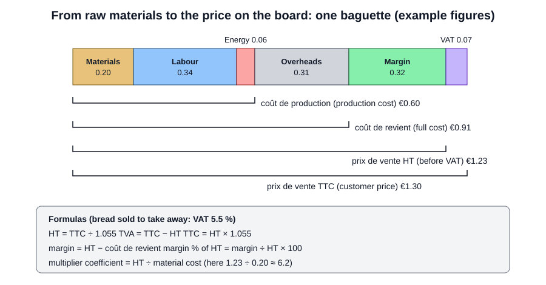

# 06.5 · Cost of a Product

A baguette's price on the board is built from the flour, water, salt and yeast in it, the baker's time, the oven's energy, the shop's overheads, a margin, and VAT. This lesson costs one PC-02 baguette step by step in euros, as the exam's applied-management questions expect, and shows the VAT rule for bread. You then cost a baguette of your own.

## Why it matters

The référentiel's applied-management knowledge asks you to identify the parts of purchase, production and full cost, the margin, the selling price and the VAT rates (S5.5), and the EP1 written paper has an applied-management part (see [The CAP Boulanger Exam](../../references/cap-exam.md)). In the fournil, cost explains rules that otherwise look petty: why losses are weighed, why the pâte fermentée is not thrown away, why a batch is not "rounded up generously". A baguette's raw materials cost a few tens of cents; the margin on it is of the same order, so a few percent of waste every day eats a real share of the profit. Lesson [18.2](../module-18/lesson-02.md) shows how bakeries cut that waste, and lesson [20.5](../module-20/lesson-05.md) takes costs and prices up to the results of the whole business.

## Key terms

| French | Say it | English meaning |
|---|---|---|
| coût d'achat | *koo dah-SHAH* | purchase cost: price paid for an ingredient plus delivery and other buying costs |
| coût matières | *koo mah-TYAIR* | raw-material cost of a batch or a piece |
| coût de production | *koo duh pro-dük-SYOHN* | production cost: materials + labour + energy and other production costs |
| frais généraux | *fray zhay-nay-ROH* | overheads: rent, sales staff, packaging, insurance, administration |
| coût de revient | *koo duh ruh-VYAN* | full cost: production cost + overheads |
| marge | *MARZH* | margin: selling price before VAT − full cost |
| prix de vente HT / TTC | *pree duh vahnt ash-TAY / tay-tay-SAY* | selling price before VAT (hors taxes) / with VAT (toutes taxes comprises) |
| TVA | *tay-vay-AH* | VAT (taxe sur la valeur ajoutée), collected for the State |
| coefficient multiplicateur | *ko-ay-fee-SYAHN mül-tee-plee-kah-TUHR* | multiplier: price HT ÷ material cost, used to set or check prices |
| chiffre d'affaires | *SHEE-fruh dah-FAIR* | turnover: quantity sold × price HT |

## How it works

### From materials to the price on the board

1. **Purchase cost per kg** = (invoice price + delivery and other buying costs) ÷ quantity.
2. **Material cost of the batch** = Σ (weight of each ingredient × its cost per kg), the pre-ferment included.
3. **Material cost of one piece**: the losses (lesson [06.3](lesson-03.md)) are paid by the pieces that are sold, so divide the batch cost by the dough that becomes products, not by the dough made, then multiply by the pâton weight.
4. **Production cost** = materials + labour + energy (and other production costs).
5. **Full cost (coût de revient)** = production cost + overheads.
6. **Margin** = price HT − full cost.
7. **Price TTC** = price HT × (1 + VAT rate).

Labour, energy and overheads per piece come from the bakery's accounts: the manager or accountant shares them out over the products. In the exam they are given.

### VAT on bakery products (France)

Food for human consumption is taxed at the reduced rate of **5.5 %**, with exceptions such as confectionery, most chocolate products, margarine and alcoholic drinks. Food **prepared for immediate consumption** and sold to take away or delivered (a sandwich, a hot pizza) is taxed at **10 %**, like food served on the premises. Bread, which the customer keeps to eat later, is at 5.5 % ([BOFiP, BOI-TVA-LIQ-30-10-10](https://bofip.impots.gouv.fr/bofip/2033-PGP.html), version in force from 19/11/2025). The same baguette sold plain is at 5.5 %; filled as a jambon-beurre for lunch it is at 10 %. VAT is collected for the State: it is never part of the bakery's margin.

$$\text{HT} = \frac{\text{TTC}}{1 + \text{rate}} \qquad \text{TVA} = \text{TTC} - \text{HT}$$

The classic slip: taking 5.5 % off the TTC price (1.30 × 0.945 = €1.2285) instead of dividing by 1.055 (€1.2322). The difference looks small on one baguette and is not small on a year's turnover.

### What changes the cost

- **Losses and waste**: dough in the bowl, a batch of under-proofed bread, unsold bread. Every gram not sold is paid by the grams that are.
- **Pre-ferment**: the pâte fermentée, poolish or levain is made of flour and water you paid for (lesson [06.4](lesson-04.md)); cost it like any ingredient.
- **Purchase price**: a cheaper flour that needs more yeast or gives more waste is not cheaper.
- **Labour and energy**: usually larger per piece than the materials for bread.

## Worked example

Boulangerie Au Pain de la Halle, PC-02 batch of 14 November (lesson [01.6](../module-01/lesson-06.md)): 9,844 g of dough for 24 baguettes at 350 g and 20 rolls at 60 g. Invoice prices before VAT (**example figures for this exercise**, not market prices): T55 flour €21.50 per 25 kg sack; salt €15.00 per 25 kg; fresh yeast €1.70 per 500 g block; water €4.20 per m³. Delivery is included.

**Step 1 — purchase cost per kg.** Flour 21.50 ÷ 25 = €0.86/kg; salt 15.00 ÷ 25 = €0.60/kg; yeast 1.70 ÷ 0.5 = €3.40/kg; water 4.20 ÷ 1,000 = €0.0042/L.

**Step 2 — cost of the pâte fermentée.** It is yesterday's dough without its own pâte fermentée: per 167.3 g of dough, flour 100 g (€0.0860) + water 64 g (€0.0003) + salt 1.8 g (€0.0011) + yeast 1.5 g (€0.0051) = €0.0925, so **€0.553/kg**.

**Step 3 — material cost of the batch.**

| Ingredient | Quantity | Cost per kg | Cost |
|---|---|---|---|
| Flour T55 | 5.400 kg | €0.86 | €4.644 |
| Water | 3.456 kg | €0.0042 | €0.015 |
| Salt | 0.097 kg | €0.60 | €0.058 |
| Fresh yeast | 0.081 kg | €3.40 | €0.275 |
| Pâte fermentée | 0.810 kg | €0.553 | €0.448 |
| **Batch** | **9.844 kg** | | **€5.44** |

**Step 4 — per piece.** The dough that became products is 9,600 g. €5.44 ÷ 9,600 g × 350 g = **€0.198 per baguette** (about €0.20); × 60 g = €0.034 per roll. Dividing by the 9,844 g made would give €0.193: the losses and leftover would vanish from the cost.

**Step 5 — full cost of a baguette.** The bakery's accounts give per baguette (example figures): labour €0.34, energy €0.06, overheads €0.31.
- Production cost = 0.198 + 0.34 + 0.06 = **€0.60**
- Full cost = 0.60 + 0.31 = **€0.91**

**Step 6 — price, VAT and margin.** The board says €1.30 TTC. VAT on bread to take away: 5.5 %.
- HT = 1.30 ÷ 1.055 = **€1.232**; TVA = 1.30 − 1.232 = **€0.068**
- Margin = 1.232 − 0.908 = **€0.32** per baguette, about 26 % of the HT price
- Multiplier on materials = 1.232 ÷ 0.198 ≈ **6.2**

**Step 7 — the rolls for the restaurant.** Invoiced at €0.40 HT each, VAT 5.5 %: €0.422 TTC each, €8.44 TTC for 20 rolls. Their material cost is €0.034 each.

**What the numbers say.** Throwing away one unsold baguette costs at least its €0.60 production cost, about two baguettes' margin. The pâte fermentée is 8 % of the material cost of the batch: worth keeping and labelling, never worth wasting.

## Practice

You cost a home batch and one of your own baguettes, then solve six costing exercises in euros.

### You need

- Calculator, your last shopping receipt (or shelf prices), your electricity bill (price per kWh) and the power rating on your oven's plate or manual.
- Professional equivalent: supplier invoices, the stock sheet and the cost figures the manager or accountant gives for labour, energy and overheads.

### Ingredients

You cost one PD-01 batch on 500 g of flour, divided into 3 home baguettes of 270 g ([lesson 08.3](../module-08/lesson-03.md) will shape them):

| Ingredient | Weight | Baker's % |
|---|---|---|
| Flour T55 | 500 g | 100 |
| Water | 325 g | 65 |
| Fine salt | 9 g | 1.8 |
| Fresh yeast (or 2.5 g instant dry) | 7.5 g | 1.5 |
| **Total** | **841.5 g** | **168.3** |

### Steps

1. Write the price you paid for each ingredient and the package size; calculate the cost per kg (or per g for yeast).
2. Calculate the material cost of the batch.
3. Divide by the dough that becomes baguettes (3 × 270 = 810 g) and multiply by 270 g: material cost per baguette.
4. Energy: oven power (kW) × hours on (preheat + bake) × an estimate of how much of that time the element is heating (use 60-70 % if you do not know) gives kWh; × price per kWh. Share it over the 3 baguettes.
5. Compare your cost per baguette with the price of a baguette at a bakery near you. Which share of that price is materials?
6. Solve exercises 1-6, using the invoice prices of the worked example (flour €0.86/kg, water €0.0042/L, salt €0.60/kg, fresh yeast €3.40/kg).

**1.** Material cost of PD-01 on 1 kg of flour, and per 350 g pâton with 2 % process losses (usable dough 1,650 g).

**2.** A pain de campagne is €4.20 TTC (bread to take away). Price HT and VAT?

**3.** Its full cost is €2.95. Margin per loaf?

**4.** The bakery prices new products at a multiplier of 5 on materials. Materials €0.75: price HT and TTC?

**5.** The mill adds €1.00 delivery per sack of flour at €21.50. New purchase cost per kg, and the flour cost of the 5.4 kg PC-02 batch?

**6.** 180 baguettes are sold today at €1.30 TTC. Turnover HT? And which VAT rate applies to a ham baguette sandwich sold for lunch?

Answers

**1.** Flour €0.860 + water €0.0027 + salt €0.0108 + yeast €0.0510 = **€0.925** per 1,683 g of dough. Per pâton: 0.925 ÷ 1,650 × 350 = **€0.196**.

**2.** HT = 4.20 ÷ 1.055 = **€3.98**; TVA = **€0.22**.

**3.** 3.98 − 2.95 = **€1.03**.

**4.** HT = 0.75 × 5 = **€3.75**; TTC = 3.75 × 1.055 = **€3.96**.

**5.** (21.50 + 1.00) ÷ 25 = **€0.90/kg**; 5.4 × 0.90 = **€4.86** instead of €4.64.

**6.** HT per baguette 1.30 ÷ 1.055 = €1.232; turnover 180 × 1.232 = **€221.80 HT**. A sandwich prepared for immediate consumption: **10 %**.

### Targets

- Your home batch costed from real prices, every line shown.
- Cost per baguette with and without energy.
- Exercises 1-6 right to the cent.

### How you know it worked

From an invoice and a technical sheet you can say what one piece costs in materials, and from a TTC price you can find the HT price, the VAT and the margin without hesitating over the rate.

### In Israel

The exam is about French costs, VAT and euros. At home you can run exactly the same calculation in shekels (ILS) to know what your practice costs. The figures below are **example figures** (illustrative, rounded, written 2026-10-08, not quoted from any shop or tariff): replace them with your own receipt and electricity bill.

| Item | Example price | Used | Cost |
|---|---|---|---|
| White flour (קמח לבן, *kemakh lavan*), 1 kg bag | ₪6.90 | 500 g | ₪3.45 |
| Salt, 1 kg | ₪3.90 | 9 g | ₪0.04 |
| Instant dry yeast (שמרים יבשים, *shmarim yeveshim*), 100 g jar | ₪12.90 | 2.5 g | ₪0.32 |
| Tap water | about ₪8 per m³ | 325 g | under ₪0.01 |
| Electricity | ₪0.65 per kWh | about 1.2 kWh | ₪0.78 |
| **Batch** | | | **₪4.59** |

Per home baguette (3 from the batch): ₪4.59 ÷ 3 ≈ **₪1.53**, of which about ₪1.27 is materials. The energy is a large share at home because a home oven heats for one small batch; a deck oven full of bread shares its energy over far more pieces. Flour type and protein: see the [flour-in-Israel reference](../../references/flour-in-israel.md). Israeli VAT and pricing rules are not part of the CAP and are not needed here.

### Self-check

- [ ] I cost the pre-ferment like any other ingredient.
- [ ] I divide the batch cost by the dough that becomes products, so losses are counted.
- [ ] I can build production cost, full cost, margin, HT and TTC in order.
- [ ] I convert TTC to HT by dividing by 1.055, never by taking 5.5 % off.
- [ ] I know when 5.5 % or 10 % applies in a bakery.

## What goes wrong

| Symptom | Likely cause | Fix now | Prevent next time |
|---|---|---|---|
| Cost per piece too low | Batch cost divided by all the dough made, losses ignored; pre-ferment left out | Recalculate on the dough that became products | Cost every ingredient; divide by the sold dough |
| Margin looks higher than the bank account says | VAT counted as income, or HT found by subtracting 5.5 % | Recalculate HT = TTC ÷ 1.055 | VAT belongs to the State; always work in HT |
| Sandwich priced with 5.5 % VAT | Food for immediate consumption treated like bread | Correct the till setting; tell the manager | 10 % for food prepared for immediate consumption |
| Real costs above the sheet's cost | Waste, unsold bread, over-weight pâtons not counted | Record waste and weights for a week | Measure losses (lesson [06.3](lesson-03.md)); divide to weight |
| "Cheaper" flour costs more in the end | More yeast, more waste or lower yield not counted | Cost a full batch with the new flour | Compare cost per sold piece, not price per sack |

## Review

- Materials → + labour and energy = production cost → + overheads = full cost (coût de revient) → + margin = price HT → + VAT = price TTC.
- Cost the pre-ferment, and divide the batch cost by the dough that becomes products: losses are paid by the pieces sold.
- Bread to take away: VAT 5.5 %; food prepared for immediate consumption: 10 %. HT = TTC ÷ 1.055 for bread.
- Applied management, including costs and VAT, is part of the EP1 written paper; see [The CAP Boulanger Exam](../../references/cap-exam.md).
