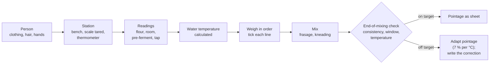

# 07.2 · From Order to Mixing

This lesson covers the first seven stages: from the order on the board to a mixed dough on target. You see how a professional reads the order into a requisition, sets up the person and the station, weighs in a fixed order, calculates the water for a final dough with a pre-ferment, and checks the dough before it goes into pointage. You finish with a timed full mise en place and a mix at home.

## Why it matters

Everything after mixing depends on what happens before it: the right flour, the right weights, water at the right temperature and a station where nothing has to be fetched once the dough is alive. In the production test, organisation and hygiene at the start of the day are visible to the jury before any bread exists (see [The CAP Boulanger Exam](../../references/cap-exam.md)). In a bakery, the commonest causes of a lost batch happen in these minutes: salt weighed twice or forgotten, yeast put on the salt, the wrong flour sack, water calculated from yesterday's readings.

## Key terms

| French | Say it | English meaning |
|---|---|---|
| mise en place | *meez ahn PLAHSS* | getting the person, the station, the tools and the ingredients ready before production |
| pesée | *puh-ZAY* | weighing: each ingredient weighed and ticked off |
| bon d'économat | *bohn day-koh-noh-MAH* | requisition: what you take from the store, with quantities and lot numbers |
| numéro de lot | *nü-may-RO duh LO* | batch number on a sack or pack, written down for traceability |
| eau de coulage | *OH duh koo-LAHZH* | the water weighed into the dough, at its calculated temperature |
| pâte finale | *paht fee-NAHL* | the final dough: what goes into the mixer on production day, pre-ferment included |
| tenue professionnelle | *tuh-NÜ pro-feh-syo-NELL* | professional clothing: jacket, apron, hair covered, safety shoes |
| contrôle de fin de pétrissage | *kohn-TROLL duh fan duh pay-tree-SAHZH* | end-of-mixing check: consistency, development, temperature |

## How it works

### Stages 1-4: from the order to the requisition

The order and the technical sheet become a list you can carry to the store: the **requisition** (bon d'économat). For each ingredient it gives the weight for this batch, and you add what you check when you take it:

| Ingredient | Check at the store |
|---|---|
| Flour | type on the sack matches the sheet (T55, T65…); lot number written down; open sacks first |
| Fresh yeast | use-by date; block firm and cream-coloured, kept at 2-6 °C |
| Pre-ferment (poolish, pâte fermentée, levain) | label with date and time; ripe (signs from lesson [04.5](../module-04/lesson-05.md)); its temperature measured |
| Salt, other dry goods | right product (fine salt, not sugar); closed container |

A problem found here (yeast past its date, not enough pâte fermentée) is reported before mixing, when it can still be solved by recalculating (lesson [06.2](../module-06/lesson-02.md)).

### Stage 5: mise en place, person and station

**The person.** Clean professional clothing, hair covered, no jewellery or watch, nails short, hands washed before touching any ingredient and again after handling cartons, the phone or waste (lesson [01.3](../module-01/lesson-03.md)).

**The station.** Bench cleaned; scale on a level surface, tared and checked with a known weight; probe thermometer checked; containers for each ingredient; scraper, tub for pointage with lid or cover; couches, boards or trays for the apprêt; the sheet and the stage list in a sleeve at eye level. Everything is laid out in the order of use.

### Stage 6: weighing in a fixed order

- **Order of the requisition, every time**: flour, water, salt, yeast, pre-ferment, then any other ingredients. A fixed order makes a missing or doubled line visible.
- **Right scale for each weight**: the bench scale for flour and water; a 0.1 g scale for small salt and yeast weights at home (lesson [01.4](../module-01/lesson-04.md)).
- **Tick each line as it is weighed**, not at the end.
- **Salt and yeast in separate containers.** Salt in direct contact draws water out of fresh yeast cells and weakens them, and two white or cream piles side by side are how salt gets added twice.
- **Water last**: weighed only once its temperature is right, and measured again just before it goes in.
- **Dust**: tip flour low and slowly into the bowl. Weighing and feeding the mixer are the moments the most flour dust gets into the air (INRS).

### Stage 6: the water for a final dough with a pre-ferment

Use the Module 5 convention (lesson [05.2](../module-05/lesson-02.md), lesson [05.3](../module-05/lesson-03.md)):

- **base** = target dough temperature (TPV) × number of factors: 3, or **4** when a pre-ferment is counted;
- **water** = base − flour − room − pre-ferment − friction factor;
- **friction factor** = degrees of heating from mixing × number of factors.

A printed TB on a sheet already has friction taken out: then water = TB − flour − room (− pre-ferment). To blend two waters, cold share = total water × (tap − wanted) ÷ (tap − cold).

### Stage 7: mixing and the end-of-mixing check

Frasage and kneading follow the sheet (lesson [03.3](../module-03/lesson-03.md)); hold back a little water for bassinage if the flour is new (lesson [03.5](../module-03/lesson-05.md)). Before the dough goes into the tub, check three things:

| Check | How | If off |
|---|---|---|
| Consistency | feel against the sheet (ferme, bâtarde, douce) | bassinage or a little flour now; note it |
| Development | window test: a thin, even film | a little more kneading; never "fix" it with longer pointage |
| Temperature | probe in the centre of the dough | outside ±1 °C: adapt pointage at about 7 % per °C (lesson [04.2](../module-04/lesson-02.md)), confirm by the dough, correct the water next batch |

Write the readings on the [temperature log](../../templates/temperature-log.md): they are the start of the stage list's "real time" column.

## Worked example

Saturday, Boulangerie Au Pain de la Halle. The order includes 24 baguettes sur poolish, sheet PO-01, from the module 6 workbook ([project](../../projects/m06-calculation-workbook.md)). The poolish was made last night. Final dough to mix at 3:00: flour T65 3,570 g, water 1,938 g, salt 91.8 g, fresh yeast 37.7 g, poolish 3,063 g. TPV 24 °C; the spiral mixer heats this dough by about 5 °C in improved mixing.

**1. Requisition (Friday 16:00).** T65: 3,570 g from the open sack, lot number written; fresh yeast 37.7 g, use-by date checked; salt 91.8 g; poolish tub labelled "PO-01, vendredi 19:00". Tonight's check: is there enough T65 for Monday as well?

**2. Mise en place (2:40).** Clothing and hands; bench, scale tared and checked with a 1 kg weight; containers for salt and yeast separate; tub with lid, couches and boards ready; sheet in its sleeve.

**3. Readings (2:50).** Flour 21 °C, fournil 23 °C, poolish 20 °C (ripe: domed, bubbly, just starting to sink at the centre), tap 19 °C, water cooler 4 °C.

**4. Water temperature, 4 factors.**

- base = 24 × 4 = 96
- friction factor = 5 × 4 = 20
- water = 96 − 21 − 23 − 20 − 20 = **12 °C**

**5. Blend.** Cold share = 1,938 × (19 − 12) ÷ (19 − 4) = 1,938 × 7 ÷ 15 ≈ **904 g** of 4 °C water + **1,034 g** of tap water. Measured in the jug: 12.2 °C. Accepted.

**6. Weigh in order, tick.** Flour, water, salt, yeast, poolish. All five lines ticked; salt and yeast in separate bowls.

**7. Mix and check (3:00-3:12).** Frasage, kneading. Consistency: bâtarde, as the sheet asks; window test: thin, even film. Dough temperature: **24.6 °C**. Within ±1 °C: pointage as the sheet. Log: "PO-01 sam. 3:12, eau 12 °C, pâte 24.6 °C."

**The slips this routine prevents.** Counting only 3 factors with a pre-ferment (72 − 21 − 23 − 15 = 13 °C: a degree off, and the poolish temperature never looked at). Using yesterday's flour and room readings. Weighing the salt onto the yeast "to save a bowl".

## Practice

You do a complete, timed mise en place at home for a 1 kg PD-01 batch, mix it, and check it at the end of mixing. The dough then goes into the shaping drills of lesson 07.3 the same day, or into flat rolls as in lesson [01.7](../module-01/lesson-07.md).

### You need

- Minimum: scale (1 g) and a 0.1 g pocket scale, probe thermometer, large bowl, small bowls for salt and yeast, scraper, lidded container with the level marked, timer, the [production sheet template](../../templates/production-sheet.md), the [temperature log](../../templates/temperature-log.md), your friction factor from lesson [05.3](../module-05/lesson-03.md) (or 6 for hand kneading), a bottle of water from the fridge, a kettle.
- Professional equivalent: requisition, bench scale and check weight, water dosing unit or cooler, spiral mixer, labelled tubs.

> [!WARNING]
> Heat water in a kettle, not from the hot tap, and never use water above 40 °C on yeast. Wipe up any water on the floor straight away: a wet floor near the oven is a slip and burn risk.

### Ingredients

PD-01 on one 1 kg bag of flour:

| Ingredient | Baker's % | Weight |
|---|---|---|
| Flour T55 (or white bread flour) | 100 | 1,000 g |
| Water, at the calculated temperature | 65 | 650 g |
| Fine salt | 1.8 | 18 g |
| Fresh yeast (or instant 5 g) | 1.5 | 15 g |
| **Total** | **168.3** | **1,683 g** |

### In Israel

Checked 2026-10-08.

- **Flour.** One 1 kg bag of white flour (קמח לבן, *kemakh lavan*) is exactly this batch; read the label and the water note in [Flour in Israel](../../references/flour-in-israel.md). Hold back 20 g of water for bassinage the first time you use a new bag.
- **Yeast.** Fresh yeast (שמרים טריים, *shmarim triyim*) is in the chilled section of some supermarkets and in bakery-supply shops; instant dry yeast (שמרים יבשים, *shmarim yeveshim*) is everywhere: use 5 g, mixed into the flour, not into cold water. Check the use-by date as you would at the store.
- **Salt.** Fine table salt (מלח דק, *melakh dak*) is what the formula assumes; coarse salt does not dissolve evenly in a hand-kneaded dough.
- **Summer water.** Kitchen 30 °C, flour 29 °C, hand kneading (friction factor 6): 72 − 29 − 30 − 6 = **7 °C**. Tap water at 26-30 °C cannot do it: blend fridge water (about 4-5 °C) with tap water using the formula above, or mix in the air-conditioned room.
- **Use the fridge for the flour.** If the open bag lives in a closed box in the fridge in summer (lesson [05.1](../module-05/lesson-01.md)), the flour itself becomes a cold input: flour 12 °C, kitchen 30 °C, friction factor 6 gives 72 − 12 − 30 − 6 = 24 °C water. Measure the flour inside the bag; let a cold bag stand closed so no condensation forms in it.
- **Scales.** A 0.1 g pocket scale (משקל דיגיטלי, *mishkal digitali*, sold for jewellery or coffee) is cheap in kitchen and electronics shops; check it with a coin of known weight.

### Steps

1. **Start the timer.** Everything from here to the first stir counts as mise en place.
2. **Person:** apron, hair tied and covered, rings and watch off, hands washed.
3. **Station:** bench cleared and wiped; scale on a level surface, tared, checked with a known weight (a 1 kg bag, a coin); thermometer checked in iced water (0 °C ± 0.5); bowls, scraper, container with lid, cover for the dough laid out in order of use.
4. **Requisition:** write the weights on the production sheet; write the flour's label (type, protein, best-before) and the yeast's date.
5. **Readings:** flour (probe in the bag), room (at the bench), tap water, fridge water. Write them.
6. **Water:** calculate with base 72 (TPV 24 °C × 3), your friction factor, and the readings; blend to ±0.5 °C. Weigh 650 g (keep 20 g aside if the flour is new).
7. **Weigh in order and tick:** flour, salt (in its own bowl), yeast (in its own bowl), water last. Stop the timer.
8. **Mix:** yeast into the water (instant yeast into the flour), then flour and salt; frasage 4 minutes with the scraper; knead 10-12 minutes as in lesson 01.7.
9. **End-of-mixing check:** consistency (bassinage with the reserved water if firm), window test, dough temperature in the centre. Write all three and the time on the temperature log.
10. **Clean while it rests:** bowls and scraper washed, bench scraped and wiped. The dough goes into its covered container for pointage.

### Targets

- Mise en place (steps 2-7) in 20 minutes or less.
- Every weight ticked; salt 18 g and yeast 15 g (or 5 g) on the 0.1 g scale.
- Water within ±0.5 °C of the calculation.
- Dough at 24 °C ± 1 °C, window test passed, consistency noted.

### How you know it worked

From the first stir to the lid going on the container you never left the bench or looked for anything. The dough landed on its target temperature because you calculated it from today's readings, and your log shows the inputs, the water, the result and any correction. If the dough was off by more than 1 °C, the log tells you whether the friction factor or a reading was wrong.

### Self-check

- [ ] I can say what is checked at the store for flour, yeast and the pre-ferment.
- [ ] I weigh in a fixed order and tick each line as I go.
- [ ] I keep salt and yeast in separate containers.
- [ ] I can calculate the water with 4 factors for a dough with a pre-ferment.
- [ ] I check consistency, development and temperature before pointage.

## What goes wrong

| Symptom | Likely cause | Fix now | Prevent next time |
|---|---|---|---|
| Dough very salty, or bland and sticky | Salt weighed twice, or forgotten | Bland dough: dissolve the missing salt in a little water and knead it in early; salty: report and remake | Fixed weighing order; tick each line; salt in its own container |
| Dough 1-2 °C off target with a pre-ferment | Calculated with 3 factors; pre-ferment temperature not measured | Adapt pointage by about 7 % per °C | Base × 4; measure the pre-ferment |
| Slow start to fermentation | Yeast weighed onto the salt and left; yeast past its date | Allow more time, warmer place | Separate containers; check dates at the requisition |
| Dough firmer than the sheet with a new flour | New sack or brand absorbs more water | Bassinage with the reserved water | Hold back 2-3 % water with a new flour; note the final hydration |
| Fetching tools after mixing | Mise en place incomplete | Cover the dough, fetch, note the delay | Station laid out in order of use before the first weighing |

## Review

- Requisition first: right flour (lot number), yeast date, pre-ferment ripe and measured.
- Mise en place covers the person, the station and the ingredients; nothing is fetched once the dough is mixed.
- Weigh in a fixed order, tick each line, keep salt and yeast apart, water last.
- Water = TPV × 3 (or × 4 with a pre-ferment) − flour − room (− pre-ferment) − friction factor.
- Check consistency, development and temperature before pointage. Exam-relevant (C1.2, C2.2): see [the CAP exam reference](../../references/cap-exam.md).
