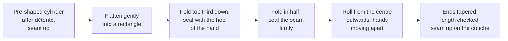

# 07.3 · From Bulk to Shaping

This lesson covers stages 8 to 13: from the dough in its tub to shaped pieces proofing on the couche. Module 4 taught the fermentation side of pointage, dividing, détente and apprêt; here the focus is the hands and the machines: how a piece is shaped, what the dough tells you at shaping, and what changes when the work is mechanised. You finish with a shaping drill of boules, bâtards and baguettes.

## Why it matters

Shaping decides the bread's form, its volume and how evenly it bakes. A loose baguette spreads and bakes flat; one shaped too tight tears and bursts on the side. In the production test the jury sees your pieces' regularity and your gestures directly (see [The CAP Boulanger Exam](../../references/cap-exam.md)), and the référentiel asks you to explain how dividing and shaping act on the dough, to recognise its main defects and to weigh the pros and cons of the machines (S3.1.3, S3.1.4).

## Key terms

| French | Say it | English meaning |
|---|---|---|
| façonnage | *fah-so-NAHZH* | shaping: giving each piece its final form |
| clé / soudure | *KLAY / soo-DÜR* | the seam: the join closed at the end of shaping |
| mise en tension | *meez ahn tahn-SYOHN* | building surface tension: a taut skin over the piece |
| façonneuse | *fah-so-NUHZ* | moulder: rollers flatten the piece, a belt rolls and lengthens it |
| balancelle | *bah-lahn-SELL* | intermediate prover: swinging pockets that carry pieces through their détente |
| repose-pâtons | *ruh-POHZ pah-TOHN* | resting cabinet or rack for pieces during the détente |
| peseuse volumétrique | *puh-ZUHZ vo-lü-may-TREEK* | volumetric divider: cuts pieces continuously by volume |
| excès de force / manque de force | *ek-SEH duh FORSS / mahnk duh FORSS* | too much strength (elastic, tears) / too little (slack, spreads) |

## How it works

### Stage 8: ending pointage

Pointage ends when the dough has the volume and feel the sheet describes, not when the timer rings (lesson [04.2](../module-04/lesson-02.md)). If it is running ahead or behind, change its temperature: about 7 % faster or slower per °C. A 2 °C warm dough is ready in about 45 ÷ 1.15 ≈ 39 minutes instead of 45. Pointage also builds strength: the longer it runs, the more elastic the dough is at dividing.

### Stages 9-11: dividing, pre-shaping, détente

Divide by weight, quickly and in order; pre-shape into balls or loose cylinders; rest covered until the pieces stretch without pulling back (lesson [04.3](../module-04/lesson-03.md)). The détente is the adjustment between the dough's strength and the shaping you want: a strong dough needs a longer one.

### Stage 12: what shaping does

Shaping does four things at once:

1. **Gives the form**: boule, bâtard, baguette, roll.
2. **Builds surface tension**: the outer layer of gluten is stretched into a taut skin. In the oven this skin holds the gas and pushes the loaf up rather than out.
3. **Redistributes the gas**: big bubbles are pressed out or divided, so the crumb is even.
4. **Closes the seam** (la clé): the join is sealed so it does not open in the oven.

The bench must grip the dough slightly: too much flour and the piece slides without gaining tension; too much force and the skin tears.

| Shape | Pre-shape | Key gesture | Proof position |
|---|---|---|---|
| Boule | ball | fold the edges to the centre, turn seam down, drag towards you on the bench while turning until taut | seam up in a floured banneton, or seam down on a tray |
| Bâtard | loose cylinder | fold top third, seal; fold in half, seal; roll with more pressure at the ends | seam up on the couche |
| Baguette | loose cylinder | as bâtard, then roll from the centre outwards to length in two or three passes | seam up on the couche, pleats between pieces |

### What the dough tells you at shaping

The référentiel names five dough defects. You feel them first at dividing and shaping:

| Defect | What you feel | Likely causes | Correct now | Correct next batch |
|---|---|---|---|---|
| Excès de force (too strong) | elastic, springs back, tears when lengthened | long or warm pointage, too much oxidation or improver, strong flour, short détente | longer détente; gentler shaping in two passes | shorter or cooler pointage; check flour and mixing ([03.5](../module-03/lesson-05.md)) |
| Manque de force (too weak) | slack, spreads, will not hold tension | short pointage, under-kneading, weak flour, too much water | tighter pre-shape, a fold, shorter détente | more pointage or a fold; less water; check kneading |
| Pâte trop ferme (too firm) | hard to stretch, tears, dry surface | too little water; flour absorbs more | longer rests; light hands | bassinage at mixing; adjust hydration |
| Pâte trop douce (too soft) | sticky, sags, sticks to hands and couche | too much water; dough too warm; over-mixed | a little more flour on the bench; work fast; firmer couche folds | less water; check dough temperature |
| Pâte croûtée (skinned) | dry, cracked skin on the pieces | pieces left uncovered; dry air | shape with the dry skin underneath and seal it inside if thin | cover at every rest; humid cabinet |

A dough of good quality at shaping is smooth, slightly tacky but not sticky, stretches without tearing, holds the shape you give it and keeps its gas.

### Mechanisation: from the tub to the couche

| Machine | What it does | Advantages | Drawbacks |
|---|---|---|---|
| Diviseuse hydraulique | presses one load into 10 or 20 equal pieces by volume | fast, even, little effort | weight depends on even gas: check pieces on the scale |
| Peseuse volumétrique | sucks or pushes dough into a chamber of set volume, continuously | high output, regular weights | stresses and degasses the dough; needs a tolerant dough; mainly larger production |
| Balancelle / repose-pâtons | carries or holds pieces through the détente | regular, timed rest; saves bench space | cleaning; pieces must be covered or kept humid |
| Façonneuse | rollers sheet the piece, a belt and pressure plate roll it to length | speed, regular length, less strain on the wrists | degasses more than hands; tears a strong dough; settings to adjust; less artisanal look |

Machines save time and effort but need a dough that tolerates them and settings matched to it. [Module 13](../module-13/lesson-02.md) covers the equipment in detail.

> [!CAUTION]
> Rollers and belts of a moulder or divider can trap fingers: guards stay closed, the machine is stopped before cleaning, and a stuck piece is never freed by hand while it runs.

### Stage 13: into the apprêt

Shaped pieces go straight to the apprêt in the order they were shaped, covered, at the sheet's temperature and humidity, and are judged by the poke test (lesson [04.4](../module-04/lesson-04.md)). On the couche the pleat between two baguettes holds each one's shape; in a banneton the basket does.

## Worked example

Friday, 4:40. The PC-02 batch (24 baguettes of 350 g, lesson [01.6](../module-01/lesson-06.md)) is going through the façonneuse. The oven was late, so pointage ran 70 minutes instead of 45. The first baguettes come out at 46-48 cm instead of 55 cm, with torn patches on the surface, and shrink back on the couche.

**1. Diagnose.** Elastic, tearing, shrinking back: **excès de force**. The evidence is on the stage list: 25 extra minutes of pointage built strength, and the détente was kept at the usual 20 minutes.

**2. Correct now.**
- Stop feeding the machine. Leave the remaining pieces covered for another 10 minutes of détente (30 minutes in all).
- Reduce the pressure plate and open the rollers one notch so the machine stretches less in one pass.
- Finish the first 6 baguettes by hand: a second gentle rolling pass to 55 cm after 5 minutes' rest.
- Check: the next baguettes come out at 54-55 cm without tears.

**3. Consequence for the apprêt.** The dough is more fermented than usual: start the poke test 15 minutes early.

**4. What should have happened at 3:40.** A 25-minute delay is 70 ÷ 45 ≈ 1.56 times the time; at about 7 % per °C that needs a dough about 6-7 °C cooler (1.07 to the power 6.5 ≈ 1.55). A tub on the bench cannot get there: when the oven delay was known, the tub should have gone into the cold room for part of the pointage.

**5. Report (C4.4).** "PC-02 du 13/11: four en retard, pointage 70 min; excès de force au façonnage, détente portée à 30 min, façonneuse réglée plus souple, 6 baguettes reprises à la main. Proposition: bac en chambre froide dès qu'un retard four est connu."

## Practice

You shape two boules, two bâtards and two baguettes from one 1 kg PD-01 dough, measure them, proof them and bake them. Use the dough you mixed in lesson [07.2](lesson-02.md), or mix it now as there.

> [!WARNING]
> You bake at 240 °C with steam. Use dry oven gloves, steam only into a preheated metal tray (never a glass dish), pour and stand back. Score with the blade moving away from your fingers and cover the lame after use.

### You need

- Minimum: the PD-01 dough from 07.2 (1,683 g), scale, scraper, ruler, timer, a heavy cotton or linen cloth folded into pleats as a couche, a bowl lined with a well-floured cloth as a banneton (or two), a board or stiff card to transfer the baguettes, baking paper, a tray, a metal tray for steam, oven gloves, lame, the [bake log](../../templates/bake-log.md).
- Professional equivalent: bench with a dusting of flour, divider, façonneuse, linen couches on boards, cane bannetons, a planchette (transfer board).

### Ingredients

PD-01 on 1 kg of flour, as in lesson 07.2:

| Ingredient | Baker's % | Weight |
|---|---|---|
| Flour T55 (or white bread flour) | 100 | 1,000 g |
| Water | 65 | 650 g |
| Fine salt | 1.8 | 18 g |
| Fresh yeast (or instant 5 g) | 1.5 | 15 g |
| **Total** | **168.3** | **1,683 g** → 6 pieces of 270 g |

### Steps

1. **Pointage:** 1 h 15 at about 24 °C with a fold at 40 minutes; end it by the dough's signs (lesson 04.2). Write the dough temperature.
2. **Divide** 6 pieces of 270 g (±2 g), each with at most one add-on. The last 63 g can be shaped into a roll.
3. **Pre-shape:** pieces 1-2 into balls; pieces 3-6 into loose cylinders about 12 cm long. Cover. Détente 20 minutes (longer if they pull back).
4. **Boules (1-2):** edges folded to the centre, turned seam down, dragged towards you while turning until taut. Seam up into the floured bannetons. Time each one.
5. **Bâtards (3-4):** fold, seal, fold, seal, roll to **25 cm** with slightly tapered ends. Seam up on the couche. Measure.
6. **Baguettes (5-6):** as bâtards, then roll from the centre outwards in two or three passes to **35 cm** (or the length your tray takes). Seam up on the couche, a pleat between each piece. Measure.
7. **Judge the dough:** write which defect you felt, if any (strong, weak, firm, soft, skinned), and what you did.
8. **Oven:** 240 °C with the baking tray in the middle and the metal steam tray at the bottom, preheated (your real preheat time).
9. **Apprêt:** covered, about 45-60 minutes at 24-26 °C, until the poke test says ready.
10. **Bake:** baguettes and bâtards transferred seam down onto baking paper with the board; boules turned out seam down. Score (baguettes 3 cuts, bâtards 1, boules a cross), steam, bake about 20 minutes for baguettes and 25-30 for the rest, in two loads if the tray is full. Cool on a rack.

### Targets

- Six pieces of 270 g ±2 g.
- Bâtards 25 cm ±1 cm, baguettes 35 cm ±1 cm, the two of each within 1 cm of each other.
- Shaping time: 60 seconds or less per piece by the second piece of each shape.
- Seams straight and closed; no tears on the surface.

### How you know it worked

The shaped pieces hold their form on the couche without spreading or shrinking back. In the oven they rise up rather than out, the seam stays closed underneath, and the two of each shape look like a pair. Cut one bâtard when cool: the crumb is even, without a big tunnel under the crust (a sign of a bubble trapped at shaping).

### In Israel

Checked 2026-10-08.

- **Tight white flour.** Israeli white flour is often stronger than T55 and some bags contain ascorbic acid, so the dough can feel elastic and tear at shaping ([Flour in Israel](../../references/flour-in-israel.md)): give a longer détente (25-30 minutes) and shape in two gentle passes.
- **Summer.** At 28-32 °C the dough softens and gets sticky fast and pieces proof quickly: shape in the air-conditioned room, use as little bench flour as you can, and start the poke test early.
- **Couche and banneton.** A linen cloth (בד פשתן, *bad pishtan*) or a heavy cotton tea towel works as a couche. Proofing baskets (סלסלת התפחה, *salsilat hatfakha*, or "banneton") are sold in baking-supply shops and online; a bowl lined with a floured cloth does the same job. Use rice flour or a mix of flour and semolina on the cloth so humid summer dough does not stick.
- **Tray size.** Measure your tray before you decide the baguette length: a 60 cm-wide oven usually takes a tray about 45 cm across, so 35-38 cm baguettes fit placed diagonally or straight.

### Self-check

- [ ] I can shape a boule, a bâtard and a baguette and explain what each gesture does.
- [ ] My pieces met the length and weight targets.
- [ ] I can recognise the five dough defects at shaping and give a correction for each.
- [ ] I can give one advantage and one drawback of each machine from divider to moulder.

## What goes wrong

| Symptom | Likely cause | Fix now | Prevent next time |
|---|---|---|---|
| Piece tears and shrinks back when lengthened | Excès de force; détente too short | Rest 10 more minutes; shape in two passes | Cooler or shorter pointage; détente matched to the dough |
| Piece spreads flat on the couche | Manque de force; shaped too loose | Reshape tighter once, shorter apprêt | Fold during pointage; less water; firmer shaping |
| Big hole under the crust after baking | Bubble trapped at shaping; seam not sealed | — | Flatten gently to remove big bubbles; seal the seam with the heel of the hand |
| Baguettes of different lengths and thicknesses | Uneven pre-shape; rolling pressure uneven | Re-roll the short one after a short rest | Even pre-shapes; measure each; roll from the centre out |
| Dough sticks to the couche at transfer | Couche not floured; dough too soft; humid proof | Ease it off with the board; flour the next folds well | Rice flour on the couche; check hydration and dough temperature |
| Torn surface out of the façonneuse | Dough too strong for the settings | Reduce pressure plate, open rollers, longer détente | Settings matched to each dough; check pointage time |

## Review

- Pointage ends by the dough's signs; its length also sets the dough's strength at shaping.
- Shaping gives the form, builds surface tension, evens the gas and closes the seam.
- Feel the dough: excès de force, manque de force, trop ferme, trop douce, croûtée; each has a correction now and one for the next batch.
- Machines (divider, volumetric divider, intermediate prover, moulder) give speed and regularity but stress the dough and need settings matched to it.
- Exam-relevant (S3.1.3, S3.1.4, C2.3): see [the CAP exam reference](../../references/cap-exam.md).
