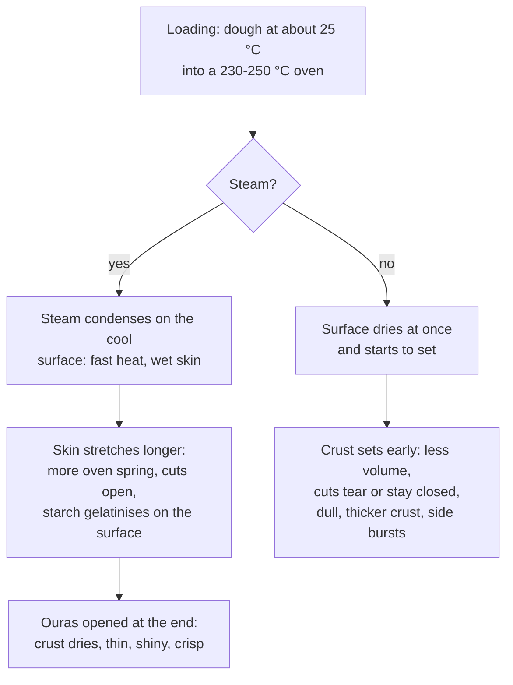
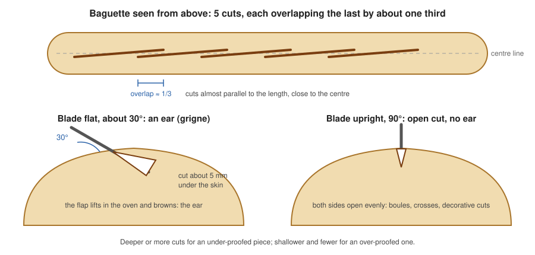

# 07.4 · Scoring, Steam and Loading the Oven

The last minute before the oven decides how the bread opens, how much it rises and how its crust looks. This lesson explains why bread is scored and steamed, how a professional organises the oven loader, and how to get steam safely in a home oven. You finish by baking the same dough three ways and comparing the results.

## Why it matters

Two identical proofed baguettes can come out completely different: one with a tall, even shape, open cuts and a thin shiny crust; the other burst on the side, dull and small. The difference is in stages 14 and 15: the cuts, the steam and the loading. The référentiel asks you to explain the roles of scoring and steam and to organise the oven loader according to the production (S3.1.5), and the jury sees your scoring directly in the production test (see [The CAP Boulanger Exam](../../references/cap-exam.md)).

## Key terms

| French | Say it | English meaning |
|---|---|---|
| grignage / scarification | *gree-NYAHZH / skah-ree-fee-kah-SYOHN* | scoring: cutting the proofed dough with a blade |
| grigne | *GREEN-yuh* | the ear: the raised, browned flap along a cut |
| lame | *LAHM* | the baker's blade, curved or straight, on a handle |
| coup de lame | *koo duh LAHM* | one cut; a baguette has 5 to 7 |
| tapis d'enfournement / enfourneur | *tah-PEE dahn-foorn-MAHN / ahn-foor-NUHR* | oven loader: a belt on a frame that lays a whole row of pieces on the deck at once |
| planchette (de transfert) | *plahn-SHET* | transfer board: moves a baguette from the couche to the loader |
| ouras | *oo-RAH* | the oven's dampers, opened to let steam out at the end of baking |
| buée | *bü-AY* | steam put into the oven at loading |

## How it works

### Why steam: the first minutes in the oven

A proofed piece goes into the oven at about 25 °C. In the first minutes three things race each other:

1. **Oven spring.** Gas expands with heat, CO₂ comes out of solution and ethanol evaporates; the yeast works faster until it dies at about 46-50 °C in the dough ([04.1](../module-04/lesson-01.md)). The loaf grows.
2. **The crust forms.** Once the surface dries and passes 100 °C it hardens and stops stretching.
3. **The crumb sets.** Starch gelatinises from about 55-60 °C and gluten sets around 70-80 °C ([02.3](../module-02/lesson-03.md)).

Oven spring only lasts while the surface can still stretch. **Steam** keeps it stretchy: water vapour condenses on the cool dough, giving up its heat (about 2,260 J per gram of steam, more than heating the same water from 0 to 100 °C five times over). The surface heats fast **but stays wet**, so the crust sets later and the loaf rises more. The film of water also gelatinises the starch on the surface, which gives the thin, shiny, crisp crust of a good baguette. Once the surface reaches 100 °C, steam no longer condenses on it: steam matters only at loading. Later the ouras are opened (or the home oven door is cracked open for the last minutes) so the crust dries and crisps.

| Steam | What you see |
|---|---|
| Right amount | full volume, cuts open with a raised ear, thin shiny golden crust |
| Too little or none | smaller loaf, dull and thicker crust, cuts torn or barely open, bursts on the side (pain cintré) |
| Too much, or left too long | cuts close up and flatten, crust thick, leathery or blistered, slow to colour |

### Why score: choosing where the loaf opens

As the loaf expands in the oven, its skin, tightened at shaping, must give somewhere. Unscored, it bursts where the skin is weakest, often along the side or the seam, or it barely rises. The cut makes a planned weak point: the loaf opens there, grows more and keeps a regular shape. In King Arthur's side-by-side trial, a scored baguette from the same batch had more volume and a more open crumb than an unscored one.

| Product | Cuts | Blade | Depth |
|---|---|---|---|
| Baguette (55 cm) | 5-7 cuts close to the centre line, almost parallel to it, each overlapping the last by about one third | curved or straight blade held flat, about 30° | about 5 mm under the skin |
| Bâtard | 1 long cut, or 3-4 short diagonal ones | flat, about 30° | 5-10 mm |
| Boule | cross, square, or decorative pattern | upright, about 90° | 5-10 mm |
| Rolls | 1 cut, or a cross | flat or upright | shallow |

Adapt the cuts to the apprêt (lesson [04.4](../module-04/lesson-04.md)): an under-proofed piece still has a lot of spring, so cut a little deeper or add a cut; an over-proofed piece has little left and collapses if cut deep, so cut shallower and fewer. If the blade drags, the dough is probably over-proofed. Use a sharp blade and one quick, confident stroke per cut: a hesitating blade tears.

> [!WARNING]
> Lame blades are razor-sharp: cut with the blade moving away from the hand that holds the bread, keep the cover on whenever the lame is not in your hand, and change blades by holding the blade's blunt edges, never the cutting edge.

### Stage 15: organising the oven loader

In a deck oven the pieces are placed on the **tapis d'enfournement** (loader) outside the oven, scored there, then laid on the hot sole in one movement. Organising it is a planning job:

- **One product per deck load**: the same size and bake time, so the whole load comes out together.
- **Order of loading**: earliest deadline first; then by bake temperature (a hotter oven first, as the deck cools a little with each load).
- **Spacing**: pieces must not touch after oven spring; keep the same gap across the loader so they colour evenly.
- **Score on the loader**, last thing before loading, so the cuts do not dry or close.
- **Steam at loading**: the oven's steam is injected just before or as the load goes in; the door is closed at once.
- **Check before loading**: oven temperature on the thermometer, steam ready, the deck empty and brushed.

A ventilated (convection) oven or a rack oven is loaded with trays or a whole rack; lesson [07.5](lesson-05.md) compares the oven types.

### Steam at home

A home oven has no steam injector, and its door leaks and vents steam. Setups that work, from the professional idea to the kitchen:

| Setup | How | Result | Limits and risks |
|---|---|---|---|
| None (control) | — | smaller, dull, cuts torn | — |
| Spray bottle | spray the loaf before loading | little effect (King Arthur trial) | never spray inside a hot oven: cold water on the door glass or the light can crack them |
| Preheated metal tray + hot water (the course's standard home method) | metal tray on the lowest shelf, preheated with the oven; fan off; pour 100-150 mL of hot water at loading; close the door; let the steam out at about 10 minutes | good volume and colour in an electric oven | steam burst at the door; tray scales; weak in gas ovens, which vent steam |
| Metal tray with lava rocks or a rolled towel | as above, with stones or a wet towel spreading the water | more surface, more and longer steam | towel can scorch if left after the water is gone |
| Cover: upturned metal roasting pan or bowl | loaf on a hot tray or stone, cover over it for the first 15-20 minutes | traps the loaf's own steam: shiny, open cuts; works in gas ovens | hot, awkward cover to lift; baguettes need a long cover |
| Cast-iron pot with lid (Dutch oven) | preheated pot, lid on 20-25 minutes, then off | excellent for boules and short bâtards | the pot is at 250 °C and heavy: two gloves, a clear landing spot |

> [!CAUTION]
> Never pour water into a hot glass (Pyrex) or ceramic dish: the thermal shock can shatter it. Use only a metal tray or pan preheated with the oven, wear a long, dry oven glove (a wet glove passes heat straight to your skin), pour from a kettle with your arm extended and your face turned away, close the door at once and stand back. When you open a steamed oven, stand to the side and let the steam out before you reach in. Keep children and pets out of the way.

## Worked example

Saturday, 5:55. The order of 14 November: 24 baguettes PC-02 (350 g) for 7:00 and 20 rolls (60 g) for 7:30, in a two-deck oven at 250 °C. Each deck's loader takes 12 baguettes or 20 rolls. Bake times: baguettes 22 minutes, rolls 15 minutes.

**1. Plan the loads.** Baguettes first (earliest deadline): 12 on the top deck, 12 on the bottom deck. Rolls on the first deck to empty: 20 on one loader.

**2. Check before loading.** Oven thermometer: top deck 250 °C, bottom deck 248 °C. Steam reservoir full. Decks brushed. Poke test on the baguettes: ready.

**3. Load 1 (6:00).** Transfer 12 baguettes from the couche to the loader with the planchette, seam down, evenly spaced. Score: 5 cuts each, blade at about 30°, about 5 mm deep: 60 cuts, about 1 minute. Steam, load, close the door. Load 2 on the bottom deck at 6:02 the same way.

**4. During the bake.** At about 17 minutes, open the ouras so the crust dries. At 6:22 and 6:24 unload when the colour is right and the base sounds hollow.

**5. Rolls (6:25).** Top deck brushed, steam, 20 rolls with one cut each, loaded; out at 6:40. They cool by 7:10 for the 7:30 delivery.

**6. What went wrong last week, and why.** An apprentice scored the baguettes on the couche at 5:50 "to save time", then waited 10 minutes for the oven. The cuts dried and partly closed; the baguettes opened unevenly and two burst on the side. Score on the loader, last thing before the oven.

## Practice

You bake one dough three ways: no steam, a metal tray with boiling water, and a cover. You compare volume, cuts and crust and decide which setup you will use from now on.

> [!WARNING]
> The oven is at 240 °C. Follow the caution above for every steam step: preheated metal tray only, long dry glove, kettle, arm extended, face away, door shut at once, stand back. Put hot covers and trays only on a heat-proof surface you cleared beforehand.

### You need

- Minimum: one 1 kg PD-01 dough (lessons [07.2](lesson-02.md) and [07.3](lesson-03.md)), scale, ruler, lame or a new razor blade on a holder (or a very sharp knife), couche, transfer board, baking paper, a flat baking tray or a baking stone, a metal tray or pan for the bottom shelf, an upturned metal roasting pan or a large metal bowl that fits over a bâtard, kettle, long oven gloves, oven thermometer, wire rack, the [bake log](../../templates/bake-log.md).
- Professional equivalent: deck oven with steam injector and ouras, loader, planchette, lame.

### Ingredients

PD-01 on 1 kg of flour (flour 1,000 g, water 650 g, salt 18 g, fresh yeast 15 g or instant 5 g; total 1,683 g) → 6 bâtards of 270 g; the remaining 63 g as a test roll.

### In Israel

Checked 2026-10-08.

- **Know your oven.** Built-in electric ovens with fan (טורבו, "turbo") and conventional (top and bottom heat) modes are common; some freestanding ranges have gas ovens. Keep the fan off for the first 10 minutes (conventional top and bottom heat): the fan blows the steam away and dries the surface. If your oven is gas, rely on the cover method.
- **Equipment.** A dark metal baking tray (תבנית אפייה, *tavnit afiya*) for the bottom shelf; a cast-iron pot (סיר ברזל יצוק, *sir barzel yatzuk*); a baking stone (אבן אפייה, *even afiya*); lava stones (אבני לבה, *avnei lava*) are sold for gas grills. Check that anything going under the steam is metal or stone, never glass or enamel with chips. Lames are sold in baking-supply shops and online.
- **Oven size.** Most 60 cm-wide ovens take a tray about 45 cm across: two bâtards per load fits; three is tight. Measure before you plan the loads.
- **Summer.** In a hot kitchen the pairs waiting for the oven over-proof fast: keep them in the fridge as described in the steps, and open the oven door as little as possible so the kitchen does not heat further.

### Steps

1. Pointage, divide 6 × 270 g, pre-shape, détente and shape 6 bâtards of about 22 cm (lesson [07.3](lesson-03.md)). Number the pieces in pairs: A (no steam), B (tray), C (cover).
2. Pair A proofs at room temperature. Pairs B and C go straight into the fridge, covered, after shaping (the cold slows them, so each pair is ready in turn).
3. Preheat 45-60 minutes at 240 °C (conventional heat): baking tray or stone in the middle, the metal steam tray on the lowest shelf. Check with the oven thermometer.
4. **Pair A, no steam.** When ready (poke test), take pair B out of the fridge. Transfer A onto baking paper, score one long cut at about 30° and about 5 mm deep, load, bake about 22 minutes. Do not put water in the tray.
5. **Pair B, tray and hot water (the standard home method).** Reheat 10 minutes. Take pair C out of the fridge. Score B, load, then pour 100-150 mL of hot water into the preheated metal tray, close the door at once and stand back. Fan off. At about 10 minutes open the door from the side to let the steam out, then finish the bake (about 22 minutes in all).
6. **Pair C, cover.** Empty and dry the steam tray (gloves). Reheat 10 minutes with the roasting pan or bowl in the oven to heat it. Score C, load, cover the pair with the hot pan for 15 minutes, then remove it (two gloves, onto the cleared surface) and finish the bake.
7. Cool all six on a rack for at least 1 hour.
8. **Measure each bâtard:** height and width at the middle (cm), how wide the cut opened (mm), whether an ear formed, crust shine (dull / satin / shiny), any side burst, and the weight. Fill in a comparison table in the bake log.

### Targets

- All six bâtards 270 g ±2 g before baking and scored the same way (one cut, about 30°, about 5 mm).
- Steam steps done exactly as in the caution, with no water on the door glass.
- A comparison table with height, width, cut opening, ear, shine and bursts for the three pairs.

### How you know it worked

The three pairs look like three different breads from one dough: A is lower, duller, with a cut that tore or barely opened; B and C are taller with an opened cut, and the better of them shows an ear and a shiny crust. Your table, not your impression, tells you which setup your oven needs. If B and C look like A, the oven vents steam (often a gas oven): use the cover method.

### Self-check

- [ ] I can explain in two sentences what steam does to the surface in the first minutes and why it matters only at loading.
- [ ] I score with one quick stroke per cut at the right angle and depth, and adapt the cuts to the apprêt.
- [ ] I can organise a loader: which product, which deck, which order, when to score, when to steam.
- [ ] I can steam a home oven without glass, without water on the door and without standing in the steam.

## What goes wrong

| Symptom | Likely cause | Fix now | Prevent next time |
|---|---|---|---|
| Loaf burst along the side (pain cintré), cut closed | No or too little steam; cut too shallow; under-proofed | — | Steam at loading; cut through the skin; check the apprêt |
| Cuts flat and fused, no ear | Blade held upright on a baguette; cuts too short or not overlapping; too much steam | Open the ouras or door earlier | Blade flat at about 30°; cuts overlapping by a third; steam only at loading |
| Loaf deflates when scored | Over-proofed | Score shallow and fewer; load at once | Poke test earlier; cooler apprêt |
| Ragged, torn cuts | Blunt blade, slow stroke, dough sticky or skinned | — | New blade; one quick stroke; cover pieces during apprêt |
| Dull, thick crust, pale | No steam, steam vented (gas oven), oven not hot enough | Longer bake for colour | Cover method in a gas oven; preheat to the real temperature |
| Uneven colour across a load | Pieces too close or unevenly spaced; deck hotter at the back | Turn the tray halfway (home) | Even spacing on the loader; know the oven's hot spots |

## Review

- Steam condenses on the cool dough, heats the surface while keeping it wet, delays the crust and so increases oven spring; it also gives the thin, shiny crust. It works only at loading; ouras open at the end.
- Scoring sets where the loaf opens: baguette cuts flat at about 30°, about 5 mm deep, overlapping by a third; adapt depth to the apprêt.
- The loader is organised by product, deadline and temperature; score on the loader, steam at loading.
- At home: a preheated metal tray on the lowest shelf with 100-150 mL of hot water at loading, fan off, steam let out at about 10 minutes; or a cover in a gas oven. Never glass, never water on the door, always stand back.
- Exam-relevant (S3.1.5): see [the CAP exam reference](../../references/cap-exam.md).
