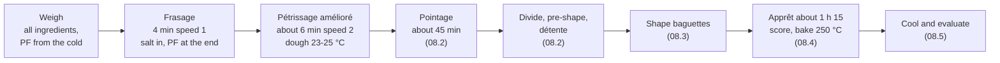

# 08.1 · Pain Courant: Formula and Mixing

This is the first lesson of Part 2 and of your first complete bread: the pain courant baguette on pâte fermentée. It explains what "pain courant" means, what every line of the PC-02 sheet does, and how the dough is mixed to its target temperature and consistency. You then make a pâte fermentée in the evening and mix a home batch of PC-02 the next day.

## Why it matters

Pain courant is the everyday bread of a French bakery and the first bread on the référentiel's list of bread types (S3.2: cite the raw materials, give the stages of manufacture). The production test asks you to complete a technical sheet for pain courant or tradition and to make bread from a dough with pâte fermentée; what exactly is asked and how it is marked is in [The CAP Boulanger Exam](../../references/cap-exam.md). Everything in Part 1 meets here: the flour and salt of Module 2, the mixing of Module 3, the fermentation of Module 4, the water temperature of Module 5 and the calculations of Module 6. A baguette shows every mistake: a dough that leaves the mixer 3 °C too warm is a pale, flat baguette two and a half hours later.

> [!NOTE]
> This is the first lesson of a practical module, so the usual reminder: watching someone bake does not make you able to bake. Do the practice at home. The Academy cannot grade photos, so you compare your result with the targets and the [quality rubric](../../templates/quality-rubric.md) yourself, and that self-assessment does not replace the official practical exam.

## Key terms

| French | Say it | English meaning |
|---|---|---|
| pain courant (français) | *pan koo-RAHN* | everyday French bread: wheat bread that is not sold under a protected name such as tradition; additives allowed |
| baguette | *bah-GET* | long, thin loaf; in pain courant usually a 250-350 g pâton |
| pâte fermentée | *paht fair-mahn-TAY* | a piece of yesterday's (or this morning's) salted, fermented dough added to today's |
| pâte bâtarde | *paht bah-TARD* | dough of medium consistency, between firm and soft: the usual baguette dough |
| frasage | *frah-ZAHZH* | first mixing phase at slow speed until no dry flour is left |
| pétrissage amélioré | *pay-tree-SAHZH ah-may-lyo-RAY* | improved mixing: frasage then a few minutes in second speed |
| TPV | *tay-pay-VAY* | target dough temperature (température de pâte visée) |
| bassinage | *bah-see-NAHZH* | extra water added at the end of mixing to soften a firm dough |

## How it works

### What "pain courant" means

The 1993 bread decree protects the name **pain de tradition française**: wheat flour, water, salt, yeast and/or levain, a few listed flours, **no additives**, never frozen ([décret n°93-1074](https://www.legifrance.gouv.fr/loda/id/JORFTEXT000000727617); Module 9). Bread that does not meet those rules is **pain courant**. It may use ordinary bread flour with ascorbic acid (E300), improvers allowed for bread, and faster methods. It is not a lesser bread: well made, on pâte fermentée with improved mixing, it has a crisp crust, a creamy crumb and a clean wheat flavour. It is cheaper to make because the day is shorter.

One legal number does apply: since October 2023, pain courant such as the baguette must contain at most **1.4 g of salt per 100 g of bread** ([Ministry of Agriculture](https://agriculture.gouv.fr/filiere-boulangerie-vers-une-diminution-du-sel-dans-le-pain-0); lesson [02.5](../module-02/lesson-05.md)).

### The PC-02 sheet, line by line

The course's pain courant sheet is PC-02 from lesson [01.6](../module-01/lesson-06.md):

| Ingredient | % | Job in this dough |
|---|---|---|
| Flour T55 | 100 | Medium-strength white flour: enough gluten for a light baguette, little bran, a pale creamy crumb ([02.2](../module-02/lesson-02.md)) |
| Water | 64 | Gives a **pâte bâtarde**: soft enough to stretch to a long baguette, firm enough to hold its shape on the couche ([03.2](../module-03/lesson-02.md)) |
| Salt | 1.8 | Flavour, tightens the gluten, slows the yeast. With about 20 % baking loss it gives about 1.34 g per 100 g of bread: under the 1.4 g limit ([06.3](../module-06/lesson-03.md)) |
| Fresh yeast | 1.5 | Enough gas for a pointage of about 45 minutes and an apprêt of about 1 h 15 at 24-25 °C ([02.6](../module-02/lesson-06.md)) |
| Pâte fermentée | 15 | Brings acidity, aroma and strength from a dough that has already fermented for hours, so a short day still gives taste and keeping quality ([04.5](../module-04/lesson-05.md)) |
| **Total** | **182.3** | |

The pâte fermentée is itself pain courant dough, with its own flour, water, salt and yeast in the same ratio. So the bread's true hydration stays 64 % and its salt stays 1.8 % of all the flour ([06.4](../module-06/lesson-04.md)). Its yeast and acid are what speed up and strengthen the new dough.

### From mixer to oven

This lesson covers the first three boxes. [Module 7](../module-07/lesson-01.md) sets out every stage of the production process in general; this module applies them to one product.

### Mixing pain courant

**Order of ingredients** (lesson [03.3](../module-03/lesson-03.md)): water at the calculated temperature, then flour, then crumbled fresh yeast; salt during the frasage; the pâte fermentée **cut into pieces at the end of frasage**, because it is already a developed, salted dough and only needs to be blended in.

**Consistency check at the end of frasage.** Pinch the dough: a pâte bâtarde is supple and slightly sticky but does not run. Flour varies, so the sheet's 64 % is a starting point. If the dough is firm, add up to 2-3 % more water by bassinage during kneading; if it is soft, note it and reduce the water next time (lesson [03.5](../module-03/lesson-05.md)). Never add dry flour into a mixing dough to "fix" it: it never fully hydrates and leaves specks.

**Improved mixing** (pétrissage amélioré) is the usual artisan choice for pain courant: frasage about 4 minutes in first speed, then about 5-7 minutes in second speed on a spiral mixer. The dough comes away from the bowl, is smooth, and stretches to a thin but not perfectly clear windowpane. It is slightly below full development on purpose: pointage and the folds of shaping finish the job, and the crumb stays creamy. By hand, 10-12 minutes of slap-and-fold kneading brings a 500 g batch to about the same point.

**Temperature.** The target is 24 °C (23-25 °C). With a pâte fermentée, the base-temperature method of Module 5 uses **four factors** (lesson [05.3](../module-05/lesson-03.md)):

$$\text{water} = 4 \times \text{TPV} - \text{flour} - \text{room} - \text{pâte fermentée} - \text{friction factor}$$

with a friction factor measured with four factors too (about 4 × the heating: about 8 by hand, 24-28 for improved mixing on a spiral). A pâte fermentée straight from the cold room at 4-8 °C pulls the dough down, so the water has to be warmer than for a direct dough. Every °C you miss changes fermentation speed by roughly 7 % (lesson [04.2](../module-04/lesson-02.md)): the whole schedule of lessons 08.2-08.4 depends on this one reading.

## Worked example

Saturday 14 November, Boulangerie Au Pain de la Halle: the order of lesson 01.6 (24 baguettes at 350 g and 20 rolls at 60 g, PC-02). The batch is already on the sheet: T55 5,400 g, water 3,456 g, salt 97 g, fresh yeast 81 g, pâte fermentée 810 g, total 9,844 g.

1. **Readings at 2:30.** Flour 20 °C, fournil 22 °C, pâte fermentée from the cold room 7 °C. The sheet's friction factor for PC-02, improved mixing, about 10 kg: 26 (four factors, measured last week, lesson 05.3).
2. **Water temperature.** Base 4 × 24 = 96. Water = 96 − 20 − 22 − 7 − 26 = **21 °C**. The water dosing unit is set to 21 °C; the meter to 3,456 g.
3. **Requisition check.** Pâte fermentée tub labelled "PC-02, vendredi 15:40", smells pleasantly acidic, has roughly doubled: ripe, not over-ripe. Yeast block within date. Salt weighed separately, never on the yeast.
4. **Frasage, 4 minutes speed 1.** Water, flour and crumbled yeast; salt after one minute; the pâte fermentée cut into eight pieces at the end. Pinch test: slightly firm. You add 70 g of bassinage water (about 1.3 % of the flour) at the start of second speed and write it on the sheet.
5. **Kneading, 6 minutes speed 2.** The dough clears the bowl, is smooth and stretches into a thin, slightly cloudy film.
6. **Temperature.** Probe in the centre of the dough: **24.4 °C**. On target. You write 24.4 °C on the [temperature log](../../templates/temperature-log.md) with the inputs and the bassinage, tip the dough into an oiled tub, cover it and note the time for pointage (08.2).
7. **What if it had read 26.5 °C?** 2.5 °C too warm is about 1.07^2.5 ≈ 1.18, so fermentation runs about 18 % faster: pointage of 45 minutes becomes about 38 minutes, and the apprêt shortens too. You would tell the chef now, not at 6:00 when the baguettes are over-proofed.

## Practice

You make a small pâte fermentée in the evening, then mix a home batch of PC-02 by hand to 24 °C ± 1 °C the next day and finish it as three short loaves. If you have already read lessons 08.2-08.4, carry the dough on through them instead.

> [!WARNING]
> The oven is at 240 °C with steam. Use dry oven gloves, steam only into a metal tray preheated in the oven (never pour water into a hot glass or ceramic dish: it can shatter), pour and step back. Score with the blade moving away from your fingers and cover the lame after use.

### You need

- Minimum: scale (1 g) and a 0.1 g pocket scale for yeast and salt, probe thermometer, large bowl, scraper, small lidded container for the pâte fermentée, 2-3 L lidded container for pointage, kettle and a bottle of water kept in the fridge, baking tray, metal steam tray, oven gloves, lame or sharp knife, wire rack, [temperature log](../../templates/temperature-log.md) and [bake log](../../templates/bake-log.md).
- Professional equivalent: spiral mixer with two speeds, water dosing unit and water cooler, dough tubs, labelled pâte fermentée tubs in the cold room at about 4 °C, deck oven.

### Ingredients

**Evening: pâte fermentée** (a mini PC-02 dough without its own pâte fermentée; you need 75 g and make a little extra for what sticks):

| Ingredient | Baker's % | Weight |
|---|---|---|
| Flour T55 | 100 | 50 g |
| Water at about 24 °C | 64 | 32 g |
| Fine salt | 1.8 | 0.9 g |
| Fresh yeast (or 0.3 g instant dry) | 1.5 | 0.8 g |
| **Total** | **167.3** | **about 84 g** |

**Next day: PC-02 on 500 g of flour** (same proportions as the bakery's 5.4 kg batch):

| Ingredient | Baker's % | Home batch | Professional batch (01.6) |
|---|---|---|---|
| Flour T55 | 100 | 500 g | 5,400 g |
| Water at the calculated temperature | 64 | 320 g | 3,456 g |
| Fine salt | 1.8 | 9 g | 97 g |
| Fresh yeast (or 2.5 g instant dry) | 1.5 | 7.5 g | 81 g |
| Pâte fermentée | 15 | 75 g | 810 g |
| **Total** | **182.3** | **911.5 g** | **9,844 g** |

### In Israel

- **Flour:** use white flour (קמח לבן, *kemakh lavan*) as the T55; read the protein and ingredients as shown in [Flour in Israel](../../references/flour-in-israel.md). Ascorbic acid in the flour is fine for pain courant (not for tradition). If the dough feels tight at the end of frasage, which is common with stronger Israeli white flour, use the bassinage: up to 66 % total water.
- **Yeast:** fresh yeast (שמרים טריים, *shmarim triyim*) is in the chilled section of some supermarkets and bakery-supply shops; instant dry yeast (שמרים יבשים, *shmarim yeveshim*) is everywhere. Use one third of the fresh weight for instant (checked 2026-10-08).
- **Water in a warm kitchen:** in summer, with flour 29 °C, kitchen 30 °C, pâte fermentée 8 °C and a hand friction factor of 8: 96 − 29 − 30 − 8 − 8 = **21 °C**. Tap water at 26-30 °C is too warm: blend with fridge water (lesson [05.2](../module-05/lesson-02.md)). With tap 28 °C and fridge 5 °C: 320 × (28 − 21) ÷ (28 − 5) ≈ **97 g** fridge water + 223 g tap water.
- **Pâte fermentée in summer:** do not leave it out for the first hour on a 30 °C evening: 20 minutes is enough before the fridge.

### Steps

**The evening before (15 minutes)**

1. Mix the pâte fermentée ingredients in a small bowl and knead 2-3 minutes until smooth. Put it in the small oiled container, label it with the date and time.
2. Leave it 1 hour at room temperature (about 22-24 °C), then put it in the fridge (about 4 °C) for 8-12 hours.

**Mixing day (30 minutes, then the bake)**

3. Take the pâte fermentée out and measure its temperature, then the flour (in the bag) and the room at your worktop. Use your own four-factor friction factor if you measured one in lesson 05.3; otherwise use 8 (about 2 °C of heating by hand).
4. Calculate the water: 96 − flour − room − pâte fermentée − friction factor. Blend kettle, tap or fridge water to that temperature ± 0.5 °C (never above 40 °C), weigh 320 g. Write everything on the temperature log.
5. Weigh the flour, salt and yeast in separate containers; tick each one.
6. **Frasage (4 minutes):** water in the bowl, yeast crumbled in and dissolved, flour on top; mix with the scraper and one hand. After one minute add the salt. At the end, add the pâte fermentée torn into 6-8 pieces and squeeze it through the dough until no streaks remain.
7. **Consistency check:** pinch the dough. If it is firm and tears, keep 10-15 g of water aside and work it in during the first minutes of kneading (bassinage). Write how much you added.
8. **Kneading (10-12 minutes):** slap and fold on the unfloured worktop until the dough is smooth, clears your hand and stretches into a thin film that tears only when very thin.
9. **Measure the dough temperature** in the centre at once. Write it next to the target.
10. **Finish the dough:** pointage about 45-60 minutes with one fold at 30 minutes (judge by the signs of lesson [04.2](../module-04/lesson-02.md)); divide 3 × 270 g (keep about 75 g of what is left in the fridge as your next pâte fermentée); pre-shape, détente 20 minutes, shape three short bâtards about 25 cm long; apprêt until the poke test says ready (lesson [04.4](../module-04/lesson-04.md)); score once along the length, bake about 25 minutes at 240 °C with steam; cool on a rack.

### Targets

- Water within ± 0.5 °C of your calculation; dough at **24 °C ± 1 °C** after kneading.
- Dough smooth, a pâte bâtarde (supple, slightly tacky, holds a rounded shape), thin windowpane.
- Three pieces of 270 g ± 2 g; about 75 g kept as tomorrow's pâte fermentée.
- Every temperature and any bassinage written down.

### How you know it worked

The dough lands on 23-25 °C and you can show the calculation that predicted it. It rises steadily in pointage (roughly 1.5 times in 45-60 minutes), and the cooled loaves have a thin golden crust and a creamy, regular crumb that tastes of wheat with a light acidity, not of yeast.

### Self-check

- [ ] I made and labelled a pâte fermentée and measured its temperature before mixing.
- [ ] I used four factors, with a four-factor friction factor, for the water.
- [ ] I added the salt during frasage and the pâte fermentée at the end of frasage.
- [ ] I checked consistency at the end of frasage and recorded any bassinage.
- [ ] My dough temperature was within ± 1 °C of 24 °C, or I recorded the miss and its effect on pointage.

## What goes wrong

| Symptom | Likely cause | Fix now | Prevent next time |
|---|---|---|---|
| Dough 2-3 °C too cold | Cold pâte fermentée not counted; three factors used instead of four | Ferment somewhere warmer; allow about 7 % more time per °C | Measure the pâte fermentée and use 4 × TPV |
| Dough 2-3 °C too warm | Warm kitchen and flour; friction factor too low; over-kneaded | Shorten pointage by the 7 % rule; ferment cooler | Colder water (fridge blend); measure your own friction factor |
| Dough firm, tears, will not stretch | Strong or dry flour; water short; salt and pâte fermentée tighten it | Bassinage 2-3 % during kneading | Note the water this flour needs on the sheet |
| Dough sticky and slack | Too much water; over-ripe or warm-kept pâte fermentée | Give a fold in pointage; shape with less flour, more tension | Weigh water exactly; keep pâte fermentée at about 4 °C, use within the sheet's time |
| Streaks or lumps of old dough in the crumb | Pâte fermentée added in one cold lump or too late | Knead 1-2 minutes more | Cut it into pieces, add at the end of frasage |
| Bread tastes salty | Salt weighed twice or on the 1 g scale by eye | — (cannot be removed) | Weigh salt on the 0.1 g scale and tick it; check salt per 100 g (08.5) |

## Review

- Pain courant is wheat bread that does not carry a protected name such as tradition; additives are allowed, and salt must stay at or below 1.4 g per 100 g of bread.
- PC-02: T55 100, water 64, salt 1.8, fresh yeast 1.5, pâte fermentée 15. The pâte fermentée brings acidity, aroma and strength, not extra hydration.
- Mixing order: water, flour, yeast; salt during frasage; pâte fermentée in pieces at the end of frasage; consistency check, then improved mixing to a smooth, nearly fully developed dough.
- With pâte fermentée, water = 4 × TPV − flour − room − pâte fermentée − friction factor (four-factor friction).
- Technical sheet and production for pain courant are part of the production test: see [The CAP Boulanger Exam](../../references/cap-exam.md).
