# 08.2 · Fermentation and Dividing

Your PC-02 dough has left the mixer at 24 °C. This lesson takes it through pointage, dividing, pre-shaping and détente: how long the pointage of a pain courant lasts and why, how to see that it is finished, and how to cut and pre-shape baguette pieces quickly and accurately. You ferment and divide a home batch, keeping back tomorrow's pâte fermentée.

## Why it matters

The référentiel asks you to identify the stages of fermentation and explain the factors that change them (S3.3), and to explain how weighing and handling affect the dough and the bread (S3.1). For pain courant the pointage is short, so a few minutes matter: a dough divided 15 minutes late on a warm morning goes into apprêt already tired. Dividing decides weight: a baguette shop that divides 10 g heavy gives away about one baguette in 35, and one that divides light sells under the weight on the board (lesson [06.3](../module-06/lesson-03.md)).

## Key terms

| French | Say it | English meaning |
|---|---|---|
| pointage | *pwan-TAHZH* | bulk fermentation, from the end of mixing to dividing |
| rabat | *rah-BAH* | fold given to the dough during pointage to restore strength |
| division / pesée | *dee-vee-ZYOHN / puh-ZAY* | cutting the dough into pieces and weighing each one |
| pâton | *pah-TOHN* | a divided piece of dough |
| appoint | *ah-PWAN* | small add-on piece used to bring a pâton to weight |
| préfaçonnage | *pray-fah-soh-NAHZH* | pre-shaping: giving each piece a loose first shape |
| détente | *day-TAHNT* | bench rest after pre-shaping, so the gluten relaxes before shaping |
| coupe-pâte | *koop PAHT* | dough cutter (bench scraper with a blade edge) |

## How it works

### Why the pointage is short

Pointage builds gas, acidity, aroma and strength in the whole mass of dough before it is cut. In PC-02 three things shorten it: the **pâte fermentée** brings hours of fermentation already done (acid and active yeast); **improved mixing** develops the gluten well in the mixer, so less strength has to come from time; and **1.5 % fresh yeast** produces gas quickly. That is why the sheet says about **45 minutes at 24 °C**, while a tradition dough on slow mixing may need 2-3 hours (Module 9).

A hand-mixed home dough is a little less developed than a spiral-mixed one, so give it **one fold (rabat) at about 30 minutes** and expect 45-60 minutes in total.

### Plan with the temperature, decide with the dough

Fermentation runs about 7 % faster for every °C above the target and 7 % slower for every °C below it (lesson [04.2](../module-04/lesson-02.md)). For a 45-minute pointage at 24 °C:

| Dough after mixing | 22 °C | 23 °C | 24 °C | 25 °C | 26 °C | 27 °C |
|---|---|---|---|---|---|---|
| Planned pointage (45 ÷ 1.07^(T − 24)) | about 52 min | about 48 min | 45 min | about 42 min | about 39 min | about 37 min |

The table tells you **when to start looking**. The dough tells you when to stop:

- volume about 1.5 times the starting level (mark the tub);
- surface domed and smooth, a few bubbles at the sides;
- the dough feels lighter and more supple, and a floured finger pressed in leaves a dent that fills back slowly;
- a light, pleasant fermented smell, not sharp or alcoholic.

Under-fermented dough is tight and dense and springs back at once; over-fermented dough is slack, sticky, sour-smelling and loses its dome (lesson [04.7](../module-04/lesson-07.md)).

### Dividing pain courant

Dividing is weighing at speed. The dough keeps fermenting while you cut, so the first piece and the last piece must not be far apart in time.

1. Turn the dough out onto a lightly floured bench, top side down, and flatten it gently to an even thickness. Even thickness means pieces of similar shape, so fewer corrections.
2. Cut with the coupe-pâte in one firm stroke (do not saw or tear: torn gluten makes weak pieces). Cut rectangles roughly the size of the pâton.
3. Weigh each piece. If it is light, add **one** small appoint on top (it will be folded inside); if heavy, cut off a piece. More than one correction per pâton means you are cutting badly: look at the size of your rectangles.
4. Line the pieces up in the order you cut them: they will be pre-shaped and shaped in that order.

In a bakery a hydraulic divider cuts the whole tub into 20 equal **volumes**; gas is not even in the dough, so the pieces are checked on the scale and corrected (lesson [04.3](../module-04/lesson-03.md)). Tolerance on PC-02: 350 g ± 5 g for baguettes. At home aim for ± 2 g.

### Pre-shaping and détente for baguettes

A baguette is pre-shaped as a **loose cylinder** (or a loose oval), not a tight ball: a ball would have to be forced into a long shape later and would tear. Flatten the piece lightly, fold the far third towards you, fold again, roll it a little: a short cylinder about 15 cm long for a 270 g piece, about 20 cm for 350 g. Tension should be light; a strong flour or a tight dough gets an even looser pre-shape.

The **détente** (15-30 minutes, covered) lets the gluten relax so the piece can be stretched to its final length without tearing. It is finished when the piece has spread slightly, feels soft, and a gentle stretch lengthens it without springing back hard. Fermentation continues during the détente: it is part of the total fermentation time.

### Keeping tomorrow's pâte fermentée

The end of pointage is the moment to take tomorrow's pâte fermentée: the dough is fermented, salted and ripe. Take tomorrow's flour × 15 % plus a margin, put it in an oiled, labelled, dated tub and into the cold room at about 4 °C (lesson [04.5](../module-04/lesson-05.md)). It must be **counted in the batch**: if you take it from dough the order needs, the order is short.

```mermaid
gantt
  title Home PC-02, 500 g flour (dough at 24 °C)
  dateFormat HH:mm
  axisFormat %H:%M
  section Dough
  Weigh and mix (by hand)        :m, 08:00, 25m
  Pointage, fold at 30 min       :p, after m, 50m
  Keep 75 g PF, divide 3 x 270 g :d, after p, 10m
  Pre-shape, détente             :r, after d, 20m
  Shape (08.3)                   :s, after r, 10m
  Apprêt (08.4)                  :a, after s, 60m
  section Oven
  Preheat 250 °C with trays      :o, 09:55, 50m
  Score and bake                 :b, after a, 25m
```

## Worked example

Saturday 14 November, PC-02 batch of lesson 08.1: 9,844 g of dough at **24.4 °C**, mixed at 2:55.

1. **Plan the pointage.** 0.4 °C above the target: 45 ÷ 1.07^0.4 ≈ 44 minutes. First check at 3:35.
2. **3:35 check.** Volume about 1.4 times the line on the tub; domed; the dent fills slowly. Give it five more minutes. At 3:40: about 1.5 times, supple, light smell. Pointage finished.
3. **Pâte fermentée for Sunday.** Sunday's sheet: 6,000 g of flour × 15 % = 900 g, plus a margin: 950 g. The dough tipped out weighs 9,760 g and the order needs 9,600 g, so only 160 g is spare. You take the **160 g** now, labelled, and write on the sheet: "PF dimanche: 160 g du lot de 2 h 55 + 790 g à prendre sur le lot de 10 h". Taking 950 g from this batch would leave the order about 790 g short: two or three baguettes missing at 7:00.
4. **Divide (3:42-4:00).** Hydraulic divider: 24 pieces at 350 g. You check every piece: 21 are within 345-355 g, three are 342, 357 and 358 g. You correct those three, then cut the 20 rolls at 60 g ± 2 g on the scale. The scraps are folded into the last pieces, never left on the bench.
5. **Pre-shape and détente.** Baguette pieces rolled into loose 20 cm cylinders, seam down, on a floured cloth, covered. The rolls are rounded lightly. Détente 20 minutes; at 4:20 the first cylinders stretch easily without springing back: ready to shape (lesson 08.3).
6. **Record.** Pointage 45 min (2:55-3:40), PF kept 160 g, three pieces corrected, détente 20 min. These times go on the sheet for the 7:00 check: if the apprêt runs fast, you will know whether the pointage was already long.

## Practice

You ferment a home PC-02 dough, judge the end of pointage, keep tomorrow's pâte fermentée, divide three pieces of 270 g, pre-shape and judge the détente. Then you finish the bake (as three short loaves, or as baguettes with lessons 08.3 and 08.4).

### You need

- Minimum: the PC-02 home batch of lesson [08.1](lesson-01.md) (or PD-01: flour 500 g, water 325 g, salt 9 g, fresh yeast 7.5 g), a straight-sided 2-3 L lidded container with the starting level marked, scale (1 g), coupe-pâte or scraper, small oiled container and a label for the pâte fermentée, floured tea towel or linen, timer, [bake log](../../templates/bake-log.md).
- Professional equivalent: dough tub, hydraulic divider, bench scale, couche on boards, cold room.

### Ingredients

| Ingredient | Baker's % | Weight |
|---|---|---|
| PC-02 dough just mixed (lesson 08.1) | 182.3 | 911.5 g |
| of which: 3 pâtons for today | | 3 × 270 g = 810 g |
| of which: pâte fermentée kept for the next bake | | 75 g |
| left for process losses | | about 26 g |

### In Israel

- **Summer kitchen (26-32 °C):** the room is warmer than the dough, so the dough warms up during pointage and ferments faster than the table says. Put the tub in the coolest place you have (an air-conditioned room at about 24-25 °C is ideal) and start checking at 30 minutes.
- **Hamsin (hot, dry air):** the surface dries and forms a skin (croûtage) in minutes. Keep the tub closed and the pieces covered with a damp, wrung-out towel or a plastic sheet during détente.
- **Winter (16-19 °C kitchen):** the dough cools down; use the switched-off oven with only the light on, checked with your thermometer, at about 24-26 °C.
- Water temperature for the next batch: follow [lesson 05.2](../module-05/lesson-02.md) with four factors, as in 08.1.

### Steps

1. Put the mixed dough in the oiled container, press it flat, mark the level and the time. Write the dough temperature.
2. From the table above, write when you will first check (and when the fold is due: 30 minutes).
3. **Fold at 30 minutes:** with a wet hand, lift each side, stretch it up and fold it over the middle, four sides. Cover.
4. **Judge the end:** volume about 1.5 times, domed, supple, dent fills slowly, pleasant smell. Write the time and what you saw.
5. **Keep the pâte fermentée:** cut 75 g, put it in the small oiled container, label "PF, date, time" and refrigerate. Use it within about 12-24 hours for your next PC-02 bake.
6. **Divide:** turn the dough out top side down on a lightly floured worktop, flatten evenly, cut three rectangles of about 270 g. Weigh each; correct with at most one appoint. Write the three weights.
7. **Pre-shape** each piece into a loose cylinder about 15 cm long, seam down, on the floured towel. Cover. Note the time.
8. **Détente 15-30 minutes:** every 5 minutes after 15, gently stretch one end of the first piece. Stop when it lengthens easily and does not spring back hard.
9. **Exercises:** answer the questions below.
10. **Finish the bake:** shape (lesson [08.3](lesson-03.md) for baguettes, or short bâtards), apprêt, score, bake with steam at 240-250 °C, cool. Weigh the dough left over and calculate your process loss.

**1.** A PC-02 dough leaves the mixer at 22.5 °C. Sheet: pointage 45 minutes at 24 °C. When do you start checking?

**2.** A dough tub contains 18,300 g after mixing. The order needs 50 baguettes at 350 g. Tomorrow's sheet needs 1,200 g of pâte fermentée. Can you take it from this batch?

**3.** Five divided pieces weigh 268, 271, 276, 269 and 270 g (target 270 ± 2 g). Which pieces need correcting, and what does the heavy one tell you?

Answers

**1.** 1.5 °C below: 45 × 1.07^1.5 ≈ 45 × 1.107 ≈ **50 minutes**. Start checking at about 45 minutes and decide by the dough.

**2.** Order: 50 × 350 = 17,500 g. Spare: 18,300 − 17,500 = 800 g, before process losses. **No**: after 1-2 % process loss (about 180-370 g) only about 430-620 g remain. Keep what is truly spare after dividing; the rest of the 1,200 g must come from another batch or a dedicated pâte fermentée, written on the sheet.

**3.** 268 g is on the lower limit: accept it. Only **276 g** is outside and must be cut back. A single piece 6 g heavy means one rectangle was cut too big: look at the piece before you lift it.

### Targets

- Pointage end decided by the signs, with the time and the volume written down.
- 75 g of pâte fermentée labelled and in the fridge.
- Three pâtons of **270 g ± 2 g**, each with at most one appoint.
- Dividing finished within 10 minutes of the end of pointage; détente 15-30 minutes until the pieces stretch without springing back.

### How you know it worked

The three pieces weigh within 4 g of each other, have smooth tops (no torn gluten), and stretch easily after the détente. Your log shows the planned and the actual pointage, and the difference makes sense against the dough temperature.

### Self-check

- [ ] I planned the pointage from the dough temperature and decided by the signs.
- [ ] I kept tomorrow's pâte fermentée from dough the order did not need, and labelled it.
- [ ] I cut cleanly with the coupe-pâte and used at most one appoint per pâton.
- [ ] I pre-shaped loose cylinders, not tight balls.
- [ ] I judged the end of the détente by stretching a piece, not only by the clock.

## What goes wrong

| Symptom | Likely cause | Fix now | Prevent next time |
|---|---|---|---|
| Dough hardly risen at the planned time | Dough cold after mixing; cold room; old yeast or cold pâte fermentée | Move somewhere warmer; wait for the signs | Hit the TPV (4 factors); check the yeast date |
| Dough slack, sticky, sour at dividing | Pointage too long or too warm; over-ripe pâte fermentée | Divide at once, pre-shape a little tighter, shorten détente and apprêt | Check earlier on warm days; use the 7 % rule |
| Pieces 10-15 g apart | Cutting by eye; uneven dough thickness | Correct with one appoint or a cut | Flatten the dough evenly; cut rectangles of similar size |
| Pieces tear when stretched for shaping | Détente too short; pre-shape too tight | Wait 5-10 minutes more | Looser pre-shape; détente until the piece stretches easily |
| Skin on the pieces, cracks at shaping | Pieces left uncovered; dry air | Mist very lightly, cover, wait a few minutes | Cover during détente; damp towel in dry weather |
| Order short by two baguettes | Pâte fermentée taken from dough the order needed | Tell the chef at once; make up from the next batch | Count the pâte fermentée in the batch calculation |

## Review

- Pain courant on pâte fermentée with improved mixing needs only about 45 minutes of pointage at 24 °C; a hand-mixed home dough gets one fold and 45-60 minutes.
- Plan with the 7 %-per-°C rule; decide by volume, dome, suppleness, a slowly filling dent and the smell.
- Divide fast and clean: even dough, one cut per piece, at most one appoint, pieces kept in order.
- Baguettes are pre-shaped as loose cylinders; the détente ends when the piece stretches without springing back.
- Tomorrow's pâte fermentée is part of the batch: never take it from dough the order needs. Fermentation stages are exam knowledge (S3.3): see [The CAP Boulanger Exam](../../references/cap-exam.md).
