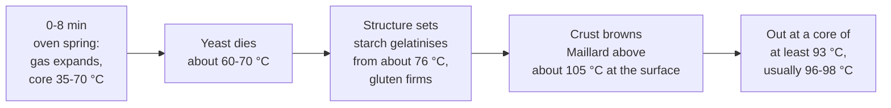

# 08.4 · Scoring and Baking Baguettes

The last half hour decides what the customer sees: the cuts, the colour, the crackling crust. This lesson covers the end of apprêt, how and why a baguette is scored, what steam does, and what happens inside the dough minute by minute in the oven. You score and bake three home baguettes of PC-02 and check them by colour, sound and core temperature.

## Why it matters

The référentiel asks you to explain the roles of scoring and steam, to organise the oven loading for the production, to choose the baking temperature for each product and to explain how the dough changes during baking (S3.1.5). A baguette's grigne (the opened score with its raised ear) is the first thing judged on the shelf and in the [quality rubric](../../templates/quality-rubric.md). Scoring is a single movement that takes a second per cut, and a mistake cannot be undone; baking is where a well-fermented dough is either finished or ruined in ten minutes of inattention.

## Key terms

| French | Say it | English meaning |
|---|---|---|
| grignage / scarification | *green-YAHZH / skah-ree-fee-kah-SYOHN* | scoring: cutting the skin of the dough before baking |
| lame | *LAHM* | razor blade on a handle used for scoring |
| grigne | *GREEN-yuh* | the opened score on the baked bread, with its raised edge |
| oreille | *oh-RAY* | the "ear": the crisp flap of crust lifted along a score |
| buée | *bü-AY* | steam put into the oven at loading |
| enfournement / défournement | *ahn-foor-nuh-MAHN / day-foor-nuh-MAHN* | loading the oven / taking the bread out |
| tapis d'enfournement (enfourneur) | *tah-PEE dahn-foor-nuh-MAHN* | oven loader: a cloth belt on a frame that sets a whole row of bread on the deck |
| ouras | *oo-RAH* | oven vents (dampers) opened to let the steam out at the end of baking |

## How it works

### When is the apprêt finished?

The baguettes are ready when they are noticeably puffy and light (roughly 1.5 to 2 times their shaped volume), the skin is smooth and slightly dry from the couche, and a floured finger pressed in leaves a dent that **fills back slowly and not completely** (lesson [04.4](../module-04/lesson-04.md)). For baguettes bakers prefer them a little **before** full proof: the remaining yeast activity gives oven spring, and that push is what opens the scores. An over-proofed baguette has no push left: the cuts stay flat and it may sag when scored.

### Why we score

In the oven the dough expands quickly while the crust is already beginning to set. Without cuts, the gas forces its way out at the weakest point, usually a wild tear along the side. A score is a **planned weak point**: it lets the baguette expand upwards and lengthwise in a controlled way, gives an even shape and a regular crumb, and makes the product recognisable (5 cuts is a classic bakery baguette).

The rules for a baguette:

- **Along the midline, nearly parallel to the length**, each cut overlapping the next by about **one third**. Cuts across the loaf (like a barber's pole) do not guide expansion along the baguette.
- **Blade held low**, about 30-45° to the surface, so it slides under a thin flap of skin. That flap lifts into the ear (oreille). A vertical blade opens a flat groove with no ear.
- **Shallow**: about 5-6 mm. Too deep and the baguette splays open and flattens; too shallow and the cut seals up again.
- **One quick, confident stroke per cut**, the hand moving away from the other hand. Hesitating drags and tears the dough.
- **Equal cuts**: on a 55 cm baguette, 5 cuts of about 12-13 cm; on a 38 cm home baguette, 3 cuts of about 13 cm.
- Score **just before loading**: cuts made too early close up.

### Why we steam

Steam injected at loading condenses on the cool dough. That thin film of water:

- keeps the skin soft for the first minutes, so the dough can expand fully and the scores open;
- gelatinises the starch on the surface, which gives a thin, shiny, crisp crust;
- improves the heat transfer into the dough at the start.

Too little steam: dull, thick crust (croûte terne), scores that barely open, side tears. Too much: blisters (pain cloqué). After 8-10 minutes the steam has done its job; the bakery opens the **ouras** for the last minutes so the crust dries and crackles.

### What happens in the oven

Figures from the American Society of Baking; the core temperature from King Arthur Baking. In practice a 350 g baguette bakes about 22 minutes on the deck at 250 °C, a 270 g home baguette about 20-25 minutes at 240-250 °C. It is done when the crust is an even **deep golden-brown**, the bottom sounds hollow when tapped and the crust crackles as it cools (the bread "sings"). Pale bread is under-baked: it will soften and taste flat. Cooling, staling and storage are covered in [Module 7](../module-07/lesson-05.md); here the rule is: racks, never stacked, never bagged warm.

### Loading

In a bakery each baguette is rolled out of the couche with the planchette onto the loader, seam down, spaced evenly, scored on the loader and set on the deck in one movement, then the steam is injected. Loading a full deck must be quick: the last baguette scored is still proofing.

At home: preheat at least 45 minutes with the baking tray (or a baking stone) on the middle shelf and an empty metal tray on the lowest shelf. Slide the baguettes on their paper onto the hot tray, pour the hot water into the metal tray, close the door. If your oven allows, use top and bottom heat without the fan for the first 10 minutes: the fan dries the skin before the scores open. Then remove the steam tray (or open the door for a few seconds) and finish with or without the fan for even colour.

## Worked example

Saturday 14 November, 5:50. The 24 baguettes of PC-02 have been in the proofing cabinet since 4:45 at 25 °C (lesson 08.3). The deck oven is at 250 °C.

1. **5:50, poke test** on the first baguette shaped: the dent fills back slowly and almost completely; volume about 1.6 times. Nearly ready. The planned 1 h 15 would end at 6:00.
2. **5:55, poke test again:** the dent fills slowly and leaves a mark. Ready. You start loading at once rather than at 6:00: five minutes too late is visible in the grigne.
3. **Loading the first deck (12 baguettes):** each one rolled from the couche onto the planchette, turned seam down onto the loader. Five cuts each, about 12 cm long, overlapping by a third, lame low. Loader into the deck, cloth pulled back, steam: about 2 seconds of injection as the oven's card says. The second deck follows straight away.
4. **6:12, ouras opened** on both decks: the crust dries for the last minutes.
5. **6:17, check:** colour golden but still light at the ends. You give 5 more minutes.
6. **6:22, défournement:** deep golden-brown, bottoms hollow, cuts open with a clear ear on most. Two baguettes from the front left corner are darker: the oven is hotter there. You note it so the next load is turned or that corner left for the rolls.
7. **Onto the racks** at once, single layer. The rolls go in at 6:25 (15 minutes). The baguettes reach the shop at 7:00, cooled.
8. **Record:** apprêt 4:45-5:55 (1 h 10), 5 cuts, steam at loading, ouras at 17 min, bake 22 min at 250 °C, hot corner front left.

## Practice

You score and bake three home baguettes of 270 g from a PC-02 batch (made with the pâte fermentée you kept in lesson 08.2), after a scoring drill.

> [!WARNING]
> The oven, trays and steam reach 250 °C. Wear dry oven gloves and long sleeves. Pour the water only into a metal tray preheated in the oven, never into a hot glass or ceramic dish, which can shatter; pour quickly, close the door and step back from the steam. Keep children and pets away from the open oven.

> [!CAUTION]
> A lame is a bare razor blade. Hold the dough or tray with the other hand well away from the line of the cut, cut away from yourself, never test the edge with a finger, and put the guard back on (or the blade in its box) after each use.

### You need

- Minimum: as for lessons [08.1](lesson-01.md)-[08.3](lesson-03.md), plus a lame (or a new razor blade on a coffee stirrer, or a very sharp small knife), a baking tray or stone and a metal steam tray, 150 mL of water just off the boil in a jug, a probe thermometer, wire rack, oven thermometer if you have one.
- Professional equivalent: deck oven with steam injection and ouras, loader (tapis d'enfournement), planchette, couche on boards.

### Ingredients

PC-02 on 500 g of flour (lesson 08.1): flour 500 g, water 320 g, salt 9 g, fresh yeast 7.5 g (or 2.5 g instant), pâte fermentée 75 g; total 911.5 g. Divide 3 × 270 g and keep 75 g as the next pâte fermentée. If you have no pâte fermentée, PD-01 on 500 g (lesson [06.5](../module-06/lesson-05.md)) gives the same three pâtons.

### In Israel

- **Oven:** most home ovens reach 250 °C, some only 240 °C; check yours with an oven thermometer during preheating, since the dial is often wrong by 10-20 °C. Ovens have a fan mode (often labelled "turbo"); use top and bottom heat without the fan for the first 10 minutes if you can.
- **Baking surface:** a pizza stone or a thick, heavy tray turned upside down and preheated 45-60 minutes gives a better bottom crust than a thin tray. Baking stones are sold in kitchen shops and online (checked 2026-10-08).
- **Lame:** sold by baking-supply shops; a double-edged razor blade threaded on a wooden coffee stirrer is the classic home substitute.
- **Dry hamsin days:** the skin dries fast, which actually helps scoring, but the dough also crusts if uncovered: keep the baguettes covered until the moment you score.
- **Kitchen heat:** a 250 °C oven running for an hour heats a small summer kitchen by several degrees; apprêt then speeds up, so poke-test earlier.

### Steps

1. **Scoring drill (10 minutes):** on a sheet of baking paper draw a 38 cm line; practise three overlapping strokes along it with a capped pen, then on one shaped piece of leftover dough with the lame. Feel the low angle.
2. Make the PC-02 dough, ferment, divide and shape three baguettes of about 38 cm (lessons 08.1-08.3). Place them seam down on baking paper with rolled towels between them. Cover.
3. **Preheat** at least 45 minutes at 250 °C (or your maximum) with the baking tray or stone on the middle shelf and the metal steam tray on the lowest shelf. Put the kettle on 5 minutes before loading.
4. **Poke test** from 45 minutes of apprêt (earlier in a warm kitchen). Write the time and what the dent did. Bake when it fills back slowly and not completely.
5. **Score**: remove the towels, slide the paper with the baguettes onto a flat board. Three cuts per baguette, about 13 cm long, overlapping by a third, along the centre, blade at 30-45°, about 5 mm deep.
6. **Load and steam**: slide the paper onto the hot tray, pour about 150 mL of hot water into the steam tray, close the door at once, step back. Note the time.
7. After **10 minutes**, open the door with gloves, remove the steam tray (or let the steam out for a few seconds), close. Turn the tray if one side colours faster.
8. **Bake 20-25 minutes in total** until deep golden-brown. Check one baguette: the bottom sounds hollow; the probe in the thickest part reads at least 93 °C (aim for 96-98 °C).
9. **Cool** on the rack, single layer. Listen for the crust crackling. Weigh each baguette after 1 hour and fill in the [bake log](../../templates/bake-log.md).

### Targets

- Apprêt ended on a poke test, with the time recorded.
- Three cuts per baguette of similar length, overlapping by about a third, along the midline.
- Steam at loading; steam removed at about 10 minutes.
- Crust deep golden-brown and even; core at least 93 °C; bake time recorded.
- At least two baguettes with open grignes and a visible ear.

### How you know it worked

The baguettes rose in the first minutes, the cuts opened into regular grignes with a raised, crisp edge, there are no tears along the sides, and the crust crackles as it cools. Cut across after cooling, the crumb is set and creamy, not gummy. Lesson 08.5 scores the result.

### Self-check

- [ ] I decided the end of apprêt with the poke test, not only the clock.
- [ ] My cuts ran along the midline and overlapped; the blade was low and the stroke quick.
- [ ] I made steam safely in a preheated metal tray and stepped back.
- [ ] I baked to a deep colour and checked the core temperature.
- [ ] I covered the lame after use and cooled the bread on a rack.

## What goes wrong

| Symptom | Likely cause | Fix now | Prevent next time |
|---|---|---|---|
| Cuts stay flat, no ear | Over-proofed; blade vertical; cuts too deep; no steam | — | Bake slightly before full proof; blade low; 5-6 mm deep; steam at loading |
| Wild tear along the side (pain éclaté) | Under-proofed; cuts too shallow or too short; too little steam | — | Wait for the poke test; overlapping cuts of full length; steam |
| Cuts look like a barber's pole | Cuts made across the loaf | — | Cut nearly parallel to the length, close to the midline |
| Dull, thick, pale-grey crust | No or too little steam; fan on from the start; dough skinned | Bake a few minutes longer for colour | Preheated metal tray, enough water; fan off for 10 minutes; cover during apprêt |
| Blisters on the crust (pain cloqué) | Too much steam; very wet surface | — | Less water; remove the steam at 10 minutes |
| Pale crust although the time is up | Oven cooler than the dial; door opened often; over-proofed | Bake on until deep golden | Oven thermometer; preheat 45-60 minutes; check proof |
| Dark or burnt bottom (pain ferré) | Tray or sole too hot for the time; tray too low | Move up a shelf; slide a second tray under | Middle shelf; check the oven's hot spots |
| Gummy crumb under the top | Under-baked; cut while hot | Return to the oven 5 minutes | Core 96-98 °C; cool fully before cutting |

## Review

- Bake baguettes slightly before full proof: the dent fills back slowly and not completely.
- Score along the midline, cuts overlapping by a third, blade low (30-45°), about 5-6 mm deep, one quick stroke each.
- Steam at loading keeps the skin supple for oven spring and gives a thin shiny crust; let it out after 8-10 minutes so the crust dries.
- In the oven: oven spring first, yeast dies at about 60-70 °C, starch sets from about 76 °C, the crust browns above about 105 °C; take out at a core of at least 93 °C with a deep golden crust.
- Scoring, steam, loading and baking are part of the production test and of S3.1: see [The CAP Boulanger Exam](../../references/cap-exam.md).
