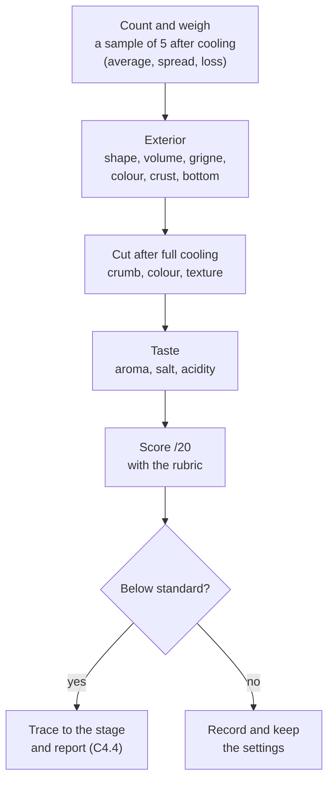

# 08.5 · Evaluating Your Pain Courant

A batch is not finished when it leaves the oven: it is finished when someone has checked that it is the right number, the right weight and the right quality, and has said what went wrong. This lesson gives you the order a professional checks a batch of baguettes in, what a good pain courant looks, feels and tastes like, and how to turn a defect into a cause and a short report. You evaluate your own baguettes with the rubric.

## Why it matters

The référentiel asks you to check the weights, quantities and look of finished products (C3.2), to report non-conformities and malfunctions during production (C4.4), and to characterise a quality bread and identify its main defects (S3.1.6). In a bakery this check happens before the bread reaches the shop: a load of pale baguettes is rebaked, a light batch is reported, an oven with a hot corner is fixed before the next load. Done honestly at home, it is the only way to improve from one bake to the next, because the Academy cannot grade photos: you compare your bread with the [quality rubric](../../templates/quality-rubric.md) yourself, and that does not replace the official practical exam.

## Key terms

| French | Say it | English meaning |
|---|---|---|
| contrôle qualité | *kohn-TROHL kah-lee-TAY* | quality check of finished products |
| poids cuit | *pwah KWEE* | baked weight, after cooling |
| croûte / mie | *KROOT / MEE* | crust / crumb |
| alvéolage | *al-vay-oh-LAHZH* | the pattern and size of the holes in the crumb |
| pain plat | *pan PLAH* | flat bread: spread, low volume |
| pain ferré | *pan feh-RAY* | bread with a burnt, hard bottom |
| croûte terne | *kroot TAIRN* | dull crust, without shine |
| fiche de non-conformité | *feesh duh nohn kohn-for-mee-TAY* | non-conformity report |

## How it works

### The order of the check

Always in this order: the outside can be judged warm, but the crumb and the taste only after **full cooling** (at least 1 hour for a baguette). Cut warm, the crumb is still setting and looks gummy even when the bread is well baked.

### What a good pain courant baguette looks like

| | Good | Common faults |
|---|---|---|
| Count and weight | as ordered; cooled weight close to the expected yield (about 80 % of the pâton, lesson [06.3](../module-06/lesson-03.md)); pieces alike | pieces missing; light pieces; spread wide |
| Shape and volume | even length and thickness, round in section, light in the hand | pain plat (spread); thick middle; bent |
| Grigne | cuts open regularly with a raised, crisp ear; no side tears | flat cuts; side tears (pain éclaté); barber's pole |
| Crust | thin, crisp, crackling, even golden-brown, slight shine | pale; dull (croûte terne); blistered (cloqué); thick and hard |
| Bottom | baked through, golden | pale; burnt (pain ferré) |
| Crumb | creamy to light cream colour, irregular medium holes, moist and elastic, springs back when pressed | white and cottony (over-mixed); dense and tight; gummy; tunnel under the crust |
| Taste | wheat and light acidity from the pâte fermentée, correctly salted, clean finish | flat; yeasty; sour; salty |

### Weight and salt: the numbers behind the look

Weigh a sample of five cooled baguettes. The **average** tells you whether pâton weight and bake are right; the **spread** tells you whether the dividing was even (lesson 06.3). From the average:

$$\text{baking loss \%} = \frac{\text{pâton} - \text{cooled weight}}{\text{pâton}} \times 100$$

Salt does not evaporate, so salt per 100 g of bread rises with the baking loss. PC-02 dough contains 1.8 g of salt per 167.3 g of fresh ingredients (the pâte fermentée has the same ratio), that is **1.076 %** of the dough:

$$\text{salt per 100 g of bread} = \frac{\text{pâton} \times 1.076\,\%}{\text{cooled weight}} \times 100$$

A 270 g home baguette holds 2.91 g of salt. At 20 % loss (216 g) that is **1.35 g per 100 g**: conforming. The limit of 1.4 g is reached at about **23 %** loss (208 g). Home ovens often bake longer at a lower temperature than a deck oven, so a home baguette can lose more and drift over the limit: check with your measured weight, not the planning figure.

### From defect to stage

Every defect has a stage where it started. Look at the evidence before you decide:

| Defect | Look at | Usually from |
|---|---|---|
| Pain plat, flat cuts, sour smell | apprêt time and poke test; pointage | over-fermentation (08.2, 08.4) |
| Side tears, tight crumb, small volume | poke test; dough temperature | under-proofing (08.4) or a cold dough (08.1) |
| Uneven length and thickness, tunnel | shaping notes | shaping (08.3) |
| Dull crust, poorly opened cuts | steam method | steam (08.4) |
| Pale crust, gummy crumb | oven thermometer, bake time, core temperature | under-baking (08.4) |
| Dark corner pieces, pain ferré | position in the oven | oven hot spot or sole too hot (08.4) |
| Light pieces, wide spread | divided weights | dividing (08.2) |
| Salty taste or salt over 1.4 g | weighing record; baking loss | weighing (08.1) or long bake (08.4) |

When the cause is equipment (an oven corner, a faulty thermostat) or a raw material, it is a **non-conformity or malfunction** to report to the manager, in facts: what, how many, measured how, what you did, what you suggest. Use the [non-conformity report](../../templates/non-conformity-report.md).

## Worked example

Saturday 14 November, 6:55. Before the 24 baguettes go to the shop, you check the batch (lessons 08.1-08.4).

1. **Count:** 24 baguettes, 20 rolls. Order covered.
2. **Weights:** five baguettes from different places on the rack: 282, 279, 285, 276, 280 g. Average **280.4 g**; spread 276-285 g. Loss (350 − 280.4) ÷ 350 = **19.9 %**. Salt: 350 × 1.076 % = 3.77 g in 280.4 g = **1.34 g per 100 g**: conforms.
3. **Exterior:** 22 baguettes golden-brown with open grignes and ears. Two from the front left corner of the upper deck are dark brown with a hard bottom (pain ferré). One is 50 cm long and slightly thin at one end (the piece torn at shaping, lesson 08.3).
4. **Interior and taste** (one baguette from the middle of the load, cut at 7:20): creamy crumb, medium irregular holes, moist and elastic; taste of wheat with a light acidity, correctly salted. Rubric: **17/20** (lost 1 point on crust colour, 1 on shape regularity across the load, 1 on bottom for the dark pair).
5. **Decision:** the two dark baguettes go to the shop as a lower-price "bien cuite" if the manager agrees, or to staff; the short one goes on sale (it is within weight).
6. **Report (C4.4):**

> **Fiche de non-conformité — 14/11, 6:55.** Equipment: deck oven, upper deck. Found: 2 of 12 baguettes in the front left corner darker, bottoms burnt (pain ferré); same load, same time 22 min, rest of the deck normal. Action: pieces set aside, manager informed. Probable cause: hot spot front left (also seen on 7/11). Suggestion: check the sole temperature with the technician; until then leave that corner for the last 3 minutes or turn the loader.

## Practice

You check and score your own baguettes from lesson 08.4 (or 08.3) like a batch control, diagnose one defect and write a report.

> [!CAUTION]
> Cut bread with a serrated bread knife on a stable board, fingers above the blade and away from its path; a hard crust can make the knife slip.

### You need

- Your three (or six) baguettes, cooled at least 1 hour on a rack; their pâton weights from your bake log.
- Scale (1 g), ruler, serrated bread knife, cutting board, calculator, the [quality rubric](../../templates/quality-rubric.md), the [bake log](../../templates/bake-log.md) and the [non-conformity report](../../templates/non-conformity-report.md).
- Professional equivalent: weighing of a sample at the control station, a cut test of one piece per batch, the batch record and the bakery's non-conformity sheet.

### Ingredients

No new ingredients: you evaluate the PC-02 or PD-01 baguettes you baked. Expected cooled weight from a 270 g pâton at 20 % loss: about **216 g**.

### In Israel

- **Humidity changes the crust.** On a humid coastal summer day, a crisp crust softens within an hour or two; on a dry hamsin day it stays crisp but the bread loses more water on the rack. Judge the crust between 1 and 2 hours after baking and note the weather in your log, so you do not blame the bake for the air.
- **Flour and crumb colour.** Israeli white flour (קמח לבן, *kemakh lavan*) may contain ascorbic acid; with long, vigorous kneading the crumb can come out whiter (more oxidised) than a T55 baguette in France. Judge colour against the rubric's "creamy" rather than against bread you remember; see [Flour in Israel](../../references/flour-in-israel.md).
- **Salt.** The French limit (1.4 g per 100 g) is the professional standard you train to; home practice in Israel does not change it.

### Steps

1. **Count and weigh** each cooled baguette; write the weights next to the pâton weights.
2. **Calculate** the average, the spread, the baking loss of each piece and the salt per 100 g of the lightest piece (pâton × 1.076 % ÷ cooled weight × 100; use 1.8 ÷ 168.3 = 1.070 % for PD-01).
3. **Exterior:** measure the length of each, then score shape, volume, grigne, crust colour, crust texture and bottom on the rubric.
4. **Cut** the middle baguette across in the centre and lengthwise for 10 cm. Score crumb structure and crumb colour and texture. Press the crumb: it should spring back.
5. **Taste** a slice of crumb and crust: aroma, salt, acidity. Score aroma and taste.
6. **Total /20.** Compare the three baguettes: which is best and why?
7. **Diagnose** your biggest defect with the "from defect to stage" table: write the defect, the evidence, the stage, the probable cause and one change for next time.
8. **Report:** write a three-line non-conformity note as if to a manager (facts, action, suggestion). If your bake had no real defect, write one for the weakest point anyway.
9. **Exercises:** answer the three questions below.

**1.** Five cooled home baguettes from 270 g pâtons: 214, 218, 205, 216, 217 g. Average, spread, and which piece do you look at?

**2.** Salt per 100 g of the 205 g piece (PC-02)? Conforming?

**3.** A bakery batch of 350 g PC-02 baguettes averages 266 g cooled. Loss? Salt per 100 g? What do you report?

Answers

**1.** Average 1,070 ÷ 5 = **214 g** (loss about 20.7 %). Spread 205-218 g: four pieces are close, **205 g** is 9-13 g lighter than the others. Look at its pâton weight in the log (divided light?) and its position in the oven (hotter spot, longer bake?).

**2.** 270 × 1.076 % = 2.905 g; 2.905 ÷ 205 × 100 = **1.42 g per 100 g**: just over 1.4 g. Its loss is 24 %: shorten the bake or move it away from the hot side.

**3.** Loss (350 − 266) ÷ 350 = **24 %**. Salt 3.77 ÷ 266 × 100 = **1.42 g per 100 g**: over the limit. Report: batch over-baked or oven too hot; salt over the limit at this loss; check bake time and oven temperature before the next load.

### Targets

- Every baguette weighed after cooling; loss and salt per 100 g calculated for the sample.
- Rubric completed for one baguette, all ten criteria, after at least 1 hour of cooling.
- One defect traced to a stage with its evidence; one change written for the next bake.
- A three-line factual report.

### How you know it worked

You can say, with numbers, whether your batch is right (count, weight, salt) and, in words, why it scored what it did. Your "next time" line names one change at one stage, not five changes at once.

### Self-check

- [ ] I weighed after cooling and calculated loss and salt from my own weights.
- [ ] I judged the exterior first and cut only after full cooling.
- [ ] I scored all ten rubric criteria honestly, including taste.
- [ ] I traced my main defect to a stage using evidence from my log.
- [ ] I wrote a short report with facts, action and suggestion.

## What goes wrong

| Symptom | Likely cause | Fix now | Prevent next time |
|---|---|---|---|
| Crumb looks gummy when cut | Cut before full cooling; or under-baked | Wait and cut another piece after 1 hour | Cool at least 1 hour; core 96-98 °C at the end of the bake |
| Rubric scores vary a lot from day to day | Judging at different times, against memory | Re-score with the rubric text beside the bread | Same time after baking, same light, rubric in hand |
| Defect "fixed" by changing several things at once | No diagnosis to a stage | — | One change per bake, written in the log |
| Batch weight right on average but complaints about small pieces | Spread ignored | Weigh the whole batch, set light pieces aside | Check spread as well as average |
| Salt over the limit although 1.8 % was weighed | High baking loss concentrates the salt | Shorten the bake for the next load | Check salt with measured losses, especially for small pieces |
| Report blames a person, not facts | Report written from impression | Rewrite: what, how many, how measured, action | Use the non-conformity template |

## Review

- Check in order: count and weigh a cooled sample, exterior, cut after full cooling, taste, score /20.
- A good pain courant baguette: even shape, open grignes with an ear, thin crisp golden crust, creamy moist crumb with irregular medium holes, wheat taste with light acidity.
- Salt per 100 g of bread = pâton × 1.076 % ÷ cooled weight × 100 for PC-02; at about 23 % loss a 270 g baguette reaches the 1.4 g limit.
- Trace each defect to its stage with evidence, change one thing at a time, and report equipment or material problems in facts.
- Weight and quality control of finished products is assessed in the production test: see [The CAP Boulanger Exam](../../references/cap-exam.md).
