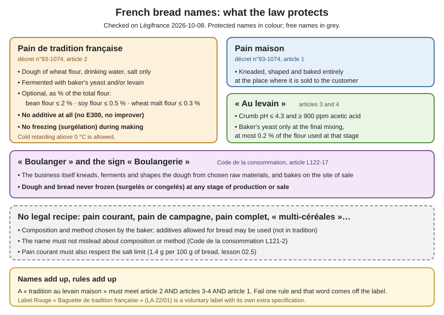

# 09.1 · The Law: Tradition, Maison, Levain and Other Names

A French bakery's shelf labels are legal statements. This lesson goes through the texts that protect bread names: the 1993 bread decree (tradition, maison, au levain), the consumer-code article that protects the words boulanger and boulangerie, and the names that have no legal recipe at all. You then classify eight real-life shop breads and check a flour bag as if you were buying for a tradition.

## Why it matters

The référentiel asks you to define the regulatory names of bread (S1.4: pain maison, pain courant, tradition, complet, campagne, viennoiserie maison) and to know which adjuvants are allowed (S2.4). Both the names and the tradition dough itself appear in the exam: see [The CAP Boulanger Exam](../../references/cap-exam.md) for how. In the shop, a wrong label is not a detail. Selling a baguette made with an improver as "tradition" claims something false about its composition, which the consumer code forbids, and the customer pays more for that name. Sales staff will ask you what each name means; this lesson gives you the answer.

> [!NOTE]
> This is the first lesson of a practical module, so the usual reminder: watching someone bake does not make you able to bake. Do the practice of lessons 09.2-09.4 at home. The Academy cannot grade photos, so you compare your result with the targets and the [quality rubric](../../templates/quality-rubric.md) yourself, and that self-assessment does not replace the official practical exam.

## Key terms

| French | Say it | English meaning |
|---|---|---|
| appellation | *ah-peh-lah-SYOHN* | a product name; "appellation réglementaire" = a name whose conditions are set by law |
| pain de tradition française | *pan duh trah-dee-SYOHN frahn-SEZ* | bread made only of wheat flour, water, salt and yeast and/or levain, with three permitted flours, no additive and no freezing (décret 93-1074, art. 2) |
| pain maison | *pan meh-ZOHN* | bread kneaded, shaped and baked entirely where it is sold (art. 1) |
| au levain | *oh luh-VAN* | a mention allowed only on bread with crumb pH ≤ 4.3 and ≥ 900 ppm acetic acid (art. 3) |
| surgélation / congélation | *sür-zhay-lah-SYOHN / kohn-zhay-lah-SYOHN* | deep-freezing / freezing |
| farine de fèves, de soja, de malt | *fah-REEN duh FEHV, duh soh-ZHAH, duh MAHLT* | bean flour, soy flour, (wheat) malt flour: the only extras tradition may contain |
| pain de campagne / pain complet | *pan duh kahm-PAHN-yuh / pan kohm-PLEH* | country bread / wholemeal bread: names with no legal recipe |
| Label Rouge | *lah-BEL ROOZH* | French state-recognised quality label with its own specification, voluntary |
| DGCCRF | *day-zhay-say-say-air-EF* | the French consumer-protection and fraud authority that checks labels and names |

## How it works

### Where the rules come from

Three texts do the work. Each was opened on Légifrance on 2026-10-08:

1. **Décret n°93-1074 of 13 September 1993** ([Légifrance](https://www.legifrance.gouv.fr/loda/id/JORFTEXT000000727617)) defines **pain maison** (art. 1), **pain de tradition française** (art. 2), the mention **au levain** (art. 3) and what a **levain** is (art. 4). Article 3 was amended in 1997; the other articles are unchanged since 1993.
2. **Code de la consommation, L122-17** ([Légifrance](https://www.legifrance.gouv.fr/codes/article_lc/LEGIARTI000032227163)), from the 1998 law on bakers, protects the title **boulanger** and the sign **boulangerie**.
3. **Code de la consommation, L121-2** ([Légifrance](https://www.legifrance.gouv.fr/codes/article_lc/LEGIARTI000044563114)) forbids misleading claims about a product's composition and method of manufacture. It covers every name the decree does not, from "campagne" to "à l'ancienne".

In January 2024 the government confirmed this split in a written answer to Parliament: the decree governs maison, tradition and au levain; "pain complet" (T150), "pain intégral", "pain au seigle" or "multi-céréales" are voluntary descriptive mentions, allowed as long as consumer law is respected ([Assemblée nationale, QE 11049](https://www.assemblee-nationale.fr/dyn/16/questions/QANR5L16QE11049)).

### Pain de tradition française (article 2)

A bread may be sold as "pain de tradition française", or under any name suggesting it (such as "baguette de tradition", "tradi"), only if it meets **all** of these:

| Rule | What it means on the bench |
|---|---|
| Dough of **wheat flour, drinking water and salt** | Any baking wheat flour; usually a T65 sold as "farine de tradition française" (lesson [02.2](../module-02/lesson-02.md)). No rye, no seeds, no milk, no sugar, no fat. |
| Fermented with **baker's yeast** (*Saccharomyces cerevisiae*) **and/or levain** in the sense of article 4 | Yeast only, levain only, or both. A pâte fermentée is fine **if it is itself tradition dough**: a piece of pain courant dough made with E300 flour would bring an additive in. |
| Optional, as a share of the **total flour**: **bean flour up to 2 %, soy flour up to 0.5 %, wheat malt flour up to 0.3 %** | On 10 kg of flour: at most 200 g of bean flour, 50 g of soy flour, 30 g of malt flour. Many tradition flours already contain some: read the mill's specification sheet before adding more. |
| **No additive** | No ascorbic acid (E300), no emulsifier, no added gluten, no deactivated yeast, no "améliorant" (lesson [02.9](../module-02/lesson-09.md)). |
| **No freezing treatment (surgélation) during its making** | No frozen dough, no frozen shaped pieces, no frozen par-baked bread finished later. |

What the freezing rule does **not** forbid: cold at positive temperatures. The référentiel lists **pointage retardé au froid** among the methods for tradition, so a bulk dough held overnight at about 4 °C (lesson [04.6](../module-04/lesson-06.md)) is still tradition. Module 7 left the freezing rules for this lesson; here they are in one place:

| Situation | Allowed? | Text |
|---|---|---|
| Tradition dough retarded in bulk at 2-6 °C overnight | Yes | art. 2 (no surgélation) + référentiel (pointage retardé au froid) |
| Shaped traditions frozen raw on Saturday, baked on Sunday | No: not "tradition" | art. 2 |
| Par-baked traditions frozen and finished in the shop oven | No: not "tradition" | art. 2 |
| Unsold traditions frozen in the shop and sold thawed the next day | No in any business calling itself "boulangerie": dough and bread may not be frozen **at any stage of production or sale** | L122-17 |
| A customer freezing the tradition she bought | Yes: the law governs the seller, not the customer | — |

These rules are about bread. Viennoiserie may be frozen ([lesson 12.5](../module-12/lesson-05.md)).

Pain de tradition française has no salt limit of its own. The Ministry of Agriculture's salt page sets 1.4 g per 100 g for "pains courants" such as the baguette ([agriculture.gouv.fr](https://agriculture.gouv.fr/filiere-boulangerie-vers-une-diminution-du-sel-dans-le-pain-0)) and does not name tradition; the course keeps tradition under the same 1.4 g as good practice (lesson 09.4 checks it).

### Pain maison (article 1)

"Pain maison" (or any equivalent, such as "fait maison") is bread **entirely kneaded, shaped and baked at the place where it is sold** to the final consumer. Sale from a van or a market stall is allowed if the same professional made and baked it at that place of sale. A shop that bakes bought-in dough, frozen or chilled, may sell good bread, but not "pain maison". For **viennoiserie maison**, also in the référentiel, there is no decree: the trade uses it for viennoiserie made on site from the raw ingredients, and calling bought-in frozen croissants "maison" is a misleading claim about the method of manufacture (L121-2).

### Levain and "au levain" (articles 3 and 4)

These numbers are the same as in lessons [02.7](../module-02/lesson-07.md) and [04.5](../module-04/lesson-05.md):

- **Levain (art. 4):** a dough of wheat and/or rye flour and drinking water, possibly salted, left to a natural acidifying fermentation. Baker's yeast may be added **only in the dough of the final mixing**, at **at most 0.2 % of the flour used at that stage**. On 6 kg of flour in the final dough: at most 12 g of yeast.
- **"Au levain" (art. 3):** the crumb must have a **pH of 4.3 or less** and contain **at least 900 ppm of acetic acid** produced by the fermentation. A bakery cannot see this by eye; it is checked by laboratory analysis, so the recipe and method must give it a safe margin.

### Boulanger and boulangerie (L122-17)

A business may call itself **boulanger** or put up the sign **boulangerie** only if it **itself** carries out, from raw materials it chooses, the **kneading, fermentation and shaping** of the dough and the **baking** at the place of sale; and the **dough and bread may not be frozen (surgelés or congelés) at any stage of production or sale**. A "point chaud" or bread depot that bakes off frozen dough can sell bread, but not under the word boulangerie.

### Names without a legal recipe

- **Pain courant (français):** every wheat bread that does not meet a protected name. Additives allowed for bread may be used. Salt: at most 1.4 g per 100 g of bread (lesson [08.1](../module-08/lesson-01.md)).
- **Pain de campagne:** no legal composition; usually wheat with some rye, often on levain, made to keep ([Module 10](../module-10/lesson-03.md) covers it). The name may not suggest something false.
- **Pain complet:** a voluntary mention; the 2024 government answer links it to **T150** wholemeal flour.
- **Label Rouge "Baguette de tradition française" (LA 22/01):** a voluntary quality label whose current specification was homologated by the arrêté of 21 March 2025 ([Légifrance](https://www.legifrance.gouv.fr/jorf/id/JORFTEXT000051391697)). It adds its own conditions on top of the decree; a bakery uses the label only if certified.

Names combine, and so do their rules: a "tradition au levain" must meet article 2 **and** articles 3-4; if it is also "maison", article 1 as well.

## Worked example

Monday, Boulangerie Au Pain de la Halle. The owner wants to launch a "Tradition au levain maison" and hands you the new mill's specification sheet and his ideas. You check each against the texts.

1. **Flour specification:** "Farine de blé T65 — farine de fèves 0,8 % — farine de malt de blé 0,2 % — sans additif." Bean flour 0.8 % ≤ 2 % and malt flour 0.2 % ≤ 0.3 %: conforms to article 2. **Consequence:** do not add malt flour at the bench; only 0.1 % of headroom remains.
2. **His recipe idea:** levain made with this flour, plus "a little yeast for safety, 1 %" in the final dough of 6,000 g flour. For a tradition: allowed. For "au levain": yeast at most 0.2 % × 6,000 = **12 g**, not 60 g. You propose 10 g, or none.
3. **Pâte fermentée:** he wants to add a piece of the PC-02 pain courant dough "for strength". PC-02 is made with T55 containing ascorbic acid: that would bring an additive into the tradition. **No.** If he wants a pâte fermentée, it must be kept from the tradition dough itself.
4. **Sunday production idea:** shape on Saturday afternoon, freeze, bake Sunday. **No:** surgélation during making ends the tradition name, and L122-17 forbids frozen dough or bread in a boulangerie anyway. Alternative: pointage retardé at 4 °C on Saturday evening, divide and shape on Sunday morning (lesson 09.2).
5. **The "au levain" claim:** the bread must show pH ≤ 4.3 and ≥ 900 ppm acetic acid. You suggest sending two loaves to a laboratory at launch and after any change of method, and keeping the reports.
6. **"Maison":** made, shaped and baked in the shop's own fournil: conforms to article 1.
7. **Note for the sales staff (C4.2):** "Notre tradition au levain: farine de blé, eau, sel et levain, sans aucun additif, jamais congelée; pétrie, façonnée et cuite ici. Le levain lui donne une mie crème, un léger goût acidulé et une bonne conservation."

## Practice

You classify eight shop breads, check a flour bag as if it were for a tradition, and write the sales staff's one-line answer for three names. No baking today; lesson 09.2 starts the dough.

### You need

- Minimum: this lesson, a notebook, one bag of white flour from your kitchen or a supermarket shelf (or a photo of its ingredient list), [Flour in Israel](../../references/flour-in-israel.md).
- Professional equivalent: the mill's specification sheet (fiche technique farine), the shop's label file, laboratory reports for "au levain" breads, and the DGCCRF as the authority that checks them.

### Ingredients

No baking. The ingredient you inspect is one bag of white flour.

### In Israel

- None of the French names is protected in Israel, and Israeli rules do not define "tradition". What you practise is the French rule, applied to what you buy.
- **Flour for your tradition dough (lessons 09.2-09.4):** white flour (קמח לבן, *kemakh lavan*) stands in for T65 **only if the ingredients list (רכיבים, *rekhivim*) says wheat flour and nothing else**. Reject a bag that lists ascorbic acid (ויטמין C / חומצה אסקורבית, E300), enzymes (אנזימים), added gluten, or added vitamins and minerals (מועשר, *me'ushar*): the details and the protein to look for are in [Flour in Israel](../../references/flour-in-israel.md). Some Israeli bread flours list ascorbic acid, so read the bag in your hand (checked 2026-10-08).
- Bean, soy and malt flours are optional in tradition: leave them out at home.

### Steps

1. Read the eight cases below. For each, write: the name it may carry, the name it may **not** carry, and the article (decree art. 1-4, L122-17 or L121-2).
   1. "Baguette tradition": mill sheet says "farine de blé, farine de fèves 1,2 %, acide ascorbique E300".
   2. "Tradition": additive-free T65, plus 1 % soy flour added at the mixer.
   3. "Pain au levain": levain plus 0.5 % fresh yeast in the final dough.
   4. "Pain maison" in a shop that bakes dough delivered frozen by a supplier.
   5. "Pain de campagne": T65 with 15 % rye, on levain, from the shop's own fournil.
   6. "Tradition": additive-free, shaped yesterday and frozen raw, baked this morning.
   7. "Pain complet": made from T150 wholemeal flour.
   8. "Tradition au levain": additive-free, levain only, bulk retarded overnight at 4 °C, lab report pH 4.1 and 1,100 ppm acetic acid.
2. Check your answers below.
3. Take your flour bag. Copy the ingredient list. Decide: usable for tradition dough, yes or no, and why.
4. Write one sentence each, as you would say it to a new sales assistant, for: tradition, au levain, pain maison.

Answers

1. **Not tradition** (E300 is an additive, art. 2). It can be sold as a baguette (pain courant). The bean flour alone (1.2 %) would have been fine.
2. **Not tradition**: soy flour is limited to 0.5 % of the total flour (art. 2). Pain courant.
3. **Not "au levain"**: yeast in the final dough is limited to 0.2 % of its flour (art. 4). "Pain" or a fantasy name; no levain claim.
4. **Not "pain maison"** (not kneaded and shaped on site, art. 1), and the shop may not use the word **boulangerie** (L122-17: frozen dough, not made on site).
5. **Pain de campagne**: no legal recipe; the name is honest for this bread (L121-2). It may be "maison" too if made and baked there.
6. **Not tradition** (surgélation during making, art. 2), and frozen dough is banned in a boulangerie (L122-17). Pain courant at best, in a shop that is not a boulangerie.
7. **Pain complet**: a voluntary mention, consistent with T150 (government answer, 2024).
8. **Tradition au levain**: art. 2 (no additive, no freezing, cold retarding is not freezing) and art. 3-4 (pH 4.1 ≤ 4.3; 1,100 ≥ 900 ppm; no yeast). If made and baked on site, "maison" as well.

### Targets

- 8 cases classified with the article named; at least 7 correct.
- One flour bag judged for tradition with the reason written.
- Three sales sentences, each under 30 words, with no false claim.

### How you know it worked

You can say, without looking, what tradition may contain and in what proportion (bean 2 %, soy 0.5 %, wheat malt 0.3 % of the flour), the two "au levain" numbers (pH 4.3, 900 ppm) and the yeast limit in a levain bread (0.2 % at the final mixing), and you know why frozen dough ends both the tradition name and the boulangerie sign.

### Self-check

- [ ] I can define pain de tradition française, pain maison and au levain from the decree.
- [ ] I can say what L122-17 requires before a shop may call itself a boulangerie.
- [ ] I know that cold retarding is allowed in tradition and freezing is not.
- [ ] I checked a real flour bag for additives before using it for tradition.
- [ ] My sales sentences make no claim the bread cannot prove.

## What goes wrong

| Symptom | Likely cause | Fix now | Prevent next time |
|---|---|---|---|
| "Tradition" label on a bread made with improver flour | Flour bag or mill sheet not checked; améliorant added by habit | Relabel as baguette (pain courant) today | Separate, labelled tradition flour; no améliorant at the tradition station |
| Tradition dough contaminated with an additive through its pâte fermentée | Piece of pain courant dough used as pâte fermentée | Sell the batch as pain courant | Keep tradition pâte fermentée from tradition dough only, labelled "TR" |
| Shaped traditions frozen for a holiday | Confusing retarding (positive cold) with freezing | Sell as pain courant, and not in a shop called boulangerie | Plan pointage retardé at 2-6 °C instead (04.6, 09.2) |
| "Au levain" bread fails a lab check (pH 4.6) | Too much yeast, too little or too young levain, short fermentation | Remove the mention until a new test passes | Yeast ≤ 0.2 % of the final dough's flour; ripe levain; test after any change |
| Extra malt flour pushes the total over 0.3 % | Malt already in the tradition flour not counted | Sell as pain courant | Read the mill sheet; count what the flour already contains |
| Sales staff tell a customer "tradition means made with levain" | No briefing on the names | Correct it with the customer | Give staff the one-line definitions (C4.2) |

## Review

- Pain de tradition française (décret 93-1074, art. 2): wheat flour, water, salt, yeast and/or levain; at most 2 % bean, 0.5 % soy and 0.3 % wheat malt flour of the total flour; no additive; no freezing during making. Cold retarding is allowed.
- Pain maison (art. 1): kneaded, shaped and baked entirely where it is sold. Au levain (art. 3): crumb pH ≤ 4.3 and ≥ 900 ppm acetic acid; in a levain bread, yeast only at the final mixing and at most 0.2 % of that flour (art. 4).
- Boulanger / boulangerie (L122-17): kneading, fermentation, shaping and baking done on site, and dough and bread never frozen at any stage of production or sale.
- Pain courant, campagne and complet have no legal recipe; their names must not mislead (L121-2). Names combine and their rules add up.
- The regulatory names are part of the written test's technology questions: see [The CAP Boulanger Exam](../../references/cap-exam.md).
