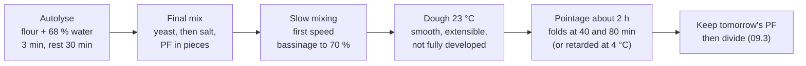

# 09.2 · Making Tradition Dough

Tradition is made from four ingredients and no help from additives, so everything the improver does for pain courant must come from the method: an autolyse, gentle mixing, a soft dough, a pre-ferment and a long pointage with folds. This lesson sets out the course's tradition sheet TR-01, why each step is there, and how to time it. You mix a home batch of tradition dough with a tradition pâte fermentée and lead it through its pointage.

## Why it matters

The référentiel lists pain de tradition française as its own product with its own methods: improved or slow mixing, pâte fermentée, same-day, slow or cold-retarded fermentation (C2.3, S3.2, S3.3). On the shelf it is usually the bakery's flagship and sells at a higher price than the pain courant next to it. What exactly the exam asks of it is in [The CAP Boulanger Exam](../../references/cap-exam.md). In the fournil, tradition is less forgiving than pain courant: there is no ascorbic acid to give tolerance, so a dough that is over-mixed, too warm or rushed shows it in a white, bland crumb and flat cuts.

## Key terms

| French | Say it | English meaning |
|---|---|---|
| pâte de tradition | *paht duh trah-dee-SYOHN* | tradition dough: wheat flour, water, salt, yeast and/or levain only |
| autolyse | *oh-toh-LEEZ* | rest of flour and water only, before the final mixing (lesson [03.2](../module-03/lesson-02.md)) |
| pétrissage lent (vitesse lente) | *pay-tree-SAHZH LAHN* | slow mixing: all or nearly all in first speed; little heating and oxidation |
| pâte douce | *paht DOOSS* | soft dough, about 68-75 % water: tradition's usual consistency |
| eau de réserve / bassinage | *oh duh ray-ZAIRV / bah-see-NAHZH* | water held back from the start / added at the end of mixing (lesson [03.5](../module-03/lesson-05.md)) |
| rabat | *rah-BAH* | fold given in pointage to add strength |
| pâte fermentée de tradition | *paht fair-mahn-TAY* | a piece of earlier tradition dough kept as pre-ferment; never pain courant dough |
| pointage retardé au froid | *pwan-TAHZH ruh-tar-DAY oh FRWAH* | bulk fermentation slowed in the cold room at about 2-6 °C (lesson [04.6](../module-04/lesson-06.md)) |

## How it works

### What replaces the additive

In pain courant, ascorbic acid strengthens the gluten network during mixing (lesson [03.4](../module-03/lesson-04.md)) and gives the dough tolerance. Tradition has none (lesson [09.1](lesson-01.md)), so the baker builds strength and flavour in other ways:

| Tool | What physically happens | Effect on the bread |
|---|---|---|
| **Autolyse** 20-60 min (flour + water only) | Flour hydrates fully; gluten bonds form without mixing; flour proteases relax the network | Less mixing needed, more extensible dough, better volume and an open crumb |
| **Slow mixing** | Less air beaten in and less heat, so less oxidation of the flour's carotenoid pigments | Cream-coloured crumb and more aroma; Calvel's main argument for the autolyse |
| **Soft dough** (about 70 %) | More free water: a looser, more extensible network that holds large irregular bubbles | Irregular, shiny alveoles, thin crust, longer keeping |
| **Pre-ferment** (pâte fermentée, poolish or levain) | Brings acids, aroma and active yeast from hours of earlier fermentation; acids tighten the gluten | Flavour and strength in a dough with little yeast |
| **Little yeast, long pointage, folds** | Slow gas production gives time for acids and aromas; each fold stretches and realigns the gluten | Strength that the mixer did not give; deeper flavour |

Sources for the autolyse figures: King Arthur Baking (Calvel's findings) and the American Society of Baking. Lesson [03.2](../module-03/lesson-02.md) explains the autolyse in detail; this lesson applies it.

### The TR-01 sheet

| Ingredient | % | Job in this dough |
|---|---|---|
| Flour T65 tradition (no additive) | 100 | A little more bran and minerals than T55: more flavour and colour, more enzyme activity ([02.2](../module-02/lesson-02.md)) |
| Water | 70 | 68 % in the autolyse, 2 % kept as eau de réserve and added by bassinage; up to 72-74 % if the flour is thirsty |
| Salt | 1.8 | Flavour, tightens gluten, slows yeast; added after the autolyse |
| Fresh yeast | 0.6 | Little yeast for a long pointage (base formulas: 0.5-1.0 %) |
| Pâte fermentée **de tradition** | 15 | Acid, aroma and strength from the previous tradition batch |
| **Total** | **187.4** | |

TPV **23 °C** (tradition range 22-24 °C, [base formulas](../../references/formulas.md)); cooler than pain courant because a cooler dough ferments more slowly and forms more of the organic acids that give flavour (King Arthur Baking). The pâte fermentée is tradition dough in the same ratio, so the bread's hydration stays 70 % and its salt 1.8 % of all the flour (as for PC-02, lesson [06.4](../module-06/lesson-04.md)).

### The process

**Water temperature.** With the pâte fermentée as fourth factor, as in Module 5 (lesson [05.3](../module-05/lesson-03.md)):

$$\text{water} = 4 \times 23 - \text{flour} - \text{room} - \text{pâte fermentée} - \text{friction factor}$$

with a friction factor measured with four factors **for this product and method** ("TR-01, autolyse + slow mixing"). Slow mixing heats a dough by only about 2-4 °C, a four-factor friction factor of about 8-16 on a spiral (lesson 05.3); by hand use your own, or 8. The autolyse rest lets the dough drift towards room temperature, and a friction factor measured on this same method already includes that drift.

**Mixing.** Water and flour for the autolyse: about 3 minutes in first speed (or by hand) until no dry flour remains, cover, rest 30 minutes. Then crumbled yeast; after a minute the salt; the pâte fermentée in pieces at the end of this frasage. Mix in **first speed** until the dough is smooth and comes away from the bowl, adding the eau de réserve slowly (bassinage) once the dough has some body. Stop **before** a perfect windowpane: the film stretches but tears with a ragged edge. The folds during pointage finish the development.

**Pointage.** About **2 hours at 23 °C** with **two folds** (at about 40 and 80 minutes) in a bakery; by hand, the dough is less developed, so give **three** folds at 30, 60 and 90 minutes. Plan with the 7 % rule (lesson [04.2](../module-04/lesson-02.md)), then decide by the dough:

| Dough after mixing | 21 °C | 22 °C | 23 °C | 24 °C | 25 °C | 26 °C | 27 °C |
|---|---|---|---|---|---|---|---|
| Planned pointage (120 ÷ 1.07^(T − 23)) | about 2 h 17 | about 2 h 08 | 2 h | about 1 h 52 | about 1 h 45 | about 1 h 38 | about 1 h 32 |

The pointage is finished when the dough has grown by roughly 1.5 to 2 times, is domed and airy with some bubbles at the edges and on the surface, feels light and supple, and holds its shape after the last fold instead of spreading (lesson [04.7](../module-04/lesson-07.md)).

**Pointage retardé au froid.** For flavour or for a later start, mix cooler (about 21-22 °C) with less yeast (about 0.4 %), give 45-60 minutes and two folds at room temperature, then put the covered tub in the cold room at about 2-6 °C for 12-16 hours. Divide cold and give a longer détente (lesson 04.6). This is positive cold, so the bread is still tradition. Freezing is not (lesson 09.1).

**Tomorrow's pâte fermentée.** At the end of pointage, cut the next pâte fermentée from the tradition dough, label it "TR" with date and time, and keep it at about 4 °C. Never use a pain courant pâte fermentée in tradition: it may carry ascorbic acid from its flour.

## Worked example

Saturday, Boulangerie Au Pain de la Halle. Order: **40 baguettes de tradition at 300 g**, TR-01. The batch must also give **Sunday's 1,000 g of tradition pâte fermentée**. Process losses 2 %; flour rounded up to the next 100 g. Readings at 4:00: flour 20 °C, fournil 22 °C, tradition pâte fermentée from the cold room 6 °C (1,100 g in stock). Friction factor on the TR-01 sheet (four factors, autolyse + slow mixing, about 13 kg): 14.

1. **Dough requirement:** 40 × 300 = 12,000 g, plus Sunday's 1,000 g = 13,000 g; with 2 %: 13,260 g.
2. **Flour:** 13,260 ÷ 1.874 = 7,075.8 g → **7,100 g**.
3. **Ingredients:** water 70 % = 4,970 g, of which 68 % = **4,828 g** in the autolyse and **142 g** eau de réserve; salt 1.8 % = **127.8 g**; fresh yeast 0.6 % = **42.6 g**; pâte fermentée 15 % = **1,065 g** (from Friday's tradition batch, label "TR"; the 1,100 g in stock covers it). Batch 7,100 × 1.874 = **13,305.4 g** ≥ 13,260 g.
4. **Water temperature:** 4 × 23 = 92; 92 − 20 − 22 − 6 − 14 = **30 °C**.
5. **Autolyse, 4:10:** flour and 4,828 g of water, 3 minutes first speed; covered, 30 minutes.
6. **Final mixing, 4:40:** yeast; after 1 minute the salt; the pâte fermentée in eight pieces at the end of frasage. First speed. At 5 minutes the dough is still slightly firm: the 142 g reserve goes in slowly. At 11 minutes it is smooth, clears the bowl, and the film tears raggedly when stretched thin. Stop.
7. **Dough temperature: 23.4 °C.** Pointage plan about 1 h 55 (120 ÷ 1.07^0.4 ≈ 117 min). Folds at about 5:30 and 6:10; check from 6:35.
8. **6:45:** the dough has nearly doubled, is domed and airy and holds its shape. Cut 1,000 g for Sunday's pâte fermentée (labelled "TR, samedi 6:45", into the cold room), then divide 40 × 300 g (lesson 09.3).
9. **Record** on the [temperature log](../../templates/temperature-log.md): inputs, water 30 °C, dough 23.4 °C, bassinage 142 g (total 70 %), mixing 11 minutes first speed, pointage 2 h with two folds.

## Practice

You make a small tradition pâte fermentée in the evening and mix a home batch of TR-01 by hand the next day, to 23 °C ± 1 °C, with an autolyse, bassinage and three folds. Lessons 09.3 and 09.4 shape and bake this dough, so plan the whole day.

> [!WARNING]
> Later today the oven runs at 240-250 °C with steam. Dry oven gloves, steam only into a metal tray preheated in the oven (never water into a hot glass or ceramic dish: it can shatter), pour and step back. Water from the kettle for blending: never above 40 °C in the bowl, and pour it away from your hands.

### You need

- Minimum: scale (1 g) and 0.1 g pocket scale, probe thermometer, large bowl, scraper, small lidded container for the pâte fermentée, 3 L lidded container for pointage (straight sides help you see the rise; mark the starting level with tape), kettle and a bottle of water in the fridge, timer, [temperature log](../../templates/temperature-log.md), [bake log](../../templates/bake-log.md).
- Professional equivalent: spiral mixer used in first speed (or an oblique-axis mixer), water dosing unit, dough tubs, labelled tradition pâte fermentée in the cold room at about 4 °C.

### Ingredients

**Evening: tradition pâte fermentée** (a mini tradition dough with the same flour; you need 75 g):

| Ingredient | Baker's % | Weight |
|---|---|---|
| Flour (additive-free, see In Israel) | 100 | 50 g |
| Water at about 24 °C | 70 | 35 g |
| Fine salt | 1.8 | 0.9 g |
| Fresh yeast (or 0.3 g instant dry) | 1.5 | 0.8 g |
| **Total** | **173.3** | **about 87 g** |

**Next day: TR-01 on 500 g of flour** (same proportions as the bakery's 7.1 kg batch):

| Ingredient | Baker's % | Home batch | Professional batch |
|---|---|---|---|
| Flour (additive-free) | 100 | 500 g | 7,100 g |
| Water in the autolyse | 68 | 340 g | 4,828 g |
| Eau de réserve (bassinage) | 2 | 10 g | 142 g |
| Fine salt | 1.8 | 9 g | 127.8 g |
| Fresh yeast (or 1 g instant dry) | 0.6 | 3 g | 42.6 g |
| Tradition pâte fermentée | 15 | 75 g | 1,065 g |
| **Total** | **187.4** | **937 g** | **13,305.4 g** |

The home pâte fermentée has more yeast (1.5 %) than TR-01 because it ferments only one evening; in its 75 g that adds about 0.7 g of yeast to the batch, which the long pointage absorbs.

### In Israel

- **Flour:** use white flour (קמח לבן, *kemakh lavan*) whose ingredients list says wheat flour and nothing else: no ascorbic acid (E300), enzymes, added gluten, vitamins or minerals. How to read the bag and which protein to expect: [Flour in Israel](../../references/flour-in-israel.md). Use the **same** flour for the pâte fermentée.
- **Water:** Israeli white flour is often stronger and thirstier than T65. Start the autolyse at 68 % (340 g) as written; if the dough is still firm after the bassinage, add more water in 5 g steps during mixing, up to 70-74 % in total (350-370 g). Write the final figure for this bag.
- **Yeast:** fresh yeast (שמרים טריים, *shmarim triyim*) from the chilled section, or instant dry (שמרים יבשים, *shmarim yeveshim*) at one third of the fresh weight: 1 g for the batch, 0.3 g for the pâte fermentée (checked 2026-10-08).
- **Summer kitchen:** with flour 29 °C, kitchen 30 °C, pâte fermentée 8 °C and hand friction factor 8: 92 − 29 − 30 − 8 − 8 = **17 °C**. Blend tap and fridge water (lesson [05.2](../module-05/lesson-02.md)): with tap 28 °C and fridge 5 °C, 340 × (28 − 17) ÷ (28 − 5) ≈ **163 g** fridge water + 177 g tap. In a 30 °C kitchen the dough also warms during pointage: ferment in the coolest room, or plan about 1 h 30 and check from 1 h 15. Or choose the retarded option in the fridge.
- **Pâte fermentée in summer:** 20 minutes at room temperature, not an hour, before the fridge.

### Steps

**The evening before (15 minutes)**

1. Mix the pâte fermentée ingredients and knead 2-3 minutes until smooth. Into the small oiled container, label "TR" with date and time. One hour at about 22-24 °C (20 minutes in a hot kitchen), then the fridge for 8-14 hours.

**Mixing day**

2. **Readings:** pâte fermentée (straight from the fridge), flour, room at your worktop. Water = 92 − flour − room − pâte fermentée − your four-factor hand friction factor (8 if you have not measured yours). Blend to ± 0.5 °C, weigh 340 g, and put 10 g aside as eau de réserve.
3. **Autolyse (35 minutes):** flour and 340 g of water in the bowl; mix with the scraper and one hand for 2-3 minutes until no dry flour remains. Cover; 30 minutes. Meanwhile weigh the salt and yeast; take the pâte fermentée out.
4. **Final mixing (about 10 minutes):** dissolve the yeast in 1-2 teaspoons of the reserve water and squeeze it through the dough; after a minute sprinkle the salt and squeeze it in; then add the pâte fermentée torn into 6-8 pieces and work it in until no streaks remain.
5. **Bassinage and gentle kneading:** knead with slow stretch-and-fold movements in the bowl or on the bench for 5-6 minutes, adding the rest of the reserve water a little at a time. Feel the dough: soft and slightly sticky, but it should start to hold together. If it is still firm, add water in 5 g steps (In Israel). Stop when it is smooth and stretches into a film that tears raggedly. Do not knead to a perfect windowpane.
6. **Measure the dough temperature** in the centre. Write it, the water used and the total hydration on the log.
7. **Pointage:** into the lightly oiled container; mark the level. Plan the length from the table above.
8. **Folds at 30, 60 and 90 minutes:** wet your hand, lift one side of the dough, stretch it up and fold it over; turn the container a quarter and repeat four times. The dough becomes tighter and smoother each time.
9. **End of pointage (about 2 hours at 23 °C):** about 1.5-2 times the volume, domed, airy, holds its shape. Cut off **75 g** for your next tradition pâte fermentée (labelled "TR", fridge), then go on to lesson 09.3.

**Retarded option:** mix to 21-22 °C with 2 g fresh yeast (0.4 %); folds at 20 and 40 minutes; after 60 minutes, the covered container into the fridge for 12-16 hours. Next day divide cold, détente 45-60 minutes.

### Targets

- Water within ± 0.5 °C of your calculation; dough at **23 °C ± 1 °C** after mixing.
- Hydration 70 % (or your flour's figure up to 74 %), recorded.
- Kneading stopped before a full windowpane; three folds done and timed.
- Pointage ended on the signs; 75 g of tradition pâte fermentée kept and labelled.

### How you know it worked

The dough is soft and slightly tacky after mixing, becomes stronger and smoother with each fold, and ends pointage domed and airy with visible bubbles, about twice its volume. It smells of wheat with a light acidity. The temperature you predicted and the temperature you measured are within a degree.

### Self-check

- [ ] My flour, and my pâte fermentée's flour, list wheat flour and nothing else.
- [ ] I left salt and yeast out of the autolyse.
- [ ] I added the eau de réserve by bassinage and recorded the final hydration.
- [ ] I mixed gently and stopped before full development.
- [ ] I gave the folds on time and ended pointage on the dough's signs, not only the clock.

## What goes wrong

| Symptom | Likely cause | Fix now | Prevent next time |
|---|---|---|---|
| Dough tears and resists after the autolyse | Flour strong or thirsty; water short | Bassinage in small steps, up to 72-74 % | Record the water this flour needs; longer autolyse (45 min) |
| Dough very slack, spreads after every fold | Too much water; weak flour; over-mixed; too warm | Extra fold; ferment cooler; firm pre-shaping | Hold back more water as reserve; stop mixing earlier; check TPV |
| White, bland crumb in the baked bread | Over-mixed (oxidised); too much speed 2 | — | Autolyse and first speed only; stop before full windowpane |
| Dough 2-3 °C too warm | Warm kitchen; friction factor too low; long autolyse in heat | Shorten pointage by the 7 % rule; ferment cooler | Colder water by blending; measure the friction factor of this method |
| Pointage slow, dough flat and dense after 2 h | Dough too cold; yeast forgotten or old; pâte fermentée old | Warmer place; extend and judge by the signs | Check readings and yeast date; four-factor calculation |
| Bread cannot be sold as tradition | Pâte fermentée from pain courant; improver flour | Sell as pain courant | Tradition pâte fermentée only, labelled "TR"; check the flour sheet |

## Review

- Tradition has no additive, so strength and flavour come from autolyse, slow mixing, a soft dough, a tradition pre-ferment, little yeast, a long pointage and folds.
- TR-01: T65 tradition 100, water 70 (68 in the autolyse + 2 by bassinage), salt 1.8, fresh yeast 0.6, tradition pâte fermentée 15; TPV 23 °C.
- Water with a pre-ferment: 4 × TPV − flour − room − pâte fermentée − four-factor friction factor for this method.
- Pointage about 2 hours at 23 °C with folds, planned with the 7 % rule and ended on the dough's signs; pointage retardé au froid at 2-6 °C keeps the tradition name, freezing does not.
- Tradition dough and its technical sheet are part of the production test: see [The CAP Boulanger Exam](../../references/cap-exam.md).
