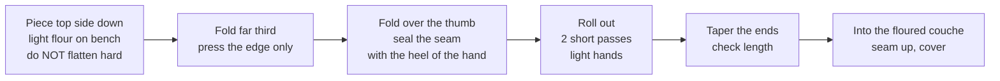

# 09.3 · Shaping and Scoring Tradition

A tradition dough reaches the bench soft, full of gas and with little tolerance for rough handling. This lesson shows how to divide, pre-shape, shape and score it so that the large irregular bubbles built during two hours of pointage end up in the crumb instead of on the bench. You shape and score three home baguettes from your TR-01 dough of lesson 09.2.

## Why it matters

Shaping is where tradition and pain courant part ways on the bench. The PC-02 baguette of [lesson 08.3](../module-08/lesson-03.md) is shaped firmly from a dough that the mixer has developed. The tradition dough is softer and weaker in the hand, and its value is the open, irregular crumb: press it like pain courant and you get a regular, tight crumb and lose what the customer pays for; handle it too loosely and it spreads flat in the oven. The référentiel asks you to make tradition and to explain how handling affects the bread (C2.3, S3.1); how this is judged in the production test is in [The CAP Boulanger Exam](../../references/cap-exam.md).

## Key terms

| French | Say it | English meaning |
|---|---|---|
| pâte douce | *paht DOOSS* | soft dough (about 68-75 % water) |
| dégazage | *day-gah-ZAHZH* | degassing: pushing gas out of the dough when handling it |
| préfaçonnage lâche | *pray-fah-soh-NAHZH LAHSH* | loose pre-shaping: a light fold, no tight ball |
| détente | *day-TAHNT* | bench rest after pre-shaping so the gluten relaxes |
| façonnage | *fah-soh-NAHZH* | final shaping |
| couche farinée | *koosh fah-ree-NAY* | floured linen couche that holds the shaped baguettes in apprêt |
| fleurage | *fluh-RAHZH* | dusting flour on the bench, the couche or the dough |
| grignage | *green-YAHZH* | scoring: cuts made with the lame before baking |

## How it works

### What is different about the dough

| | PC-02 pain courant (Module 8) | TR-01 tradition |
|---|---|---|
| Water | 64 %, pâte bâtarde | 70 % or more, pâte douce |
| Strength at dividing | from the mixer: firm, elastic | from folds and time: soft, extensible, less elastic |
| Gas at dividing | after 45 minutes, moderate | after about 2 hours, large irregular bubbles |
| Goal of shaping | regular, creamy crumb | keep the large bubbles: open, irregular, shiny crumb |

Every handling step is planned around one rule: **keep the gas, add just enough tension.**

### Dividing and pre-shaping

1. **Turn the dough out** with a wet scraper onto a lightly floured bench, top side down. Do not punch or flatten it: let it spread under its own weight, then nudge it into an even thickness with floured fingertips.
2. **Cut rectangles** with one firm stroke of the coupe-pâte, close to the final weight. Weigh, correct with **at most one appoint**, placed on top so it is folded inside. A soft dough sticks to sawing blades: one clean cut, flour on the blade.
3. **Pre-shape loosely:** fold the far third towards you, then the near third over it, and leave it seam down as a short, soft rectangle or cylinder. No ball, no rolling.
4. **Détente about 30 minutes**, covered (longer than PC-02's 20 minutes): soft dough needs time to relax after even light handling. Retarded dough divided cold needs 45-60 minutes. The détente is over when a gentle pull lengthens the piece without it springing back.

### Shaping with minimal degassing

The movements are those of [lesson 08.3](../module-08/lesson-03.md), done more lightly:

- **Flatten only to an even rectangle**, using fingertips at the edges. Large bubbles in the middle stay.
- **Seal the seam firmly**, even though the folds are light: the seam is what holds a soft dough together in the oven. An open seam spreads.
- **Roll out in two short passes**, hands barely pressing, starting at the centre. A soft dough lengthens easily; pressing hard to "help" it squeezes out the gas.
- **Lengths:** the bakery's 300 g tradition pâton to about 55 cm; your 270 g home piece to about 38 cm, or your tray width minus 4-5 cm (lesson 08.3).
- **Use more fleurage** than for pain courant: the soft dough sticks to the couche. Rice flour or a 50/50 mix of rice and wheat flour sticks least.

A tradition baguette is allowed to look a little irregular: slight bumps along its length show the gas inside. It must not be flat, torn or uneven in thickness.

### Apprêt

Shaped pieces go into the floured couche, seam up, with a fold of linen standing between them, covered. Because pointage was long and the pieces still hold gas, the apprêt is usually shorter than PC-02's 1 h 15: about **45 minutes to 1 hour** at 24-25 °C. Judge by the poke test (lesson [04.4](../module-04/lesson-04.md)): bake when the dent fills back slowly and not completely. A tradition is better a little early than late: an over-proofed soft dough collapses when scored and gives flat, pale baguettes.

### Scoring tradition

The rules of [lesson 08.4](../module-08/lesson-04.md) apply: cuts **along the midline**, overlapping by about **a third**, **blade held low** (30-45°), shallow, one quick stroke each (King Arthur Baking). Three points are particular to a soft tradition:

- **Dry skin first.** Leave the baguettes uncovered in the couche for the last 5-10 minutes of apprêt, or roll them onto the paper a few minutes before loading: a slightly dry skin cuts cleanly; a wet one drags.
- **Decisive cut.** A slow cut in soft dough tears it. If the lame drags, the blade is dull or the skin wet; change the blade.
- **A pattern the shop recognises.** Many bakeries give their tradition a cut pattern different from their pain courant so staff and customers can tell them apart at a glance. Choose one and keep it: for example 5 cuts on the courant and 3 longer cuts on the tradition. The course's home baguette keeps 3 cuts of about 13 cm.

## Worked example

Saturday, 6:45: the TR-01 batch of lesson 09.2 has finished pointage. After Sunday's 1,000 g of pâte fermentée has been cut off, about 12.3 kg of dough remain for **40 baguettes at 300 g** (12,000 g). The shop's tradition pattern is 3 long cuts; the courant has 5.

1. **6:45-7:05, dividing:** dough turned out with a wet scraper, spread to an even slab, cut into rectangles. Every fifth piece is checked on the scale: 301, 298, 300, 304, 297 g. Tolerance on the sheet: 300 g ± 5 g. Four pieces needed one appoint; none needed two.
2. **Pre-shaping:** each piece folded in thirds, seam down, in division order on a floured board. Covered.
3. **Détente 30 minutes**, 7:05-7:35. The first pieces spread slightly and stretch without resistance: ready.
4. **7:35-8:00, shaping:** light flattening, firm seam, two rolling passes, 55 cm. Five pieces measured: 54, 56, 55, 53, 56 cm. Into a couche dusted with rice flour, seam up.
5. **Apprêt** at 24 °C from 8:00. Poke test at 8:40 on the first-shaped piece: springs back quickly. At 8:55: fills back slowly, not completely. The baguettes have been uncovered since 8:45.
6. **8:55, scoring and loading:** 3 cuts each, lame at about 30°, one stroke per cut; two decks of 20 (lesson 09.4).
7. **Record:** dividing 20 minutes, 4 appoints, détente 30 minutes, lengths 53-56 cm, apprêt 55 minutes, 3-cut pattern.

## Practice

You divide, pre-shape, shape and score three baguettes of 270 g from your TR-01 dough (lesson 09.2) and set them up for baking (lesson 09.4). Start the oven preheating when you shape.

> [!WARNING]
> Preheat the oven to 240-250 °C with the baking tray or stone in the middle and an empty metal tray on the lowest shelf. Use dry oven gloves for every tray. Steam goes only into the preheated metal tray, never into a hot glass or ceramic dish.

> [!CAUTION]
> A lame is a bare razor blade. Hold the board or tray with the other hand well away from the line of the cut, cut away from yourself, never test the edge with a finger, and put the guard back on after use.

### You need

- Minimum: bench scraper and dough cutter, scale (1 g), ruler or tape measure, rice flour (or wheat flour) for dusting, couche or a heavy linen tea towel, baking paper on a flat board or tray, lame (or a new razor blade on a coffee stirrer), cling film or a cover, [bake log](../../templates/bake-log.md).
- Professional equivalent: floured bench, hydraulic divider (checked on the scale), boards with couches, proofing cabinet at 24-25 °C and about 75-80 % relative humidity, transfer board (planchette), loader.

### Ingredients

Your TR-01 dough from lesson 09.2 after pointage: about 937 g, minus the 75 g of tradition pâte fermentée you kept. You divide 3 × 270 g; the remaining 40-50 g can be shaped into a small roll as a test piece for the poke test.

### In Israel

- **Rice flour** (קמח אורז, *kemakh orez*) is sold in supermarkets and health-food shops (checked 2026-10-08): it is the best dusting for a couche because it does not glue to soft dough. Otherwise use your white flour, more generously.
- **Couche:** baking-supply shops and online shops sell linen couches; a heavy, smooth linen or cotton tea towel (not terry towelling) works at home.
- **Warm kitchen:** at 28-30 °C the apprêt can be ready in 30-40 minutes. Poke-test from 25 minutes, and on a very hot day shape the second piece only when the first is in the couche, so no piece waits on the bench.
- **Strong white flour:** if your tradition dough springs back when you roll it, give 10 more minutes of détente rather than pressing harder.

### Steps

1. **Scoring drill (5 minutes):** on baking paper draw a 38 cm line and practise three overlapping 13 cm strokes with a capped pen, blade angle low.
2. **Divide:** turn the dough out with a wet scraper onto a lightly floured bench. Do not punch it. Cut three rectangles of about 270 g, weigh, correct with at most one appoint each. Write the weights. Shape the leftover into a small test roll.
3. **Pre-shape:** fold each piece in thirds, seam down. Cover. Note the time.
4. **Détente about 30 minutes** (longer if the dough was retarded). Check: the piece stretches without springing back.
5. **Shape:** piece top side down; even it out with fingertips; fold the far third and press the edge only; fold over the thumb and seal the seam firmly; two light rolling passes to about 38 cm; taper the ends. Measure each baguette.
6. **Into the couche:** dust the couche well, lay each baguette seam up with a fold of cloth between them (or seam down on floured baking paper with rolled towels between them). Cover. Note the time.
7. **Apprêt:** poke-test the test roll from 35 minutes (25 minutes in a hot kitchen). Uncover the baguettes for the last 5-10 minutes.
8. **Transfer and score:** roll each baguette seam down onto the baking paper on a flat board. Three cuts of about 13 cm along the midline, overlapping by a third, blade at 30-45°, about 5 mm deep, one quick stroke each. Cover the lame. Bake at once (lesson 09.4).

```mermaid
gantt
  title Home TR-01 day, 500 g flour (dough at 23 °C)
  dateFormat HH:mm
  axisFormat %H:%M
  section Dough (09.2)
  Readings, weigh, autolyse      :a, 08:00, 40m
  Final mixing and bassinage     :m, after a, 15m
  Pointage, folds at 30, 60, 90  :p, after m, 120m
  section Shaping (09.3)
  Keep 75 g PF, divide, pre-shape :d, after p, 15m
  Détente                        :r, after d, 30m
  Shape, into the couche         :s, after r, 15m
  Apprêt                         :q, after s, 55m
  section Oven (09.4)
  Preheat with trays             :o, 11:35, 70m
  Score and bake                 :b, after q, 25m
```

### Targets

- Three pâtons of 270 g ± 2 g, at most one appoint each.
- Détente about 30 minutes, ended on the stretch test.
- Baguettes 38 cm ± 2 cm (or your tray length), even in thickness, seams closed, with visible gas under the skin.
- Apprêt ended on the poke test; 3 cuts each, overlapping, along the midline.

### How you know it worked

The pieces stayed puffy and light through dividing and shaping; you saw and felt bubbles under the skin when you sealed the seam. The baguettes kept their shape in the couche without spreading flat, and the cuts opened cleanly without dragging. After baking (lesson 09.4) the crumb shows large irregular holes rather than a tight, even crumb.

### Self-check

- [ ] I turned the dough out without punching it and divided with clean single cuts.
- [ ] I pre-shaped loosely and gave a longer détente than for pain courant.
- [ ] I shaped with light hands but sealed every seam firmly.
- [ ] I used enough dusting and the baguettes came out of the couche cleanly.
- [ ] I scored with a low blade and quick strokes and covered the lame afterwards.

## What goes wrong

| Symptom | Likely cause | Fix now | Prevent next time |
|---|---|---|---|
| Tight, regular crumb in a tradition | Dough punched at turning out; flattened hard; tight pre-shape | — | Let the dough spread by itself; fingertips only; loose pre-shape |
| Baguettes spread flat in the couche | Seam not sealed; too little tension; dough too slack or over-fermented | Bake slightly early; firmer support with the couche folds | Seal firmly; check hydration and pointage (09.2) |
| Piece tears when rolled out | Détente too short; strong flour; pressed too hard | Rest 10 minutes more, then finish | Longer détente; lighter hands; two short passes |
| Baguettes stick to the couche and deflate when moved | Too little or wrong dusting | Ease them off with a floured scraper | More fleurage; rice flour |
| Lame drags, cuts tear | Wet skin; blunt blade; slow cut | Change the blade | Uncover for the last 5-10 minutes; quick decisive stroke |
| Baguettes collapse when scored | Over-proofed: dent stays | Bake at once, do not re-shape | Poke-test earlier, especially in a warm kitchen |

## Review

- Tradition dough is soft and gas-rich: keep the gas, add just enough tension.
- Turn it out without punching, cut cleanly, at most one appoint, pre-shape loosely, détente about 30 minutes (45-60 after retarding).
- Shape with light hands, a firmly sealed seam and two short rolling passes; dust the couche well, ideally with rice flour.
- Apprêt is often 45 minutes to 1 hour, judged by the poke test; score with a slightly dry skin, a low blade and quick strokes, in a pattern that tells tradition apart from pain courant.
- Shaping and scoring are part of the production test: see [The CAP Boulanger Exam](../../references/cap-exam.md).
