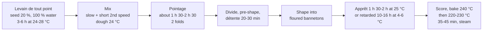

# 10.3 · Pain de Campagne and Levain Bread

Pain de campagne is the bakery's rustic loaf: a little rye, a levain, a long fermentation, a thick, well-coloured crust and a crumb that keeps for days. This lesson takes the CA-01 sheet you calculated in Module 6 into the fournil: building the liquid levain, mixing with the levain as a fourth temperature factor, fermenting by the signs of the dough, and baking a large loaf right through. You bake two campagne loaves on your own levain.

## Why it matters

Pain de campagne is one of the four "other breads" of the référentiel (S3.2: cite its raw materials and its stages), and it is the one that uses the levain you started in lesson [02.7](../module-02/lesson-07.md). What the production test asks about these breads is in [The CAP Boulanger Exam](../../references/cap-exam.md). It is also the bread where the name on the label matters most: "campagne" and "au levain" are promises to the customer, and "au levain" is checked in a laboratory. A campagne on levain is slow and less predictable than a baguette on pâte fermentée, so it trains exactly the skill the course keeps coming back to: judging the dough, not the clock.

## Key terms

| French | Say it | English meaning |
|---|---|---|
| pain de campagne | *pan duh kahm-PAN-yuh* | "country bread": rustic loaf, usually with some rye or darker flour and a levain or long fermentation |
| pain au levain | *pan oh luh-VAN* | bread that may carry the legal "au levain" mention: levain-raised, crumb pH 4.3 or less, at least 900 ppm acetic acid |
| farine de seigle | *fah-REEN duh SEH-gluh* | rye flour (T85, T130, T170 by ash) |
| levain liquide | *luh-VAN lee-KEED* | liquid levain, about 100 % water on its flour |
| levain de tout point | *luh-VAN duh too PWAN* | the final levain build, ripe and ready for the dough |
| banneton | *bahn-TOHN* | proofing basket that holds a boule or bâtard in shape, seam up |
| pétrissage lent (PVL) | *pay-tree-SAHZH LAHN* | slow mixing in first speed: little heating, little oxidation, creamy crumb |
| pain bien cuit | *pan byan KWEE* | well-baked bread: a deep, dark crust that is part of the campagne's character |

## How it works

### What the names mean

The 1993 bread decree does **not** define pain de campagne: the name comes from professional usage, which [lesson 09.1](../module-09/lesson-01.md) sets out with the other bread names. In practice a campagne is a wheat loaf, often with some rye (here 15 %), on levain or a long fermentation, with a thick crust, often floured, and a slightly acidic taste. A campagne made with yeast and a short process can still be called campagne by usage, which is why the second name exists:

- **"Au levain"** (décret n°93-1074, art. 3): the crumb must have a **pH of 4.3 or less** and at least **900 ppm of acetic acid** from the fermentation.
- **Levain** (art. 4): a dough of wheat and/or rye flour and water, possibly salt, left to a natural acidifying fermentation. Baker's yeast may be added **only at the final mixing**, at most **0.2 % of the flour used at that stage**.

CA-01 contains no baker's yeast at all, so it can carry "au levain" if its crumb passes the two tests. The labels and the full law are [lesson 09.1](../module-09/lesson-01.md)'s subject; here you make the bread.

### The CA-01 sheet

From the order sheet of the [Module 6 calculation workbook](../../projects/m06-calculation-workbook.md), as an overall formula (all flour = 100 %, lesson [06.4](../module-06/lesson-04.md)):

| Ingredient | Overall % | Job in this dough |
|---|---|---|
| Flour T65 | 85 | A little more bran than T55: more flavour, a creamier-grey crumb, good strength |
| Rye flour T130 | 15 | Flavour and keeping; its arabinoxylans bind water and it forms no gluten network (American Society of Baking), so it makes the dough stickier and weaker: kept to a minority share |
| Water | 70 | A soft dough (rye and bran absorb more water); slightly higher than pain courant |
| Salt | 1.8 | Flavour, gluten tightening; within the salt limits (checked below) |
| Liquid levain (100 %), made with T65 | 20 % of the flour prefermented | All the rise and the acidity; no baker's yeast |
| **Total** | **171.8** | Bake loss on the sheet: 15 % |

Split for the mixer (per 1,000 g of total flour): levain = 200 g T65 + 200 g water (400 g); final dough = T65 650 g, rye 150 g, water 500 g, salt 18 g and the 400 g of levain. The levain has no salt, so all the salt goes in the final dough.

### The day of a campagne

**Levain ripeness first.** The levain decides the day. Build it with a seed of about 20 % of its new flour, 100 % water (lesson 06.4: F = levain wanted ÷ (1 + h + s)), and use it at or just after its peak: domed, full of bubbles, smelling of yoghurt and fruit with a light vinegar note (lesson [04.5](../module-04/lesson-05.md)). Young levain gives a slow, flat, bland loaf; over-ripe levain brings so much acid and protease activity that the dough slackens and tears.

**Mixing.** Water, flours and the ripe levain; salt during the frasage. Slow mixing (or slow plus 2-3 minutes in second speed) is the usual choice: rye does not need, or tolerate, long intensive mixing, and slow mixing keeps the crumb creamy. The dough is soft and a little sticky, not smooth like pain courant. **Temperature:** the levain is a fourth factor (lesson [05.3](../module-05/lesson-03.md)): water = 4 × TPV − flour − room − levain − friction factor, with TPV about 24 °C.

**Fermentation is slower.** Wild yeasts work more slowly than a 1.5 % dose of baker's yeast. At 24 °C, count about 1 h 30 to 2 h 30 of pointage with two folds (they build the strength the short mixing did not), and an apprêt of 1 h 30 to 2 h, or a retarded apprêt in the cold of 10-16 hours at 4-6 °C (lesson [04.6](../module-04/lesson-06.md)). Judge by the dough: about 1.5 times its volume, domed, airy at the edges, a poke that fills back slowly. Every °C changes the speed by about 7 % (lesson [04.2](../module-04/lesson-02.md)).

**Shaping and scoring.** Boules or bâtards with good tension (lesson [10.1](lesson-01.md)), into bannetons dusted with rye or rice flour, seam up. They are turned out seam down onto the loader and scored: a cross, a square or parallel cuts ("saucisson"). A loaf proofed in the cold is firm and can take deeper cuts, up to about 1-2 cm (King Arthur Baking); one proofed warm takes shallower cuts.

**Baking.** Large loaves need a long bake: about 240 °C with steam at loading, then 220-230 °C after 10 minutes so the crust does not burn before the centre is baked; 35-45 minutes for 500-600 g; core at least 93 °C. A campagne is baked darker than a baguette (bien cuit): the thick, deep-brown crust carries much of its aroma and keeps the crumb moist. Cool at least 1-2 hours before cutting: a warm rye crumb is gummy.

## Worked example

Monday, Boulangerie Au Pain de la Halle: the CA-01 line of the Module 6 order, **10 boules de campagne, poids cuit 500 g**, for the afternoon. The calculations are already on the sheet (reference answers of the [workbook](../../projects/m06-calculation-workbook.md)):

| | T65 | Rye T130 | Water | Salt | Levain |
|---|---|---|---|---|---|
| Pâton 500 ÷ 0.85 = 588 → **590 g**; batch with 2 %: 6,018 g; flour **3,600 g** | 3,060 g overall | 540 g | 2,520 g | 64.8 g | — |
| Levain de tout point (100 %) | 720 g | — | 720 g | — | = 1,440 g |
| Final dough | 2,340 g | 540 g | 1,800 g | 64.8 g | 1,440 g |

1. **4:00, levain build.** For 1,440 g plus a 60 g margin: F = 1,500 ÷ 2.2 = **682 g** of T65, 682 g of water at 28 °C, 136 g of ripe levain chef. Into the levain cabinet at 26 °C. Planned ripe at about 8:00-9:00.
2. **8:30, ripeness check.** Domed, just beginning to flatten in the centre, surface full of bubbles, yoghurt and fruit smell. Ripe. 1,440 g weighed; the rest (about 60 g) becomes tomorrow's levain chef.
3. **Water temperature.** Flour 20 °C, fournil 22 °C, levain 27 °C; friction factor for this mix (slow mixing plus 2 minutes second speed, four factors): 16. Water = 96 − 20 − 22 − 27 − 16 = **11 °C**.
4. **Mixing.** 6 minutes first speed (salt after 1 minute), 2 minutes second speed. Soft, slightly sticky, stretches without tearing. **24.2 °C.**
5. **Pointage** 8:45-10:45 with folds at 9:30 and 10:15. At 10:45: about 1.5 times, domed, bubbles at the sides. Divide 10 × 590 g, pre-shape round, détente 25 minutes.
6. **Shape** boules into rye-dusted bannetons, seam up. Apprêt at 25 °C from 11:15; poke test from 12:30.
7. **12:50, bake.** Turned out, cross cut about 1 cm deep, steam, 240 °C; 230 °C after 10 minutes; out at 13:30 (40 minutes), deep brown, core 97 °C.
8. **Checks for the sheet.** Yeast: none, so the "au levain" rule is met by construction; had the chef wanted 0.2 % yeast to secure the timing, the maximum would be 0.2 % of the final-mixing flour, 2,880 g → **5.8 g**. Salt: 1.8 ÷ 171.8 = 1.048 % of the dough; 590 × 1.048 % = 6.18 g in 500 g of bread = **1.24 g per 100 g**, under the 1.4 g limit for pain courant and even under the 1.3 g of wholemeal and cereal breads. A cooled boule weighs 498 g: loss 15.6 %, as planned.

## Practice

Over two days you build a levain de tout point from the levain you started in lesson 02.7, mix CA-01 on 500 g of flour, and bake a campagne boule and a bâtard of 420 g each, after an apprêt at room temperature or overnight in the fridge.

> [!WARNING]
> The oven runs at 240-250 °C for a long bake. Use dry oven gloves and long sleeves; steam only into a metal tray preheated on the lowest shelf (never water into a hot glass or ceramic dish: it can shatter), pour 100-150 mL of hot water, close the door and step back. Turning a loaf out of a banneton onto a board and sliding it onto a hot tray needs both hands and a clear space. Score with the blade moving away from your fingers and cover the lame after use.

### You need

- Minimum: your levain (lesson 02.7) and a clean jar with an elastic band, scale (1 g) and a 0.1 g pocket scale, probe thermometer, large bowl, scraper, lidded container for pointage, two bannetons or two bowls of about 18-20 cm lined with tea towels well dusted with flour (rye or rice flour sticks least), baking paper, a board as a peel, baking tray or stone, metal steam tray, oven gloves, lame, wire rack, [bake log](../../templates/bake-log.md) and [temperature log](../../templates/temperature-log.md).
- Professional equivalent: levain cabinet or levain machine, spiral mixer (slow speed), bannetons on racks, proofing cabinet or retarder, deck oven with steam.

### Ingredients

**Levain de tout point** (the evening before, or 3-6 hours before mixing): F = (200 + 20 margin) ÷ 2.2 = 100 g.

| Ingredient | % of its flour | Weight |
|---|---|---|
| Flour T65 | 100 | 100 g |
| Water at about 28 °C | 100 | 100 g |
| Ripe levain chef (seed) | 20 | 20 g |
| **Total** | | **220 g** (use 200 g, keep the rest as your levain chef) |

**CA-01 on 500 g of flour:**

| Ingredient | Overall % | Home: final dough | Professional: final dough (worked example) |
|---|---|---|---|
| Flour T65 | 85 (of which 20 in the levain) | 325 g | 2,340 g |
| Rye flour T130 | 15 | 75 g | 540 g |
| Water at the calculated temperature | 70 (of which 20 in the levain) | 250 g | 1,800 g |
| Fine salt | 1.8 | 9 g | 64.8 g |
| Liquid levain, ripe | (100 g flour + 100 g water) | 200 g | 1,440 g |
| **Total** | **171.8** | **859 g** | **6,184.8 g** |

Two pâtons of 420 g = 840 g; about 19 g covers what sticks.

### In Israel

- **Flour:** for T65 use half white (קמח לבן, *kemakh lavan*) and half 80 % wheat flour (קמח חיטה 80%), as the [Flour in Israel](../../references/flour-in-israel.md) reference suggests; blend the whole 425 g first and take the levain's 100 g from the blend. With this blend start at 70 % and add up to 2-4 points by bassinage (the reference's campagne range is about 70-74 % with 80 % flour).
- **Rye:** look for rye flour (קמח שיפון, *kemakh shifon*) in health-food shops, baking-supply shops and the "special flours" shelf of larger supermarkets. It is often whole rye, darker and thirstier than T130: keep 15 % and add 1-2 points of water. If you cannot find any, use 100 % whole wheat flour (קמח חיטה מלא) for the 15 %; the bread will lack rye's taste but will behave similarly (checked 2026-10-08).
- **Levain in summer:** at 28-30 °C a 20 % seed peaks in about 3 hours and is soon over-ripe. Use a 10 % seed (10 g) or water at 20 °C for the build, or build it in the evening and finish it in the fridge.
- **Water in summer:** four factors with a hand friction factor of 8. With flour 29 °C, kitchen 30 °C, levain 29 °C: 96 − 29 − 30 − 29 − 8 = **0 °C**, which tap water cannot give. Either put the flour in the fridge for a few hours (flour at 10 °C: 96 − 10 − 30 − 29 − 8 = 19 °C) or use fridge water at 4 °C and accept about 25 °C: (29 + 30 + 29 + 4 + 8) ÷ 4 = 25 °C, then shorten pointage by about 7 % and judge by the dough.
- **Overnight in the fridge** is the easiest home schedule in a hot kitchen: shape in the evening, bannetons covered in the fridge (about 4 °C) for 10-14 hours, bake straight from the cold.

### Steps

1. **Refresh your levain** once or twice in the days before (lesson 02.7) so it doubles within 4-8 hours.
2. **Build the levain de tout point** (100 g T65, 100 g water at 28 °C, 20 g levain chef) in a clean jar; mark the level; keep at 24-28 °C for 3-6 hours. Use it when domed and just starting to flatten.
3. **Measure** flour, room and levain; calculate the water: 96 − flour − room − levain − 8. Blend to ± 0.5 °C; weigh 250 g.
4. **Mix:** water and levain in the bowl, stir to loosen; add both flours; mix with a scraper until no dry flour is left. Rest 10 minutes. Add the salt and knead gently by hand for 5-6 minutes, slap and fold, until the dough holds together and stretches; it stays a little sticky. Wet your hands rather than flouring the bench. **Measure the temperature** (target 24 °C ± 1 °C).
5. **Pointage** in the lidded container, about 1 h 30-2 h 30 at 24 °C, with two folds (at 30 and 60 minutes). End when about 1.5 times the volume, domed, airy at the sides.
6. **Divide** 2 × 420 g ± 2 g; pre-shape round; détente 20-30 minutes, covered.
7. **Shape** one boule and one bâtard with tension (lesson 10.1). Dust the lined bannetons with flour, set the loaves in seam up, cover.
8. **Apprêt:** either 1 h 30-2 h at room temperature (poke test), or into the fridge for 10-14 hours. Preheat the oven to 250 °C with the tray or stone on the middle shelf and the steam tray on the lowest, at least 45-60 minutes.
9. **Turn out** each loaf onto baking paper on the board, seam down. Score: a cross on the boule, one long cut on the bâtard, about 1 cm deep (deeper if the loaf is cold from the fridge).
10. **Bake:** slide onto the tray, 100-150 mL of hot water into the steam tray, close, step back; fan off for 10 minutes if possible. After 10 minutes vent and lower to 220-230 °C. About **30-35 minutes** in total for 420 g pieces, until deep brown; core at least 93 °C.
11. **Cool** at least 1-2 hours on a rack. Weigh both loaves; calculate the loss and the salt per 100 g (pâton × 1.048 % ÷ cooled weight × 100).

### Targets

- Levain used ripe (domed, bubbly, pleasant sour smell) and its rise recorded.
- Dough at 24 °C ± 1 °C after mixing; pointage and apprêt ended on the signs, times recorded.
- Pâtons 420 g ± 2 g; loaves round in section, scores open.
- Crust deep brown; core at least 93 °C; loss about 13-17 %; salt at or below 1.3 g per 100 g.

### How you know it worked

The loaves rose in the oven and opened along the cuts, the crust is thick, deep brown and crackles as it cools, and the base sounds hollow. Cut after cooling, the crumb is creamy-grey, moist and irregular with medium holes, not gummy, and the taste is wheaty with a clear but pleasant acidity. On the second and third day the bread is still good: that keeping quality is the levain's work.

### Self-check

- [ ] I built the levain to the gram and used it at its peak, not young or collapsed.
- [ ] I counted the levain as a fourth factor for the water temperature.
- [ ] I gave two folds during pointage and ended fermentation on the dough's signs.
- [ ] I baked long enough for a dark crust and a core of at least 93 °C, and cooled before cutting.
- [ ] I can explain why CA-01 can carry "au levain" and what 0.2 % of the final-mixing flour would allow.

## What goes wrong

| Symptom | Likely cause | Fix now | Prevent next time |
|---|---|---|---|
| Dough barely rises in 3 hours | Levain young or weak; dough too cold | Move somewhere warmer; wait, judge by the dough | Refresh the levain until it doubles reliably; use it at its peak; check the dough temperature |
| Dough slack, sticky, tears; loaf spreads | Over-ripe levain (acid and proteases); too much water with whole rye; over-fermented | Shape gently with wet hands; banneton for support; bake at once | Use the levain at its peak; hold back 2-3 points of water; shorter or cooler pointage |
| Very sour, sharp taste | Levain over-ripe; very long warm fermentation | — | Use the levain earlier; ferment cooler; a liquid, warmer levain is milder (02.7) |
| Loaf sticks in the banneton | Too little flour in the cloth; wheat flour soaked in | Ease it out with a scraper | Dust with rye or rice flour; dry the cloth between uses |
| Gummy crumb near the base | Under-baked; cut warm (rye crumb sets slowly) | Return to the oven 5-10 minutes | 93 °C or more at the core; cool 1-2 hours before cutting |
| Pale, thin crust | Oven too cool; under-baked; over-fermented (sugars used up) | Bake longer | Preheat 45-60 minutes; bake to deep brown; judge apprêt by the poke test |
| Burnt crust, raw centre | Too hot for the whole bake | Lower the oven, cover with foil | 240 °C at loading, then 220-230 °C |

## Review

- Pain de campagne is defined by usage, not by the 1993 decree; "au levain" is legal: crumb pH 4.3 or less, at least 900 ppm acetic acid, baker's yeast only at final mixing and at most 0.2 % of that flour ([lesson 09.1](../module-09/lesson-01.md) sets out the names).
- CA-01: T65 85, rye 15, water 70, salt 1.8, 20 % of the flour in a liquid levain; the levain is the only leaven and a fourth temperature factor.
- The levain sets the day: build it to the gram, use it at its peak; ferment the dough slowly with folds, judged by its signs, or retard the apprêt in the cold.
- Bake large loaves long and dark: 240 °C with steam, then 220-230 °C, core at least 93 °C; cool before cutting.
- Pain de campagne is one of the "other breads" of the production test: see [The CAP Boulanger Exam](../../references/cap-exam.md).
