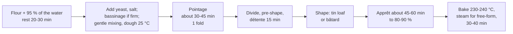

# 10.4 · Pain Complet and Wholemeal Doughs

Pain complet is bread made from wholemeal flour: the whole grain, bran and germ included. The bran changes almost everything about the dough: it drinks more water, cuts the gluten film, speeds up fermentation and shortens the life of the flour. This lesson explains those changes with numbers, sets a formula that respects the lower salt limit for wholemeal bread, and you bake a tin loaf and a bâtard of pain complet.

## Why it matters

Pain complet is one of the four "other breads" of the référentiel (S3.2) and one of the legal names you must define (S1.4); the production test can ask for it (see [The CAP Boulanger Exam](../../references/cap-exam.md)). Customers buy it for fibre and taste and expect it to be moist and to rise properly, not to be a heavy brick. A baker who treats wholemeal flour like T55 gets exactly the brick: too little water, too much mixing, a pointage that runs over, and salt over the limit, since wholemeal and cereal breads have their own, lower threshold.

## Key terms

| French | Say it | English meaning |
|---|---|---|
| pain complet | *pan kohm-PLAY* | wholemeal bread: made with wholemeal flour (type 150) |
| farine complète (T150) | *fah-REEN kohm-PLET* | wholemeal flour: the whole grain milled, ash about 1.4 % or more |
| son | *SOHN* | bran: the outer layers of the grain |
| germe | *ZHAIRM* | germ: the embryo of the grain, rich in oil and enzymes |
| pain moulé | *pan moo-LAY* | tin loaf: bread baked in a mould |
| moule | *MOOL* | baking tin |
| rancissement | *rahn-sees-MAHN* | rancidity: off-taste from the oxidation of fats, here the oil of the germ and bran |

## How it works

### What the name promises

In French usage, **pain complet** is made with wholemeal flour, type 150 (lesson [02.2](../module-02/lesson-02.md)): the whole grain, with an ash content around 1.4 % or more. The exact wording of the name, with the other bread names, is in [lesson 09.1](../module-09/lesson-01.md). A bread made with T80 or T110 is darker than pain courant but is not pain complet.

The salt agreement gives wholemeal and cereal breads a lower limit than pain courant: **at most 1.3 g of salt per 100 g of bread** since October 2023 ([Ministry of Agriculture](https://agriculture.gouv.fr/filiere-boulangerie-vers-une-diminution-du-sel-dans-le-pain-0); lesson [02.5](../module-02/lesson-05.md)).

### What the bran does

| Bran effect | What happens physically | What you do |
|---|---|---|
| **More water** | Bran particles absorb a lot of water, and slowly (American Society of Baking) | 72-78 % water instead of 62-65 %; rest flour and water 20-30 minutes before judging consistency (an autolyse, lesson [03.2](../module-03/lesson-02.md)) |
| **Weaker gluten** | Bran particles cut the gluten films and the germ's compounds weaken them; less gluten-forming protein per gram of flour | Gentle, shorter mixing; folds in pointage; tins for support; some bakers add a little wheat gluten (an adjuvant, lesson [02.9](../module-02/lesson-09.md)) |
| **Faster fermentation** | More enzymes, minerals and sugars from the outer layers | A shorter pointage and apprêt; check the dough early |
| **Less volume, denser crumb** | Weaker gas retention | Proof to about 80-90 % of what a white dough would reach, not to the limit |
| **Shorter flour life** | The oil of the germ and bran oxidises: the flour turns rancid sooner (American Society of Baking) | Buy small lots, store cool and dry, first in first out, check the date |

### The CO-01 sheet

| Ingredient | % | Why |
|---|---|---|
| Wholemeal flour T150 | 100 | The name requires it |
| Water | 74 | Middle of the 72-78 % range of the [base formulas](../../references/formulas.md): bran needs it; adjust after the rest |
| Salt | **1.7** | Lower than pain courant's 1.8, to stay under 1.3 g per 100 g even in small pieces (below) |
| Fresh yeast | 1.8 | Direct method, short day; the bran's sugars and enzymes help |
| **Total** | **177.5** | TPV 25 °C (25-26 °C range) |

A pâte fermentée of 10 % (optional in the base formulas) adds flavour and keeping; then use four factors for the water.

**Why 1.7 % and not 1.8 %?** Salt in the dough = 1.7 ÷ 177.5 = 0.958 %. For a 500 g tin loaf losing 18 %: 500 × 0.958 % = 4.79 g in 410 g → 1.17 g per 100 g. For a 60 g roll losing 23 %: 0.575 g in 46.2 g → 1.24 g. At 1.8 % the roll would be 1.8 ÷ 177.6 = 1.014 % → 0.608 g in 46.2 g = **1.32 g: over the limit**. The higher water already dilutes the salt; small, longer-baked pieces concentrate it again.

### Process

- **Rest first.** Mix the flour with most of the water and leave it 20-30 minutes. The bran soaks up water and the dough becomes softer than it looked at first: only then decide whether to add the rest (bassinage).
- **Mixing:** frasage, then a moderate second speed. Stop at a smooth, extensible dough that stretches into a thin but not perfectly clear film; bran makes a windowpane look "speckled" and tear earlier, so do not chase it with more mixing (that only heats and weakens the dough).
- **Temperature:** TPV 25 °C, three factors for a direct dough (lesson [05.2](../module-05/lesson-02.md)): water = 75 − flour − room − friction factor.
- **Fermentation:** shorter than pain courant: pointage about 30-45 minutes with one fold, apprêt about 45-60 minutes at 25-26 °C, judged by the dough. A wholemeal dough that has gone too far collapses rather than springing back.
- **Shaping:** **pain moulé** in a greased tin (the tin supports the weak dough and gives a regular sandwich slice) or free-form bâtards and boules with a little less tension than a white dough (lesson [10.1](lesson-01.md)).
- **Baking:** free-form loaves with steam at 230-240 °C, about 30-35 minutes for 400-500 g; tin loaves about 35-40 minutes, turned out for the last 5 minutes if the sides are pale; core at least 93 °C. The crust colours fast because of the bran's sugars: judge by the core, not only the colour.

## Worked example

Wednesday: a health-food shop orders **8 pains complets moulés of 500 g** and **20 petits pains complets of 60 g**. Sheet CO-01 (total 177.5 %), process losses 2 %, flour rounded up to the next 100 g. Readings: flour 21 °C, fournil 22 °C; friction factor for improved mixing on the spiral (three factors) 15.

1. **Dough.** 8 × 500 + 20 × 60 = 4,000 + 1,200 = **5,200 g**; with 2 %: 5,304 g.
2. **Flour.** 5,304 ÷ 1.775 = 2,988 g → **3,000 g**. Water 2,220 g; salt 51 g; fresh yeast 54 g; total 5,325 g ≥ 5,304 g.
3. **Water temperature.** 3 × 25 = 75; 75 − 21 − 22 − 15 = **17 °C**.
4. **Rest.** Flour and 2,100 g of the water in the mixer, 2 minutes first speed, rest 25 minutes. Pinch test: supple. The last 120 g of water go in at the start of mixing.
5. **Mix** 4 minutes first speed (yeast, then salt), 3 minutes second speed: smooth, speckled, extensible. **25.3 °C.**
6. **Pointage** 40 minutes with one fold at 20. Divide 8 × 500 g and 20 × 60 g; détente 15 minutes; shape the loaves into greased tins seam down, the rolls on a tray.
7. **Apprêt** at 26 °C: rolls ready at 40 minutes, tins at 55 minutes (dough about 1 cm above the rim at the centre).
8. **Bake.** Rolls 15 minutes at 240 °C with steam; tins 38 minutes at 230 °C, out of the tins for the last 4 minutes. Core 96 °C.
9. **Salt check after cooling.** Tin loaf 412 g (17.6 % loss): 4.79 g → **1.16 g per 100 g**. Roll 46.0 g (23.3 %): 0.575 g → **1.25 g per 100 g**. Both conform to 1.3 g.

## Practice

You mix CO-01 on 500 g of wholemeal flour with a rest before kneading, and bake one tin loaf of 470 g and one free-form bâtard of 400 g, so you see what the tin does for a weak wholemeal dough.

> [!WARNING]
> The oven is at 230-240 °C. Use dry oven gloves and long sleeves; steam only into a metal tray preheated on the lowest shelf (never water into a hot glass or ceramic dish), pour 100-150 mL of hot water, close the door and step back. A hot tin holds its heat for a long time: turn the loaf out with gloves onto the rack and put the tin where nobody will touch it. Score with the blade moving away from your fingers.

### You need

- Minimum: scale (1 g) and a 0.1 g pocket scale, probe thermometer, large bowl, scraper, lidded container, a metal loaf tin of about 1.3-1.5 L (for example about 20 × 10 × 7 cm), a little oil or butter for the tin, baking paper, baking tray, metal steam tray, oven gloves, lame, wire rack, [bake log](../../templates/bake-log.md).
- Professional equivalent: spiral mixer, sets of tins (moules) on trays, proofing cabinet, deck or rack oven.

### Ingredients

| Ingredient | Baker's % | Home batch | Professional batch (worked example) |
|---|---|---|---|
| Wholemeal flour T150 | 100 | 500 g | 3,000 g |
| Water at the calculated temperature | 74 | 370 g (keep 20 g back) | 2,220 g |
| Fine salt | 1.7 | 8.5 g | 51 g |
| Fresh yeast (or 3 g instant dry) | 1.8 | 9 g | 54 g |
| **Total** | **177.5** | **887.5 g** | **5,325 g** |

Divide 470 g (tin) + 400 g (bâtard) = 870 g.

### In Israel

- **Flour:** 100 % whole wheat flour (קמח חיטה מלא, *kemakh khita male*) stands in for T150; check the bag says 100 % or "whole wheat flour" alone, not 80 % ([Flour in Israel](../../references/flour-in-israel.md)). Its protein is high (12-14 g per 100 g as sold), so start at 74 % and expect to need the 20 g you held back, or even 2-4 points more.
- **80 % flour is not pain complet:** קמח חיטה 80% is close to T80. Bread from it alone is a darker bread, not a pain complet; keep it for the campagne blend of lesson 10.3.
- **Storage:** whole wheat flour turns rancid sooner than white. In a hot Israeli summer keep an opened bag in a closed container in the fridge or freezer and use it within a few weeks; smell it before use (a bitter, paint-like smell means rancid).
- **Water in summer:** three factors, TPV 25 °C, hand friction factor 6 (lesson [05.2](../module-05/lesson-02.md)). Flour 29 °C, kitchen 30 °C: 75 − 29 − 30 − 6 = **10 °C**: fridge water. The dough ferments fast at 25 °C and above: start checking pointage at 25 minutes.
- **Tins:** a standard rectangular metal loaf tin from a kitchen shop works; dark metal colours the sides better than glass. Do not use a glass dish for this practice (checked 2026-10-08).

### Steps

1. **Water temperature:** measure flour and room; water = 75 − flour − room − 6 (your own three-factor hand friction factor if you measured one). Weigh 370 g; set 20 g aside.
2. **Rest:** mix the flour with 350 g of the water until no dry flour is left. Cover, 25 minutes.
3. **Mix:** add the crumbled yeast and the salt; squeeze them through, then knead gently 6-8 minutes (slap and fold), adding the 20 g of water if the dough feels firm. Stop when smooth, extensible and speckled. **Measure:** 25 °C ± 1 °C.
4. **Pointage** about 30-45 minutes with one fold at 20 minutes; end at about 1.5 times the volume.
5. **Divide** 470 g and 400 g. Pre-shape a cylinder and a ball; détente 15 minutes.
6. **Shape:** the 470 g piece into a cylinder as long as the tin, seam down into the greased tin; the 400 g piece into a bâtard (a little less tension than white dough) on baking paper. Cover both. Preheat the oven to 240 °C with the tray on the middle shelf and the steam tray on the lowest.
7. **Apprêt** about 45-60 minutes. Tin: when the dough has risen about 1 cm above the rim at the centre. Bâtard: poke test, slightly before full proof.
8. **Bake the bâtard** with steam: one long cut, slide onto the tray, 100-150 mL of hot water, close, step back; vent at 10 minutes; about 30-35 minutes.
9. **Bake the tin** at 230 °C on the middle shelf (no steam needed): about 35-40 minutes; turn it out onto the tray for the last 5 minutes if the sides are pale. Core at least 93 °C for both.
10. **Cool** on a rack at least 1 hour; weigh, calculate the loss and the salt per 100 g (pâton × 0.958 % ÷ cooled weight × 100).

### Targets

- Dough 25 °C ± 1 °C; the rest done before the water decision.
- Fermentation shorter than pain courant and ended on the signs; times recorded.
- Tin loaf with a domed top, sides golden, base hollow; bâtard with an open cut.
- Core at least 93 °C; salt at or below 1.3 g per 100 g for both.

### How you know it worked

The tin loaf slices cleanly with a moist, even crumb and no crack between top and sides; the bâtard is flatter but has risen and opened along its cut. Both taste of whole wheat, nutty and slightly sweet, not bitter. Comparing the two shows the point of the tin: the same weak dough keeps its height when supported.

### Self-check

- [ ] I rested the flour and water before deciding on the last water.
- [ ] I stopped mixing at an extensible, speckled dough instead of chasing a white-dough windowpane.
- [ ] I shortened fermentation and judged it by the dough.
- [ ] I baked to a core of at least 93 °C, not only to the colour.
- [ ] My salt per 100 g is at or below 1.3 g for both loaves.

## What goes wrong

| Symptom | Likely cause | Fix now | Prevent next time |
|---|---|---|---|
| Heavy, dense brick | Too little water; no rest; over-mixed; under-proofed | — | 74 % or more; rest 20-30 min; gentle mixing; poke test |
| Dough sticky and slack after mixing | Water added before the bran had absorbed; over-mixed warm dough | Fold during pointage; shape into a tin | Hold back 2-3 points until after the rest; stop mixing earlier |
| Loaf collapsed, flat top, crumb torn | Over-proofed: wholemeal dough has little tolerance | Bake at once | Shorter apprêt; proof to 80-90 %, check early |
| Crust dark, crumb gummy | Bran sugars colour fast; under-baked centre | Lower the oven, bake on | Bake by core temperature (93 °C or more) |
| Bitter, stale or "paint" taste | Rancid flour (germ oil oxidised) | — | Fresh flour, small lots, stored cool; first in first out |
| Salt over 1.3 g per 100 g | Pain courant salt dose kept; small, long-baked pieces | — | 1.7 % or less; check with measured losses |
| Crack between top and sides of the tin loaf | Under-proofed; oven too hot at first | — | Proof until the dough is about 1 cm above the rim; 230 °C |

## Review

- Pain complet is made with wholemeal flour (T150); a darker bread from T80 or T110 is not pain complet. Lesson [09.1](../module-09/lesson-01.md) sets out the name.
- Bran absorbs more water slowly, cuts and weakens the gluten, speeds fermentation and makes the flour turn rancid sooner: more water, a rest, gentle mixing, shorter fermentation, fresh flour.
- CO-01: T150 100, water 74, salt 1.7, fresh yeast 1.8, TPV 25 °C; tins support the weak dough.
- Wholemeal and cereal breads must stay at or below 1.3 g of salt per 100 g: check small pieces with their measured losses.
- Pain complet is one of the "other breads" of the production test: see [The CAP Boulanger Exam](../../references/cap-exam.md).
