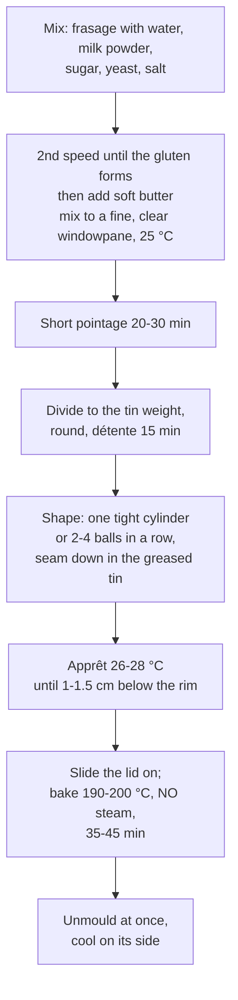

# 10.5 · Pain de Mie

Pain de mie is the "crumb bread": a soft, square sandwich loaf baked in a lidded tin, with a thin, tender crust and a fine, even crumb. Everything a baguette is not. This lesson explains what milk, sugar and butter do, how the tin and its lid shape the bread, how much dough a tin needs, and why pain de mie has the lowest salt limit of all. You bake one pain de mie in a covered tin.

## Why it matters

Pain de mie is one of the four "other breads" of the référentiel (S3.2) and a steady seller for sandwiches, toast and catering; the production test can ask for it (see [The CAP Boulanger Exam](../../references/cap-exam.md)). It is a precision product: a few grams too much dough and the lid is forced up and the corners are ragged; too little and the corners are round and the crumb coarse. Unmould it five minutes late and the sides cave in. It also has the strictest salt figure in the French agreement: **1.1 g of salt per 100 g of bread since October 2025**, so the pain courant habit of 1.8 % salt puts it over the limit.

## Key terms

| French | Say it | English meaning |
|---|---|---|
| pain de mie | *pan duh MEE* | soft sandwich loaf baked in a tin, mostly crumb with a thin, soft crust |
| moule à pain de mie (avec couvercle) | *MOOL ah pan duh MEE* | pain de mie tin with a sliding lid (Pullman tin) |
| couvercle | *koo-VAIR-kluh* | lid |
| lait en poudre | *LAY ahn POO-druh* | milk powder |
| matière grasse | *mah-TYAIR GRAHSS* | fat (here butter) |
| démoulage | *day-moo-LAHZH* | unmoulding: taking the bread out of the tin |
| pain de mie à chapeau | *ah shah-POH* | "with a hat": pain de mie baked without a lid, with a domed top |
| flancs affaissés | *FLAHN ah-fay-SAY* | caved-in sides: the defect of a tin loaf left in its tin or under-baked |

## How it works

### What the enrichments do

| Ingredient | What it does (Bake Info; American Society of Baking) | Effect you see |
|---|---|---|
| **Milk / milk powder** | milk solids keep the loaf moist and give a soft crust; lactose is not fermented by baker's yeast and stays as a reducing sugar for browning | soft, golden crust; tender crumb; slightly sweet taste |
| **Sugar** | food for the yeast, holds moisture, colours the crust (Maillard from about 105 °C, caramelisation from about 160 °C at the surface) | quick fermentation, fast colouring, longer softness |
| **Butter** | coats the proteins and slows gluten development; then lubricates the gluten network | more volume and a softer, finer crumb, but only if added after the gluten has formed |
| **More yeast** (3-4 %) | sugar and fat slow fermentation; a higher dose keeps a short schedule | short pointage, fast apprêt |

### The PM-01 sheet

Ranges from the [base formulas](../../references/formulas.md), with salt chosen for the limit:

| Ingredient | % | Note |
|---|---|---|
| Flour T55 (or T45) | 100 | enough strength for a tall, even rise |
| Water | 60 | with the milk powder, a medium-soft dough |
| Milk powder | 4 | or replace water and powder with milk (In Israel notes) |
| Salt | **1.6** | low end of the 1.6-1.8 range: see the check below |
| Fresh yeast | 3.5 | |
| Sugar | 5 | |
| Butter | 8 | added after the gluten has formed |
| **Total** | **182.1** | TPV 25 °C |

**Salt check.** Salt in the dough = 1.6 ÷ 182.1 = 0.879 %. A pain de mie loses little weight in a lidded tin: about 10 % in this lesson's planning (measure your own). A 1,050 g pâton: 9.23 g of salt in 945 g of bread = **0.98 g per 100 g**: conforms. At 1.8 %: 1.8 ÷ 182.3 = 0.987 % → 10.37 g in 945 g = 1.10 g, exactly at the limit, and over it as soon as the loss passes 10 % (1.12 g at 12 %). The course's base formulas give 1.6-1.8 %; for pain de mie stay at the low end.

### The tin decides the dough weight

A lidded tin has a fixed volume, so the dough is weighed for the tin, not by habit. About **0.35 g of dough per cm³** of tin works for a lidded pain de mie: King Arthur Baking's recipe puts about 1.15 kg of dough in a 13-inch tin of 33 × 10 × 10 cm (about 3.3 L), which is 0.35 g/cm³.

$$\text{pâton (g)} = \text{inside volume of the tin (cm}^3) \times 0.35$$

A 30 × 10 × 10 cm tin (3,000 cm³) takes about 1,050 g. Too heavy and the lid is forced up, the corners are ragged and the crumb is dense; too light and the corners stay round and the crumb is open and dry. Without a lid (pain de mie à chapeau) the same dough rises into a dome and you can use 10-15 % more dough.

### Process

- **Mixing.** Improved mixing taken to full development: a smooth, silky dough and a thin, clear windowpane, because the fine, even crumb comes from a fine, even gluten network. The butter, soft (about 15-18 °C) but not melted, goes in once the gluten has formed, at slow speed until absorbed, then second speed again. Butter added at the start coats the proteins and the dough takes much longer to develop and heats up.
- **Shaping.** Either one tight cylinder as long as the tin, or 2-4 tight balls placed in a row (they rise evenly and give a very regular crumb). Seam down, in a greased tin.
- **Apprêt** at about 26-28 °C until the dough is about **1-1.5 cm below the rim**, then the lid is slid on (King Arthur Baking: just below the lip). The last rise happens in the oven and fills the corners.
- **Baking without steam.** The bread is not scored and the closed tin traps the dough's own moisture; a soft, thin, evenly coloured crust is wanted, not a crisp, shiny one. Steam would bring nothing. Bake at about 190-200 °C (the sugar and milk colour fast), about 35-45 minutes for 1 kg; King Arthur bakes its 13-inch loaf at 350 °F (about 177 °C), 25 minutes with the lid and 10-20 without. Done when the centre reads at least about 90 °C (King Arthur: 190 °F, about 88 °C) and the sides are golden when you slide the loaf out.
- **Unmould at once** onto a rack and lay the loaf on its side. Left in the tin, steam condenses between bread and metal, the crust softens and the sides cave in. Cool fully (2-3 hours) before slicing: a warm crumb tears and squashes.

## Worked example

Thursday: a caterer orders **12 pains de mie for sandwiches**, lidded tins of 30 × 10 × 10 cm inside. Sheet PM-01 (total 182.1 %), process losses 2 %, flour rounded up to the next 100 g. Readings: flour 20 °C, fournil 22 °C; friction factor for this long improved mix on the spiral (three factors): 24.

1. **Pâton.** 30 × 10 × 10 = 3,000 cm³ × 0.35 = **1,050 g**.
2. **Dough.** 12 × 1,050 = 12,600 g; with 2 %: 12,852 g. Flour 12,852 ÷ 1.821 = 7,058 g → **7,100 g**.
3. **Ingredients.** Water 4,260 g; milk powder 284 g; salt 113.6 g; fresh yeast 248.5 g; sugar 355 g; butter 568 g. Total 7,100 × 1.821 = 12,929.1 g ≥ 12,852 g.
4. **Water temperature.** 3 × 25 = 75; 75 − 20 − 22 − 24 = **9 °C**.
5. **Mixing.** 4 minutes first speed; 4 minutes second speed until the dough clears the bowl; butter at 16 °C in pieces at first speed, 2 minutes; then 4 minutes second speed: fine, clear windowpane. **25.4 °C.**
6. **Pointage** 25 minutes. Divide 12 × 1,050 g; round; détente 15 minutes; four balls of 262 g per tin, in a row, seam down.
7. **Apprêt** at 27 °C: at 1 h 10 the dough is 1.2 cm below the rim. Lids slid on.
8. **Baking.** Deck at 195 °C, no steam, 40 minutes. One tin opened: sides golden, centre 94 °C. All unmoulded at once onto racks, on their sides.
9. **Control after 3 hours.** A loaf weighs 948 g: loss (1,050 − 948) ÷ 1,050 = 9.7 %. Salt: 1,050 × 0.879 % = 9.23 g in 948 g = **0.97 g per 100 g**: conforms to 1.1 g. Label for the caterer: contains wheat (gluten) and milk.

## Practice

You make PM-01 on 400 g of flour and bake it in a loaf tin covered with a lid (or a tray and a weight), then compare the crumb and crust with your baguettes.

> [!WARNING]
> The oven is at 190-200 °C and the tin, its lid and any weight on top get just as hot. Wear dry oven gloves for the lid and the tin, put the hot tin and lid down on a board out of reach, and turn the loaf out away from your body. Use only an oven-safe weight (an ovenproof dish or a second metal tray), never anything that can melt or crack.

> [!CAUTION]
> Pain de mie contains milk and gluten, two of the 14 regulated allergens: label it if you give it to anyone, and do not serve it to people with a milk allergy. Keep milk and butter in the fridge until you use them.

### You need

- Minimum: scale (1 g) and a 0.1 g pocket scale, probe thermometer, large bowl, scraper, a metal loaf tin, a lid for it (a Pullman tin, or a flat metal tray laid on top with an oven-safe weight), butter or oil for greasing, ruler, wire rack, [bake log](../../templates/bake-log.md). A stand mixer helps for full development but is optional.
- Professional equivalent: spiral mixer, sets of lidded pain de mie tins, proofing cabinet at 26-28 °C, deck or rack oven, bread slicer.

### Ingredients

Measure your tin first: inside length × width × height in cm (for a tapered tin, average the top and bottom). Pâton = volume × 0.35. The batch below gives about 700 g, right for a tin of about 2,000 cm³ (for example 22 × 11 × 8 cm on average). For a smaller tin, divide the extra into rolls.

| Ingredient | Baker's % | Home batch | Professional batch (worked example) |
|---|---|---|---|
| Flour T55 | 100 | 400 g | 7,100 g |
| Water at the calculated temperature | 60 | 240 g | 4,260 g |
| Milk powder | 4 | 16 g | 284 g |
| Fine salt | 1.6 | 6.4 g | 113.6 g |
| Fresh yeast (or 4.7 g instant dry) | 3.5 | 14 g | 248.5 g |
| Sugar | 5 | 20 g | 355 g |
| Butter, soft | 8 | 32 g | 568 g |
| **Total** | **182.1** | **728.4 g** | **12,929.1 g** |

### In Israel

- **Flour:** white flour (קמח לבן, *kemakh lavan*) as the T55 ([Flour in Israel](../../references/flour-in-israel.md)); its strength suits a tall pain de mie.
- **Milk instead of powder:** if you cannot find milk powder (אבקת חלב, *avkat khalav*), replace the 240 g of water and 16 g of powder with **270 g of whole milk** (milk is about 88 % water, so 270 g brings about 238 g of water plus the milk solids). Supermarket milk is sold at different fat contents: read the label and take the full-fat one. Warm or cool the milk to the calculated water temperature.
- **Butter:** buy a product labelled butter (חמאה, *khem'a*), unsalted, not a spread (ממרח) or margarine; soften it to about 15-18 °C. In a 30 °C kitchen it melts fast: take it out of the fridge only 15-20 minutes before use.
- **Kitchen heat:** three factors, TPV 25 °C, hand friction factor 6 (with a stand mixer use your own measured factor, lesson [05.3](../module-05/lesson-03.md)). Flour 29 °C, kitchen 30 °C, by hand: 75 − 29 − 30 − 6 = **10 °C**. The apprêt in summer may take only 40-50 minutes: check the height often.
- **Dairy bread:** in a kosher-keeping household this loaf is dairy (חלבי, *khalavi*); Israeli bakeries label dairy bread for that reason.
- **Tins:** a lidded "Pullman" tin (תבנית פולמן) is sold by baking-supply shops and online; any straight-sided metal loaf tin with a flat tray and an oven-safe weight on top works (checked 2026-10-08).

### Steps

1. **Measure the tin** and calculate your pâton (volume × 0.35). Grease the tin and the underside of the lid or tray.
2. **Water temperature:** 75 − flour − room − friction factor (6 by hand). Weigh the water (or milk).
3. **Mix:** water, milk powder, sugar and crumbled yeast in the bowl; flour; mix until no dry flour is left; add the salt and knead 8-10 minutes until the dough is smooth and stretches into a film.
4. **Butter:** spread the soft butter over the dough and squeeze it through; the dough first slides and tears, then comes back together. Knead 6-8 more minutes until silky and a thin, clear windowpane forms. **Measure:** 25 °C ± 1 °C.
5. **Pointage** 20-30 minutes, covered.
6. **Divide** your pâton (± 5 g); round it, or divide it into 3 equal balls; détente 15 minutes.
7. **Shape** one tight cylinder as long as the tin, or 3 tight balls in a row, seam down in the tin. Cover.
8. **Apprêt** in the warmest draught-free place (26-28 °C) until the dough is 1-1.5 cm below the rim. Preheat the oven to 190-200 °C, conventional heat, no steam tray.
9. **Lid on**, middle shelf, bake about 35-40 minutes. With gloves, slide the lid off and check: golden sides and top; centre at least about 90 °C. If pale, bake 5 minutes more without the lid.
10. **Unmould at once** onto a rack, lay it on its side; cool 2-3 hours before slicing. Weigh it; calculate the loss and the salt per 100 g (pâton × 0.879 % ÷ cooled weight × 100).

### Targets

- Dough 25 °C ± 1 °C, a thin clear windowpane after the butter.
- Pâton within 5 g of volume × 0.35.
- Lid on at 1-1.5 cm below the rim; square corners after baking; no dough pushed out under the lid.
- Centre at least about 90 °C; loss about 8-12 %; salt at or below 1.1 g per 100 g.

### How you know it worked

The loaf comes out square, with sharp corners and flat, evenly golden sides that do not cave in as it cools. The crust is thin and soft, not crisp. Sliced after cooling, the crumb is fine, white-cream, even from corner to corner, soft and springy, and the slices hold together for a sandwich without tearing.

### Self-check

- [ ] I calculated the dough weight from my tin's volume.
- [ ] I added the butter only after the gluten had formed and reached a clear windowpane.
- [ ] I put the lid on at 1-1.5 cm below the rim, and baked without steam.
- [ ] I unmoulded at once and cooled the loaf on its side before slicing.
- [ ] My salt per 100 g is at or below 1.1 g, and I can name the allergens to declare.

## What goes wrong

| Symptom | Likely cause | Fix now | Prevent next time |
|---|---|---|---|
| Rounded corners, gaps at the top | Too little dough for the tin; lid on too early (under-proofed) | — | Pâton = volume × 0.35; lid on at 1-1.5 cm below the rim |
| Lid forced up, ragged dough squeezed out | Too much dough; over-proofed before the lid went on | — | Weigh to the tin; lid on earlier |
| Sides caved in after unmoulding | Left in the tin (condensation); under-baked | — | Unmould at once; bake until golden on the sides and at least about 90 °C in the centre |
| Coarse, open, uneven crumb | Under-developed gluten; butter added too early; loose shaping | — | Full development before the butter; tight cylinder or balls |
| Dark top and corners, pale sides | Oven too hot for a sugar-and-milk dough; top heat strong | Lower to 180-190 °C, bake on | 190-200 °C conventional heat; middle shelf |
| Tunnel or hole along the centre | Air trapped at shaping; balls not sealed | — | Roll tightly, seal seams, press out large bubbles |
| Salt above 1.1 g per 100 g | Pain courant salt (1.8 %) used; higher loss | — | 1.6 % or less; check with your measured loss |

## Review

- Pain de mie: T55 or T45, water and milk powder (or milk), salt, 3-4 % yeast, sugar and butter; milk and sugar give a soft, golden crust, butter a soft, fine crumb.
- Develop the gluten fully, then add soft butter; pointage short; dough weight = tin volume × about 0.35 g/cm³.
- Lid on when the dough is 1-1.5 cm below the rim; bake at about 190-200 °C without steam (no scoring, enclosed tin, soft crust wanted); unmould at once.
- Since October 2025 pain de mie must contain at most 1.1 g of salt per 100 g of bread: about 1.6 % of the flour, checked with the measured loss; declare milk and gluten.
- Pain de mie is one of the "other breads" of the production test: see [The CAP Boulanger Exam](../../references/cap-exam.md).
