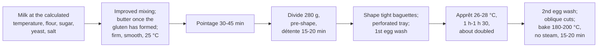

# 10.6 · Pain Viennois

Pain viennois is the bakery's soft, slightly sweet milk bread, usually sold as a baguette viennoise with a shiny egg-washed crust and a row of regular oblique cuts. It sits between bread and viennoiserie: a firm dough made with milk, sugar and butter, baked cooler than bread. This lesson explains what each enrichment changes, how the dough is mixed, shaped and scored, and why it is baked without the baguette's steam. You make three baguettes viennoises.

## Why it matters

Pain viennois is one of the four "other breads" of the référentiel (S3.2), and the production test can ask for it (see [The CAP Boulanger Exam](../../references/cap-exam.md)). It is sold to children for the after-school snack, often with chocolate chips, and its look is its sales argument: a perfectly regular row of cuts on an even, glossy, golden crust. It is also where bread habits go wrong: a baguette's 250 °C oven and steam burn a sugar-and-milk dough and wash off its egg wash, and a baguette's soft dough cannot hold sharp cuts.

## Key terms

| French | Say it | English meaning |
|---|---|---|
| pain viennois / baguette viennoise | *pan vyeh-NWAH / bah-GET vyeh-NWAZ* | soft milk bread enriched with sugar and butter, usually shaped as a baguette |
| pâte ferme | *paht FAIRM* | firm dough: low hydration, holds sharp cuts and a regular shape |
| lait entier | *LAY ahn-TYAY* | whole milk |
| dorure | *do-ROOR* | egg wash brushed on before baking for colour and shine |
| coups de lame obliques | *KOO duh LAHM oh-BLEEK* | oblique cuts: short, parallel cuts across the top of a baguette viennoise |
| plaque perforée | *plahk pair-fo-RAY* | perforated tray on which viennois proofs and bakes |
| pain viennois aux pépites | *oh pay-PEET* | viennois with chocolate chips |

## How it works

### What makes it viennois

| Ingredient | Viennois (VI-01) | Baguette (PC-02) | What changes (Bake Info; American Society of Baking) |
|---|---|---|---|
| Flour | T45 or T55, 100 | T55, 100 | similar strength; T45 gives a whiter crumb |
| Liquid | whole milk 58 | water 64 | milk is about 88 % water, so 58 % milk ≈ 51 % water: a **firm dough** that holds its shape and sharp cuts; milk solids soften the crumb and crust |
| Sugar | 6 | 0 | feeds the yeast, keeps the crumb moist, browns the crust fast |
| Butter | 10 | 0 | softer, finer crumb and more volume, once the gluten has formed; slows gluten development if added early |
| Fresh yeast | 3.5 | 1.5 | sugar and fat slow fermentation; a higher dose keeps a short day |
| Salt | 1.8 | 1.8 | see below |
| **Total** | **179.3** | 182.3 (with pâte fermentée) | TPV 25 °C |

Ranges in the [base formulas](../../references/formulas.md): milk 55-60, sugar 5-8, butter 8-12, yeast 3-4, salt 1.8. VI-01 uses **1.8 %** salt: the salt agreement names pains courants, wholemeal and cereal breads, and pain de mie, not viennois, but the reduction effort applies to all bread, and 1.8 % tastes right with the sugar. Check: 1.8 ÷ 179.3 = 1.004 % of the dough; a 280 g baguette viennoise losing about 14 % carries 2.81 g of salt in 241 g = 1.17 g per 100 g (2.0 % would give 1.30 g).

### Process

**Mixing.** The liquid is milk at the temperature calculated like water (three factors, lesson [05.2](../module-05/lesson-02.md)); milk straight from the cold room is often exactly what a warm fournil needs. A firm dough heats more in the mixer than a soft one, so the friction factor is higher. Mix to good development, add the soft butter once the gluten has formed (as for pain de mie, lesson [10.5](lesson-05.md)), and finish to a smooth, firm, satiny dough. For aux pépites, fold cold chocolate chips (about 20-25 % of the flour) in at slow speed at the very end, so they neither melt nor break the dough.

**Shaping.** Tight baguettes (lesson [08.3](../module-08/lesson-03.md)) with very even thickness: the cuts will show any irregularity. A home baguette viennoise of 280 g is about 35 cm. They proof on perforated trays (or baking paper), seam down, not in a couche: a firm, egg-washed dough is not turned over.

**Egg wash and apprêt.** A first thin coat of egg wash right after shaping keeps the skin from drying; the apprêt is long and full (about 1 h to 1 h 30 at 26-28 °C, roughly doubled), because the dough is firm and the cuts are decorative, not there to control a strong oven spring. A second thin coat just before baking. Brush thin: drips collect at the base and burn.

**Scoring.** After the second egg wash, so the cuts stay pale against the golden crust. Short, parallel **oblique cuts across the top**, about 1.5-2 cm apart and 3-5 mm deep, blade held at about 45° to the length, all the same angle and spacing from end to end. This is the opposite of the baguette's long, overlapping cuts along the midline: a viennois is meant to show a regular pattern, not a grigne with an ear.

**Baking without steam, at a moderate heat.** Milk sugars (lactose, which baker's yeast does not ferment) and added sugar are reducing sugars: the crust browns quickly through the Maillard reaction and caramelises at higher temperatures. At a baguette's 250 °C the outside is dark long before the inside is baked. Bake at about 180-200 °C in a home or deck oven (about 170-180 °C in a fan oven), about 15-20 minutes, until evenly golden-brown. **No steam:** the egg wash already gives the shine, and steam would make it streaky and dull; the cuts are shallow and do not need a long supple phase to open. (An unwashed viennois can be given a light steam for shine; this lesson's are washed.)

> [!CAUTION]
> Egg wash is raw egg: a food-safety and allergen risk. Make it fresh for each batch, keep it cold (in the fridge or on ice), never pour leftovers back, discard what is left at the end, and wash the brush hot and dry it. Bakeries often use pasteurised liquid egg (ovoproduits) kept at +4 °C maximum. Wash your hands after cracking eggs. Declare egg and milk (and wheat) on the label.

## Worked example

Wednesday: a primary school orders **40 baguettes viennoises of 280 g** for 15:30, half plain, half aux pépites. Sheet VI-01 (total 179.3 %), process losses 2 %, flour rounded up to the next 100 g. Chips at 22 % of the flour for half the batch. Readings at 11:00: flour 22 °C, fournil 24 °C; friction factor for this firm dough with improved mixing (three factors): 24.

1. **Dough.** 40 × 280 = 11,200 g; with 2 %: 11,424 g. (The chips are added on top; the plain dough weight is what is divided before they go in.)
2. **Flour.** 11,424 ÷ 1.793 = 6,371 g → **6,400 g**. Milk 3,712 g; salt 115.2 g; fresh yeast 224 g; sugar 384 g; butter 640 g. Total 11,475.2 g.
3. **Milk temperature.** 3 × 25 = 75; 75 − 22 − 24 − 24 = **5 °C**: milk straight from the cold room (4-5 °C).
4. **Mixing.** 4 minutes first speed, 4 minutes second speed; butter at 16 °C in pieces, 2 minutes first speed; 3 minutes second speed: firm, satiny. **25.2 °C.** Half the dough (about 5,740 g) back in the mixer with 704 g of cold chocolate chips (22 % of 3,200 g of flour) for 1 minute at slow speed.
5. **Pointage** 40 minutes. Divide the plain half into 20 × 280 g. The chip half weighs 5,738 + 704 = 6,442 g, so every gram of dough now carries 704 ÷ 5,738 = 0.123 g of chips: a pâton holding 280 g of dough weighs 280 × 1.123 = 314 g → **315 g**. Twenty of them use 6,300 g of the 6,442 g.
6. **Shaping** at 12:15, 35-40 cm, on perforated trays, first egg wash. Apprêt at 27 °C.
7. **13:40**, about doubled. Second egg wash; 20 oblique cuts on each plain baguette, about 1.8 cm apart; the chip baguettes get the same cuts, shallower, so no chip is dragged by the blade.
8. **Bake** in the rack oven at 175 °C, fan, no steam, 16 minutes; evenly golden. Cooled on racks; at 15:00 a plain one weighs 242 g (loss 13.6 %). Labels: contains wheat, milk, egg; the chip ones also soy (from the chocolate's lecithin, as printed on the chip bag's label).

> [!NOTE]
> Step 5 shows a real bakery habit: when an inclusion is added on top of a weighed dough, weigh one test piece to find the pâton that contains the right amount of dough, instead of guessing.

## Practice

You make VI-01 on 500 g of flour and shape three baguettes viennoises of 280 g, egg-wash, score and bake them without steam.

> [!WARNING]
> The oven is at about 200 °C. Use dry oven gloves; there is no steam tray in this bake. Score with the blade moving away from your fingers and cover the lame after use. If you use a mixer, never put a hand or scraper in the bowl while the hook turns.

> [!CAUTION]
> Raw egg: keep the egg wash in the fridge between coats, wash your hands after handling eggs, discard leftover egg wash. The bread contains wheat, milk and egg: do not serve it to anyone allergic to them.

### You need

- Minimum: scale (1 g) and a 0.1 g pocket scale, probe thermometer, large bowl, scraper, lidded container, baking tray with baking paper (or a perforated baguette tray), small bowl and pastry brush, fork, lame, ruler, wire rack, [bake log](../../templates/bake-log.md).
- Professional equivalent: spiral mixer, perforated trays (plaques perforées) on racks, proofing cabinet at 26-28 °C, rack (ventilated) or deck oven; pasteurised liquid egg.

### Ingredients

| Ingredient | Baker's % | Home batch | Professional batch (worked example) |
|---|---|---|---|
| Flour T45 or T55 | 100 | 500 g | 6,400 g |
| Whole milk at the calculated temperature | 58 | 290 g | 3,712 g |
| Fine salt | 1.8 | 9 g | 115.2 g |
| Fresh yeast (or 6 g instant dry) | 3.5 | 17.5 g | 224 g |
| Sugar | 6 | 30 g | 384 g |
| Butter, soft | 10 | 50 g | 640 g |
| **Total** | **179.3** | **896.5 g** | **11,475.2 g** |
| Egg wash: 1 egg beaten with a pinch of salt | — | 1 egg | pasteurised liquid egg |

Three pâtons of 280 g = 840 g; the remaining 56 g can be one small roll.

### In Israel

- **Flour:** white flour (קמח לבן, *kemakh lavan*) as the T45/T55 ([Flour in Israel](../../references/flour-in-israel.md)). Israeli white flour is often strong: if the dough is tight and springs back at shaping, give 5-10 minutes more détente.
- **Milk and butter:** full-fat milk (חלב, *khalav*; read the fat percentage on the label and take the highest) and unsalted butter (חמאה, *khem'a*), not a spread. In a 30 °C kitchen keep the butter in the fridge until 15 minutes before use.
- **Milk temperature in summer:** three factors, TPV 25 °C, hand friction factor 6 (a firm dough kneaded by hand heats a little more; measure yours). Flour 29 °C, kitchen 30 °C: 75 − 29 − 30 − 6 = **10 °C**: milk straight from the fridge is close; let it stand a few minutes.
- **Eggs:** Israeli eggs are sold by size grade on the carton; any size works for egg wash. Keep eggs in the fridge (checked 2026-10-08).
- **Chocolate chips** (שוקולד צ'יפס) for the aux pépites variant are in the baking aisle: choose chips that hold their shape in baking, and read the label for milk and soy.
- **Dairy bread:** in a kosher-keeping household this is a dairy (חלבי, *khalavi*) bread.

### Steps

1. **Milk temperature:** 75 − flour − room − 6. Weigh 290 g of milk at that temperature.
2. **Mix:** milk, sugar and crumbled yeast; then the flour; mix until no dry flour is left; add the salt. Knead 8-10 minutes (the dough is firm: push with the heel of the hand, fold, turn) until smooth.
3. **Butter:** spread it over the dough and work it in until absorbed, then knead 5-8 minutes more until firm, satiny and stretchy. **Measure:** 25 °C ± 1 °C.
4. **Pointage** 30-45 minutes, covered.
5. **Divide** 3 × 280 g ± 2 g; pre-shape loose cylinders; détente 15-20 minutes, covered.
6. **Shape** three tight baguettes of about 35 cm, even in thickness, blunt or lightly tapered ends. Place them seam down on baking paper, about 8 cm apart. Brush a first thin coat of egg wash. Cover loosely with a plastic sheet that does not touch them (oil it lightly).
7. **Apprêt** at 26-28 °C, about 1 h-1 h 30, until roughly doubled and light. Preheat the oven to 200 °C conventional (or 180 °C fan) with the baking tray inside; **no steam tray**.
8. **Second egg wash**, thin, no drips. **Score:** 15-18 oblique cuts per baguette, about 2 cm apart, 3-5 mm deep, all at the same angle.
9. **Bake** about 15-18 minutes, middle shelf, until evenly golden-brown; turn the tray once if colour is uneven. The base sounds hollow; the core reads at least 93 °C.
10. **Cool** on a rack. Weigh after 1 hour; calculate the loss and the salt per 100 g (280 × 1.004 % ÷ cooled weight × 100). Discard the leftover egg wash.

### Targets

- Dough 25 °C ± 1 °C, firm and satiny.
- Three baguettes of 280 g ± 2 g and about 35 cm ± 2 cm, even in thickness.
- Cuts regular in angle and spacing from end to end; pale cuts on an even, glossy, golden-brown crust.
- No steam; loss about 12-16 %; salt about 1.2 g per 100 g.

### How you know it worked

The three baguettes look identical: straight, round in section, glossy, with a regular "ladder" of pale oblique cuts. The crust is thin and soft-crisp, not hard; the crumb is fine, white-cream, soft and slightly sweet, and it tears in soft strands. Put next to your baguettes of [Module 8](../module-08/lesson-01.md), the difference in crust, crumb and cut pattern is obvious.

### Self-check

- [ ] I calculated the milk temperature like water and hit 25 °C ± 1 °C.
- [ ] I added the butter after the gluten had formed.
- [ ] I egg-washed thinly twice and scored after the second coat.
- [ ] I baked at about 200 °C (180 °C fan) without steam.
- [ ] I kept the egg wash cold, discarded the rest, and can name the allergens.

## What goes wrong

| Symptom | Likely cause | Fix now | Prevent next time |
|---|---|---|---|
| Crust dark brown, centre underbaked | Oven too hot for a sugar-and-milk dough | Lower to 180 °C, bake on | 180-200 °C (170-180 °C fan); judge by colour and core |
| Streaky, dull crust | Steam used on egg-washed dough; egg wash thick or uneven | — | No steam; two thin coats |
| Burnt spots along the base | Egg wash dripped onto the tray | — | Brush thin, from the top, wipe drips |
| Cuts closed or blurred | Dough too soft (water used instead of milk, or too much milk); cuts too shallow; scored before the egg wash | — | 58 % milk for a firm dough; 3-5 mm; score after the second coat |
| Irregular cut pattern | Baguette uneven in thickness; cuts at changing angles | — | Even shaping; same angle and spacing, start at one end |
| Dense, small baguettes | Under-proofed (apprêt cut short as for baguettes); butter added too early | — | Full apprêt, about doubled; butter after gluten forms |
| Chocolate chips melted or smeared | Chips added warm or mixed in at speed | — | Cold chips at the end, slow speed, 1 minute |

## Review

- Pain viennois: T45 or T55, whole milk (a firm dough), sugar, butter and more yeast; it is shaped as tight baguettes, egg-washed and scored with regular oblique cuts across the top.
- Milk sugars and added sugar brown fast: bake at about 180-200 °C (170-180 °C fan), 15-20 minutes, without steam for an egg-washed viennois.
- Add butter after the gluten has formed; give a full apprêt; score after the second egg wash so the cuts stay pale.
- Egg wash is raw egg: fresh, cold, discarded after use; declare wheat, milk and egg.
- Pain viennois is one of the "other breads" of the production test: see [The CAP Boulanger Exam](../../references/cap-exam.md).
